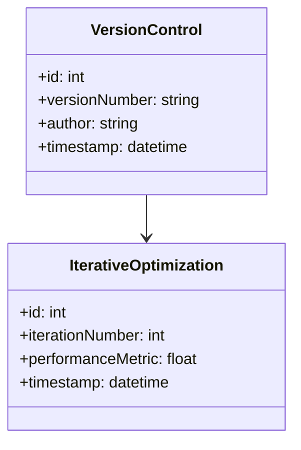

                 


# 版本控制与迭代：AI Agent的持续优化策略

## 关键词：
版本控制, 迭代优化, AI Agent, 算法原理, 系统架构

## 摘要：
本文深入探讨了AI Agent在版本控制与迭代优化中的策略与实践。从核心概念到算法原理，从系统设计到项目实战，系统地分析了AI Agent的持续优化方法。通过详细的数学模型和系统架构设计，结合实际案例，为AI Agent的优化提供了全面的解决方案。

---

# 第1章: 版本控制与迭代概述

## 1.1 问题背景

### 1.1.1 AI Agent的发展现状
AI Agent作为一种智能体，广泛应用于自动驾驶、智能助手、机器人等领域。随着技术的进步，AI Agent的功能复杂性不断提高，版本控制与迭代优化变得尤为重要。

### 1.1.2 版本控制与迭代的重要性
- 版本控制确保了AI Agent在开发过程中的可追溯性和可维护性。
- 迭代优化通过持续改进算法和系统性能，提升AI Agent的智能水平和用户体验。

### 1.1.3 问题的边界与外延
- **边界**：版本控制与迭代优化的具体实施范围，例如代码版本管理、模型迭代训练。
- **外延**：版本控制与迭代优化对系统整体性能的影响，例如对系统架构、数据处理流程的优化。

### 1.1.4 核心概念与联系
- **版本控制**：通过记录和管理代码或模型的变更，确保系统的稳定性和可追溯性。
- **迭代优化**：通过多次迭代改进系统性能，逐步逼近最优解。

## 1.2 核心概念与联系

### 1.2.1 版本控制与迭代的核心原理
- 版本控制通过分支和合并操作管理代码变更，确保多个开发团队的协作。
- 迭代优化通过逐步调整模型参数或算法策略，提升系统的性能和智能水平。

### 1.2.2 版本控制与迭代的属性特征对比
| 特性 | 版本控制 | 迭代优化 |
|------|----------|----------|
| 目标 | 管理变更历史 | 提升系统性能 |
| 工具 | Git、svn | 梯度下降、遗传算法 |
| 应用场景 | 软件开发 | 算法优化 |

### 1.2.3 实体关系图（ER图）架构

```mermaid
erd
    entity VersionControl {
        id
        versionNumber
        author
        timestamp
    }

    entity IterativeOptimization {
        id
        iterationNumber
        performanceMetric
        timestamp
    }

    VersionControl --|> VersionControlHistory
    IterativeOptimization --|> OptimizationStrategy
```

---

# 第2章: AI Agent的持续优化策略

## 2.1 AI Agent的优化目标

### 2.1.1 功能优化
- 提升AI Agent的决策准确率。
- 优化系统的响应速度。

### 2.1.2 性能优化
- 降低计算资源消耗。
- 提升系统的可扩展性。

### 2.1.3 可靠性优化
- 提高系统的容错能力。
- 优化系统的鲁棒性。

## 2.2 版本控制与迭代的核心要素

### 2.2.1 版本控制的流程
1. 创建分支。
2. 提交变更。
3. 合并分支。
4. 解决冲突。

### 2.2.2 迭代优化的步骤
1. 初始化模型参数。
2. 迭代训练。
3. 评估性能。
4. 调整策略。
5. 重复迭代。

### 2.2.3 核心要素的组成
- 版本控制工具：Git、svn。
- 迭代优化算法：梯度下降、遗传算法。

---

# 第3章: 版本控制的算法实现

## 3.1 分支与合并算法

### 3.1.1 分支的创建与合并
- 创建分支：`git branch feature_branch`
- 切换分支：`git checkout feature_branch`
- 合并分支：`git merge feature_branch`

### 3.1.2 合并冲突的解决
- 冲突检测：通过`git status`或`git diff`发现冲突。
- 手动解决：编辑文件，选择保留的部分。
- 提交解决：`git add .`，`git commit`.

### 3.1.3 分支策略的优化
- 使用`git-flow`工作流。
- 定期清理无关分支。

## 3.2 版本控制的数学模型

### 3.2.1 版本树的构建
版本树是一个树状结构，记录了代码的变更历史。

### 3.2.2 合并算法的数学表达
- 合并两个分支的代码，解决冲突。

### 3.2.3 版本冲突的数学分析
- 冲突概率：与代码行数和分支数量相关。
- 冲突解决：基于合并树的最优策略。

---

# 第4章: 迭代优化的算法实现

## 4.1 迭代优化的基本原理

### 4.1.1 迭代的定义与特点
- 迭代是一种通过多次重复计算过程来逼近最优解的方法。

### 4.1.2 迭代优化的数学模型
$$x_{n+1} = f(x_n)$$

### 4.1.3 迭代优化的收敛性分析
- 收敛速度：线性收敛、二次收敛。
- 收敛条件：初始值选择、函数连续性。

## 4.2 迭代优化的算法流程

### 4.2.1 初始化参数
```python
x = initial_guess
```

### 4.2.2 迭代步骤
```python
for _ in range(iterations):
    x = update_rule(x)
```

### 4.2.3 收敛条件的判断
```python
if abs(x - previous_x) < epsilon:
    break
```

---

# 第5章: 系统分析与架构设计

## 5.1 问题场景介绍

### 5.1.1 AI Agent的优化需求
- 提升决策准确率。
- 优化系统响应速度。

### 5.1.2 版本控制与迭代的应用场景
- AI Agent的模型训练。
- 系统功能的迭代优化。

### 5.1.3 系统的目标与范围
- 实现AI Agent的版本控制与迭代优化。
- 提供高效的代码管理和模型训练工具。

## 5.2 系统功能设计

### 5.2.1 领域模型设计


### 5.2.2 系统架构设计


---

# 第6章: 项目实战

## 6.1 环境安装

### 6.1.1 安装Git
```bash
sudo apt-get install git
```

### 6.1.2 安装Python环境
```bash
python --version
pip install --upgrade pip
```

## 6.2 系统核心实现

### 6.2.1 版本控制实现
```python
def create_branch():
    os.system("git branch feature_branch")
```

### 6.2.2 迭代优化实现
```python
def gradient_descent(x, learning_rate):
    for _ in range(iterations):
        x = x - learning_rate * gradient(x)
    return x
```

## 6.3 实际案例分析

### 6.3.1 案例分析
- 优化AI Agent的模型参数。
- 使用版本控制管理模型变更。

### 6.3.2 代码应用解读
```python
# 初始化模型参数
x = np.random.randn(n_features)

# 迭代优化
for _ in range(iterations):
    x = x - learning_rate * gradient(x)
```

---

# 第7章: 最佳实践

## 7.1 小结
- 版本控制与迭代优化是AI Agent持续改进的关键。
- 通过合理的系统设计和算法优化，可以显著提升AI Agent的性能和可靠性。

## 7.2 注意事项
- 定期备份代码和模型。
- 及时解决版本冲突，避免代码混乱。

## 7.3 拓展阅读
- 《版本控制的艺术》
- 《机器学习中的迭代优化方法》

---

# 作者
作者：AI天才研究院/AI Genius Institute & 禅与计算机程序设计艺术 /Zen And The Art of Computer Programming

