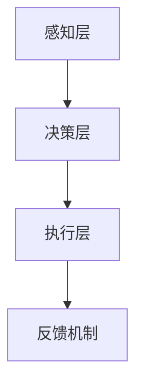
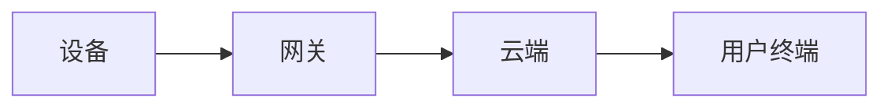

                 


# 物联网AI：构建智能家居和工业互联网的AI Agent

> 关键词：物联网AI，AI Agent，智能家居，工业互联网，算法原理，系统架构

> 摘要：本文将深入探讨物联网AI的核心概念、算法原理和系统架构，分析智能家居和工业互联网中的AI Agent设计与实现。通过详细的技术分析和案例展示，为读者提供一个全面的物联网AI解决方案框架。

---

## 第1章: 物联网AI的背景与概念

### 1.1 物联网AI的定义与核心概念

#### 1.1.1 物联网AI的定义
物联网AI是指将人工智能技术应用于物联网系统中，通过智能传感器、数据传输和计算单元实现对物理世界的感知、决策和控制。

#### 1.1.2 AI Agent的核心要素
- **自主性**：能够在没有外部干预的情况下自主运行。
- **反应性**：能够根据环境变化实时调整行为。
- **主动性**：能够主动采取行动以实现目标。
- **学习能力**：能够通过数据和经验不断优化性能。

#### 1.1.3 物联网与AI的结合方式
- **感知层**：AI Agent通过传感器收集数据。
- **决策层**：利用机器学习算法进行分析和决策。
- **执行层**：通过执行机构将决策转化为实际操作。

### 1.2 物联网AI的发展背景

#### 1.2.1 物联网技术的演进
从简单的数据采集到智能分析，物联网技术逐步向智能化方向发展。

#### 1.2.2 AI技术的快速发展
深度学习、强化学习等技术的突破推动了AI在物联网中的应用。

#### 1.2.3 物联网与AI融合的趋势
AI Agent的引入使得物联网系统更加智能化和自动化。

### 1.3 物联网AI的应用领域

#### 1.3.1 智能家居
通过AI Agent实现家电的智能控制和能耗优化。

#### 1.3.2 工业互联网
在工业生产中应用AI Agent进行设备监控、预测维护和质量控制。

#### 1.3.3 其他应用场景
包括智慧城市、医疗健康、农业等领域。

### 1.4 物联网AI的未来趋势

#### 1.4.1 技术融合的趋势
AI、大数据、5G等技术的深度融合将推动物联网AI的发展。

#### 1.4.2 市场需求的变化
用户对智能化、个性化需求的增加推动了物联网AI的市场扩展。

#### 1.4.3 挑战与机遇
数据安全、隐私保护等挑战，以及技术创新带来的机遇。

---

## 第2章: 物联网AI的核心概念与联系

### 2.1 AI Agent的原理

#### 2.1.1 AI Agent的基本原理
AI Agent通过感知环境、分析数据、制定决策并执行操作来实现目标。

#### 2.1.2 AI Agent的核心属性
- **自主性**：无需外部干预。
- **反应性**：实时响应环境变化。
- **主动性**：主动采取行动。
- **学习能力**：通过经验优化性能。

#### 2.1.3 AI Agent与传统算法的区别
AI Agent具有自主性和学习能力，而传统算法通常需要人工干预和调整。

### 2.2 物联网体系结构

#### 2.2.1 物联网的层次结构
物联网通常分为感知层、网络层、应用层。

#### 2.2.2 物联网中的数据流
数据从感知层收集，通过网络层传输到应用层进行处理。

#### 2.2.3 AI Agent与物联网的交互机制
AI Agent在感知层收集数据，通过网络层传输到决策层进行分析，最后通过执行层进行操作。

### 2.3 核心概念对比表格

| **概念**       | **AI Agent**           | **传统算法**             |
|-----------------|-----------------------|--------------------------|
| 自主性          | 高                    | 低                      |
| 反应性          | 高                    | 中                      |
| 主动性          | 高                    | 低                      |
| 学习能力        | 高                    | 无或低                 |

### 2.4 ER实体关系图

```mermaid
erDiagram
    actor 用户
    actor 系统
    actor 设备
    device 设备
    user 用户
    system 系统
    用户 -> 设备 : 控制
    设备 -> 系统 : 上传数据
    系统 -> 用户 : 返回结果
```

---

## 第3章: 物联网AI的算法原理

### 3.1 感知层算法

#### 3.1.1 感知层的定义与作用
感知层负责收集环境中的数据，如温度、湿度等。

#### 3.1.2 常见感知层算法
- **卷积神经网络（CNN）**：用于图像识别和特征提取。

#### 3.1.3 感知层算法的实现流程
1. 数据采集。
2. 数据预处理。
3. 特征提取。
4. 分类或回归。

### 3.2 决策层算法

#### 3.2.1 决策层的定义与作用
决策层负责分析数据并制定决策。

#### 3.2.2 常见决策层算法
- **强化学习（Reinforcement Learning）**：通过试错法优化决策。

#### 3.2.3 决策层算法的实现流程
1. 状态感知。
2. 行动选择。
3. 奖励机制。
4. 策略优化。

### 3.3 执行层算法

#### 3.3.1 执行层的定义与作用
执行层负责将决策转化为实际操作。

#### 3.3.2 常见执行层算法
- **反馈机制**：根据执行结果调整后续操作。

#### 3.3.3 执行层算法的实现流程
1. 接收决策指令。
2. 执行操作。
3. 反馈执行结果。
4. 调整后续操作。

### 3.4 算法流程图



---

## 第4章: 物联网AI的数学模型与公式

### 4.1 感知层的数学模型

#### 4.1.1 感知层的基本公式
$$y = f(x)$$

#### 4.1.2 感知层的优化公式
$$x_{n+1} = x_n - \alpha \cdot \nabla f(x_n)$$

### 4.2 决策层的数学模型

#### 4.2.1 决策层的基本公式
$$Q(s, a) = r + \gamma \cdot \max_{a'} Q(s', a')$$

#### 4.2.2 决策层的优化公式
$$\theta_{n+1} = \theta_n - \eta \cdot \nabla L(\theta_n)$$

### 4.3 执行层的数学模型

#### 4.3.1 执行层的基本公式
$$u = \text{argmax}_a Q(s, a)$$

#### 4.3.2 执行层的优化公式
$$J = \sum_{i=1}^n (y_i - y_{\text{pred}}i)^2$$

---

## 第5章: 物联网AI的系统架构与设计

### 5.1 智能家居的系统架构

#### 5.1.1 系统功能设计
- **数据采集**：通过传感器收集环境数据。
- **数据处理**：对数据进行分析和处理。
- **用户交互**：通过APP或网页与用户互动。

#### 5.1.2 系统架构设计


### 5.2 工业互联网的系统架构

#### 5.2.1 系统功能设计
- **设备监控**：实时监控设备运行状态。
- **预测维护**：基于历史数据预测设备故障。
- **质量控制**：通过AI算法优化生产过程。

#### 5.2.2 系统架构设计



---

## 第6章: 物联网AI的项目实战

### 6.1 环境安装与配置

#### 6.1.1 安装Python环境
使用Anaconda或Miniconda安装Python 3.8及以上版本。

#### 6.1.2 安装依赖库
安装TensorFlow、Keras、Scikit-learn等机器学习库。

### 6.2 系统核心实现

#### 6.2.1 感知层实现
```python
import numpy as np
from sklearn import datasets

# 加载数据集
X, y = datasets.load_iris(return_X_y=True)

# 数据预处理
X = X.astype(np.float32)
y = y.astype(np.int32)
```

#### 6.2.2 决策层实现
```python
import tensorflow as tf
from tensorflow.keras import layers

# 构建模型
model = tf.keras.Sequential([
    layers.Dense(64, activation='relu'),
    layers.Dense(10, activation='softmax')
])

# 编译模型
model.compile(optimizer='adam', loss='sparse_categorical_crossentropy', metrics=['accuracy'])
```

#### 6.2.3 执行层实现
```python
# 执行预测
predictions = model.predict(X)
print(predictions)
```

### 6.3 案例分析与解读

#### 6.3.1 智能家居案例
通过AI Agent实现智能家居的能耗优化。

#### 6.3.2 工业互联网案例
通过AI Agent实现生产设备的预测维护。

---

## 第7章: 总结与展望

### 7.1 本章总结
物联网AI通过AI Agent的引入，使得智能家居和工业互联网更加智能化和自动化。

### 7.2 未来展望
随着技术的不断进步，物联网AI将在更多领域得到应用，推动社会智能化发展。

---

## 附录

### 附录A: 工具安装指南

#### 1. Python安装
使用以下命令安装Python：
```bash
python --version
pip install --upgrade pip
```

#### 2. 库安装
安装常用机器学习库：
```bash
pip install numpy scikit-learn tensorflow
```

### 附录B: 术语表

- **AI Agent**：人工智能代理，能够感知环境、自主决策并执行操作。
- **物联网**：通过各种信息传感设备，按照约定的协议，把任何物品与互联网连接起来。

---

作者：AI天才研究院/AI Genius Institute & 禅与计算机程序设计艺术 /Zen And The Art of Computer Programming

