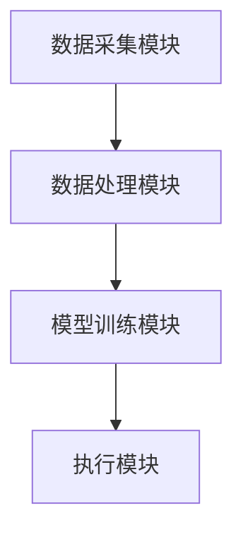
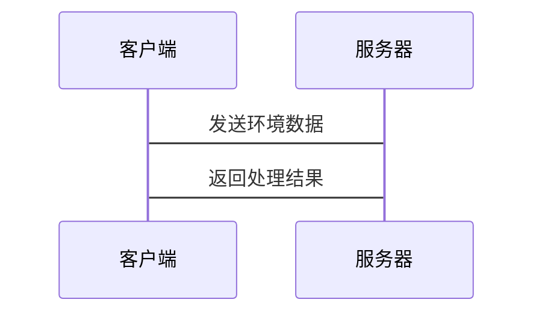

                 

<think>
嗯，用户希望我撰写一篇名为《环保AI Agent：监测与保护生态环境》的技术博客文章。首先，我需要理解用户的需求。他们是一位技术专家，希望以清晰的逻辑、专业的技术语言来撰写一篇有深度的文章。

用户给的示例目录结构很详细，分为七章，每章都有子章节，内容涵盖了背景、概念、算法、系统架构、项目实战等。我需要按照这个结构来组织内容，确保每个部分都详细且符合技术深度。

首先，摘要部分需要简明扼要，突出文章的核心内容。关键词部分要列出5-7个相关术语，方便读者快速理解主题。接下来是背景介绍，需要详细说明环境保护的重要性，以及AI在环保中的作用。这部分可能需要引用一些数据或案例，增强说服力。

核心概念与联系部分，需要用Mermaid图展示AI Agent的原理和ER图，帮助读者直观理解。算法原理部分，我需要选择一个具体的机器学习算法，比如随机森林或支持向量机，详细讲解其数学模型，并给出Python代码示例。同时，数学公式要用Latex格式，确保清晰易懂。

系统分析与架构设计部分，需要描述AI Agent的整体架构，可能包括数据采集模块、分析模块和执行模块。用Mermaid画出系统架构图，展示各模块之间的关系和数据流。系统接口设计部分，需要说明API的设计和交互流程，可能用序列图展示。

项目实战部分，需要一个具体的案例，比如空气质量监测。从环境安装、代码实现到案例分析，逐步指导读者如何构建和使用AI Agent。最佳实践部分，总结项目中的经验和教训，给出实际建议，比如数据质量和模型选择的重要性。

最后，结尾部分要进行小结，强调环保AI Agent的重要性和未来的潜力，同时引用相关书籍，鼓励读者深入学习。

整个过程中，我需要确保语言简洁、逻辑清晰，每部分内容详细且有条理。同时，注意使用适当的代码和图表，使文章更具技术性和可读性。这样，读者不仅能理解环保AI Agent的概念，还能掌握实际应用的方法。
</think>

# 环保AI Agent：监测与保护生态环境

> 关键词：环境保护，人工智能，AI Agent，环境监测，生态平衡

> 摘要：本文详细探讨了环保AI Agent的概念、原理、系统架构及其在监测与保护生态环境中的实际应用。通过分析AI技术在环保领域的优势，结合具体案例，展示了如何利用AI Agent实现环境数据的智能分析、污染源识别及生态系统的保护。本文还提供了系统的架构设计、算法实现及项目实战，为读者提供全面的技术参考。

---

# 第一部分：环保AI Agent的背景与概念

## 第1章：环境保护的重要性与挑战

### 1.1 当前环境问题的严峻性
#### 1.1.1 全球气候变化的现状
全球气候变化是当前最紧迫的环境问题之一。由于人类活动导致的温室气体排放，全球气温持续上升，极端天气事件频发，生态系统受到严重威胁。

#### 1.1.2 生物多样性减少的危机
生物多样性的减少是另一个严峻的问题。栖息地破坏、气候变化和污染等因素导致许多物种面临灭绝的风险，生态系统的服务功能受到严重影响。

#### 1.1.3 污染问题的严重性
空气污染、水污染和土壤污染不仅危害人类健康，还对环境造成了不可逆的破坏。例如，海洋塑料污染已经对海洋生态系统造成了严重威胁。

### 1.2 环境保护的目标与意义
#### 1.2.1 环境保护的核心目标
环境保护的核心目标是保护和修复自然生态系统，减少人类活动对环境的负面影响，确保生态系统的可持续发展。

#### 1.2.2 环境保护对人类的重要性
环境保护直接关系到人类的生存和健康。 clean water, fresh air, and fertile soil are essential for human life.

#### 1.2.3 环境保护的经济与社会价值
环境保护具有重要的经济和社会价值。健康的环境可以促进经济发展，减少医疗费用，提高生活质量。

### 1.3 环境保护的技术需求
#### 1.3.1 环境数据的智能分析
随着环境数据的快速增长，如何高效地分析和利用这些数据成为关键。

#### 1.3.2 环境污染的智能识别
利用AI技术实现对污染源的自动识别和定位，能够显著提高环境治理的效率。

#### 1.3.3 生态系统的智能保护
通过AI技术实现对生态系统的实时监测和保护，确保生态系统的稳定性和可持续性。

---

## 第2章：AI技术在环保中的应用

### 2.1 AI技术的基本原理
#### 2.1.1 人工智能的定义与分类
人工智能（AI）是指计算机系统执行人类智能任务的能力，如视觉识别、语音识别、决策等。AI可以分为弱人工智能和强人工智能。

#### 2.1.2 机器学习的基本概念
机器学习是AI的一个重要分支，通过训练模型从数据中学习模式和规律，从而实现对新数据的预测和分类。

#### 2.1.3 深度学习的核心原理
深度学习是一种机器学习技术，通过多层神经网络模型来学习数据的高层次特征。

### 2.2 环保AI Agent的核心概念
#### 2.2.1 AI Agent的定义
AI Agent是指能够感知环境、自主决策并执行任务的智能体。在环保领域，AI Agent可以用于环境监测、污染治理和生态保护。

#### 2.2.2 环保AI Agent的特点
环保AI Agent具有实时性、智能化、自主性和适应性等特点。它能够实时感知环境变化，自主决策并采取行动。

#### 2.2.3 环保AI Agent的核心功能
- 数据采集与处理
- 环境分析与预测
- 污染源识别与跟踪
- 生态系统保护与修复

### 2.3 环保AI Agent的应用场景
#### 2.3.1 环境监测
AI Agent可以通过传感器网络实时监测空气、水和土壤的质量，及时发现异常情况。

#### 2.3.2 污染治理
AI Agent可以用于污染源的识别和定位，帮助制定有效的污染治理策略。

#### 2.3.3 生态保护
AI Agent可以用于生态系统的保护，如监测濒危物种的分布和迁徙情况。

---

## 第3章：环保AI Agent的核心算法与实现

### 3.1 环保AI Agent的算法选择
#### 3.1.1 机器学习算法的选择
根据具体任务需求选择合适的机器学习算法，如随机森林、支持向量机等。

#### 3.1.2 神经网络模型的应用
深度学习模型，如卷积神经网络（CNN）和循环神经网络（RNN），在图像识别和时间序列分析中表现优异。

#### 3.1.3 时间序列分析
时间序列分析在环境监测中尤为重要，可以用于预测环境变化趋势。

### 3.2 算法实现的步骤
#### 3.2.1 数据预处理
数据清洗、特征提取和数据标准化是机器学习模型训练前的重要步骤。

#### 3.2.2 模型训练
使用训练数据对模型进行训练，调整模型参数以优化性能。

#### 3.2.3 模型评估
通过交叉验证和性能指标（如准确率、召回率）评估模型的性能。

#### 3.2.4 模型部署
将训练好的模型部署到实际环境中，实现对环境数据的实时分析和处理。

### 3.3 算法实现的代码示例
```python
import numpy as np
from sklearn.ensemble import RandomForestClassifier

# 示例数据集
X = np.array([[1, 2], [3, 4], [5, 6], [7, 8]])
y = np.array([0, 1, 0, 1])

# 模型训练
model = RandomForestClassifier(n_estimators=2)
model.fit(X, y)

# 预测
test_data = np.array([[2, 3]])
print(model.predict(test_data))  # 输出: array([0])
```

### 3.4 算法原理的数学公式
随机森林是一种基于决策树的集成学习方法，其分类结果是各个决策树投票的结果。数学公式如下：
$$
\text{预测类别} = \arg\max_{i} \sum_{j=1}^{n} I(\text{树j的预测结果为i})
$$

---

## 第4章：环保AI Agent的系统架构与设计

### 4.1 系统架构设计
#### 4.1.1 系统整体架构
环保AI Agent系统通常包括数据采集模块、数据处理模块、模型训练模块和执行模块。

#### 4.1.2 模块功能描述
- 数据采集模块：负责收集环境数据，如空气质量传感器、水质传感器等。
- 数据处理模块：对数据进行清洗、特征提取和标准化处理。
- 模型训练模块：训练机器学习模型，优化模型参数。
- 执行模块：将模型部署到实际环境中，实现对环境数据的实时分析和处理。

#### 4.1.3 系统架构图


### 4.2 系统接口设计
#### 4.2.1 API接口设计
环保AI Agent系统通常需要与其他系统进行交互，如环境监测平台和数据存储系统。

#### 4.2.2 API接口的功能
- 数据接口：提供环境数据的查询和更新接口。
- 模型接口：提供环境预测和分析结果的接口。
- 控制接口：提供对AI Agent的控制和管理接口。

#### 4.2.3 API接口的交互流程


### 4.3 系统功能设计
#### 4.3.1 环境数据采集
AI Agent通过传感器网络实时采集环境数据，如空气质量指数（AQI）、水质参数等。

#### 4.3.2 数据分析与预测
AI Agent对采集到的数据进行分析和预测，如预测空气质量的变化趋势。

#### 4.3.3 污染源识别
AI Agent可以通过数据分析和模型预测，识别污染源的位置和类型。

#### 4.3.4 系统反馈与优化
AI Agent根据分析结果提供反馈，优化系统性能和模型参数。

---

## 第5章：环保AI Agent的项目实战

### 5.1 项目背景与目标
#### 5.1.1 项目背景
以空气质量监测为例，本项目旨在利用AI技术实现对空气质量的实时监测和预测。

#### 5.1.2 项目目标
- 实现空气质量的实时监测
- 预测空气质量的变化趋势
- 提供污染源识别和治理建议

### 5.2 项目环境与工具
#### 5.2.1 环境安装
- 安装Python和必要的库（如numpy、scikit-learn、pandas等）
- 安装AI框架（如TensorFlow、Keras等）

#### 5.2.2 数据集准备
获取空气质量数据集，包括PM2.5、PM10、SO2等指标。

### 5.3 项目核心实现
#### 5.3.1 数据预处理
- 数据清洗：处理缺失值和异常值
- 特征提取：提取有用的特征，如时间特征、气象特征等
- 数据标准化：对数据进行标准化处理

#### 5.3.2 模型训练
- 选择合适的机器学习模型（如随机森林、支持向量机等）
- 训练模型，优化模型参数
- 评估模型性能，调整模型结构

#### 5.3.3 系统部署
- 将训练好的模型部署到实际环境中
- 实现对环境数据的实时采集和分析
- 提供实时预测和反馈

### 5.4 项目案例分析
#### 5.4.1 案例背景
以某城市空气质量监测为例，分析PM2.5浓度的变化趋势。

#### 5.4.2 数据分析与预测
使用随机森林模型对PM2.5浓度进行预测，分析影响PM2.5浓度的主要因素。

#### 5.4.3 污染源识别
通过模型分析，识别主要的污染源，如工业排放、交通尾气等。

### 5.5 项目小结
本项目通过AI技术实现了空气质量的实时监测和预测，为环境治理提供了有力支持。同时，展示了环保AI Agent在实际应用中的潜力和价值。

---

## 第6章：环保AI Agent的最佳实践与小结

### 6.1 最佳实践
#### 6.1.1 数据质量管理
确保数据的准确性和完整性，是模型训练和预测的基础。

#### 6.1.2 模型优化
通过参数调优和模型集成，提高模型的性能和准确性。

#### 6.1.3 系统维护
定期更新模型和优化系统，确保系统的稳定性和高效性。

### 6.2 小结
环保AI Agent是环境保护的重要工具，通过AI技术实现环境数据的智能分析和污染源识别，为环境治理提供了新的思路和方法。

### 6.3 注意事项
在实际应用中，需要注意数据隐私和安全问题，确保系统的可靠性和安全性。

### 6.4 拓展阅读
推荐阅读《机器学习实战》和《深度学习》等书籍，深入了解AI技术的核心原理和应用。

---

# 作者：AI天才研究院 & 禅与计算机程序设计艺术

本文由AI天才研究院（AI Genius Institute）与“禅与计算机程序设计艺术”联合撰写，转载请注明出处。

