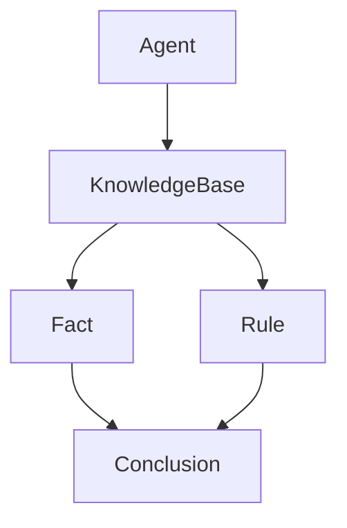
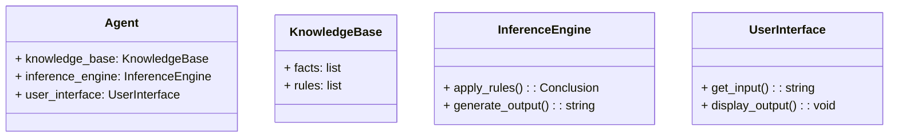
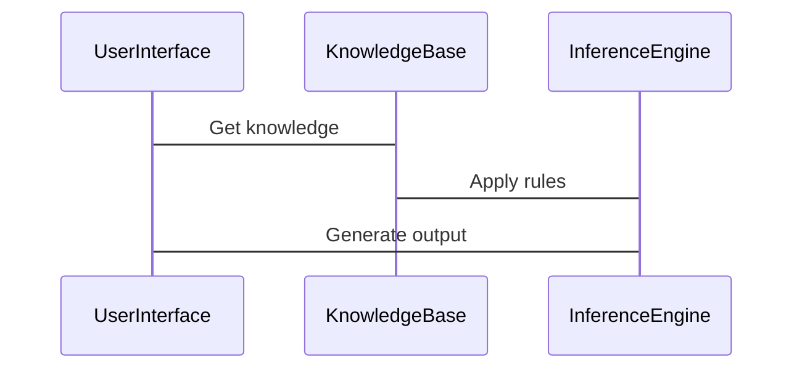

                 


# 知识推理：增强AI Agent的逻辑思考能力

## 关键词：知识推理、AI Agent、逻辑思考能力、符号推理、概率推理、逻辑推理、知识表示、推理规则

## 摘要：知识推理是人工智能领域的重要组成部分，通过合理表示知识并应用推理规则，可以显著增强AI Agent的逻辑思考能力。本文详细探讨知识推理的核心概念、算法原理、系统架构设计及实际应用案例，帮助读者全面理解如何提升AI Agent的逻辑推理能力。

---

# 第一部分：知识推理的背景与核心概念

## 第1章：知识推理的基本概念

### 1.1 问题背景与问题描述

#### 1.1.1 人工智能与知识推理的关联
人工智能（AI）的进步依赖于处理复杂问题的能力，而知识推理是其核心之一。知识推理使AI Agent能够基于现有知识和推理规则，推导出新的结论，从而做出更智能的决策。

#### 1.1.2 知识推理的定义与目标
知识推理是通过逻辑规则和知识库进行推导的过程。其目标是增强AI Agent的理解和决策能力，使其能够处理不确定性、复杂性和动态变化的问题。

#### 1.1.3 知识推理在AI Agent中的作用
知识推理使AI Agent能够：
- 理解输入信息的含义；
- 推导潜在结论；
- 处理知识的动态更新；
- 支持复杂任务的决策。

### 1.2 知识推理的核心要素

#### 1.2.1 知识表示
知识表示方法包括：
- 语义网络：通过节点表示概念，边表示关系。
- 逻辑符号：使用命题逻辑或一阶逻辑表示知识。
- 概率表示：通过概率分布表示不确定性。

#### 1.2.2 推理规则
推理规则包括：
- 逻辑推理：基于逻辑规则进行推导。
- 概率推理：基于概率模型进行推导。
- 类比推理：通过类比关系推导结论。

#### 1.2.3 推理过程
推理过程包括：
- 知识获取：从数据或经验中提取知识。
- 知识存储：将知识组织存储在知识库中。
- 推理执行：应用推理规则，推导新的结论。

### 1.3 知识推理的边界与外延

#### 1.3.1 知识推理的适用范围
知识推理适用于需要逻辑推理的场景，如自然语言处理、智能问答系统、机器人路径规划等。

#### 1.3.2 与相关概念的区分
- 知识表示：关注知识的表达方式。
- 逻辑推理：关注基于逻辑规则的推导。
- 概率推理：关注基于概率模型的推导。

#### 1.3.3 知识推理的发展趋势
知识推理正在向动态、实时和分布式方向发展，结合机器学习和大数据技术，提升推理的准确性和效率。

---

# 第二部分：知识推理的核心概念与联系

## 第2章：知识推理的核心原理

### 2.1 知识推理的原理概述

#### 2.1.1 基于符号的推理
基于符号的推理使用符号逻辑进行知识表示和推理，适用于规则明确的领域。例如，使用一阶逻辑表示知识，并通过逻辑推理规则进行推导。

#### 2.1.2 基于概率的推理
基于概率的推理使用概率模型处理不确定性，适用于需要处理模糊信息的场景。例如，使用贝叶斯网络进行概率推理。

#### 2.1.3 基于逻辑的推理
基于逻辑的推理通过逻辑规则和逻辑推理算法进行推导，适用于需要严格逻辑推理的场景。例如，使用命题逻辑进行推理。

### 2.2 知识推理的核心概念属性对比

| 概念 | 特征 | 例子 |
|------|------|------|
| 知识表示 | 明确性 | 符号逻辑 |
| 推理规则 | 精确性 | 逻辑推理规则 |
| 推理结果 | 可验证性 | 逻辑结论 |

### 2.3 知识推理的ER实体关系图



---

# 第三部分：知识推理的算法原理

## 第3章：知识推理算法的实现

### 3.1 算法原理概述

#### 3.1.1 逻辑推理算法
逻辑推理算法基于逻辑规则进行推导，适用于规则明确的场景。例如，使用归结式推理（Resolution）进行逻辑推导。

#### 3.1.2 概率推理算法
概率推理算法基于概率模型进行推导，适用于需要处理不确定性的场景。例如，使用贝叶斯网络进行概率推理。

#### 3.1.3 符号推理算法
符号推理算法使用符号逻辑进行推导，适用于规则明确的领域。例如，使用一阶逻辑进行符号推理。

### 3.2 算法实现的详细步骤

#### 3.2.1 算法输入的处理
- 逻辑推理算法的输入包括知识库和推理规则。
- 概率推理算法的输入包括概率模型和观测数据。
- 符号推理算法的输入包括符号逻辑表达式和推理规则。

#### 3.2.2 推理过程的执行
- 逻辑推理算法通过应用归结式规则进行推导。
- 概率推理算法通过贝叶斯推理进行概率计算。
- 符号推理算法通过应用符号规则进行推导。

#### 3.2.3 推理结果的输出
- 逻辑推理算法输出逻辑结论。
- 概率推理算法输出概率分布。
- 符号推理算法输出符号表达式。

### 3.3 算法实现的代码示例

#### 3.3.1 逻辑推理的Python代码

```python
from sympy import symbols, And, Or, Not, Implies, solve

# 定义符号
a, b = symbols('a b')

# 定义逻辑表达式
expression = Implies(a, b)

# 解决问题
solution = solve([expression], [a, b])

print(solution)
```

#### 3.3.2 概率推理的Python代码

```python
from scipy.stats import norm

# 计算概率密度函数
x = 0
pdf = norm.pdf(x)

print(pdf)
```

#### 3.3.3 符号推理的Python代码

```python
from logic.utils import parse_clause, solve_by_dpll

# 定义逻辑语句
clauses = ['(A ∨ B)', '(¬B ∨ C)', '(A ∨ ¬C)']

# 解决问题
solution = solve_by_dpll(clauses)

print(solution)
```

### 3.4 算法实现的数学模型

#### 3.4.1 逻辑推理的数学模型
逻辑推理的数学模型包括命题逻辑和一阶逻辑。命题逻辑使用基本命题变量和逻辑连接词进行表达，一阶逻辑使用谓词、函数和量词进行表达。

#### 3.4.2 概率推理的数学模型
概率推理的数学模型包括概率分布和贝叶斯网络。概率分布描述变量的概率，贝叶斯网络描述变量之间的依赖关系。

#### 3.4.3 符号推理的数学模型
符号推理的数学模型包括符号逻辑和逻辑规则。符号逻辑使用符号表达式和逻辑规则进行推导。

---

# 第四部分：知识推理的数学模型与公式

## 第4章：数学模型的建立

### 4.1 逻辑推理的数学表达

#### 4.1.1 命题逻辑的基本公式
命题逻辑的基本公式包括逻辑连接词和逻辑运算符，如 ∧（与）、∨（或）、¬（非）、→（蕴含）等。

#### 4.1.2 一阶逻辑的表达式
一阶逻辑的表达式包括谓词、函数和量词，如 ∀（对于所有）、∃（存在）。

#### 4.1.3 逻辑推理的规则
逻辑推理的规则包括归结式推理、消解规则等。

### 4.2 概率推理的数学公式

#### 4.2.1 贝叶斯定理
贝叶斯定理的公式为：
$$ P(A|B) = \frac{P(B|A)P(A)}{P(B)} $$

#### 4.2.2 条件概率公式
条件概率公式为：
$$ P(A|B) = \frac{P(A \cap B)}{P(B)} $$

### 4.3 符号推理的数学模型

#### 4.3.1 符号逻辑的表达式
符号逻辑的表达式包括基本符号和逻辑运算符，如 ∧、∨、¬ 等。

#### 4.3.2 逻辑规则的表达
逻辑规则的表达包括命题逻辑规则和一阶逻辑规则。

---

# 第五部分：知识推理的系统分析与架构设计

## 第5章：系统分析与架构设计方案

### 5.1 项目介绍

#### 5.1.1 项目背景
本项目旨在开发一个基于知识推理的AI Agent，用于处理复杂问题。

#### 5.1.2 项目目标
- 提供知识表示和推理功能。
- 支持多种推理算法。
- 提供友好的用户接口。

### 5.2 系统功能设计

#### 5.2.1 领域模型设计
领域模型包括：
- 知识库：存储知识。
- 推理引擎：执行推理。
- 用户接口：与用户交互。



#### 5.2.2 系统架构设计


#### 5.2.3 系统接口设计
- 知识库接口：提供知识存储和查询功能。
- 推理引擎接口：提供推理规则和结果输出功能。
- 用户接口接口：提供用户输入和输出功能。

#### 5.2.4 系统交互设计



---

# 第六部分：知识推理的项目实战

## 第6章：项目实战

### 6.1 环境安装

#### 6.1.1 安装Python
安装Python 3.x版本。

#### 6.1.2 安装依赖库
安装所需的Python库，如SymPy、Scipy等。

### 6.2 系统核心实现源代码

#### 6.2.1 知识库实现

```python
class KnowledgeBase:
    def __init__(self):
        self.facts = []
        self.rules = []
```

#### 6.2.2 推理引擎实现

```python
class InferenceEngine:
    def __init__(self, knowledge_base):
        self.knowledge_base = knowledge_base

    def apply_rules(self):
        # 具体推理逻辑
        pass
```

#### 6.2.3 用户接口实现

```python
class UserInterface:
    def __init__(self, inference_engine):
        self.engine = inference_engine

    def get_input(self):
        return input("请输入问题：")

    def display_output(self, output):
        print(output)
```

### 6.3 代码应用解读与分析

#### 6.3.1 知识库的实现
知识库存储事实和规则，供推理引擎使用。

#### 6.3.2 推理引擎的实现
推理引擎根据知识库中的事实和规则，应用推理算法，生成结论。

#### 6.3.3 用户接口的实现
用户接口接收用户输入，调用推理引擎，输出结果。

### 6.4 案例分析与详细讲解

#### 6.4.1 实际案例分析
假设知识库中有以下事实和规则：
- 事实：A是人。
- 规则：所有人都会死亡。
推理引擎推导出结论：A会死亡。

#### 6.4.2 详细讲解
推理引擎根据知识库中的事实和规则，应用逻辑推理，得出结论。

### 6.5 项目小结

#### 6.5.1 项目总结
本项目实现了基于知识推理的AI Agent，能够处理复杂问题。

#### 6.5.2 经验总结
- 知识表示要清晰明确。
- 推理规则要准确无误。
- 推理引擎要高效可靠。

---

# 第七部分：知识推理的最佳实践、小结、注意事项与拓展阅读

## 第7章：最佳实践与注意事项

### 7.1 最佳实践

#### 7.1.1 知识表示
- 使用清晰明确的表示方法。
- 定期更新知识库。
- 考虑领域知识的特殊性。

#### 7.1.2 推理规则
- 确保推理规则的正确性。
- 定期验证推理结果。
- 考虑规则的优先级。

#### 7.1.3 系统设计
- 分模块设计系统。
- 确保模块间的通信。
- 定期测试系统性能。

### 7.2 小结

知识推理是AI Agent的核心能力，通过合理表示知识和应用推理规则，可以显著提升AI Agent的逻辑思考能力。

### 7.3 注意事项

- 知识表示要准确。
- 推理规则要合理。
- 系统设计要完善。
- 定期测试和优化。

### 7.4 拓展阅读

- 《逻辑与计算机程序设计》
- 《概率论与贝叶斯网络》
- 《符号逻辑与知识表示》

---

# 作者：AI天才研究院/AI Genius Institute & 禅与计算机程序设计艺术 /Zen And The Art of Computer Programming

