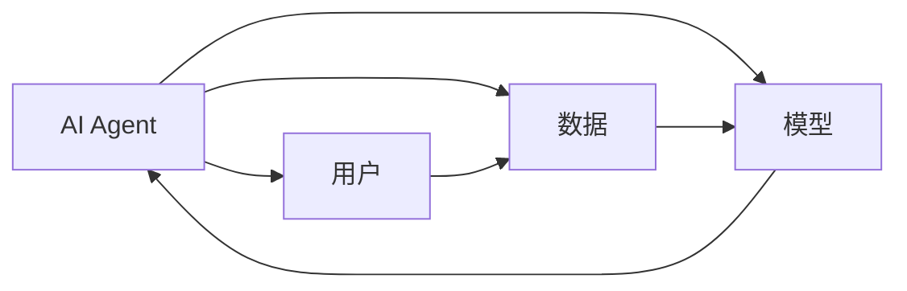
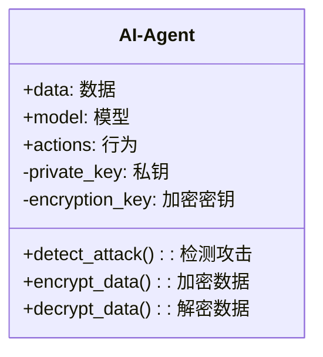
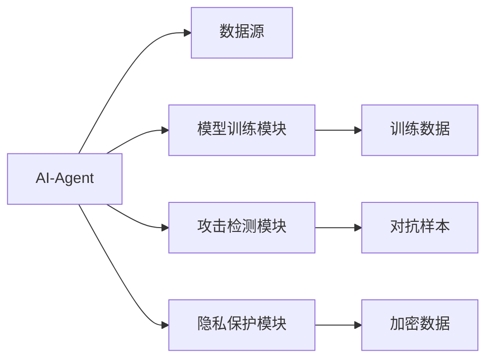

                 


# 确保AI Agent的安全性与隐私保护

---

## 关键词  
AI Agent、安全性、隐私保护、对抗攻击、数据加密、系统架构

---

## 摘要  
AI Agent作为人工智能领域的核心技术，其安全性与隐私保护问题日益重要。本文从AI Agent的基本概念出发，分析其面临的安全威胁与隐私风险，并详细探讨对抗攻击检测与防御算法、数据加密与隐私保护技术、系统架构设计等核心内容。通过具体项目实战与案例分析，总结AI Agent的安全性与隐私保护的最佳实践，并展望未来发展方向。

---

# 第一部分: AI Agent的安全性与隐私保护概述

## 第1章: AI Agent的基本概念与背景

### 1.1 AI Agent的定义与核心概念

#### 1.1.1 AI Agent的定义  
AI Agent（人工智能代理）是指在特定环境中，能够感知环境、自主决策并执行任务的智能实体。它可以是一个软件程序、一个机器人，或者任何能够与环境交互的智能系统。

#### 1.1.2 AI Agent的核心特征  
- **自主性**：能够在没有外部干预的情况下自主决策。  
- **反应性**：能够实时感知环境并做出响应。  
- **目标导向性**：以特定目标为导向，执行任务。  
- **学习能力**：通过数据与经验不断优化自身性能。

#### 1.1.3 AI Agent的分类与应用场景  
- **按智能水平分类**：  
  - **反应式AI Agent**：基于当前感知做出决策。  
  - **认知式AI Agent**：具备推理、规划能力。  
- **按应用场景分类**：  
  - 智能客服、自动驾驶、智能助手等。  

---

### 1.2 AI Agent的安全性与隐私保护的重要性

#### 1.2.1 AI Agent面临的安全威胁  
- **对抗攻击**：通过对抗样本干扰AI Agent的决策过程。  
- **数据投毒**：恶意数据干扰模型训练。  
- **模型窃取**：通过攻击获取模型参数。  

#### 1.2.2 隐私保护的必要性  
- AI Agent通常需要处理敏感数据（如用户行为数据、个人信息），保护这些数据不被滥用至关重要。  

#### 1.2.3 安全与隐私保护的边界与外延  
- **边界**：AI Agent的权限与能力范围。  
- **外延**：涉及数据安全、网络安全、隐私合规等多个领域。  

---

### 1.3 本章小结  
本章介绍了AI Agent的基本概念、核心特征与分类，并分析了其面临的安全威胁与隐私风险，为后续内容奠定了基础。

---

# 第二部分: AI Agent的安全威胁与风险分析

## 第2章: AI Agent的安全威胁模型

### 2.1 常见的安全威胁类型

#### 2.1.1 对抗攻击（Adversarial Attack）  
- **定义**：通过在输入数据中添加干扰，使得AI Agent做出错误决策。  
- **常见场景**：图像识别、语音识别中的对抗攻击。  
- **数学模型**：$$ y = f(x + \epsilon) $$，其中$\epsilon$为对抗扰动。  

#### 2.1.2 数据投毒（Data Poisoning）  
- **定义**：恶意数据被混入训练数据中，影响模型训练。  
- **常见场景**：恶意用户上传虚假数据干扰AI Agent学习。  

#### 2.1.3 模型窃取（Model Extraction）  
- **定义**：通过获取模型预测结果反推出模型参数。  
- **常见场景**：攻击者通过API获取模型预测结果，进而窃取模型。  

---

### 2.2 隐私风险分析

#### 2.2.1 数据泄露风险  
- **定义**：AI Agent处理的敏感数据被未经授权的第三方获取。  
- **常见场景**：用户数据在传输或存储过程中被窃取。  

#### 2.2.2 用户行为追踪风险  
- **定义**：通过分析AI Agent的行为数据，推断用户的隐私信息。  
- **常见场景**：智能助手记录用户的对话内容。  

#### 2.2.3 模型反推风险  
- **定义**：通过分析模型输出结果，推断输入数据。  
- **常见场景**：攻击者通过模型预测结果反推训练数据。  

---

### 2.3 安全威胁与隐私风险的对比分析

#### 2.3.1 基于表格的核心概念对比  
| 安全威胁        | 隐私风险          |  
|------------------|-------------------|  
| 对抗攻击        | 数据泄露          |  
| 数据投毒        | 用户行为追踪      |  
| 模型窃取        | 模型反推          |  

#### 2.3.2 基于Mermaid的实体关系图  



---

### 2.4 本章小结  
本章详细分析了AI Agent面临的安全威胁与隐私风险，并通过对比分析和实体关系图帮助读者理解其复杂性。

---

# 第三部分: AI Agent的安全性与隐私保护的算法原理

## 第3章: 对抗攻击检测与防御算法

### 3.1 对抗攻击检测的原理

#### 3.1.1 基于梯度的方法  
- **定义**：通过计算模型梯度，识别对抗样本。  
- **数学模型**：$$ \text{梯度} = \nabla_{x} (f(x)) $$  
- **代码实现示例**：  
  ```python
  import tensorflow as tf
  def detect_adversarial_attack(model, x):
      gradient = tf.GradientTape().gradient(model(x), x)
      return tf.norm(gradient) > threshold
  ```

#### 3.1.2 基于生成对抗网络的方法  
- **定义**：使用生成对抗网络检测异常输入。  
- **数学模型**：$$ G \text{与} D \text{的损失函数} $$  

---

### 3.2 对抗攻击防御的算法实现

#### 3.2.1 梯度掩蔽技术  
- **定义**：在模型训练中添加噪声，降低对抗攻击的影响。  
- **数学模型**：$$ y = f(x + \text{noise}) $$  
- **代码实现示例**：  
  ```python
  def apply_noise(x, noise_level):
      noise = tf.random.normal(tf.shape(x), scale=noise_level)
      return x + noise
  ```

#### 3.2.2 模型鲁棒性优化  
- **定义**：通过优化模型结构提升其对对抗攻击的抵抗能力。  
- **方法**：使用防御蒸馏（Defensive Distillation）技术。  

---

### 3.3 对抗攻击的数学模型与公式

#### 3.3.1 对抗样本生成的数学模型  
$$ x_{\text{adv}} = x + \epsilon \cdot \text{sign}(\nabla f(x)) $$  

#### 3.3.2 模型鲁棒性优化的数学公式  
$$ \min_{\theta} \frac{1}{n}\sum_{i=1}^{n} \text{loss}(f_{\theta}(x_i), y_i) + \lambda \cdot \text{robustness} $$  

---

### 3.4 本章小结  
本章详细探讨了对抗攻击的检测与防御算法，并通过数学模型与代码示例帮助读者理解其实现原理。

---

# 第四部分: AI Agent的安全与隐私保护系统架构设计

## 第4章: 安全与隐私保护框架

### 4.1 系统功能设计

#### 4.1.1 基于Mermaid的领域模型类图  



#### 4.1.2 系统功能模块划分  
- **数据处理模块**：负责数据的采集、预处理与加密。  
- **模型训练模块**：负责模型的训练与优化。  
- **攻击检测模块**：负责检测对抗攻击。  
- **隐私保护模块**：负责数据的加密与解密。  

---

### 4.2 系统架构设计

#### 4.2.1 基于Mermaid的系统架构图  



#### 4.2.2 系统组件之间的交互关系  
- **数据源**：提供原始数据。  
- **模型训练模块**：使用数据训练模型。  
- **攻击检测模块**：检测输入数据是否为对抗样本。  
- **隐私保护模块**：对数据进行加密处理。  

---

### 4.3 接口与交互设计

#### 4.3.1 API接口设计  
- **输入接口**：$$ \text{API}(\text{输入数据}) $$  
- **输出接口**：$$ \text{API}(\text{处理结果}) $$  

#### 4.3.2 用户交互流程设计  
- **用户请求**：用户发送请求到AI Agent。  
- **攻击检测**：AI Agent检测请求是否为对抗攻击。  
- **隐私保护**：对请求数据进行加密处理。  
- **处理结果**：返回处理结果。  

---

### 4.4 本章小结  
本章通过系统架构设计与交互流程图，详细描述了AI Agent的安全与隐私保护框架，并分析了各组件之间的交互关系。

---

# 第五部分: AI Agent的安全与隐私保护项目实战

## 第5章: 项目开发与实现

### 5.1 环境搭建与工具安装

#### 5.1.1 开发环境配置  
- **操作系统**：Linux/Windows/MacOS  
- **开发工具**：Jupyter Notebook、PyCharm  
- **依赖库安装**：`pip install tensorflow matplotlib scikit-learn`  

#### 5.1.2 工具链安装  
- **框架选择**：TensorFlow、Keras  
- **工具包安装**：`pip install mermaid4jupyter`  

---

### 5.2 核心算法实现

#### 5.2.1 对抗攻击检测的Python代码实现  

```python
import tensorflow as tf
def detect_adversarial_attack(model, x, threshold=0.5):
    with tf.GradientTape() as tape:
        tape.watch(x)
        y_pred = model(x)
    gradient = tape.gradient(y_pred, x)
    gradient_norm = tf.norm(gradient, axis=(1, 2, 3))
    return tf.where(gradient_norm > threshold, True, False)
```

#### 5.2.2 模型鲁棒性优化的代码实现  

```python
def model_with_noise(model, noise_level=0.1):
    def noisy_model(inputs):
        noise = tf.random.normal(tf.shape(inputs), scale=noise_level)
        return model(inputs + noise)
    return noisy_model
```

---

### 5.3 项目案例分析

#### 5.3.1 案例背景介绍  
假设我们开发了一个图像识别AI Agent，需要保护其免受对抗攻击。  

#### 5.3.2 实际案例的详细分析与实现  
- **步骤1**：训练图像分类模型。  
- **步骤2**：生成对抗样本。  
- **步骤3**：检测对抗样本并进行防御。  

---

### 5.4 项目小结与经验总结  
本章通过具体项目实战，详细展示了AI Agent的安全性与隐私保护的实现过程，并总结了开发中的经验与注意事项。

---

# 第六部分: 最佳实践与未来展望

## 第6章: 最佳实践与未来展

### 6.1 最佳实践

#### 6.1.1 安全性保障措施  
- 定期进行安全漏洞扫描与测试。  
- 使用多方安全计算与联邦学习技术保护隐私。  

#### 6.1.2 隐私保护策略  
- 数据最小化原则：仅收集必要的数据。  
- 数据加密存储与传输：使用AES、RSA等加密算法。  

---

### 6.2 未来展望

#### 6.2.1 技术发展趋势  
- 更强大的对抗防御算法。  
- 基于可信计算的AI Agent架构。  

#### 6.2.2 应用场景扩展  
- 智能家居中的隐私保护。  
- 智能医疗中的数据安全。  

---

### 6.3 本章小结  
本章总结了AI Agent的安全性与隐私保护的最佳实践，并展望了未来的技术发展趋势与应用场景。

---

## 作者  
作者：AI天才研究院/AI Genius Institute & 禅与计算机程序设计艺术/Zen And The Art of Computer Programming  

---

以上是关于《确保AI Agent的安全性与隐私保护》的完整目录大纲与文章内容，您可以根据需要进一步扩展每个章节的具体内容。

