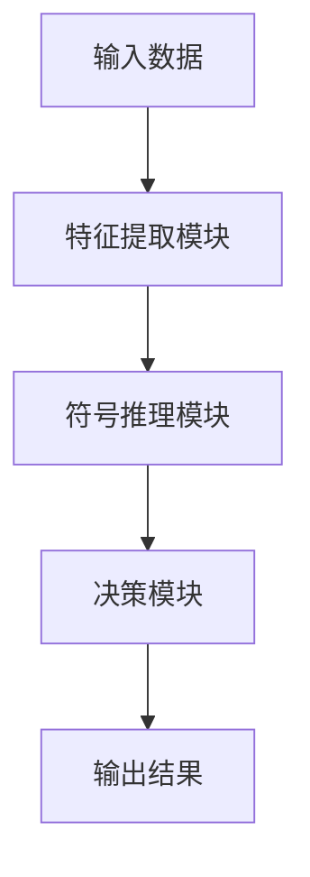

                 


# 神经符号AI：结合符号推理与神经网络的AI Agent

> **关键词**：神经符号AI、符号推理、神经网络、AI Agent、知识图谱、逻辑推理、深度学习

> **摘要**：  
神经符号AI是一种结合符号推理与神经网络的新兴技术，旨在通过符号逻辑的确定性推理与神经网络的特征学习能力，构建更加智能化和可解释的人工智能系统。本文从神经符号AI的背景、核心概念、算法原理、系统架构到实际应用，全面探讨这一技术的潜力与挑战。

---

## 第1章：神经符号AI的背景与核心概念

### 1.1 神经符号AI的背景介绍

#### 1.1.1 传统符号AI的局限性
传统符号AI（如专家系统）依赖于明确的知识表示和规则，但在处理模糊、动态或复杂问题时表现出明显的局限性。例如，符号系统难以处理大量非结构化数据，且规则的更新和维护成本较高。

#### 1.1.2 神经网络的局限性
神经网络（尤其是深度学习模型）在处理感知任务（如图像识别、自然语言处理）方面表现出色，但缺乏可解释性，且难以处理需要逻辑推理的任务。

#### 1.1.3 神经符号AI的结合优势
神经符号AI结合了符号推理的可解释性和神经网络的特征学习能力，能够处理结构化和非结构化数据，适用于需要推理和决策的任务，如自动驾驶、医疗诊断和机器人控制。

#### 1.1.4 神经符号AI的核心问题与挑战
- 如何将符号逻辑与神经网络有效结合。
- 确保模型的可解释性与鲁棒性。
- 解决符号推理的计算效率问题。

---

### 1.2 神经符号AI的应用领域

#### 1.2.1 自然语言处理
神经符号模型可以结合词向量和语法规则，实现更准确的语义理解与推理。

#### 1.2.2 机器人与自动化
通过符号推理与视觉识别的结合，机器人能够更好地理解和执行复杂的任务。

#### 1.2.3 逻辑推理与决策系统
神经符号模型能够处理复杂的逻辑推理问题，如法律推理和金融风险评估。

#### 1.2.4 知识图谱与语义理解
神经符号模型可以结合知识图谱进行语义理解，增强数据的关联性与可解释性。

---

## 第2章：神经符号AI的核心概念与联系

### 2.1 符号推理与神经网络的结合

#### 2.1.1 符号逻辑与神经网络的互补性
符号逻辑提供确定性推理，而神经网络擅长从数据中学习特征。

#### 2.1.2 神经符号模型的基本架构
- 输入：符号表示或非结构化数据。
- 输出：符号逻辑推理的结果或概率预测。

#### 2.1.3 符号与神经网络的交互机制
符号推理指导神经网络的学习，而神经网络为符号推理提供特征支持。

---

### 2.2 神经符号AI的核心要素与概念结构

#### 2.2.1 符号表示与知识表示
符号表示包括命题逻辑、一阶逻辑等，知识表示则包括知识图谱和语义网络。

#### 2.2.2 神经网络的特征学习
神经网络通过卷积或循环结构提取输入数据的特征。

#### 2.2.3 推理机制与动态更新
推理机制包括逻辑推理和概率推理，动态更新则是根据新数据调整模型参数。

---

### 2.3 神经符号AI的属性特征对比

| 特性         | 符号推理       | 神经网络       | 神经符号AI       |
|--------------|----------------|----------------|------------------|
| 可解释性     | 高             | 低             | 中               |
| 计算效率     | 高             | 低             | 中               |
| 适应性       | 低             | 高             | 高               |
| 任务类型     | 结构化数据处理 | 非结构化数据处理 | 两者兼顾         |

---

## 第3章：神经符号AI的算法原理

### 3.1 神经符号模型的数学基础

#### 3.1.1 符号逻辑与数学表示
符号逻辑可以表示为一阶逻辑公式：$$\forall x, P(x) \rightarrow Q(x)$$

#### 3.1.2 神经网络的数学模型
神经网络的损失函数表示为：$$L = \frac{1}{n}\sum_{i=1}^{n}(y_i - \hat{y}_i)^2$$

#### 3.1.3 神经符号模型的联合优化
神经符号模型的目标是最小化联合损失：$$\min_{\theta, \phi} \mathbb{E}_{(x,y)}[L(\theta, \phi)] + \lambda R(\phi)$$

---

### 3.2 神经符号AI的算法实现

#### 3.2.1 神经符号模型的算法流程
1. 输入符号表示或非结构化数据。
2. 神经网络提取特征。
3. 符号推理模块进行推理。
4. 输出结果。

#### 3.2.2 神经符号模型的实现代码（示例）
```python
def neural_symbolic_inference(input_symbols, model):
    features = model.neural_network(input_symbols)
    result = model.symbolic_inference(features)
    return result
```

---

## 第4章：神经符号AI的系统架构与设计

### 4.1 系统架构设计

#### 4.1.1 系统功能模块
- 特征提取模块：负责处理输入数据。
- 符号推理模块：进行逻辑推理。
- 决策模块：基于推理结果做出决策。

#### 4.1.2 系统架构图（Mermaid）


---

## 第5章：神经符号AI的实际应用与案例分析

### 5.1 项目实战：医疗诊断系统

#### 5.1.1 项目背景
医疗诊断系统需要结合症状、病史和实验室数据进行推理。

#### 5.1.2 项目实现
1. 特征提取：从电子病历中提取症状和病史。
2. 符号推理：基于医学知识图谱进行推理。
3. 输出诊断结果。

#### 5.1.3 代码实现
```python
def medical_diagnosis(symptoms, patient_history):
    features = extract_features(symptoms, patient_history)
    diagnosis = symbolic_reasoning(features)
    return diagnosis
```

---

## 第6章：总结与展望

### 6.1 核心总结
神经符号AI结合了符号推理的可解释性和神经网络的特征学习能力，能够处理复杂任务。

### 6.2 未来展望
未来研究方向包括提升计算效率、增强可解释性以及扩展应用场景。

---

## 参考文献

（此处列出相关文献和资源）

---

## 作者信息

**作者：AI天才研究院/AI Genius Institute & 禅与计算机程序设计艺术 /Zen And The Art of Computer Programming**

---

以上是文章的详细大纲和内容结构，您可以根据实际需求进一步扩展或调整。

