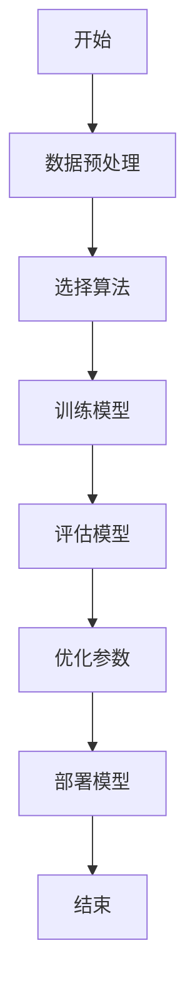
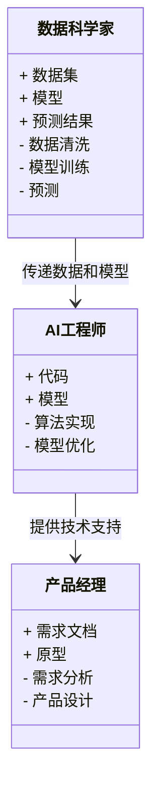
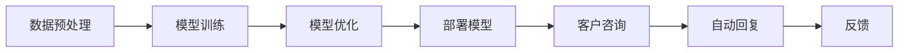
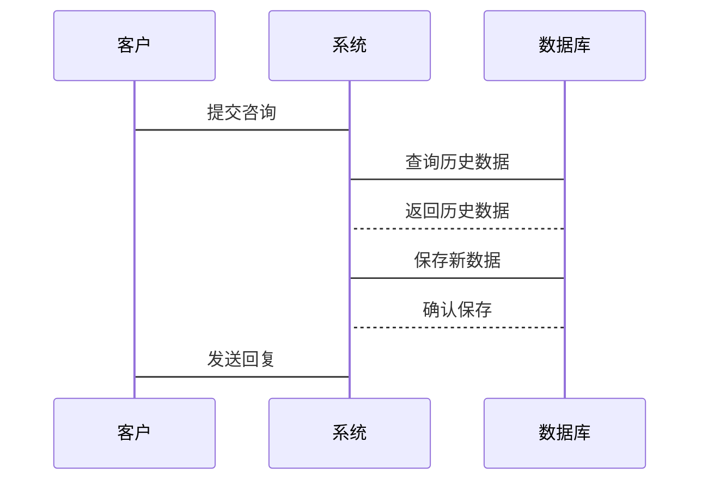

                 


# 组建高效AI开发团队：角色、技能与协作

> **关键词**：AI开发团队、角色分工、技能要求、团队协作、高效开发、系统架构

> **摘要**：本文详细探讨了如何组建高效的AI开发团队，涵盖团队角色、技能要求和协作机制的核心要素。通过分析团队结构、技能模块化分解、协作流程优化，结合实际案例和系统设计，提供了一套高效AI开发团队的组建方法论。

---

## 第一部分：背景介绍

### 第1章：AI开发团队的背景与挑战

#### 1.1 问题背景

##### 1.1.1 AI开发的现状与趋势
AI技术正在迅速改变各个行业，从数据分析到模型部署，AI开发的需求激增。然而，AI开发团队的组建面临角色分工不明确、技能互补性不足以及协作效率低下的问题。

##### 1.1.2 AI开发团队面临的挑战
- **角色分工不明确**：团队成员在职责划分上存在模糊地带，导致任务重叠或遗漏。
- **技能互补性不足**：团队成员的技能分布不均衡，难以应对复杂的AI开发任务。
- **协作效率低下**：缺乏有效的协作机制，导致沟通不畅，开发周期延长。

##### 1.1.3 高效AI开发团队的重要性
高效的AI开发团队能够快速响应需求，高质量完成任务，是企业在AI领域竞争的关键因素。

#### 1.2 问题描述

##### 1.2.1 AI开发中的角色分工
AI开发团队通常包括数据科学家、AI工程师、产品经理等角色，但各自的具体职责和协作方式尚不明确。

##### 1.2.2 技能要求与协作问题
团队成员需要具备数据处理、算法优化、产品设计等多方面的技能，但技能互补性不足和协作流程不畅是主要问题。

##### 1.2.3 团队协作中的常见问题
- **沟通不畅**：团队成员之间的沟通效率低下，导致任务执行偏差。
- **资源浪费**：重复劳动和资源分配不当，导致效率低下。
- **缺乏统一目标**：团队成员对目标理解不一致，导致协作困难。

#### 1.3 问题解决

##### 1.3.1 高效团队的核心要素
高效AI开发团队需要明确的角色分工、互补的技能和高效的协作机制。

##### 1.3.2 技能互补与角色协同
通过技能模块化分解和角色协同，确保团队能够高效完成任务。

##### 1.3.3 协作机制的优化
建立清晰的协作流程和有效的沟通工具，提高团队协作效率。

#### 1.4 边界与外延

##### 1.4.1 AI开发团队的边界
AI开发团队的职责范围和协作边界需要明确，以避免任务重叠和资源浪费。

##### 1.4.2 相关领域的外延
AI开发团队需要与数据团队、产品团队等其他团队协作，形成完整的开发体系。

##### 1.4.3 高效团队的衡量标准
通过团队效率、任务完成度、协作满意度等指标来衡量团队的高效性。

#### 1.5 概念结构与核心要素

##### 1.5.1 团队角色的层次结构
AI开发团队的角色可以分为核心角色和辅助角色，核心角色包括数据科学家、AI工程师和产品经理，辅助角色包括数据工程师和测试工程师。

##### 1.5.2 技能要求的模块化分解
技能要求可以分解为数据处理、算法优化、产品设计等多个模块，团队成员需要具备相应的技能模块。

##### 1.5.3 协作机制的系统性架构
协作机制需要形成系统化的架构，包括协作流程、沟通工具和任务分配系统。

---

## 第二部分：核心概念与联系

### 第2章：核心概念原理

#### 2.1 团队角色的原理

##### 2.1.1 角色定义与职责分配
每个角色的定义和职责需要明确，确保任务分配合理。

##### 2.1.2 角色间的依赖关系
角色之间的依赖关系需要清晰，确保协作顺畅。

##### 2.1.3 角色协同的数学模型
可以通过数学模型来描述角色协同的过程，例如角色间的任务依赖可以用图论模型表示。

#### 2.2 技能要求的原理

##### 2.2.1 技能模块化分解
将技能分解为多个模块，如数据处理、算法优化等，确保技能互补性。

##### 2.2.2 技能互补性分析
通过技能互补性分析，优化团队成员的技能分布，确保团队能够高效完成任务。

##### 2.2.3 技能提升的路径规划
根据团队需求，制定技能提升计划，帮助团队成员提升必要技能。

#### 2.3 协作机制的原理

##### 2.3.1 协作流程的设计
设计高效的协作流程，确保任务执行顺畅。

##### 2.3.2 协作工具的选择与优化
选择适合的协作工具，优化团队协作效率。

##### 2.3.3 协作效率的评估指标
通过协作效率的评估指标，不断优化协作机制。

### 第3章：核心概念属性特征对比

#### 3.1 团队角色对比

| 角色       | 职责                          | 技能要求             | 协作方式             |
|------------|------------------------------|----------------------|----------------------|
| 数据科学家 | 数据分析与建模                | 数据处理、统计分析   | 与AI工程师协作       |
| AI工程师   | 模型实现与优化                | 编程、算法优化       | 与数据科学家协作     |
| 产品经理   | 产品设计与需求管理            | 产品设计、需求分析   | 与所有角色协作       |
| 数据工程师 | 数据清洗与存储                | 数据处理、数据库操作 | 与数据科学家协作     |
| 测试工程师 | 模型测试与优化                | 测试用例设计、自动化测试 | 与AI工程师协作       |

#### 3.2 技能模块对比

| 技能模块       | 必备技能                     | 补充技能               |
|----------------|------------------------------|-----------------------|
| 数据处理       | 数据清洗、数据建模           | 数据可视化、数据存储   |
| 算法优化       | 算法实现、模型训练           | 超参数调优、分布式计算 |
| 产品设计       | 需求分析、原型设计           | 用户体验设计、项目管理 |
| 编程           | Python、Java                | C++、JavaScript       |

---

## 第三部分：算法原理讲解

### 第3章：算法原理

#### 3.1 算法原理

##### 3.1.1 算法的描述
AI开发团队中常用的算法，如决策树、随机森林、神经网络等，需要选择合适的算法模型。

##### 3.1.2 算法实现
通过代码实现算法，例如使用Python的Scikit-learn库进行机器学习模型的训练。

##### 3.1.3 算法优化
通过超参数调优、分布式计算等方法优化算法性能。

##### 3.1.4 算法的数学模型
机器学习算法的数学模型可以用数学公式表示，例如线性回归的损失函数：

$$ L = \sum_{i=1}^{n} (y_i - \hat{y}_i)^2 $$

其中，$y_i$ 是真实值，$\hat{y}_i$ 是预测值。

#### 3.2 算法的流程图



---

## 第四部分：系统分析与架构设计方案

### 第4章：系统分析与架构设计

#### 4.1 问题场景介绍

##### 4.1.1 问题场景
以智能客服系统为例，AI开发团队需要设计一个高效的系统架构，实现客户咨询的自动回复。

##### 4.1.2 项目介绍
项目目标是开发一个基于机器学习的智能客服系统，实现客户咨询的自动处理。

#### 4.2 系统功能设计

##### 4.2.1 领域模型类图



#### 4.3 系统架构设计

##### 4.3.1 系统架构图



#### 4.4 系统接口设计

##### 4.4.1 系统接口
- **API接口**：提供RESTful API，供前端调用。
- **数据接口**：与数据库交互，存储客户咨询数据和模型结果。

##### 4.4.2 系统交互序列图



---

## 第五部分：项目实战

### 第5章：项目实战

#### 5.1 环境安装

##### 5.1.1 安装Python
```bash
python --version
pip install --upgrade pip
```

##### 5.1.2 安装依赖库
```bash
pip install numpy pandas scikit-learn
```

#### 5.2 系统核心实现源代码

##### 5.2.1 数据预处理代码
```python
import pandas as pd
from sklearn.model_selection import train_test_split
from sklearn.preprocessing import StandardScaler

# 加载数据集
data = pd.read_csv('data.csv')

# 分割数据集
X_train, X_test, y_train, y_test = train_test_split(data.drop('label', axis=1), data['label'], test_size=0.2, random_state=42)

# 标准化处理
scaler = StandardScaler()
X_train_scaled = scaler.fit_transform(X_train)
X_test_scaled = scaler.transform(X_test)
```

##### 5.2.2 模型训练代码
```python
from sklearn.ensemble import RandomForestClassifier
from sklearn.metrics import accuracy_score

# 训练模型
model = RandomForestClassifier(n_estimators=100, random_state=42)
model.fit(X_train_scaled, y_train)

# 预测
y_pred = model.predict(X_test_scaled)

# 评估
print(f'Accuracy: {accuracy_score(y_test, y_pred)}')
```

##### 5.2.3 部署代码
```python
import flask
from flask import Flask, request, jsonify

app = Flask(__name__)

@app.route('/predict', methods=['POST'])
def predict():
    data = request.json['data']
    prediction = model.predict(data)
    return jsonify({'result': prediction[0]})

if __name__ == '__main__':
    app.run(debug=True)
```

#### 5.3 代码应用解读与分析

##### 5.3.1 代码功能解读
上述代码实现了数据预处理、模型训练和API部署，展示了AI开发团队在实际项目中的协作流程。

##### 5.3.2 代码运行分析
通过运行代码，可以验证模型的准确性和API的响应速度，确保系统运行正常。

#### 5.4 实际案例分析

##### 5.4.1 案例分析
以智能客服系统为例，分析系统的运行情况，评估模型的准确性和客户满意度。

##### 5.4.2 案例总结
总结项目经验，优化团队协作流程，提升开发效率。

#### 5.5 项目小结

##### 5.5.1 项目成果
成功开发了一个高效的智能客服系统，实现了客户咨询的自动回复。

##### 5.5.2 经验总结
明确了团队角色分工，优化了协作流程，提高了开发效率。

---

## 第六部分：最佳实践与小结

### 第6章：最佳实践

#### 6.1 小结

##### 6.1.1 团队角色分工
通过明确的角色分工，确保任务分配合理，避免重复劳动。

##### 6.1.2 技能互补与提升
通过技能模块化分解和技能提升计划，优化团队成员的技能分布。

##### 6.1.3 协作机制优化
建立高效的协作流程和沟通工具，提高团队协作效率。

#### 6.2 注意事项

##### 6.2.1 避免的误区
- **角色混淆**：避免角色职责不明确导致的任务重叠。
- **技能单一化**：避免团队成员技能过于单一，导致协作困难。
- **协作流程僵化**：避免协作流程过于僵化，无法适应实际需求。

##### 6.2.2 风险提示
- **技术风险**：选择合适的算法和技术方案，确保系统稳定性。
- **协作风险**：建立有效的沟通机制，避免协作冲突。
- **项目风险**：制定合理的项目计划，确保项目按时完成。

#### 6.3 拓展阅读

##### 6.3.1 推荐书籍
- 《集体智慧编程》
- 《人月神话》
- 《敏捷开发实战》

##### 6.3.2 推荐文章
- 《如何构建高效的开发团队》
- 《AI开发的最佳实践》
- 《团队协作的优化方法》

---

## 作者：AI天才研究院 / AI Genius Institute & 禅与计算机程序设计艺术 / Zen And The Art of Computer Programming

---

以上是《组建高效AI开发团队：角色、技能与协作》的完整目录大纲和详细内容，涵盖了背景介绍、核心概念、算法原理、系统设计、项目实战以及最佳实践等多个方面。

