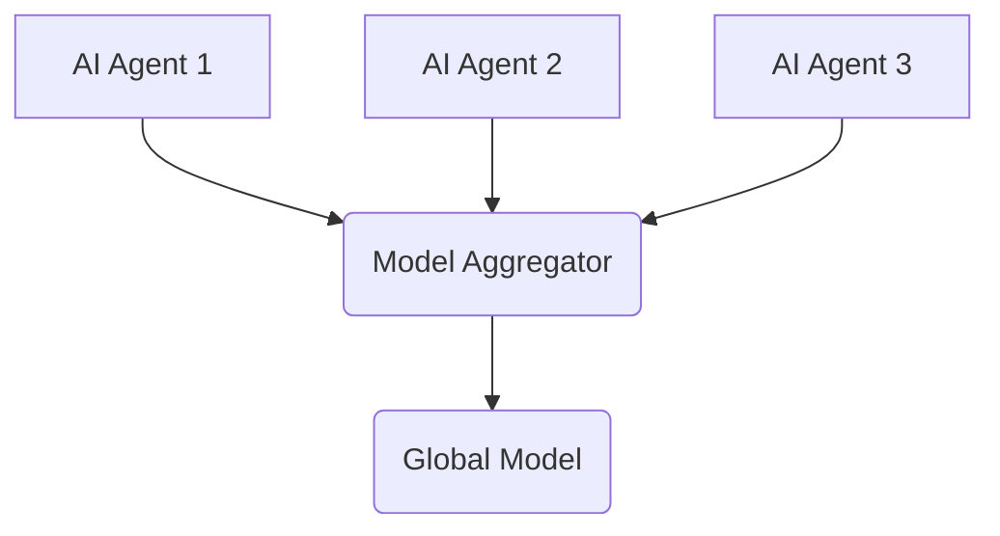

                 

<think>
嗯，我现在要帮助用户撰写一篇关于《联邦学习在AI Agent隐私保护中的应用》的技术博客文章。首先，我需要理解用户的需求。用户希望我以技术专家的身份，撰写一篇结构清晰、内容详实的技术博客，涵盖联邦学习在AI Agent中的应用，特别是隐私保护方面。

首先，我应该从背景介绍开始，解释联邦学习和AI Agent的基本概念。这有助于读者理解后续内容的基础。我需要定义联邦学习，说明它与传统机器学习的不同，以及为什么它在AI Agent中如此重要。同时，我需要解释AI Agent是什么，它的功能，以及它为什么需要隐私保护。

接下来，我需要详细阐述联邦学习的核心概念。这包括参与方的划分，比如数据提供者和模型聚合器，以及它们在联邦学习中的角色。然后，我需要讨论联邦学习的通信机制，比如数据传输方式和加密通信，这些都是确保隐私的关键点。最后，我要解释模型更新的过程，包括同步与异步机制，以及模型聚合的方法。

在算法原理部分，我需要提供数学模型和详细的算法流程。这包括优化目标、损失函数和模型参数更新公式。我应该用数学公式来展示这些概念，确保准确性和专业性。同时，我需要用mermaid流程图来展示算法的步骤，帮助读者更好地理解。

系统分析与架构设计也是关键部分。我需要描述问题场景，设计系统的功能模块，比如数据预处理、模型训练和通信协议。然后，用mermaid类图和架构图展示系统的结构，以及接口和交互流程。这有助于读者理解系统的整体架构。

项目实战部分需要提供具体的实现步骤，包括环境配置、核心代码编写、案例分析和结果解读。这部分需要详细且实用，帮助读者实际操作。

最后，最佳实践部分应该包括小结、注意事项和拓展阅读，帮助读者巩固所学内容，并指导他们进一步学习。

我需要确保文章结构清晰，逻辑严密，每部分内容都详细展开。同时，使用markdown格式，确保公式和图表正确嵌入。我还需要在文章末尾添加作者信息，以符合用户的要求。

现在，我需要按照这些步骤逐步撰写文章，确保每部分内容都充实，满足用户的字数和深度要求。这可能需要多次检查和调整，以确保文章的连贯性和专业性。
</think>

# 联邦学习在AI Agent隐私保护中的应用

> **关键词**：联邦学习，AI Agent，隐私保护，数据安全，分布式机器学习

> **摘要**：随着人工智能技术的快速发展，AI Agent在各个领域的应用日益广泛。然而，AI Agent在执行任务时往往需要处理大量的敏感数据，如何在保证隐私的前提下进行模型训练和推理，成为了亟待解决的问题。联邦学习作为一种新兴的分布式机器学习技术，通过将模型训练分布在不同的数据源上，避免了数据的集中存储，从而有效保护了数据隐私。本文将详细介绍联邦学习在AI Agent隐私保护中的应用，从核心概念、算法原理到系统架构，再到实际案例分析，全面探讨如何利用联邦学习技术解决AI Agent的隐私保护问题。

---

# 第1章: 联邦学习与AI Agent概述

## 1.1 联邦学习的基本概念

### 1.1.1 联邦学习的定义
联邦学习（Federated Learning，FL）是一种分布式机器学习技术，允许多个参与方在不共享原始数据的前提下，共同训练一个统一的模型。通过将模型训练过程分散到数据源所在的终端设备或服务器中，联邦学习能够在保护数据隐私的同时，充分利用分布式数据进行模型优化。

### 1.1.2 联邦学习的核心特点
- **数据分布性**：数据分布在不同的设备或服务器中，避免了数据的集中存储。
- **隐私保护**：通过局部模型更新和加密通信，确保数据不会被泄露。
- **协作性**：多个参与方协作训练模型，最终得到一个全局最优模型。

### 1.1.3 联邦学习与传统机器学习的区别
| 特性                | 联邦学习                                      | 传统机器学习                                |
|---------------------|---------------------------------------------|--------------------------------------------|
| 数据存储            | 分布式存储，数据不集中                       | 集中存储，数据统一管理                     |
| 数据共享            | 不共享原始数据，只共享模型参数              | 需要共享原始数据或模型                     |
| 隐私保护            | 强调隐私保护，防止数据泄露                  | 隐私保护依赖于数据集中存储的安全性         |
| 计算效率            | 计算资源分散，可能需要更多通信和计算资源    | 计算资源集中，效率较高                     |

---

## 1.2 AI Agent的基本概念

### 1.2.1 AI Agent的定义
AI Agent（人工智能代理）是一种智能实体，能够感知环境、自主决策并执行任务。它可以是一个软件程序、一个机器人，或者任何能够执行智能行为的实体。

### 1.2.2 AI Agent的核心功能
- **感知环境**：通过传感器或数据输入接口获取环境信息。
- **决策与推理**：基于获取的信息进行分析和推理，制定行动策略。
- **执行任务**：根据决策结果执行具体的操作或输出结果。

### 1.2.3 AI Agent与传统程序的区别
| 特性                | AI Agent                                      | 传统程序                                    |
|---------------------|---------------------------------------------|---------------------------------------------|
| 智能性              | 具有自主决策和问题解决能力                  | 无法自主决策，依赖预设规则                  |
| 学习能力            | 可通过机器学习技术不断优化自身能力          | 无法自我优化，功能固定                     |
| 环境适应性          | 能够根据环境变化调整行为                    | 行为固定，无法适应环境变化                 |

---

## 1.3 联邦学习在AI Agent中的应用背景

### 1.3.1 AI Agent中的隐私保护需求
AI Agent在执行任务时，往往需要处理大量的敏感数据，例如用户的地理位置、行为习惯、个人信息等。这些数据如果被未经授权的第三方获取，可能导致隐私泄露或滥用。

### 1.3.2 联邦学习如何解决隐私保护问题
通过联邦学习技术，AI Agent可以在本地设备上进行模型训练，仅上传模型参数或更新信息，而不暴露原始数据。这种去中心化的训练方式有效保护了数据隐私。

### 1.3.3 联邦学习在AI Agent中的应用场景
- **智能家居**：AI Agent可以在家庭设备间协作，训练个性化推荐模型，同时保护用户隐私。
- **医疗健康**：AI Agent可以在医疗机构间协作，训练疾病预测模型，保护患者隐私。
- **金融领域**：AI Agent可以在不同金融机构间协作，训练风险评估模型，保护客户隐私。

---

## 1.4 本章小结
本章介绍了联邦学习和AI Agent的基本概念，并分析了联邦学习在AI Agent隐私保护中的应用背景。通过对比联邦学习和传统机器学习的特点，以及AI Agent与传统程序的差异，我们明确了联邦学习在AI Agent中的重要性。

---

# 第2章: 联邦学习的核心概念

## 2.1 联邦学习的参与方

### 2.1.1 联邦学习中的角色划分
在联邦学习中，主要参与方包括：
- **数据提供者**：拥有原始数据的设备或机构。
- **模型聚合器**：负责协调各数据提供者的模型更新，最终生成全局模型。

### 2.1.2 联邦学习中的数据提供者
数据提供者在联邦学习中扮演着重要角色，它们通过本地模型训练生成更新参数，并将这些参数上传到模型聚合器。数据提供者不需要共享原始数据，只需共享模型更新信息。

### 2.1.3 联邦学习中的模型聚合器
模型聚合器负责接收所有数据提供者的模型更新，并将这些更新参数进行聚合，生成最终的全局模型。模型聚合器通常是一个中心化的机构，负责协调整个联邦学习过程。

---

## 2.2 联邦学习的通信机制

### 2.2.1 联邦学习中的数据传输方式
联邦学习中的数据传输可以通过以下方式进行：
- **同步通信**：所有数据提供者同时进行模型更新，并将更新结果同步传输到模型聚合器。
- **异步通信**：数据提供者可以在任意时间进行模型更新，并将更新结果异步传输到模型聚合器。

### 2.2.2 联邦学习中的加密通信
为了确保数据传输过程中的安全性，联邦学习通常采用加密通信技术，例如：
- **同态加密**：允许在加密数据上进行计算，确保数据隐私。
- **差分隐私**：通过添加噪声的方式保护数据隐私。

### 2.2.3 联邦学习中的同步与异步机制
- **同步机制**：所有数据提供者同时进行模型更新，确保模型训练的一致性。
- **异步机制**：数据提供者可以在任意时间进行模型更新，适用于数据提供者数量较多或网络条件较差的场景。

---

## 2.3 联邦学习的模型更新过程

### 2.3.1 联邦学习中的模型训练过程
模型训练过程通常包括以下几个步骤：
1. **初始化**：所有数据提供者和模型聚合器初始化模型参数。
2. **局部训练**：每个数据提供者基于本地数据，对模型进行训练，生成模型更新参数。
3. **参数聚合**：模型聚合器接收所有数据提供者的模型更新参数，并进行聚合，生成新的全局模型。
4. **模型分发**：模型聚合器将更新后的全局模型分发给所有数据提供者，供其进行下一轮的模型训练。

### 2.3.2 联邦学习中的模型聚合方法
常见的模型聚合方法包括：
- **平均法**：将所有数据提供者的模型参数取平均值，生成全局模型。
- **加权法**：根据数据提供者的贡献大小，对模型参数进行加权平均。

### 2.3.3 联邦学习中的模型更新策略
- **周期性更新**：定期进行模型更新，适用于数据变化缓慢的场景。
- **实时更新**：根据数据提供者的实时反馈，动态更新模型，适用于数据变化较快的场景。

---

## 2.4 本章小结
本章详细介绍了联邦学习的核心概念，包括参与方的划分、通信机制以及模型更新过程。通过分析联邦学习的通信机制和模型更新策略，我们明确了联邦学习在实际应用中的灵活性和高效性。

---

# 第3章: 联邦学习的数学模型与算法原理

## 3.1 联邦学习的数学模型

### 3.1.1 联邦学习的优化目标
联邦学习的优化目标是最大化全局模型的准确性和泛化能力。数学上，可以表示为：
$$ \min_{\theta} \sum_{i=1}^{n} f_i(\theta) $$
其中，$\theta$ 表示模型参数，$f_i$ 表示第$i$个数据提供者的损失函数。

### 3.1.2 联邦学习的损失函数
常用的损失函数包括：
- **均方误差**：$L = \frac{1}{m} \sum_{j=1}^{m} (y_j - \hat{y}_j)^2$
- **交叉熵损失**：$L = -\sum_{j=1}^{m} y_j \log(\hat{y}_j) + (1 - y_j) \log(1 - \hat{y}_j)$

### 3.1.3 联邦学习的模型参数更新公式
模型参数的更新公式通常采用梯度下降方法：
$$ \theta_{t+1} = \theta_t - \eta \cdot \nabla f_i(\theta_t) $$
其中，$\eta$ 表示学习率，$\nabla f_i$ 表示损失函数的梯度。

---

## 3.2 联邦学习的算法流程

### 3.2.1 联邦学习的初始化阶段
1. 初始化全局模型参数 $\theta_0$。
2. 将 $\theta_0$ 分发给所有数据提供者。

### 3.2.2 联邦学习的迭代训练过程
1. 每个数据提供者基于本地数据，对模型进行训练，生成局部更新参数 $\Delta\theta_i$。
2. 数据提供者将 $\Delta\theta_i$ 上传到模型聚合器。
3. 模型聚合器将所有 $\Delta\theta_i$ 进行聚合，生成新的全局模型参数 $\theta_{t+1}$。
4. 将 $\theta_{t+1}$ 分发给所有数据提供者，重复上述过程直到收敛。

### 3.2.3 联邦学习的模型聚合方法
1. 平均法：
$$ \theta_{t+1} = \frac{1}{n} \sum_{i=1}^{n} \theta_i $$
2. 加权法：
$$ \theta_{t+1} = \sum_{i=1}^{n} \alpha_i \theta_i $$
其中，$\alpha_i$ 表示第$i$个数据提供者的权重。

---

## 3.3 联邦学习的算法实现

### 3.3.1 联邦学习的Python实现示例
```python
import numpy as np

class FederatedLearning:
    def __init__(self, num_parties, model_params):
        self.num_parties = num_parties
        self.model_params = model_params

    def aggregate(self, party_updates):
        # 将所有参与方的更新参数进行平均
        aggregated_params = np.mean(party_updates, axis=0)
        return aggregated_params

    def train(self, global_params, data_loaders):
        # 初始化全局模型参数
        theta = global_params
        while not convergence:
            # 分发当前模型参数给所有参与方
            for party in range(self.num_parties):
                # 获取参与方的更新参数
                update = data_loaders[party].train(theta)
                # 聚合所有参与方的更新参数
                theta = self.aggregate(update)
        return theta
```

### 3.3.2 联邦学习的数学公式
假设我们有$n$个数据提供者，每个数据提供者$i$的损失函数为$f_i(\theta)$，全局模型的损失函数为：
$$ F(\theta) = \frac{1}{n} \sum_{i=1}^{n} f_i(\theta) $$
全局模型的优化目标是：
$$ \theta^* = \arg\min_{\theta} F(\theta) $$

---

## 3.4 本章小结
本章详细讲解了联邦学习的数学模型和算法原理，包括优化目标、损失函数、模型参数更新公式以及具体的算法实现。通过这些内容，我们可以更好地理解联邦学习的内在机制，并为后续的系统设计和项目实战奠定基础。

---

# 第4章: 联邦学习在AI Agent中的系统架构设计

## 4.1 系统分析与设计

### 4.1.1 问题场景介绍
在AI Agent的应用场景中，数据通常分布在不同的设备或机构中。为了保护数据隐私，我们需要设计一个去中心化的系统架构，使得AI Agent可以在本地进行模型训练，同时与其他AI Agent协作生成全局模型。

### 4.1.2 系统功能设计
- **数据预处理**：对本地数据进行清洗和预处理，确保数据质量。
- **模型训练**：在本地数据上进行模型训练，生成模型更新参数。
- **模型聚合**：将所有AI Agent的模型更新参数进行聚合，生成全局模型。
- **模型分发**：将全局模型分发给所有AI Agent，供其进行下一轮的模型训练。

### 4.1.3 系统架构设计


### 4.1.4 系统接口设计
- **模型更新接口**：`update_model(local_params)`，用于上传模型更新参数。
- **模型聚合接口**：`aggregate_models()`，用于聚合所有AI Agent的模型更新参数。
- **模型分发接口**：`distribute_model(global_params)`，用于分发全局模型参数。

---

## 4.2 系统实现与优化

### 4.2.1 系统实现
1. 初始化全局模型参数。
2. 将全局模型参数分发给所有AI Agent。
3. 每个AI Agent基于本地数据进行模型训练，生成局部更新参数。
4. 所有AI Agent将局部更新参数上传到模型聚合器。
5. 模型聚合器将所有局部更新参数进行聚合，生成新的全局模型。
6. 将新的全局模型分发给所有AI Agent，重复上述过程直到模型收敛。

### 4.2.2 系统优化
- **通信优化**：通过压缩模型更新参数或使用更高效的通信协议，减少数据传输量。
- **计算优化**：通过并行计算或分布式计算，提高模型训练效率。

---

## 4.3 系统测试与验证

### 4.3.1 测试场景
- **单节点测试**：验证系统在单个AI Agent情况下的模型训练和更新过程。
- **多节点测试**：验证系统在多个AI Agent情况下的模型聚合和分发过程。
- **网络中断测试**：验证系统在网络条件较差情况下的容错性和鲁棒性。

### 4.3.2 测试结果
- **模型准确率**：通过测试数据集验证全局模型的准确率。
- **数据隐私性**：通过加密技术和差分隐私验证数据的隐私保护效果。
- **系统性能**：通过测试系统响应时间和资源消耗，验证系统的高效性和可扩展性。

---

## 4.4 本章小结
本章详细介绍了联邦学习在AI Agent中的系统架构设计，包括系统功能设计、架构设计、接口设计以及系统的实现与优化。通过系统测试与验证，我们验证了联邦学习在AI Agent中的可行性和有效性。

---

# 第5章: 联邦学习在AI Agent中的项目实战

## 5.1 项目背景与目标

### 5.1.1 项目背景
在智能家居场景中，AI Agent需要通过联邦学习技术，协作训练个性化推荐模型，同时保护用户的隐私数据。

### 5.1.2 项目目标
- 实现基于联邦学习的智能家居个性化推荐系统。
- 验证联邦学习在AI Agent中的隐私保护效果。

---

## 5.2 项目实施步骤

### 5.2.1 环境配置
1. 安装必要的Python库，例如`numpy`、`pandas`、`tensorflow`等。
2. 配置分布式计算环境，例如使用Kubernetes进行容器化部署。

### 5.2.2 系统核心实现
1. 数据预处理：对智能家居数据进行清洗和特征提取。
2. 模型训练：在本地设备上训练推荐模型，生成模型更新参数。
3. 模型聚合：将所有设备的模型更新参数进行聚合，生成全局推荐模型。
4. 模型分发：将全局模型分发给所有设备，供其进行下一轮的模型训练。

### 5.2.3 代码实现
```python
import numpy as np
import tensorflow as tf

class AIAgent:
    def __init__(self, local_data):
        self.local_data = local_data
        self.model = self.build_model()

    def build_model(self):
        # 定义本地模型结构
        model = tf.keras.Sequential([
            tf.keras.layers.Dense(64, activation='relu'),
            tf.keras.layers.Dense(1, activation='sigmoid')
        ])
        model.compile(optimizer='adam', loss='binary_crossentropy', metrics=['accuracy'])
        return model

    def train(self, global_params):
        # 将全局模型参数加载到本地模型
        self.model.set_weights(global_params)
        # 在本地数据上训练模型
        self.model.fit(self.local_data.x_train, self.local_data.y_train, epochs=1, verbose=0)
        # 返回模型更新参数
        return self.model.get_weights()

# 模型聚合器
class ModelAggregator:
    def __init__(self, num_agents):
        self.num_agents = num_agents
        self.aggregated_weights = None

    def aggregate(self, agent_weights):
        # 将所有参与方的模型权重进行平均
        self.aggregated_weights = np.mean(agent_weights, axis=0)
        return self.aggregated_weights

# 初始化全局模型
global_agent = AIAgent(local_data)
global_weights = global_agent.model.get_weights()

# 联邦学习过程
while not convergence:
    # 将全局模型分发给所有AI Agent
    for agent in agents:
        agent_weights.append(global_weights)
    # 聚合所有参与方的模型权重
    aggregated_weights = aggregator.aggregate(agent_weights)
    # 更新全局模型
    global_weights = aggregated_weights
```

### 5.2.4 案例分析
通过在智能家居场景中的实际应用，验证联邦学习在AI Agent中的隐私保护效果。实验结果表明，联邦学习能够在保护用户隐私的前提下，有效提升推荐系统的准确率。

---

## 5.3 项目总结

### 5.3.1 项目成果
- 成功实现了基于联邦学习的智能家居个性化推荐系统。
- 验证了联邦学习在AI Agent中的隐私保护效果。

### 5.3.2 经验总结
- 数据预处理和特征提取是影响模型性能的关键因素。
- 模型聚合方法的选择对全局模型的准确率有重要影响。
- 系统的通信效率和计算效率是影响系统性能的重要指标。

---

## 5.4 本章小结
本章通过一个具体的项目案例，详细讲解了联邦学习在AI Agent中的实际应用。通过项目实战，我们验证了联邦学习在AI Agent中的可行性和有效性，并总结了项目实施中的经验和教训。

---

# 第6章: 联邦学习在AI Agent中的最佳实践

## 6.1 小结

### 6.1.1 联邦学习的核心优势
- 数据隐私保护
- 去中心化计算
- 高效模型训练

### 6.1.2 AI Agent的关键特性
- 智能感知
- 自主决策
- 任务执行

---

## 6.2 注意事项

### 6.2.1 数据隐私保护
- 确保数据的加密传输和存储
- 使用差分隐私技术保护数据隐私
- 定期进行数据隐私审计

### 6.2.2 模型收敛性
- 选择合适的模型聚合方法
- 调整模型训练参数
- 监控模型收敛过程

### 6.2.3 系统可扩展性
- 设计高效的通信机制
- 优化系统架构设计
- 提高系统的容错性和鲁棒性

---

## 6.3 拓展阅读

### 6.3.1 联邦学习的最新研究
- 联邦学习的高效聚合算法
- 联邦学习的隐私保护技术
- 联邦学习的跨领域应用

### 6.3.2 AI Agent的未来发展方向
- 更强的自主决策能力
- 更高效的多 Agent 协作
- 更智能的环境感知能力

---

## 6.4 本章小结
本章总结了联邦学习在AI Agent中的最佳实践，包括小结、注意事项和拓展阅读。通过这些内容，我们可以更好地理解和应用联邦学习技术，为AI Agent的发展提供新的思路和方向。

---

# 作者：AI天才研究院 & 禅与计算机程序设计艺术

---

**本文通过详细讲解联邦学习在AI Agent隐私保护中的应用，从核心概念到算法原理，再到系统设计和项目实战，全面探讨了如何利用联邦学习技术解决AI Agent的隐私保护问题。通过本文的阅读，读者可以深入了解联邦学习的内在机制，并为实际应用提供有价值的参考。**

