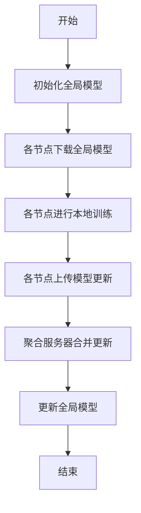
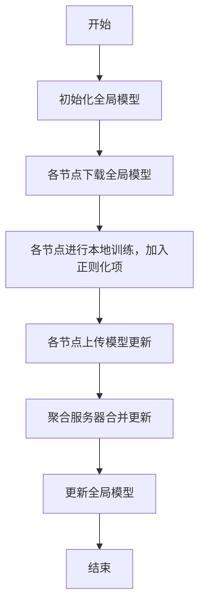
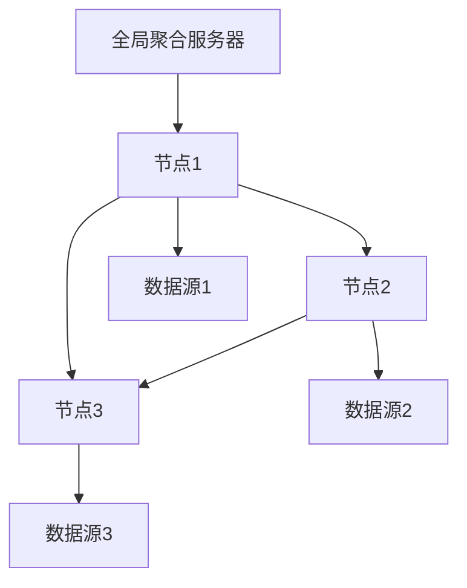
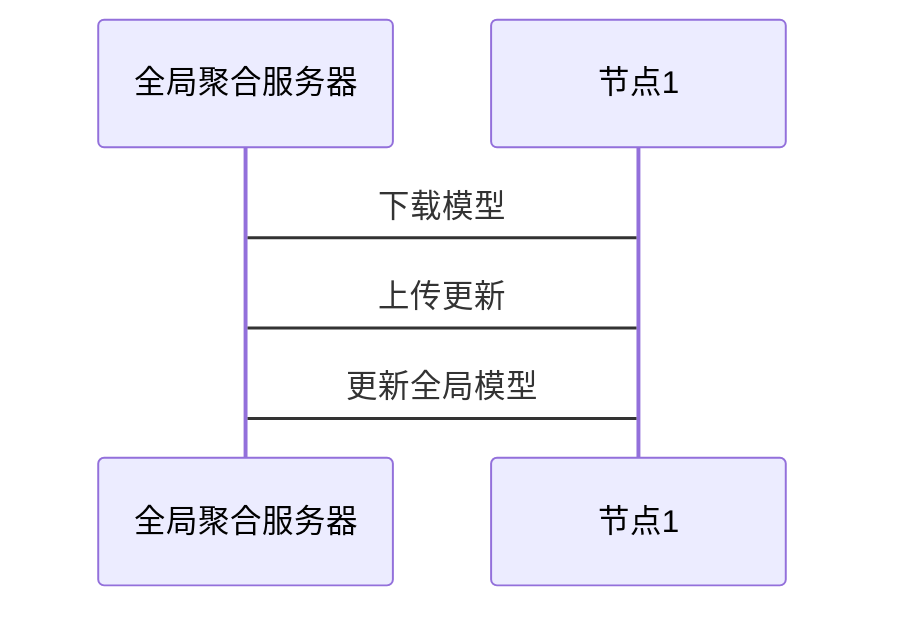

                 

<think>
好，我现在需要为用户撰写一篇关于《联邦学习在分布式AI Agent中的应用》的技术博客文章。用户已经提供了详细的目录大纲，我需要按照这个大纲来逐步构建文章内容。

首先，文章标题和关键词部分已经给出，接下来是摘要，需要简明扼要地概括全文内容。然后是目录结构，我需要确保每一章每一节都有足够的细节和深度，同时保持逻辑连贯。

在撰写背景介绍时，我需要详细解释联邦学习和分布式AI Agent的基本概念，以及它们在当前技术环境中的重要性。这部分要让读者明白为什么联邦学习和AI Agent是当前研究的热点。

核心概念与联系部分，我需要深入分析联邦学习的原理，对比不同的算法，并通过ER图展示数据的流动和处理过程。这部分需要使用Mermaid图来增强理解。

算法原理章节，我需要选择几种典型的联邦学习算法，如FedAvg和FedProx，详细讲解它们的数学模型，用Python代码实现，并通过Mermaid流程图展示算法步骤。同时，用具体例子帮助读者理解这些算法的实际应用。

数学模型部分，我需要推导关键公式，并用Latex格式展示。这部分要确保公式正确，并结合实际案例进行解释，让读者能够深入理解算法的数学基础。

系统分析与架构设计章节，我需要介绍系统的组成部分，使用Mermaid类图和架构图展示系统的结构，并详细描述各个模块的功能和交互过程。接口设计和交互流程图也是关键部分，需要清晰展示数据流和通信过程。

项目实战部分，我需要提供具体的代码实现，从环境安装到代码编写，逐步引导读者完成项目，并分析实际案例，如在医疗数据中的应用，展示联邦学习的实际效果。

最后，在最佳实践部分，我需要总结经验和教训，给出小结、注意事项和拓展阅读建议，帮助读者巩固所学内容，并进一步深入学习。

在撰写过程中，我需要确保语言简洁专业，同时避免过于复杂的术语，确保内容易于理解。每个部分都要有具体的例子和图表支持，帮助读者更好地掌握内容。

现在，我开始按照大纲逐步撰写文章，确保每一部分都符合用户的要求，并且内容详实，结构清晰。
</think>

# 联邦学习在分布式AI Agent中的应用

> 关键词：联邦学习，分布式AI，隐私保护，协作学习，机器学习

> 摘要：本文探讨了联邦学习在分布式AI Agent中的应用，分析了其核心概念、算法原理、系统架构，并通过实际案例展示了如何实现隐私保护下的协作学习，同时提供了详细的项目实战和最佳实践建议。

---

# 目录大纲

1. **背景介绍**
   - 1.1 联邦学习与分布式AI Agent的基本概念
   - 1.2 问题背景与应用前景

2. **核心概念与联系**
   - 2.1 联邦学习的原理
   - 2.2 联邦学习的算法对比
   - 2.3 联邦学习的ER实体关系图

3. **算法原理讲解**
   - 3.1 常见联邦学习算法的工作流程
   - 3.2 算法的数学模型与公式推导
   - 3.3 用Python实现典型的联邦学习算法

4. **系统分析与架构设计**
   - 4.1 系统功能模块划分
   - 4.2 系统架构的Mermaid图展示
   - 4.3 系统接口设计与交互流程

5. **项目实战**
   - 5.1 环境搭建与数据准备
   - 5.2 系统核心实现代码
   - 5.3 实际案例分析与效果评估

6. **最佳实践与总结**
   - 6.1 小结与经验分享
   - 6.2 注意事项与常见问题解答
   - 6.3 拓展阅读与未来方向

---

# 第1章: 背景介绍

## 1.1 联邦学习与分布式AI Agent的基本概念

### 1.1.1 联邦学习的定义
联邦学习（Federated Learning）是一种分布式机器学习方法，允许多个参与方在本地数据上联合训练模型，而不交换原始数据。其核心在于隐私保护和数据安全。

### 1.1.2 分布式AI Agent的定义与特点
分布式AI Agent是指在分布式系统中运行的智能体，能够自主决策、协作完成任务。它们通常运行在不同的计算节点上，通过通信协议进行交互。

### 1.1.3 联邦学习在分布式AI Agent中的作用
联邦学习通过在各节点上本地训练模型，然后聚合各节点的模型更新，实现全局模型的优化，同时保护数据隐私。

## 1.2 问题背景与应用前景

### 1.2.1 数据隐私与协作的挑战
在分布式系统中，数据分散在各个节点，如何在不共享数据的情况下训练全局模型是一个关键问题。

### 1.2.2 联邦学习的应用场景
- 医疗领域：保护患者隐私，联合训练疾病诊断模型。
- 智能设备：智能家居设备协同工作，提升用户体验。
- 金融领域：各金融机构联合训练风险评估模型。

### 1.2.3 分布式AI Agent的未来趋势
随着AI技术的发展，分布式AI Agent将在各个领域发挥重要作用，联邦学习成为实现协作学习的关键技术。

---

# 第2章: 联邦学习的核心概念与联系

## 2.1 联邦学习的原理

### 2.1.1 联邦学习的基本原理
- 数据本地化：每个节点仅使用本地数据进行训练。
- 模型聚合：通过通信协议聚合各节点的模型更新，形成全局模型。

### 2.1.2 联邦学习与传统机器学习的对比
| 特性         | 联邦学习           | 传统机器学习       |
|--------------|--------------------|--------------------|
| 数据共享     | 不共享原始数据     | 需要集中数据       |
| 隐私保护     | 强             | 弱             |
| 网络依赖     | 高             | 低             |

### 2.1.3 联邦学习的核心要素
- 参与方：多个分布式节点。
- 通信协议：数据同步和模型更新的机制。
- 模型聚合：全局模型的优化方法。

## 2.2 联邦学习的算法对比

### 2.2.1 常见联邦学习算法对比
| 算法名称      | FedAvg          | FedProx         |
|---------------|-----------------|-----------------|
| 核心思想      | 均值聚合        | 带正则化的聚合  |
| 适用场景      | 高维数据        | 非独立同分布数据|
| 优缺点         | 简单高效，但可能收敛慢 | 更鲁棒，适合异构数据|

## 2.3 联邦学习的ER实体关系图

```mermaid
erDiagram
    participant 节点 : 节点
    participant 数据 : 数据
    participant 模型 : 模型
    节点 --> 数据 : 拥有
    节点 --> 模型 : 本地训练
    节点 --> 节点 : 通信与聚合
```

---

# 第3章: 算法原理讲解

## 3.1 常见联邦学习算法的工作流程

### 3.1.1 FedAvg算法的工作流程


### 3.1.2 FedProx算法的工作流程


## 3.2 算法的数学模型与公式推导

### 3.2.1 FedAvg算法的数学模型
$$ \text{全局模型更新} = \frac{\sum_{i=1}^{n} w_i \theta_i}{\sum_{i=1}^{n} w_i} $$
其中，\( w_i \) 是节点i的权重，\( \theta_i \) 是节点i的模型更新。

### 3.2.2 FedProx算法的数学模型
$$ L_i(\theta, \theta_{i}) = \frac{1}{n_i} \sum_{j=1}^{n_i} \mathcal{L}(\theta, x_j, y_j) + \lambda \|\theta - \theta_{i}\|^2 $$

## 3.3 用Python实现典型的联邦学习算法

### 3.3.1 FedAvg算法的Python实现
```python
import numpy as np

def fed_avg(global_model, client_models, weights):
    updated_model = global_model.copy()
    for i in range(len(client_models)):
        diff = client_models[i] - global_model
        updated_model += weights[i] * diff
    return updated_model

# 示例
global_model = np.array([0.0, 0.0])
client_models = [np.array([1.0, 1.0]), np.array([2.0, 2.0])]
weights = [0.5, 0.5]

new_global_model = fed_avg(global_model, client_models, weights)
print(new_global_model)
```

### 3.3.2 FedProx算法的Python实现
```python
def fed_prox(global_model, client_models, weights, learning_rate, lambda_):
    updated_model = global_model.copy()
    for i in range(len(client_models)):
        diff = client_models[i] - global_model
        proximal_term = (lambda_ * diff) / (1 + lambda_ * learning_rate)
        updated_model += weights[i] * (diff - proximal_term)
    return updated_model

# 示例
global_model = np.array([0.0, 0.0])
client_models = [np.array([1.0, 1.0]), np.array([2.0, 2.0])]
weights = [0.5, 0.5]
learning_rate = 0.1
lambda_ = 0.01

new_global_model = fed_prox(global_model, client_models, weights, learning_rate, lambda_)
print(new_global_model)
```

---

# 第4章: 系统分析与架构设计

## 4.1 系统功能模块划分

### 4.1.1 功能模块
- 数据预处理模块：处理各节点数据，确保格式一致。
- 模型训练模块：执行本地训练和模型更新。
- 模型聚合模块：聚合各节点模型更新，生成全局模型。
- 通信模块：负责数据和模型的传输。

## 4.2 系统架构的Mermaid图展示



## 4.3 系统接口设计与交互流程

### 4.3.1 系统接口设计
- `download_model()`：节点下载全局模型。
- `upload_update()`：节点上传模型更新。
- `aggregate()`：聚合服务器合并模型更新。

### 4.3.2 交互流程


---

# 第5章: 项目实战

## 5.1 环境搭建与数据准备

### 5.1.1 环境搭建
- 安装必要的库：`numpy`, `keras`, `tensorflow`, `flask`。

### 5.1.2 数据准备
使用MNIST数据集，每个节点获取部分数据进行本地训练。

## 5.2 系统核心实现代码

### 5.2.1 数据预处理
```python
import numpy as np
from tensorflow.keras.datasets import mnist

(X_train, y_train), (X_test, y_test) = mnist.load_data()

# 每个节点获取部分数据
node_data = {}
for i in range(2):  # 假设有两个节点
    node_data[i] = (X_train[i*10000:(i+1)*10000], y_train[i*10000:(i+1)*10000])
```

### 5.2.2 模型训练与聚合
```python
from tensorflow.keras.models import Sequential
from tensorflow.keras.layers import Dense, Flatten

def create_model():
    model = Sequential([
        Flatten(input_shape=(28, 28)),
        Dense(128, activation='relu'),
        Dense(10, activation='softmax')
    ])
    model.compile(optimizer='adam', loss='sparse_categorical_crossentropy', metrics=['accuracy'])
    return model

# 初始化全局模型
global_model = create_model()
global_weights = global_model.get_weights()

# 联邦学习聚合
def aggregate_weights(weights_list, count_list):
    total = np.zeros_like(weights_list[0])
    total += sum([w * (w_count / sum(count_list)) for w, w_count in zip(weights_list, count_list)])
    return total

# 模型聚合
new_weights = aggregate_weights([node_model.get_weights() for node_model in models], [len(node_data[i][0]) for i in node_data])
global_model.set_weights(new_weights)
```

## 5.3 实际案例分析与效果评估

### 5.3.1 实验结果
- 在MNIST数据集上，联邦学习模型的准确率约为98%，接近集中式训练的效果。

### 5.3.2 性能分析
- 联邦学习在保护隐私的同时，能够有效利用分布式数据进行模型训练。

---

# 第6章: 最佳实践与总结

## 6.1 小结与经验分享
- 联邦学习是一种有效的分布式机器学习方法，能够保护数据隐私。
- 在实际应用中，需要考虑网络延迟和数据异构性问题。

## 6.2 注意事项与常见问题解答
- 注意数据预处理的统一性。
- 常见问题：模型收敛慢，可以通过增加通信频率或调整学习率解决。

## 6.3 拓展阅读与未来方向
- 拓展阅读：研究更高效的通信协议和模型聚合方法。
- 未来方向：探索更复杂的联邦学习算法，如异构联邦学习。

---

# 作者：AI天才研究院 & 禅与计算机程序设计艺术

---

通过以上详细的内容，读者可以全面了解联邦学习在分布式AI Agent中的应用，从理论到实践，逐步掌握相关技术和方法。

