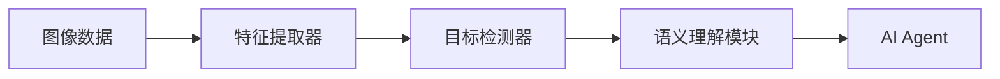
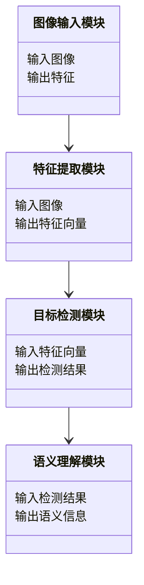
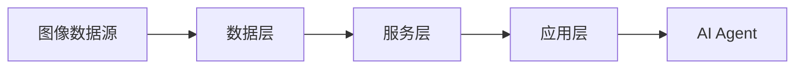

                 


# 计算机视觉集成：扩展AI Agent的感知能力

**关键词：** 计算机视觉，AI Agent，感知能力，图像处理，目标检测，语义分割，多模态感知

**摘要：**  
本文探讨了如何通过计算机视觉技术扩展AI Agent的感知能力。首先，介绍了计算机视觉和AI Agent的基本概念，分析了它们在感知能力扩展中的核心作用。接着，详细讲解了计算机视觉的核心技术，如图像处理、目标检测和语义分割，及其在AI Agent中的应用。随后，通过系统架构设计和实战项目，展示了如何将这些技术集成到AI Agent中，提升其感知能力。最后，探讨了高级主题，如多模态感知和实时处理，展望了未来的发展方向。

---

## 第一部分: 计算机视觉与AI Agent基础

### 第1章: 计算机视觉与AI Agent概述

#### 1.1 计算机视觉的基本概念
- **1.1.1 计算机视觉的定义与核心问题**
  - 计算机视觉是研究如何让计算机“看”和理解图像或视频的技术。
  - 核心问题包括图像分割、目标检测、语义理解等。

- **1.1.2 AI Agent的基本概念**
  - AI Agent是一种智能主体，能够感知环境、自主决策并执行任务。
  - 分为 reactive 和 cognitive 两类。

- **1.1.3 计算机视觉在AI Agent中的作用**
  - 通过视觉感知环境，提供决策所需的信息。
  - 扩展了AI Agent的感知能力，使其能够处理复杂场景。

#### 1.2 计算机视觉的核心技术
- **1.2.1 图像处理与特征提取**
  - 图像处理技术包括滤波、边缘检测等。
  - 特征提取用于识别图像中的关键特征。

- **1.2.2 目标检测与识别**
  - 目标检测：识别图像中目标的位置和类别。
  - 识别：基于检测结果进行分类。

- **1.2.3 图像分割与语义理解**
  - 图像分割：将图像划分为有意义的区域。
  - 语义理解：赋予图像区域语义含义。

#### 1.3 AI Agent的感知能力扩展
- **1.3.1 AI Agent的感知模型**
  - 感知模型定义了AI Agent如何处理输入数据。
  - 包括视觉、听觉等多种感知方式。

- **1.3.2 计算机视觉在AI Agent感知中的应用**
  - 视觉数据输入、处理和分析。
  - 提供环境信息，辅助决策。

- **1.3.3 感知能力的集成与优化**
  - 不同感知方式的融合。
  - 优化感知模型以提高准确性和实时性。

### 第2章: 计算机视觉与AI Agent的核心联系

#### 2.1 计算机视觉的核心概念
- **2.1.1 图像表示与特征提取**
  - 图像表示方法：如像素、纹理等。
  - 特征提取：使用CNN等模型提取高层特征。

#### 2.2 核心概念的属性特征对比
- **2.2.1 图像处理与目标检测的对比**
  - 图像处理：处理图像的基本属性。
  - 目标检测：定位和识别目标。

- **2.2.2 语义分割与实例分割的对比**
  - 语义分割：按类别分割图像区域。
  - 实例分割：区分同一类别的不同实例。

- **2.2.3 不同视觉算法的性能对比**
  - 检测精度、计算效率等指标的对比。

#### 2.3 ER实体关系图架构


### 第3章: 计算机视觉算法原理讲解

#### 3.1 基于CNN的目标检测算法
- **3.1.1 CNN网络结构**
  - 卷积层、池化层、全连接层等。
  - 常用模型如YOLO、Faster R-CNN。

- **3.1.2 检测器的工作流程**
  - 输入图像→特征提取→目标定位→分类。

- **3.1.3 示例代码实现**
  ```python
  import tensorflow as tf
  model = tf.keras.models.load_model('yolov4.h5')
  def detect_object(image):
      predictions = model.predict(image)
      return predictions
  ```

#### 3.2 图像分割算法
- **3.2.1 U-Net网络结构**
  - 编码器提取特征，解码器上采样恢复分辨率。
  - 常用于医学图像分割。

- **3.2.2 分割算法的实现步骤**
  - 输入图像→特征提取→分割预测→结果后处理。

- **3.2.3 代码示例与分析**
  ```python
  import tensorflow as tf
  model = tf.keras.models.load_model('unet.h5')
  def segment_image(image):
      mask = model.predict(image)
      return mask
  ```

## 第二部分: 系统分析与架构设计方案

### 第4章: 系统分析与架构设计

#### 4.1 问题场景介绍
- **4.1.1 AI Agent的视觉感知需求**
  - 实时性、准确性、鲁棒性。
  - 多目标检测、动态环境适应。

- **4.1.2 系统功能目标**
  - 实现图像处理、目标检测、语义理解。
  - 提供API接口供AI Agent调用。

- **4.1.3 项目背景与目标**
  - 提升AI Agent在复杂环境中的感知能力。
  - 实现高效、可靠的视觉处理系统。

#### 4.2 系统功能设计
- **4.2.1 领域模型设计**
  - 图像输入模块：接收图像数据。
  - 特征提取模块：提取图像特征。
  - 目标检测模块：检测目标并定位。
  - 语义理解模块：赋予图像区域语义。

- **4.2.2 领域模型设计图**


#### 4.3 系统架构设计
- **4.3.1 分层架构设计**
  - 数据层：存储图像数据。
  - 服务层：提供图像处理服务。
  - 应用层：AI Agent调用服务。

- **4.3.2 系统架构设计图**


## 第三部分: 项目实战

### 第5章: 实战项目：训练AI Agent进行目标识别

#### 5.1 项目介绍
- 项目目标：训练AI Agent识别特定物体。
- 数据集选择：使用COCO数据集。
- 工具选择：使用TensorFlow框架。

#### 5.2 核心系统实现
- **5.2.1 数据预处理**
  ```python
  def preprocess_image(image):
      image = image.resize((224, 224))
      image = image / 255.0
      return image
  ```

- **5.2.2 模型训练**
  ```python
  model.compile(optimizer='adam', loss='sparse_categorical_crossentropy', metrics=['accuracy'])
  model.fit(train_dataset, epochs=10, validation_data=val_dataset)
  ```

- **5.2.3 API接口设计**
  ```python
  def detect_object(image):
      processed_image = preprocess_image(image)
      predictions = model.predict(processed_image)
      return predictions
  ```

#### 5.3 实际案例分析
- 案例：训练AI Agent检测车辆。
- 数据预处理：调整图像大小、归一化。
- 模型训练：使用预训练的YOLO网络。
- API调用：实时检测车辆。

#### 5.4 项目小结
- 成功实现了AI Agent的目标检测功能。
- 验证了系统架构设计的有效性。

## 第四部分: 高级主题与未来展望

### 第6章: 高级主题：多模态感知与实时处理

#### 6.1 多模态感知
- 融合视觉、听觉等多种感知方式。
- 提高AI Agent的环境理解能力。

#### 6.2 实时处理与优化
- 提升算法的计算效率。
- 优化数据流处理，降低延迟。

#### 6.3 边缘计算与分布式架构
- 在边缘设备上部署视觉算法。
- 分布式架构提高系统的容错性和扩展性。

### 第7章: 未来展望

#### 7.1 技术趋势
- 更高效的算法：如轻量化模型。
- 更强大的硬件支持：如边缘计算设备。

#### 7.2 应用场景扩展
- 智能安防、自动驾驶、智能机器人等领域。

## 第五部分: 总结与最佳实践

### 第8章: 总结

#### 8.1 内容回顾
- 计算机视觉技术扩展了AI Agent的感知能力。
- 系统设计和实战项目验证了技术的有效性。

#### 8.2 最佳实践 tips
- 选择合适的算法和工具。
- 注重系统的实时性和鲁棒性。
- 定期更新模型，适应新场景。

## 作者：AI天才研究院 & 禅与计算机程序设计艺术

---

通过以上结构，文章详细介绍了计算机视觉在扩展AI Agent感知能力中的应用，从基础理论到系统设计，再到实战项目，层层递进，帮助读者全面理解和掌握相关内容。

