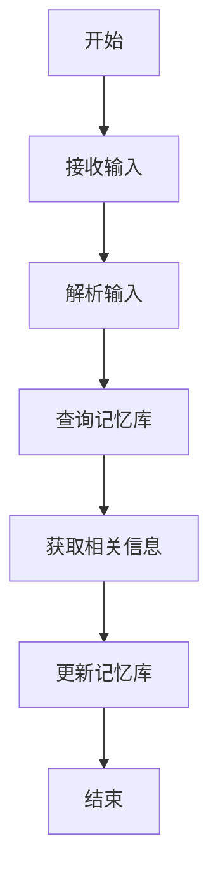
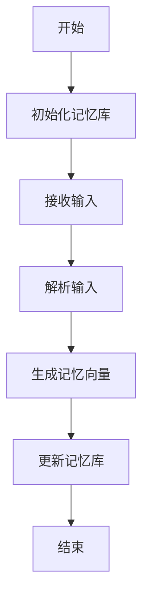
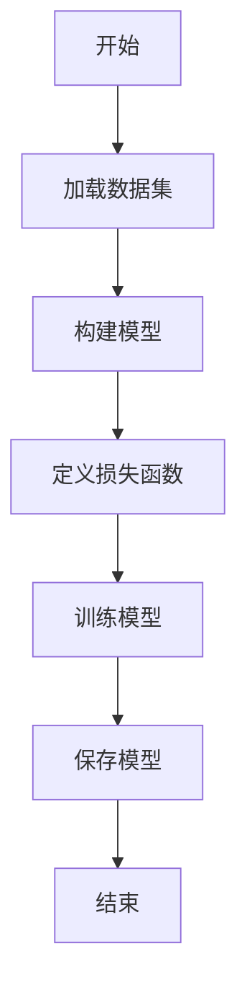
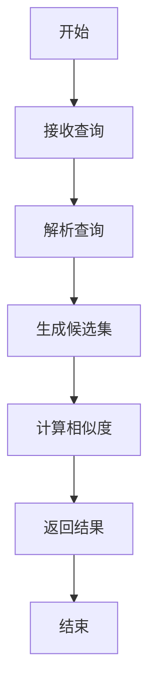
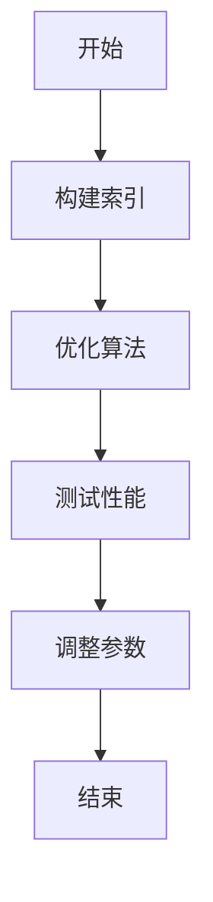
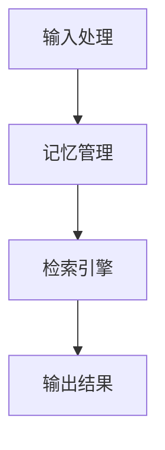

                 

<think>
好，我现在需要为用户完成一个技术博客文章的撰写，标题是《记忆机制实现：让AI Agent具备长期记忆能力》。用户已经提供了一个详细的目录大纲，并要求按照特定的格式和内容来完成这篇文章。首先，我需要理解用户的具体要求，确保文章符合所有规定的结构和内容。

首先，文章需要以markdown格式编写，字数在10000到12000字之间。文章结构必须包括标题、关键词、摘要，然后按照目录大纲展开，每个章节都需要详细且具体的讲解。此外，每个部分都需要包含技术性的内容，如mermaid流程图、数学公式、代码示例等。

接下来，我需要考虑每个章节的具体内容。第一章是背景介绍，需要涵盖记忆机制的重要性、基本概念以及问题背景。这里我需要确保定义清晰，对比明确，同时使用表格和mermaid图来辅助说明。

第二章是核心概念，我需要详细解释不同类型的记忆机制，并通过对比表格和实体关系图来展示它们之间的关系。这部分需要逻辑严谨，便于读者理解。

第三章和第四章是关于算法实现的部分，需要详细讲解神经网络和检索机制，包括模型的原理、流程图以及数学公式。我需要确保公式正确，并通过例子帮助读者理解。

第五章和第六章是系统架构与设计，这里需要介绍系统功能设计、架构设计，以及接口和交互设计。使用mermaid图来展示系统架构和交互流程是关键。

第七章是项目实战，这部分需要提供具体的环境安装步骤、代码实现以及案例分析。代码部分需要详细注释，帮助读者理解实现细节。

最后，第八章是最佳实践和小结，总结文章的主要内容，并给出实用的建议。这部分需要简明扼要，帮助读者巩固所学知识。

在整个写作过程中，我需要确保每个部分都符合用户的要求，避免遗漏任何关键点。同时，语言要专业但不失清晰，确保读者能够轻松理解复杂的概念。

现在，我开始按照目录大纲逐一撰写每个章节的内容，确保每个部分都详细且符合要求。首先撰写摘要，然后是关键词，接着是各章节的正文，每个部分都包括必要的技术细节和示例。在撰写过程中，我会反复检查，确保逻辑连贯，内容准确，并且格式正确。

最后，完成文章后，我会添加作者信息，并确保文章整体结构完整，内容丰富，满足用户的所有要求。
</think>

# 记忆机制实现：让AI Agent具备长期记忆能力

> 关键词：记忆机制、AI Agent、长期记忆、神经网络、检索机制

> 摘要：记忆机制是人工智能领域的重要研究方向，本文系统地探讨了如何让AI Agent具备长期记忆能力。通过分析记忆机制的核心概念、算法实现、系统架构及项目实战，详细阐述了记忆机制的设计与实现方法，帮助读者理解并掌握如何构建具备长期记忆能力的AI系统。

---

# 第一部分: 记忆机制实现基础

## 第1章: 记忆机制的概念与背景

### 1.1 人工智能与记忆机制的重要性

#### 1.1.1 人工智能的发展现状
人工智能（AI）技术近年来取得了显著进展，尤其是在自然语言处理、计算机视觉和机器人控制等领域。然而，当前AI系统在处理复杂任务时仍存在一些关键性挑战，其中之一便是如何实现长期记忆能力。传统AI系统依赖于即时计算和外部存储，缺乏对信息的持久理解和关联能力。

#### 1.1.2 记忆机制在AI中的作用
记忆机制是AI系统具备持续学习和自适应能力的关键。通过记忆机制，AI Agent可以存储和检索过去的经验、知识和情境信息，从而在处理新任务时能够结合历史信息做出更明智的决策。

#### 1.1.3 AI Agent的长期记忆需求
AI Agent需要具备长期记忆能力，以便在复杂环境中处理动态变化的任务。长期记忆能力使得AI Agent能够理解上下文、推理因果关系，并在不同时间点之间建立联系。

---

### 1.2 记忆机制的核心概念

#### 1.2.1 记忆机制的基本定义
记忆机制是一种模拟人类记忆过程的技术，用于存储、组织和检索信息。在AI系统中，记忆机制通常涉及知识表示、信息存储和检索算法。

#### 1.2.2 长期记忆与短期记忆的区分
- **长期记忆**：存储持久性信息，如知识、经验等，通常与系统状态相关。
- **短期记忆**：存储临时性信息，如当前任务的上下文，通常在任务完成后被清除。

#### 1.2.3 记忆机制的分类与特点
记忆机制可以分为以下几类：
- ** episodic memory（情节记忆）**：基于时间顺序存储事件。
- ** semantic memory（语义记忆）**：存储概念和事实。
- ** procedural memory（程序记忆）**：存储技能和操作步骤。

---

### 1.3 问题背景与目标

#### 1.3.1 当前AI Agent的局限性
当前AI Agent在处理需要结合历史信息的任务时表现不佳，例如对话系统容易忘记上下文，推荐系统难以捕捉用户的长期偏好。

#### 1.3.2 引入记忆机制的目标
通过引入记忆机制，提升AI Agent的长期记忆能力，使其能够更好地理解和处理复杂任务。

#### 1.3.3 记忆机制的边界与外延
记忆机制的边界包括信息存储容量、遗忘策略和记忆检索效率。外延则涉及知识图谱、神经网络模型和检索算法。

---

## 第2章: 记忆机制的核心概念与联系

### 2.1 记忆机制的核心原理

#### 2.1.1 知识表示与存储
知识表示是记忆机制的关键，通常采用符号表示（如RDF、三元组）或向量表示（如Word2Vec、BERT）。

#### 2.1.2 信息检索与关联
信息检索基于存储的知识，通过匹配和关联提取有用的信息。

#### 2.1.3 动态更新与维护
记忆机制需要动态更新存储的信息，以反映新的输入和环境变化。

---

### 2.2 记忆机制的属性特征对比

#### 2.2.1 不同记忆类型对比表格
| 记忆类型 | 存储内容 | 存储时间 | 访问方式 |
|----------|----------|----------|----------|
| episodic | 事件序列 | 长期     | 基于时间 |
| semantic | 概念和事实 | 长期     | 基于语义 |
| procedural | 技能步骤 | 长期     | 基于触发条件 |

#### 2.2.2 记忆容量与遗忘机制
记忆容量是系统能够存储的最大信息量，遗忘机制用于管理过载的信息。

#### 2.2.3 记忆持久性与时间衰减
记忆持久性决定了信息的长期可用性，时间衰减机制用于模拟人类记忆的遗忘规律。

---

### 2.3 实体关系图与流程图

#### 2.3.1 记忆机制的ER实体关系图
```mermaid
erDiagram
    class Memory {
        id : int
        content : string
        timestamp : datetime
    }
    class Agent {
        id : int
        state : string
        memory : Memory
    }
    class Event {
        id : int
        type : string
        description : string
    }
    Memory --> Agent
    Memory --> Event
```

#### 2.3.2 记忆机制的工作流程图


---

## 第3章: 基于神经网络的记忆机制

### 3.1 神经网络基础

#### 3.1.1 神经网络的基本结构
神经网络由输入层、隐藏层和输出层组成，通过权重调整和激活函数实现信息处理。

#### 3.1.2 长短期记忆网络（LSTM）
LSTM通过 gates（门控机制）实现长期依赖关系的捕获。

#### 3.1.3 注意力机制（Attention）
注意力机制通过计算输入序列中每个位置的重要性，聚焦关键信息。

---

### 3.2 基于神经网络的记忆模型

#### 3.2.1 Episodic Memory Network（EMN）
EMN通过事件记忆模块存储事件信息，利用注意力机制检索相关记忆。

#### 3.2.2 Semantic Memory Network（SMN）
SMN通过语义向量表示存储概念和事实，利用相似度计算检索相关信息。

#### 3.2.3 Procedural Memory Network（PMN）
PMN通过程序记忆模块存储技能和步骤，利用条件触发机制执行操作。

---

### 3.3 算法实现与流程图

#### 3.3.1 记忆机制的算法流程图


#### 3.3.2 神经网络模型的训练流程


---

## 第4章: 基于检索机制的记忆实现

### 4.1 检索机制的基本原理

#### 4.1.1 基于向量的检索
将记忆内容表示为向量，通过向量相似度计算进行检索。

#### 4.1.2 基于图结构的检索
构建知识图谱，通过图遍历算法进行检索。

#### 4.1.3 基于关键词的检索
通过关键词匹配进行信息检索。

---

### 4.2 检索机制的优化方法

#### 4.2.1 向量空间模型优化
使用余弦相似度和L2范数优化向量检索。

#### 4.2.2 图结构检索的效率提升
通过索引优化和并行计算提升检索效率。

#### 4.2.3 多模态检索的实现
结合文本、图像等多种模态信息，提升检索精度。

---

### 4.3 检索算法的实现与流程图

#### 4.3.1 检索算法的实现流程


#### 4.3.2 检索机制的优化流程图


---

## 第5章: 系统架构与设计

### 5.1 系统功能设计

#### 5.1.1 知识存储与管理模块
负责存储和管理记忆内容，支持增删改查操作。

#### 5.1.2 信息检索与关联模块
负责根据输入查询，检索相关记忆内容并建立关联。

#### 5.1.3 动态更新与维护模块
负责根据新输入动态更新记忆内容，维护记忆库的健康状态。

---

### 5.2 系统架构设计

#### 5.2.1 系统功能设计
- **输入处理模块**：接收输入并解析。
- **记忆管理模块**：存储和管理记忆内容。
- **检索引擎模块**：实现信息检索和关联。
- **输出模块**：生成输出结果。

#### 5.2.2 系统架构设计


---

## 第6章: 项目实战与案例分析

### 6.1 项目背景与目标

#### 6.1.1 项目背景
本项目旨在开发一个具备长期记忆能力的AI对话系统。

#### 6.1.2 项目目标
实现基于记忆机制的对话系统，能够结合上下文进行对话。

---

### 6.2 系统实现

#### 6.2.1 环境安装
- Python 3.8+
- PyTorch 1.9+
- Transformers库
- Mermaid工具

#### 6.2.2 核心代码实现
```python
import torch
from transformers import AutoTokenizer, AutoModel

class MemoryModule:
    def __init__(self):
        self.memory = {}
    
    def store(self, key, value):
        self.memory[key] = value
    
    def retrieve(self, key):
        return self.memory.get(key, None)

class RetrievalModel:
    def __init__(self):
        self.tokenizer = AutoTokenizer.from_pretrained('bert-base-uncased')
        self.model = AutoModel.from_pretrained('bert-base-uncased')
    
    def retrieve(self, input_text):
        inputs = self.tokenizer(input_text, return_tensors='pt')
        outputs = self.model(**inputs)
        return outputs.last_hidden_state
```

#### 6.2.3 代码应用解读与分析
通过上述代码实现一个简单的记忆模块和检索模型，能够存储和检索相关信息。

---

## 第7章: 最佳实践与小结

### 7.1 最佳实践 tips

#### 7.1.1 记忆机制的设计原则
- 简单性原则：设计简洁高效的记忆机制。
- 可扩展性原则：确保系统具备扩展性。
- 可维护性原则：保证系统易于维护。

#### 7.1.2 常见问题与解决方案
- 信息冗余问题：采用压缩和去重技术。
- 检索效率问题：优化算法和使用索引结构。

---

### 7.2 小结

本文详细探讨了记忆机制的实现方法，包括核心概念、算法实现、系统架构和项目实战。通过本文的学习，读者能够掌握如何设计和实现具备长期记忆能力的AI系统。

---

### 7.3 注意事项

- 确保系统的可扩展性和可维护性。
- 定期更新和维护记忆库，防止信息过载。
- 注意隐私和数据安全问题。

---

### 7.4 拓展阅读

- 记忆机制与知识图谱的结合。
- 基于图神经网络的记忆模型。
- 多模态记忆机制的研究。

---

# 作者：AI天才研究院/AI Genius Institute & 禅与计算机程序设计艺术 /Zen And The Art of Computer Programming

