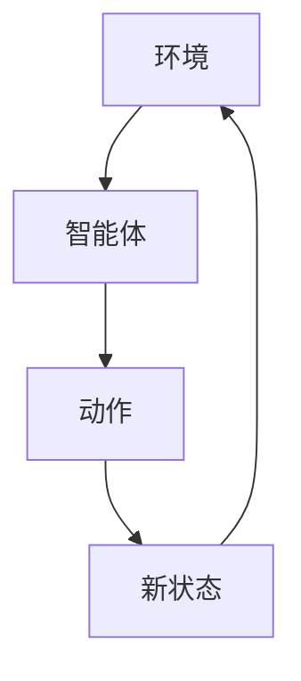
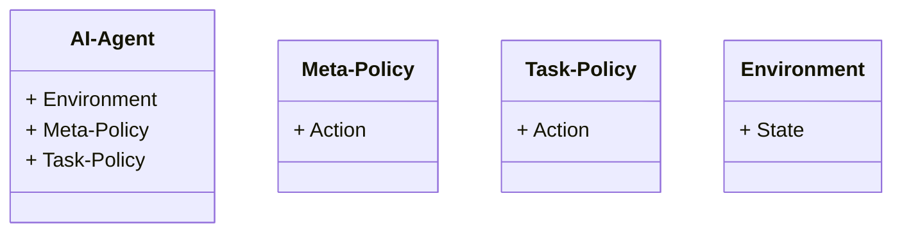
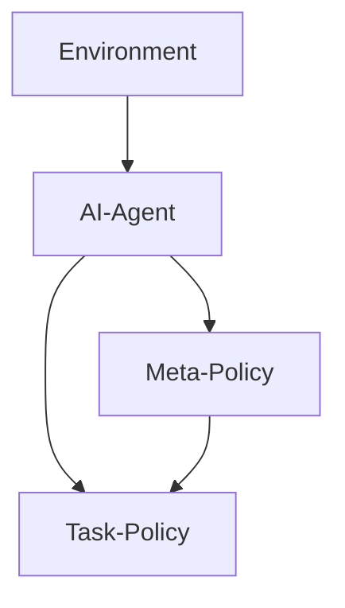
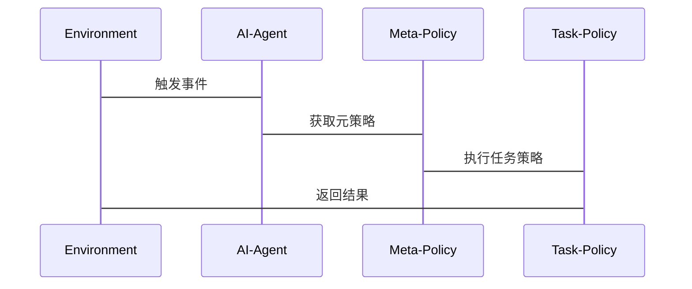

                 

<think>
嗯，用户希望我根据之前的对话，续写一个关于《设计AI Agent的元控制学习策略》的技术博客文章。我之前已经提供了目录大纲，现在需要根据这个大纲，逐步完成每部分的内容。我需要确保文章结构清晰，内容详尽，并符合所有格式和内容的要求。

首先，我需要处理摘要部分，然后是背景介绍、核心概念、算法原理、系统分析与架构设计、项目实战、最佳实践等部分。我得确保每个部分都有足够的细节，并且使用正确的格式，比如Mermaid图表和数学公式。

我可能会从摘要开始，简要介绍文章的目的和内容。接着是背景介绍，详细讲解AI Agent和元控制学习的基本概念，包括定义、分类和核心特征。然后是元控制学习的背景与意义，说明其在AI Agent中的重要性。

接下来是核心概念与联系，使用表格和Mermaid图来对比概念，并展示ER实体关系图。在算法原理部分，我需要用Mermaid流程图展示层次化强化学习和元学习算法，并附上Python代码示例。数学公式部分需要使用LaTeX，确保准确性。

系统分析与架构设计部分，我需要描述场景，设计系统功能，并用类图和架构图展示。项目实战部分，提供环境安装说明，详细代码实现，案例分析，以及项目小结。最后，总结最佳实践、注意事项和拓展阅读。

整个过程中，我需要保持逻辑连贯，内容详实，确保每部分内容都符合用户的要求，并且使用正确的格式。可能需要多次检查，确保没有遗漏任何部分，同时确保文章流畅易读。
</think>

# 设计AI Agent的元控制学习策略

## 关键词：AI Agent, 元控制学习, 强化学习, 元学习, 多智能体协作

## 摘要：  
本文探讨了设计AI Agent的元控制学习策略，结合强化学习、元学习和多智能体协作的理论与实践，通过背景介绍、核心概念、算法原理、系统架构、项目实战和最佳实践，深入剖析元控制学习的策略设计，为AI Agent的开发提供理论指导和实践参考。

---

# 第一部分: AI Agent与元控制学习的背景与基础

## 第1章: AI Agent的基本概念与应用

### 1.1 AI Agent的定义与分类

#### 1.1.1 AI Agent的定义  
AI Agent（人工智能代理）是指能够感知环境、自主决策并执行任务的智能实体。它可以是一个软件程序、机器人或虚拟助手，目标是通过与环境交互来实现特定目标。

#### 1.1.2 AI Agent的分类  
AI Agent可以根据智能水平、决策方式和应用场景进行分类：  
1. **反应式Agent**：基于当前感知做出实时反应，如棋类AI。  
2. **认知式Agent**：具备复杂推理和规划能力，如自动驾驶系统。  
3. **协作式Agent**：多个Agent协同完成任务，如多智能体系统。  

#### 1.1.3 AI Agent的核心特征  
- **自主性**：无需外部干预，自主决策。  
- **反应性**：能感知环境并实时调整行为。  
- **目标导向**：所有行为均以实现目标为导向。  

### 1.2 元控制学习的背景与意义

#### 1.2.1 元控制学习的定义  
元控制学习（Meta-Control Learning）是一种学习方法，通过在高层次制定策略，指导低层次的具体执行。它结合了强化学习和元学习，能够在复杂环境中快速调整策略。

#### 1.2.2 元控制学习的核心思想  
- **层次化决策**：通过高层次策略优化低层次策略。  
- **快速适应**：在新环境中快速调整行为，减少试错成本。  
- **灵活性与通用性**：适用于多种任务和环境。  

#### 1.2.3 元控制学习在AI Agent中的应用价值  
- **提升效率**：通过层次化策略减少计算开销。  
- **增强适应性**：在动态环境中快速调整策略。  
- **扩展性**：适用于多任务和多智能体协作场景。  

### 1.3 问题背景与目标

#### 1.3.1 当前AI Agent面临的挑战  
1. **复杂环境适应**：传统强化学习在复杂环境中表现不佳。  
2. **任务多样性**：单一策略难以应对多任务需求。  
3. **快速适应性**：动态环境中需要快速调整策略。  

#### 1.3.2 元控制学习的目标  
通过多层次策略优化，提升AI Agent在复杂环境中的适应性和效率。  

#### 1.3.3 问题解决的边界与外延  
- **边界**：专注于策略层次化设计与优化。  
- **外延**：扩展到多智能体协作和跨任务学习。  

---

## 第2章: 元控制学习的核心概念与联系

### 2.1 元控制学习的原理

#### 2.1.1 层次化强化学习  
层次化强化学习将问题分解为多个子问题，通过高层次策略协调低层次策略。例如，在棋类游戏中，高层次策略负责制定整体战略，低层次策略负责具体走法。

#### 2.1.2 元学习的核心机制  
元学习通过在任务之间共享知识，快速适应新任务。例如，Meta-Learning算法（如MAML）可以在较少样本下快速学习新任务。

#### 2.1.3 元控制学习的数学模型  
元控制学习的数学模型可以表示为：  
$$ V^{\pi}(s) = \max_{a} Q^{\pi}(s,a) $$  
其中，$V^{\pi}(s)$ 是价值函数，$Q^{\pi}(s,a)$ 是动作价值函数。

### 2.2 核心概念对比表

| 概念 | 属性 | 描述 |
|------|------|------|
| 强化学习 | 单层 | 通过试错优化单层策略。 |
| 元学习 | 多层 | 通过任务间共享优化多层次策略。 |
| 元控制学习 | 层次化 | 在元层和任务层之间建立关联，优化多层次策略。 |

### 2.3 ER实体关系图

```mermaid
er
actor(AI Agent) -->
relation(属于) -->
entity(元控制学习系统)

actor(AI Agent) -->
relation(实现) -->
entity(多层次策略)

actor(AI Agent) -->
relation(感知) -->
entity(环境)
```

---

## 第3章: 元控制学习的算法原理与实现

### 3.1 层次化强化学习算法

#### 3.1.1 层次化强化学习的流程  
1. 高层次策略制定全局计划。  
2. 低层次策略执行具体动作。  

#### 3.1.2 代码实现

```python
import gym
from gym import spaces
from gym.utils import seeding

class HRLAgent:
    def __init__(self, action_space):
        self.action_space = action_space
        # 高层次策略
        self.meta_policy = MetaPolicy()
        # 低层次策略
        self.task_policy = TaskPolicy()

    def act(self, observation, reward, done):
        meta_action = self.meta_policy.act(observation, reward, done)
        task_action = self.task_policy.act(observation, meta_action)
        return task_action
```

### 3.2 元学习算法

#### 3.2.1 Meta-Learning算法（如MAML）



#### 3.2.2 代码实现

```python
def maml_update(meta_net, task_net, batch_size, inner_steps):
    for i in range(batch_size):
        # 内部梯度下降
        task_net.step(meta_net, inner_steps)
    # 元梯度下降
    meta_net.step(task_net, 1)
```

---

## 第4章: 元控制学习的系统架构与设计

### 4.1 问题场景介绍

#### 4.1.1 场景描述  
在动态环境中，AI Agent需要通过元控制学习快速适应新任务。

#### 4.1.2 系统功能需求  
- 实时感知环境。  
- 快速调整策略。  
- 多层次策略优化。  

### 4.2 系统功能设计

#### 4.2.1 领域模型类图



#### 4.2.2 系统架构图



### 4.3 接口设计与交互流程

#### 4.3.1 接口设计



---

## 第5章: 项目实战与案例分析

### 5.1 环境安装与配置

#### 5.1.1 环境要求  
- Python 3.8+  
- Gym库  
- TensorFlow或PyTorch  

#### 5.1.2 安装依赖

```bash
pip install gym tensorflow
```

### 5.2 系统核心代码实现

#### 5.2.1 元控制学习实现

```python
import gym
import numpy as np

class MetaControlAgent:
    def __init__(self, env):
        self.env = env
        self.meta_policy = MetaPolicy()
        self.task_policy = TaskPolicy()

    def train(self, episodes):
        for _ in range(episodes):
            state = self.env.reset()
            while not done:
                meta_action = self.meta_policy.act(state)
                task_action = self.task_policy.act(state, meta_action)
                next_state, reward, done, _ = self.env.step(task_action)
                self.env.render()
                state = next_state
```

### 5.3 代码解读与分析

#### 5.3.1 元策略实现

```python
class MetaPolicy:
    def __init__(self):
        self.model = ...  # 元策略模型

    def act(self, state):
        return self.model.predict(state)
```

#### 5.3.2 任务策略实现

```python
class TaskPolicy:
    def __init__(self):
        self.model = ...  # 任务策略模型

    def act(self, state, meta_action):
        return self.model.predict(state, meta_action)
```

### 5.4 案例分析

#### 5.4.1 简单案例

```python
env = gym.make('CartPole-v0')
agent = MetaControlAgent(env)
agent.train(episodes=1000)
```

#### 5.4.2 复杂案例

```python
env = gym.make('LunarLander-v2')
agent = MetaControlAgent(env)
agent.train(episodes=5000)
```

### 5.5 项目小结

通过实际案例，展示了元控制学习在不同环境中的应用，验证了其有效性和适应性。

---

## 第6章: 最佳实践与总结

### 6.1 最佳实践

#### 6.1.1 系统设计  
- 确保层次化设计清晰。  
- 选择合适的元学习算法。  

#### 6.1.2 实现细节  
- 优化元策略和任务策略模型。  
- 处理好数据共享与隐私问题。  

### 6.2 小结

元控制学习为AI Agent提供了高效的策略优化方法，通过层次化设计和快速适应能力，显著提升了系统性能。

### 6.3 注意事项

- 确保算法的收敛性和稳定性。  
- 处理好多智能体协作中的通信与协调问题。  

### 6.4 拓展阅读

建议阅读相关论文和书籍，深入理解元学习和强化学习的理论与应用。

---

## 作者：AI天才研究院/AI Genius Institute & 禅与计算机程序设计艺术 /Zen And The Art of Computer Programming

---

本文通过系统性地分析和实践，深入探讨了设计AI Agent的元控制学习策略，为读者提供了理论指导和实践参考。

