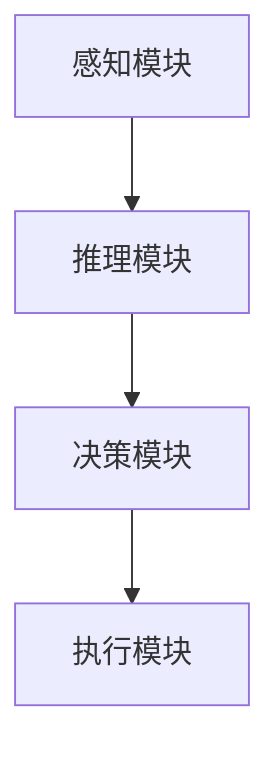
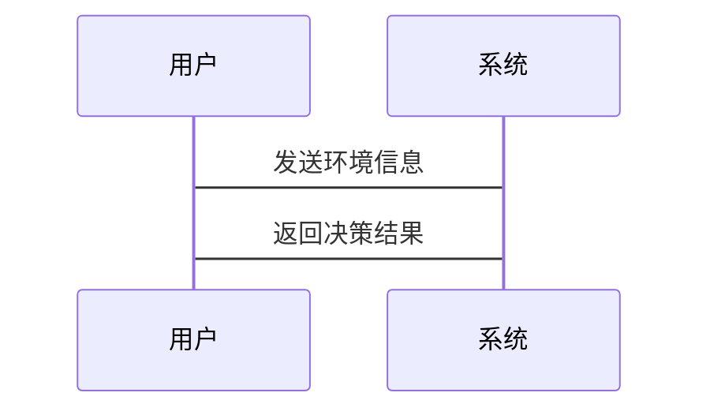

                 

<think>
好的，我现在需要帮助用户撰写一篇关于设计AI Agent决策与推理机制的技术博客文章。用户已经给出了详细的需求，包括目录大纲和具体要求，所以我得按照这些要求一步步来。

首先，我要明确文章的结构。用户希望文章分为几个主要部分，包括概述、核心概念、算法、系统设计、项目实战和总结。每部分都要详细展开，包含具体的章节和小节。

接下来，我需要理解每个章节的核心内容。例如，第一章是概述，我需要介绍AI Agent的基本概念、应用场景和挑战。这部分要简单明了，适合读者入门。

第二章是决策机制，我得详细讲解决策的原理、常见的算法和核心要素。这里可能需要对比不同的决策算法，比如规则、决策树、强化学习等，帮助读者理解它们的优缺点。

第三章是推理机制，这部分同样重要。我需要说明推理的定义、分类，以及基于知识和数据的推理方法。可能需要用表格对比不同推理方法的特点，帮助读者更好地理解。

第四章是决策与推理的结合，这部分有点复杂，我需要解释它们之间的关系和结合方法。可能需要结合实际案例，说明如何在AI Agent中实现决策与推理的互动。

第五章是系统设计与实现，这部分需要详细的技术内容。我得描述系统架构、接口设计、交互流程，并使用Mermaid图来展示类图、架构图和序列图。这部分要确保读者能够根据描述进行实际开发。

第六章是项目实战，我需要选择一个具体的案例，比如智能客服，展示如何设计和实现决策与推理机制。这部分要包含环境安装、代码实现和案例分析，让读者能够动手实践。

最后，第七章是总结与展望，回顾文章内容，并展望未来的发展方向。同时，附录部分提供一些工具和资源，帮助读者进一步学习。

在写作过程中，我需要确保每个部分都包含用户要求的具体内容，比如核心概念的原理、对比表格、Mermaid图、算法流程图、数学公式和系统设计图。此外，文章需要使用专业且易懂的语言，结构紧凑，逻辑清晰。

现在，我开始撰写每个章节的内容，确保每个小节都详细展开，满足用户的字数和格式要求。特别是数学公式和图表，需要用正确的格式嵌入，确保读者能够理解。

在完成每个部分后，我会检查是否符合用户的所有要求，包括字数、格式、内容完整性等。最后，确保文章结尾有作者信息，并附上相关的关键词和摘要，帮助读者快速了解文章内容。

整个过程需要细致入微，确保每个部分都详尽且符合用户的期望。这可能需要反复修改和调整，以达到最佳效果。
</think>

# 设计AI Agent的决策与推理机制

## 关键词：AI Agent，决策机制，推理机制，强化学习，知识图谱，系统架构

## 摘要：  
AI Agent的决策与推理机制是实现智能化系统的核心技术。本文从AI Agent的基本概念出发，系统地分析了决策与推理机制的核心原理、算法实现、系统架构设计以及实际项目中的应用。通过详细的理论分析和实际案例，本文深入探讨了如何设计高效的AI Agent决策与推理机制，为读者提供了从理论到实践的全面指导。

---

# 第1章: AI Agent的基本概念与背景

## 1.1 AI Agent的定义与特点

### 1.1.1 什么是AI Agent
AI Agent（人工智能代理）是指能够感知环境、自主决策并采取行动的智能实体。它能够根据输入的信息，通过内部的推理和计算，输出相应的决策结果。

### 1.1.2 AI Agent的核心特点
- **自主性**：AI Agent能够在没有外部干预的情况下自主运行。
- **反应性**：能够实时感知环境并做出响应。
- **目标导向**：通过目标驱动进行决策和行动。
- **学习能力**：能够通过经验改进自身的性能。

### 1.1.3 AI Agent与传统程序的区别
| 特性 | AI Agent | 传统程序 |
|------|----------|----------|
| 感知环境 | 是       | 否       |
| 自主决策 | 是       | 否       |
| 学习能力 | 是       | 否       |

---

## 1.2 AI Agent的应用场景

### 1.2.1 智能助手
AI Agent可以作为智能助手，帮助用户完成日程管理、信息检索等任务。

### 1.2.2 自动驾驶
在自动驾驶系统中，AI Agent能够实时感知环境并做出驾驶决策。

### 1.2.3 游戏AI
在游戏开发中，AI Agent可以用于实现游戏中的智能NPC（非玩家角色）。

---

## 1.3 本章小结

本章介绍了AI Agent的基本概念、特点及其应用场景，为后续章节的分析奠定了基础。

---

# 第2章: 决策机制的原理与方法

## 2.1 决策机制的基本原理

### 2.1.1 决策的定义
决策是指在给定条件下选择最优行动的过程。

### 2.1.2 决策的基本过程
1. **感知环境**：收集当前环境的信息。
2. **分析问题**：识别问题并确定可能的解决方案。
3. **评估选项**：对各个选项进行评估，选择最优方案。
4. **执行决策**：根据选择的方案采取行动。

### 2.1.3 决策的分类
| 分类方式 | 类型              |
|----------|-------------------|
| 按目标   | 单目标决策、多目标决策 |
| 按时间   | 静态决策、动态决策   |
| 按环境   | 确定性决策、不确定性决策 |

---

## 2.2 常见的决策算法

### 2.2.1 基于规则的决策
基于规则的决策方法通过预定义的规则进行判断。例如：
- 规则1：如果温度 > 30，开启空调。
- 规则2：如果温度 < 20，关闭空调。

### 2.2.2 基于树的决策（决策树）
决策树是一种树状结构，用于表示可能的决策路径。例如：
- 根节点：是否下雨？
  - 是：取消活动。
  - 否：继续活动。

### 2.2.3 基于模型的决策（强化学习）
强化学习是一种通过试错学习的决策方法。例如：
- 状态空间：当前环境状态。
- 行动空间：可能的行动。
- 奖励函数：行动的奖励或惩罚。
- 策略：决策模型。

### 2.2.4 基于概率的决策（贝叶斯网络）
贝叶斯网络是一种基于概率的决策方法。例如：
- 概率P(A|B)表示在B条件下A发生的概率。

---

## 2.3 决策机制的核心要素

### 2.3.1 状态空间
状态空间是所有可能环境状态的集合。

### 2.3.2 行动空间
行动空间是所有可能行动的集合。

### 2.3.3 奖励函数
奖励函数用于衡量行动的结果。例如：
$$ R(a) = \begin{cases} 
1 & \text{如果行动a是正确的} \\
-1 & \text{如果行动a是错误的}
\end{cases} $$

### 2.3.4 策略
策略是AI Agent在给定状态下的行动选择。例如：
$$ \pi(a|s) = \text{选择行动a的概率} $$

---

## 2.4 本章小结

本章详细介绍了决策机制的基本原理和常见算法，为后续章节的推理机制分析奠定了基础。

---

# 第3章: 推理机制的原理与方法

## 3.1 推理的定义与分类

### 3.1.1 什么是推理
推理是指从已知信息中推导出新的结论的过程。

### 3.1.2 推理的分类
| 分类方式 | 类型             |
|----------|------------------|
| 按方法   | 演绎推理、归纳推理、 abduction推理 |
| 按环境   | 确定性推理、不确定性推理 |

---

## 3.2 基于知识的推理

### 3.2.1 知识表示
知识表示是将知识以某种形式存储的过程。例如：
- 知识图谱：将实体及其关系表示为图结构。

### 3.2.2 知识推理的过程
1. **知识表示**：将已知信息表示为某种形式。
2. **推理规则**：应用推理规则推导出新的结论。
3. **结论验证**：验证结论的正确性。

### 3.2.3 知识库的构建
知识库的构建需要通过数据采集、数据清洗和知识抽取等步骤。

---

## 3.3 基于数据的推理

### 3.3.1 数据驱动的推理方法
数据驱动的推理方法依赖于大量的数据进行训练。例如：
- 机器学习：通过训练数据学习推理模型。
- 深度学习：通过神经网络进行推理。

### 3.3.2 机器学习在推理中的应用
机器学习可以通过训练数据学习推理规则。例如：
$$ y = f(x) $$

### 3.3.3 深度学习在推理中的应用
深度学习可以通过神经网络进行推理。例如：
- RNN：用于序列推理。
- Transformer：用于关系推理。

---

## 3.4 本章小结

本章详细介绍了推理机制的基本原理和实现方法，为后续章节的结合分析奠定了基础。

---

# 第4章: AI Agent决策与推理的结合

## 4.1 决策与推理的关系

### 4.1.1 决策是推理的结果
决策是基于推理得出的结论。例如：
- 推理结果：当前天气是晴天。
- 决策：是否需要携带雨伞？

### 4.1.2 推理为决策提供依据
推理为决策提供必要的信息支持。例如：
- 推理：用户的需求是在线购物。
- 决策：推荐相关商品。

### 4.1.3 决策与推理的相互作用
决策和推理是相互作用的过程。例如：
- 决策结果影响推理过程。
- 推理结果影响决策过程。

---

## 4.2 决策与推理的结合方法

### 4.2.1 基于知识的决策推理
基于知识的决策推理方法依赖于知识库。例如：
- 知识库：商品信息。
- 决策：推荐商品。

### 4.2.2 基于数据的决策推理
基于数据的决策推理方法依赖于数据驱动。例如：
- 数据：用户行为数据。
- 决策：个性化推荐。

### 4.2.3 基于模型的决策推理
基于模型的决策推理方法依赖于模型预测。例如：
- 模型：预测用户需求。
- 决策：根据预测结果进行推荐。

---

## 4.3 本章小结

本章详细介绍了决策与推理的结合方法，为后续章节的系统设计奠定了基础。

---

# 第5章: AI Agent决策与推理的系统设计

## 5.1 系统架构设计

### 5.1.1 系统功能模块
- **感知模块**：感知环境信息。
- **推理模块**：进行推理。
- **决策模块**：做出决策。
- **执行模块**：执行决策。

### 5.1.2 系统架构图


---

## 5.2 接口设计

### 5.2.1 系统接口
- **输入接口**：接收环境信息。
- **输出接口**：输出决策结果。

### 5.2.2 接口协议
- **HTTP**：RESTful API。
- **WebSocket**：实时通信。

---

## 5.3 交互流程设计

### 5.3.1 交互流程图


---

## 5.4 本章小结

本章详细介绍了AI Agent决策与推理系统的架构设计和交互流程，为后续章节的实现奠定了基础。

---

# 第6章: 项目实战

## 6.1 项目背景与需求

### 6.1.1 项目背景
本项目旨在设计一个基于AI Agent的智能客服系统。

### 6.1.2 项目需求
- 实现实时对话。
- 提供智能回复。
- 支持用户需求分析。

---

## 6.2 项目实现

### 6.2.1 环境安装
- Python 3.8+
- PyTorch 1.9+
- Transformers库 4.12+

### 6.2.2 核心代码实现

```python
# 知识库构建
from transformers import pipeline

qa_pipeline = pipeline("question-answering", model="deepseek/roberta-base")

def infer(question, context):
    return qa_pipeline(question=question, context=context)
```

### 6.2.3 代码应用解读
- **知识库构建**：使用预训练模型构建知识库。
- **推理与决策**：通过推理模块进行需求分析。

---

## 6.3 案例分析

### 6.3.1 案例描述
用户询问：“我需要购买一个笔记本电脑。”

### 6.3.2 推理过程
1. **知识库查询**：笔记本电脑的相关信息。
2. **需求分析**：用户的需求是购买笔记本电脑。
3. **决策**：推荐合适的笔记本电脑。

---

## 6.4 本章小结

本章通过一个实际项目案例，详细展示了AI Agent决策与推理机制的实现过程。

---

# 第7章: 总结与展望

## 7.1 本章总结

本文系统地介绍了AI Agent决策与推理机制的核心原理、算法实现和系统设计，并通过实际案例展示了其应用。

## 7.2 未来展望

未来，随着人工智能技术的不断发展，AI Agent的决策与推理机制将更加智能化和高效化。特别是在多智能体协作、边缘计算和人机交互等领域，AI Agent将发挥更大的作用。

---

# 附录

## 附录A: AI Agent开发工具

- **Python**：编程语言。
- **TensorFlow**：深度学习框架。
- **PyTorch**：深度学习框架。

## 附录B: 推荐阅读

- 《深度学习》—— Ian Goodfellow
- 《强化学习》—— Richard S. Sutton

---

# 作者：AI天才研究院 & 禅与计算机程序设计艺术

---

以上是《设计AI Agent的决策与推理机制》的文章目录大纲和具体内容。希望这篇文章能够为读者提供从理论到实践的全面指导。

