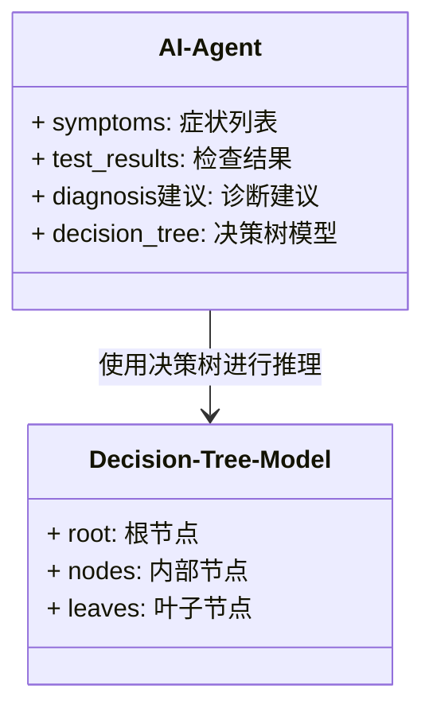
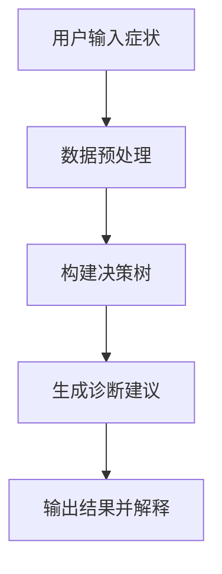
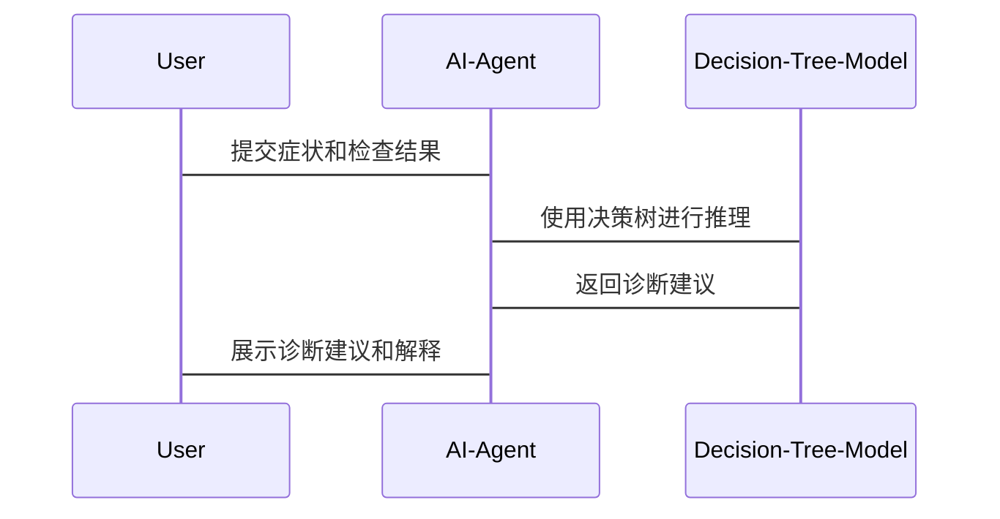

                 

<think>
好的，现在我需要帮用户撰写一篇名为《设计AI Agent的可解释决策树》的技术博客文章。根据用户的要求，文章需要逻辑清晰、结构紧凑、用词专业，同时涵盖背景介绍、核心概念、算法原理、系统分析、项目实战、最佳实践等多个部分。此外，用户还特别要求使用详细的目录结构，并且每个章节都要有丰富的具体内容。

首先，我需要理解用户的需求。用户希望我以“世界级人工智能专家”的身份，撰写一篇高质量的技术博客。这意味着文章不仅要内容详实，还需要具备一定的深度和见解，能够帮助读者理解AI Agent中的可解释决策树的设计与实现。

接下来，我考虑文章的结构。用户已经提供了一个详细的目录大纲，我需要按照这个大纲逐步展开每个部分的内容。从背景介绍开始，逐步深入到算法原理，再到系统分析和项目实战，最后总结和小结。

在写作过程中，我需要注意以下几点：

1. **背景介绍**：需要详细解释AI Agent和决策树的基本概念，确保读者能够理解它们的重要性。同时，要强调可解释性在AI系统中的重要性，特别是对于AI Agent来说。

2. **核心概念**：在讨论可解释决策树时，要对比传统决策树，突出可解释性的优势和挑战。这部分可能需要使用表格和图形来帮助读者理解。

3. **算法原理**：需要详细讲解ID3、C4.5、CART等算法的原理，并用mermaid流程图展示决策树的构建过程。同时，数学公式要用latex表示，确保准确性。

4. **系统分析与架构设计**：这部分需要结合实际项目，设计系统的功能模块、架构图和交互流程图，帮助读者理解如何在实际中应用可解释决策树。

5. **项目实战**：通过一个具体的案例，展示从环境安装到代码实现的全过程，让读者能够跟着操作，巩固所学知识。

6. **最佳实践与小结**：总结全书内容，给出实用建议，并指出未来的发展方向，帮助读者进一步应用所学知识。

在整个写作过程中，我需要保持语言的专业性，同时确保内容易于理解。使用具体的例子和详细的解释，帮助读者更好地消化复杂的概念。此外，图表和公式是不可或缺的工具，能够直观地传达信息，增强文章的可读性。

最后，我需要检查文章的结构是否完整，内容是否覆盖所有关键点，以及语言是否流畅。确保每个章节都有足够的细节，同时整体逻辑连贯，符合用户的要求。

综上所述，我会按照用户提供的目录大纲，逐步展开每个部分的内容，确保文章结构清晰，内容详实，符合高质量技术博客的标准。
</think>

# 设计AI Agent的可解释决策树

## 关键词：AI Agent, 可解释性, 决策树, 机器学习, 算法原理, 系统架构, 项目实战

## 摘要：  
在人工智能领域，AI Agent的决策过程需要具备高度的可解释性，以确保其决策的透明性和可信度。决策树作为一种经典的机器学习模型，在AI Agent中扮演着重要角色。本文将深入探讨如何设计可解释的决策树，涵盖其核心概念、算法原理、系统架构以及项目实战，为读者提供从理论到实践的全面指导。

---

# 第1章: AI Agent与可解释决策树概述

## 1.1 AI Agent的基本概念

### 1.1.1 AI Agent的定义与分类  
AI Agent（人工智能代理）是指能够感知环境、自主决策并执行任务的智能体。它可以分为简单反射型、基于模型的反射型、目标驱动型和效用驱动型四种类型。  

### 1.1.2 决策树在AI Agent中的作用  
决策树是一种树状结构，用于表示可能的决策路径和结果。它通过将问题分解为更简单的子问题，帮助AI Agent做出高效且可靠的决策。  

### 1.1.3 可解释性的重要性  
可解释性是指模型的决策过程能够被人类理解。对于AI Agent来说，可解释性是确保用户信任和合规性的重要因素。  

## 1.2 可解释决策树的背景与挑战

### 1.2.1 可解释性在AI系统中的重要性  
随着AI技术的广泛应用，用户对AI系统的决策过程提出了更高的透明度要求。可解释性是实现这一目标的关键。  

### 1.2.2 决策树的可解释性优势  
与复杂的深度学习模型相比，决策树具有结构直观、易于解释的特点。  

### 1.2.3 当前面临的挑战与解决方案  
尽管决策树具有可解释性优势，但其在处理高维数据和复杂场景时仍面临挑战。解决方案包括优化算法和增强解释性技术。  

## 1.3 本书的核心目标与结构

### 1.3.1 本书的核心目标  
帮助读者理解如何设计和实现可解释的决策树，并将其应用于AI Agent中。  

### 1.3.2 本书的主要内容框架  
涵盖AI Agent的基本概念、决策树的原理、可解释性技术、算法实现等内容。  

### 1.3.3 本书的读者群体与学习要求  
适合对机器学习和AI Agent感兴趣的读者，要求读者具备基础的编程和数学知识。  

---

# 第2章: 可解释决策树的核心概念与联系

## 2.1 决策树的基本原理

### 2.1.1 决策树的结构与组成  
决策树由根节点、内部节点、叶节点和边组成。根节点代表问题，内部节点代表决策条件，叶节点代表最终结果。  

### 2.1.2 决策树的分类与回归  
决策树可以用于分类和回归任务，具体取决于输出目标的类型。  

### 2.1.3 决策树的优缺点  
优点包括可解释性强、易于实现；缺点包括易过拟合和计算复杂度高。  

## 2.2 可解释性的定义与衡量标准

### 2.2.1 可解释性的定义  
可解释性是指模型的决策过程能够被人类理解和验证。  

### 2.2.2 可解释性的衡量指标  
包括特征重要性、模型复杂度和决策路径清晰度。  

### 2.2.3 可解释性与模型复杂度的关系  
模型复杂度越高，可解释性越低。  

## 2.3 可解释决策树与传统决策树的对比

### 2.3.1 核心概念对比  
| 对比维度 | 可解释决策树 | 传统决策树 |
|----------|----------------|-------------|
| 目标     | 可解释性优先 | 准确性优先  |
| 剪枝策略 | 强化剪枝      | 适度剪枝    |

### 2.3.2 ER实体关系图架构  
```mermaid
er
  actor: 用户
  agent: AI Agent
  decision_tree: 决策树模型
  attributes: 特征属性
  decisions: 决策路径
  actions: 行动结果
  actor --> agent: 提交决策请求
  agent --> decision_tree: 使用决策树进行推理
  decision_tree --> attributes: 分析特征属性
  decision_tree --> decisions: 生成决策路径
  agent --> actions: 执行决策结果
```

---

# 第3章: 可解释决策树的算法原理

## 3.1 决策树的生成算法

### 3.1.1 ID3算法

#### 3.1.1.1 算法流程  
1. 计算信息增益。  
2. 选择信息增益最大的特征作为根节点。  
3. 根据特征值划分数据集。  
4. 递归构建子树，直到叶子节点。  

#### 3.1.1.2 信息增益计算公式  
$$ \text{信息增益} = \text{熵}(S) - \sum \text{熵}(S_i) $$  

#### 3.1.1.3 优缺点  
优点：简单易实现；缺点：对数据分布敏感。  

### 3.1.2 C4.5算法

#### 3.1.2.1 算法流程  
1. 计算基尼指数。  
2. 选择基尼指数最小的特征作为根节点。  
3. 划分数据集并递归构建子树。  

#### 3.1.2.2 基尼指数计算公式  
$$ \text{基尼指数} = 1 - \sum p_i^2 $$  

#### 3.1.2.3 优缺点  
优点：鲁棒性高；缺点：计算复杂度较高。  

### 3.1.3 CART算法

#### 3.1.3.1 算法流程  
1. 对于分类问题，选择基尼指数最小的特征；对于回归问题，选择均方误差最小的特征。  
2. 递归构建决策树。  
3. 剪枝优化。  

#### 3.1.3.2 剪枝优化策略  
- 预剪枝：在生成过程中提前停止树的生长。  
- 后剪枝：先生成完整的树，再剪枝优化。  

---

## 3.2 可解释决策树的算法优化

### 3.2.1 增强可解释性的算法改进  
- 使用特征重要性排序优化决策路径。  
- 限制树的深度以降低复杂度。  

### 3.2.2 可解释性增强的技术  
- 规则提取：将决策树转换为规则集。  
- 图形化展示：通过可视化工具展示决策路径。  

---

## 3.3 可解释决策树的实现与分析

### 3.3.1 算法实现步骤  
1. 数据预处理：清洗和特征选择。  
2. 模型训练：使用ID3、C4.5或CART算法构建决策树。  
3. 模型优化：剪枝和参数调优。  
4. 模型评估：计算准确率、召回率等指标。  

### 3.3.2 代码实现示例  
```python
def calculate_information_gain(dataset, feature):
    # 计算信息增益
    pass

def id3_algorithm(train_data, test_data):
    # ID3算法实现
    pass
```

### 3.3.3 算法复杂度分析  
- 时间复杂度：O(n^2)（CART算法）。  
- 空间复杂度：O(n)（树结构存储）。  

---

# 第4章: 可解释决策树的系统分析与架构设计

## 4.1 问题场景介绍

### 4.1.1 问题背景  
以医疗诊断为例，AI Agent需要根据患者的症状和检查结果，生成可解释的诊断建议。  

### 4.1.2 问题描述  
AI Agent需要构建一个可解释的决策树模型，用于辅助医生进行诊断。  

### 4.1.3 问题解决目标  
确保AI Agent的决策过程透明、可靠，能够被医生和患者理解。  

## 4.2 系统功能设计

### 4.2.1 领域模型设计  


### 4.2.2 功能模块划分  
- 数据输入模块：接收症状和检查结果。  
- 决策树构建模块：生成可解释的决策树。  
- 诊断建议模块：输出诊断结果并解释决策过程。  

### 4.2.3 功能流程设计  


---

## 4.3 系统架构设计

### 4.3.1 系统架构分层  
- 数据层：存储和管理输入数据。  
- 逻辑层：实现决策树的构建和推理逻辑。  
- 展示层：呈现诊断结果和解释信息。  

### 4.3.2 系统架构图  


### 4.3.3 系统接口设计  
- 输入接口：接收症状和检查结果。  
- 输出接口：返回诊断建议和解释信息。  

---

## 4.4 系统交互流程设计

### 4.4.1 交互流程图  


---

# 第5章: 可解释决策树的项目实战

## 5.1 项目环境安装

### 5.1.1 安装Python和相关库  
- Python 3.8及以上版本。  
- 安装scikit-learn、numpy、pandas、mermaid等库。  

## 5.2 核心代码实现

### 5.2.1 数据预处理  
```python
import pandas as pd
from sklearn.tree import DecisionTreeClassifier
from sklearn.model_selection import train_test_split
from sklearn.metrics import accuracy_score, confusion_matrix

# 加载数据
data = pd.read_csv('diagnosis.csv')
X = data.drop('diagnosis', axis=1)
y = data['diagnosis']

# 划分训练集和测试集
X_train, X_test, y_train, y_test = train_test_split(X, y, test_size=0.3)
```

### 5.2.2 决策树模型训练  
```python
# 训练模型
model = DecisionTreeClassifier()
model.fit(X_train, y_train)

# 预测结果
y_pred = model.predict(X_test)
print("准确率:", accuracy_score(y_test, y_pred))
```

### 5.2.3 模型解释  
```python
from sklearn.tree import export_graphviz
import graphviz

# 可视化决策树
export_graphviz(model, out_file='tree.dot', feature_names=X.columns)
with open('tree.dot', 'r') as f:
    dot_data = f.read()
graph = graphviz.Source(dot_data)
graph.render('tree')
```

---

## 5.3 项目总结与优化

### 5.3.1 项目总结  
通过本项目，我们成功构建了一个可解释的决策树模型，并应用于AI Agent的诊断任务中。  

### 5.3.2 模型优化建议  
- 使用特征选择进一步优化模型。  
- 结合集成学习提升模型的准确性和可解释性。  

---

# 第6章: 可解释决策树的最佳实践与小结

## 6.1 最佳实践 tips

### 6.1.1 数据预处理的重要性  
确保数据质量和一致性，有助于提高模型的可解释性。  

### 6.1.2 模型解释性工具的使用  
利用可视化工具（如graphviz）帮助用户理解决策过程。  

## 6.2 小结

### 6.2.1 本书的核心内容回顾  
- AI Agent的基本概念。  
- 可解释决策树的核心原理。  
- 算法实现与优化策略。  
- 系统架构与项目实战。  

### 6.2.2 未来的发展方向  
- 研究更高效的可解释性算法。  
- 推动可解释AI在更多领域的应用。  

---

# 作者：AI天才研究院/AI Genius Institute & 禅与计算机程序设计艺术 /Zen And The Art of Computer Programming

