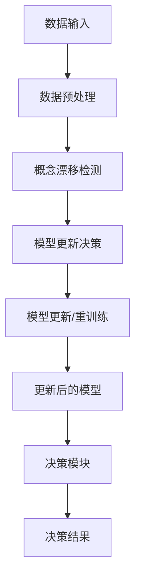
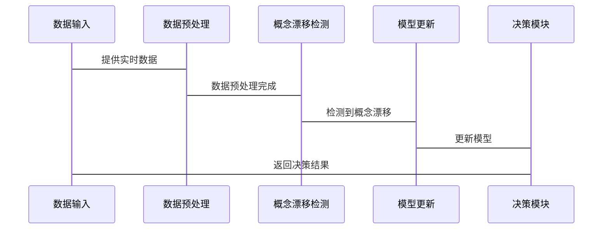

                 

<think>
嗯，用户希望我撰写一篇关于设计AI Agent的概念漂移适应策略的技术博客文章。看起来他需要我以《设计AI Agent的概念漂移适应策略》为标题，结构要清晰，有逻辑，用专业但易懂的技术语言来写。

首先，我得先理解什么是概念漂移。概念漂移是指在机器学习模型部署后，由于数据分布或标签的变化，导致模型性能下降的现象。这对于AI Agent来说是个大问题，因为它们需要实时做出决策，不能因为数据变化而失效。

接下来，我需要考虑博客的结构。用户已经给出了一个大纲，我需要按照这个大纲来填充内容。第一部分是背景介绍，我得解释概念漂移的定义、类型以及它对AI Agent的影响。这部分要让读者明白为什么概念漂移重要，以及它在AI Agent中的应用。

然后是核心概念，我需要详细讨论概念漂移的类型和AI Agent的适应机制。这部分可能需要一些图表，比如分类图和特征分析表，帮助读者更好地理解。

接下来是算法部分，我得解释检测和适应概念漂移的算法原理。比如，使用分布差异检测的方法，可能用KL散度或JS散度，然后用mermaid画出流程图，展示算法步骤。

系统架构设计也是关键，我需要设计AI Agent的系统结构，展示各个部分如何协作，比如检测模块、学习模块、决策模块之间的关系，可能用类图和架构图来说明。

项目实战部分，我得提供一个实际案例，展示如何实现一个AI Agent，包括环境配置、核心代码、案例分析等，让读者能够动手实践。

最后，总结和展望，回顾主要内容，并提出未来的研究方向，帮助读者巩固知识并思考未来发展。

在写作过程中，我需要确保每一部分都有足够的细节，比如在算法部分，不仅要解释方法，还要给出代码示例和数学公式。同时，系统架构部分需要用图示展示结构，使内容更直观。

还要注意章节之间的逻辑顺序，确保读者能够一步步从理论到实践，从理解到应用。比如，先了解背景，再学习核心概念，接着深入算法，然后设计系统，最后实战项目。

最后，检查整个目录是否符合用户的要求，是否覆盖了所有必要的部分，并且每一部分都有足够的细节支持。这样，用户就能得到一个完整且详细的博客文章，帮助他们理解并解决概念漂移适应策略的问题。
</think>

# 设计AI Agent的概念漂移适应策略

## 关键词：
AI Agent, 概念漂移, 适应策略, 分布变化检测, 实时更新机制

## 摘要：
本文详细探讨了设计AI Agent时应对概念漂移的核心策略。概念漂移是指在模型部署后，数据分布或标签的变化导致模型性能下降的现象。本文从概念漂移的定义、类型及其对AI Agent的影响入手，深入分析了概念漂移检测与适应算法的原理，并结合实际案例，提出了基于分布变化检测和实时更新机制的概念漂移适应策略。通过本文的系统性分析，读者能够全面理解如何设计具备概念漂移适应能力的AI Agent。

---

## 第一部分: 概念漂移与AI Agent的背景介绍

### 第1章: 概念漂移与AI Agent概述

#### 1.1 概念漂移的定义与背景
- **1.1.1 什么是概念漂移**
  - 概念漂移（Concept Drift）是指在机器学习模型部署后，训练数据与测试数据之间的分布发生变化，导致模型性能下降的现象。
  - 例如，当客户行为模式发生变化时，推荐系统的预测能力会显著降低。

- **1.1.2 概念漂移的类型**
  - **突然的概念漂移**：数据分布突然发生重大变化，例如网络攻击模式的突然改变。
  - **渐进的概念漂移**：数据分布逐渐变化，例如用户偏好随时间缓慢变化。
  - **分布变化的概念漂移**：数据分布的变化模式较为复杂，例如用户行为在不同时间、地点或设备上的差异。

- **1.1.3 概念漂移在AI Agent中的重要性**
  - AI Agent需要实时做出决策，概念漂移会显著影响其准确性。
  - 例如，在金融交易中，概念漂移可能导致欺诈检测模型失效。

#### 1.2 AI Agent的基本概念
- **1.2.1 AI Agent的定义**
  - AI Agent是一种能够感知环境、自主决策并采取行动的智能体。
  - 例如，自动驾驶汽车就是一个复杂的AI Agent。

- **1.2.2 AI Agent的核心功能**
  - 感知环境：通过传感器或数据输入获取信息。
  - 制定策略：基于当前状态和目标，制定最优决策。
  - 执行行动：根据决策采取具体行动。

- **1.2.3 AI Agent的应用场景**
  - 智能客服：实时响应用户需求。
  - 智能推荐：根据用户行为动态调整推荐策略。
  - 自动驾驶：实时处理交通数据并做出驾驶决策。

#### 1.3 概念漂移对AI Agent的影响
- **1.3.1 概念漂移对模型性能的影响**
  - 模型预测精度下降。
  - 例如，一个分类模型在概念漂移后，分类准确率可能从90%降至70%。

- **1.3.2 概念漂移对AI Agent决策能力的影响**
  - 决策失误风险增加。
  - 例如，在医疗诊断AI Agent中，概念漂移可能导致误诊。

- **1.3.3 概念漂移对实时应用的挑战**
  - 需要实时检测和适应概念漂移。
  - 例如，在实时 fraud detection 中，概念漂移可能导致漏检或误检。

#### 1.4 本章小结
- 本章介绍了概念漂移的定义、类型及其对AI Agent的影响。
- 强调了设计具备概念漂移适应能力的AI Agent的重要性。

---

## 第二部分: 概念漂移与AI Agent的核心概念

### 第2章: 概念漂移的类型与特征

#### 2.1 概念漂移的分类
- **2.1.1 突然的概念漂移**
  - 数据分布突然变化，例如攻击模式的突然改变。
  - 检测难度较高，需要实时监控。

- **2.1.2 渐进的概念漂移**
  - 数据分布逐渐变化，例如用户偏好的缓慢转变。
  - 检测相对容易，但需要长期监控。

- **2.1.3 分布变化的概念漂移**
  - 数据分布的变化模式复杂，例如多模态数据的变化。
  - 检测和适应需要更复杂的算法。

#### 2.2 概念漂移的特征分析
- **2.2.1 数据分布的变化**
  - 数据分布的变化可以用统计指标或机器学习模型检测。
  - 例如，使用Kullback-Leibler散度（KL散度）检测分布变化。

- **2.2.2 标签变化的模式**
  - 标签变化可能与数据分布变化相关联。
  - 例如，欺诈交易的标签变化可能与交易模式的改变相关。

- **2.2.3 概念漂移的检测指标**
  - 使用分类性能下降作为检测指标。
  - 例如，分类模型的准确率下降可能表明概念漂移。

#### 2.3 概念漂移与AI Agent的关系
- **2.3.1 概念漂移对AI Agent的挑战**
  - AI Agent需要实时适应数据分布的变化。
  - 例如，在动态网络环境中，安全AI Agent需要实时调整威胁检测策略。

- **2.3.2 AI Agent对概念漂移的适应能力**
  - 通过分布变化检测和实时更新机制适应概念漂移。
  - 例如，使用流数据处理技术实时更新模型。

- **2.3.3 概念漂移与AI Agent的协同进化**
  - AI Agent通过学习和适应，逐步增强对概念漂移的抵抗力。
  - 例如，动态调整模型参数以适应新的数据分布。

#### 2.4 本章小结
- 本章详细分析了概念漂移的类型和特征。
- 探讨了概念漂移对AI Agent的挑战及适应策略。

---

## 第三部分: AI Agent的概念漂移适应策略

### 第3章: 概念漂移的检测与预警

#### 3.1 概念漂移检测的方法
- **3.1.1 统计方法**
  - 使用统计指标检测数据分布变化。
  - 例如，使用均值和方差的变化检测。

- **3.1.2 机器学习方法**
  - 使用分类或回归模型检测概念漂移。
  - 例如，使用在线学习算法实时检测分布变化。

- **3.1.3 时间序列分析方法**
  - 使用时间序列分析技术检测数据趋势变化。
  - 例如，使用ARIMA模型预测数据变化趋势。

#### 3.2 概念漂移检测的指标
- **3.2.1 数据分布变化的度量**
  - 使用KL散度、JS散度等指标衡量数据分布差异。
  - 例如，计算新旧数据分布的KL散度，若超过阈值则触发预警。

- **3.2.2 模型性能变化的度量**
  - 使用分类准确率、F1分数等指标衡量模型性能变化。
  - 例如，当准确率下降超过10%时，触发概念漂移预警。

- **3.2.3 实时监控指标**
  - 定义实时监控指标，例如每分钟检测一次模型性能。
  - 例如，使用阈值监控准确率的变化，若发现性能显著下降，则触发预警。

#### 3.3 概念漂移的预警机制
- **3.3.1 基于阈值的预警**
  - 设置性能变化阈值，当检测指标超过阈值时触发预警。
  - 例如，当分类准确率低于75%时，触发预警。

- **3.3.2 基于时间窗口的预警**
  - 使用滑动窗口技术，计算窗口内性能变化趋势。
  - 例如，当过去10分钟内准确率持续下降时，触发预警。

- **3.3.3 基于模型性能的预警**
  - 结合模型性能和数据分布变化，综合判断是否触发预警。
  - 例如，当KL散度超过0.5且准确率下降超过5%时，触发预警。

#### 3.4 本章小结
- 本章详细介绍了概念漂移检测的方法和指标。
- 探讨了基于阈值和时间窗口的预警机制。

---

### 第4章: 概念漂移的适应策略

#### 4.1 概念漂移的适应算法
- **4.1.1 增量学习算法**
  - 使用增量学习方法实时更新模型。
  - 例如，使用在线随机森林算法逐步更新模型。

- **4.1.2 模型重训练策略**
  - 定期或按需重新训练模型。
  - 例如，当检测到概念漂移后，使用新数据重新训练模型。

- **4.1.3 混合学习策略**
  - 结合增量学习和定期重训练，平衡实时性和稳定性。
  - 例如，增量学习处理小幅度概念漂移，定期重训练应对大幅度概念漂移。

#### 4.2 适应策略的实现步骤
- **4.2.1 检测概念漂移**
  - 使用统计方法或机器学习模型检测分布变化。
  - 例如，计算新数据和旧数据的KL散度，判断是否超过阈值。

- **4.2.2 判断适应策略**
  - 根据漂移程度选择适应策略。
  - 例如，小幅度漂移采用增量学习，大幅度漂移采用模型重训练。

- **4.2.3 实施适应策略**
  - 根据选择的策略更新模型或重新训练。
  - 例如，使用流数据处理框架（如Flink）实时更新模型参数。

#### 4.3 适应策略的优缺点
- **4.3.1 增量学习**
  - 优点：实时性强，适合小幅度概念漂移。
  - 缺点：可能无法应对大幅度概念漂移。

- **4.3.2 模型重训练**
  - 优点：能够应对大幅度概念漂移。
  - 缺点：需要重新收集数据和训练，实时性较差。

- **4.3.3 混合学习**
  - 优点：结合了增量学习和重训练的优势。
  - 缺点：实现复杂，需要平衡两种策略。

#### 4.4 本章小结
- 本章提出了三种概念漂移适应策略：增量学习、模型重训练和混合学习。
- 分析了每种策略的优缺点及适用场景。

---

## 第四部分: 系统分析与架构设计方案

### 第5章: 系统架构设计

#### 5.1 系统功能设计
- **5.1.1 概念漂移检测模块**
  - 功能：实时监控数据分布变化，检测概念漂移。
  - 输入：实时数据流。
  - 输出：漂移检测结果。

- **5.1.2 模型更新模块**
  - 功能：根据漂移检测结果，选择适应策略更新模型。
  - 输入：漂移检测结果、当前模型状态。
  - 输出：更新后的模型或重新训练的模型。

- **5.1.3 决策模块**
  - 功能：基于更新后的模型做出决策。
  - 输入：更新后的模型、实时输入数据。
  - 输出：决策结果。

#### 5.2 系统架构设计


#### 5.3 系统接口设计
- **输入接口**
  - 数据输入接口：接收实时数据流。
  - 模型状态接口：获取当前模型状态。

- **输出接口**
  - 漂移检测结果接口：输出检测结果。
  - 决策结果接口：输出最终决策结果。

#### 5.4 系统交互设计


#### 5.5 本章小结
- 本章设计了一个具备概念漂移适应能力的AI Agent系统架构。
- 包括数据输入、预处理、检测、更新和决策模块。

---

## 第五部分: 项目实战

### 第6章: 项目实战

#### 6.1 项目背景与目标
- **项目背景**
  - 在线零售平台，用户购买行为随时间变化。
  - 需要设计一个具备概念漂移适应能力的推荐系统。

- **项目目标**
  - 实时检测用户购买行为的变化。
  - 根据变化动态调整推荐策略。

#### 6.2 项目环境配置
- **6.2.1 系统环境**
  - 操作系统：Linux
  - 网络环境：互联网连接
  - 数据源：模拟或真实用户行为数据

- **6.2.2 工具安装**
  - Python 3.8+
  - TensorFlow 2.0+
  - Scikit-learn 0.20+
  - Pandas 1.0+

#### 6.3 核心代码实现
- **6.3.1 概念漂移检测模块**
```python
import numpy as np
from sklearn.metrics import kl_divergence

def detect_drift(old_data, new_data):
    # 计算KL散度
    kl = kl_divergence(old_data, new_data)
    threshold = 0.5
    return kl > threshold
```

- **6.3.2 模型更新模块**
```python
from tensorflow.keras import layers, models

def update_model(old_model, new_data):
    # 增量更新模型（简化示例）
    model = old_model
    # 假设new_data是训练数据
    model.fit(new_data, epochs=10, verbose=0)
    return model
```

- **6.3.3 决策模块**
```python
def make_decision(model, input_data):
    # 预测结果
    prediction = model.predict(input_data)
    # 返回决策结果
    return prediction
```

#### 6.4 项目实现与案例分析
- **6.4.1 案例分析**
  - 数据模拟：生成模拟用户购买行为数据。
  - 模型训练：使用历史数据训练推荐模型。
  - 实时检测：在新数据输入时检测概念漂移。
  - 动态调整：根据检测结果更新模型并重新推荐。

- **6.4.2 代码实现细节**
  - 数据预处理：对输入数据进行归一化处理。
  - 模型选择：使用深度学习模型（如神经网络）进行推荐。
  - 评估指标：使用准确率、召回率和F1分数评估模型性能。

#### 6.5 项目小结
- 本章通过一个在线零售推荐系统的案例，展示了概念漂移适应策略的实现。
- 提供了核心代码和实现细节，帮助读者理解如何将理论应用于实践。

---

## 第六部分: 总结与展望

### 第7章: 总结与展望

#### 7.1 本章总结
- 本文详细探讨了设计AI Agent时应对概念漂移的核心策略。
- 提出了基于分布变化检测和实时更新机制的概念漂移适应策略。
- 通过系统架构设计和项目实战，展示了如何将理论应用于实际场景。

#### 7.2 未来展望
- **7.2.1 研究方向**
  - 更高效的分布变化检测算法。
  - 更智能的模型更新策略，例如结合迁移学习和自适应增强学习。

- **7.2.2 应用场景**
  - 在金融、医疗、交通等领域的更广泛应用。
  - 与边缘计算结合，实现更实时的概念漂移适应。

#### 7.3 注意事项与最佳实践
- 定期监控模型性能，及时发现概念漂移。
- 结合多种适应策略，根据漂移程度灵活调整。
- 使用高效的流数据处理框架，确保实时性。

#### 7.4 拓展阅读
- 推荐阅读相关领域的最新论文和书籍，例如《Data Streams: Models and Algorithms》。

---

## 作者：AI天才研究院/AI Genius Institute & 禅与计算机程序设计艺术 /Zen And The Art of Computer Programming

---

### 总结：
本文通过系统的分析和详细的案例，探讨了设计具备概念漂移适应能力的AI Agent的核心策略。通过理论分析、算法实现和系统设计，为读者提供了全面的指导。希望本文能够帮助读者更好地理解和应对AI Agent中的概念漂移挑战。

