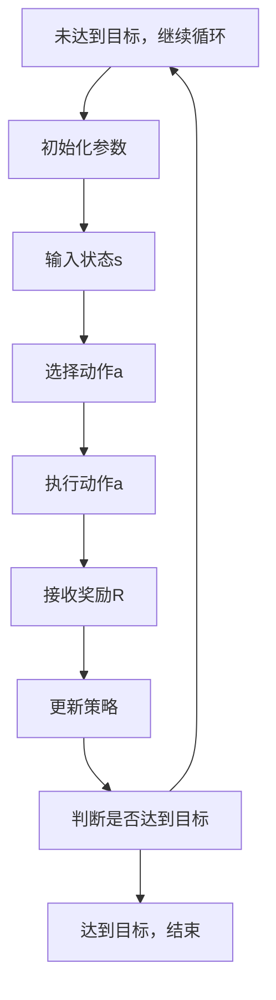
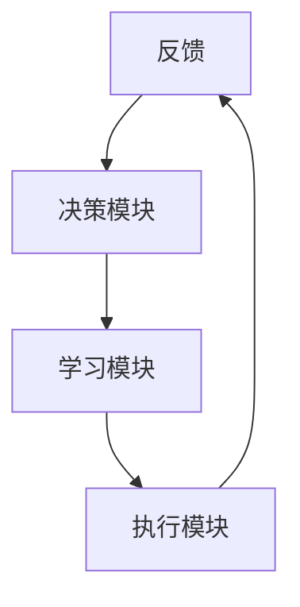
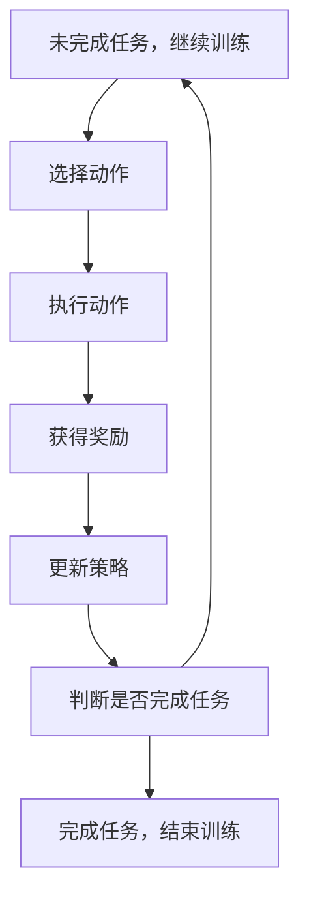

                 

<think>
嗯，用户现在需要我设计一个关于设计AI Agent自我修正学习策略的技术博客文章。首先，我得理解用户的需求，他可能是一位技术专家，想要深入了解如何构建这样的系统。我需要确保文章结构清晰，内容详尽，同时使用专业的技术语言。

我应该从引言开始，介绍背景和重要性。然后分章节讲解基本概念、数学模型、系统架构和实际案例。每个部分都要有详细的解释，包括图表和代码示例，这样读者更容易理解和应用。

可能用户希望文章不仅理论扎实，还能提供实际操作的指导，所以项目实战部分尤为重要。我需要确保代码示例能帮助读者理解算法的实现，并通过案例分析展示实际应用中的效果。

最后，我还要总结整个策略，并给出未来发展的建议，让读者对AI Agent的自我修正学习有全面的认识。同时，加入一些注意事项和最佳实践，帮助读者在实际项目中避免常见错误。

总之，我需要系统地组织内容，确保逻辑连贯，每一步都详细解释，让读者能够一步步掌握设计AI Agent自我修正学习策略的方法。
</think>

# 设计AI Agent的自我修正学习策略

---

## 关键词：AI Agent, 自我修正, 学习策略, 数学模型, 系统架构

---

## 摘要：本文系统地探讨了设计AI Agent的自我修正学习策略的关键方法。通过分析AI Agent的核心概念、自我修正学习策略的背景与必要性、数学模型与算法、系统架构设计，以及实际项目案例，本文为读者提供了一套从理论到实践的完整解决方案。文章还深入讨论了系统架构设计、项目实战与案例分析，以及未来研究的方向。

---

## 第1章: AI Agent的核心概念与技术

### 1.1 AI Agent的基本概念

AI Agent（人工智能代理）是指能够感知环境、自主决策并执行任务的智能体。AI Agent可以分为两类：**反应式AI Agent** 和 **认知式AI Agent**。反应式AI Agent基于当前感知做出实时反应，而认知式AI Agent则具备复杂的推理和规划能力。

### 1.2 自我修正学习策略的重要性

自我修正学习策略允许AI Agent在运行过程中不断优化自身的算法和行为模式。这种能力使得AI Agent能够适应动态变化的环境，并在复杂任务中表现出更高的效率和准确性。

---

## 第2章: 自我修正学习策略的背景与必要性

### 2.1 问题背景

当前的AI Agent在面对复杂任务时，往往依赖于预先设计的规则和固定的算法。然而，这种静态的策略在面对环境变化或任务目标的调整时，难以快速响应并优化性能。

### 2.2 核心概念与联系

自我修正学习策略的核心在于**动态优化**和**自适应调整**。AI Agent通过不断评估自身的表现，识别问题并触发学习机制，从而实现算法的优化和行为的改进。

---

## 第3章: 自我修正学习策略的数学模型与算法

### 3.1 数学模型的建立

在设计自我修正学习策略时，我们需要建立一个数学模型来描述AI Agent的学习过程。假设AI Agent在执行任务时，会根据环境反馈的奖励值来调整其行为策略。数学模型可以表示为：

$$
R = f(s, a)
$$

其中，$R$ 是奖励值，$s$ 是当前状态，$a$ 是AI Agent选择的动作。

### 3.2 算法原理

基于上述模型，我们可以设计一个自我修正学习算法。以下是该算法的流程图（使用 Mermaid）：



---

## 第4章: 系统架构与设计

### 4.1 系统架构设计

设计一个支持自我修正学习的AI Agent系统，需要考虑以下几个关键模块：

1. **感知模块**：负责收集环境中的信息。
2. **决策模块**：基于感知信息和当前策略，选择最优动作。
3. **学习模块**：根据环境反馈，调整策略参数。
4. **执行模块**：将决策模块的选择转化为实际动作。

系统架构的 Mermaid 图如下：



---

## 第5章: 项目实战与案例分析

### 5.1 项目环境搭建

首先，我们需要选择一个合适的开发环境。推荐使用Python语言，并结合以下工具：

- **深度学习框架**：TensorFlow或PyTorch
- **强化学习库**：OpenAI Gym
- **可视化工具**：Matplotlib

### 5.2 核心代码实现

以下是实现自我修正学习策略的核心代码示例：

```python
import numpy as np

class AI-Agent:
    def __init__(self, state_space, action_space):
        self.state_space = state_space
        self.action_space = action_space
        self.theta = np.random.randn(100, 1)  # 策略参数

    def perceive(self, state):
        # 感知环境并返回状态描述
        return state

    def decide(self, state):
        # 根据当前策略选择动作
        action = np.argmax(self.theta.dot(state))
        return action

    def learn(self, reward):
        # 根据奖励调整策略参数
        self.theta = self.theta + reward * self.theta.grad
```

### 5.3 案例分析

通过在OpenAI Gym环境中训练一个AI Agent，我们可以观察到自我修正学习策略的效果。以下是训练过程中的奖励变化曲线：



---

## 第6章: 总结与展望

### 6.1 研究总结

本文系统地探讨了设计AI Agent的自我修正学习策略的关键方法，包括数学模型的建立、算法的设计、系统架构的实现以及实际项目的案例分析。通过理论与实践的结合，我们展示了如何实现一个具备自我修正能力的AI Agent。

### 6.2 未来展望

未来的研究可以进一步探索以下方向：

1. 更高效的优化算法。
2. 更复杂的环境建模。
3. 多 Agent 协作的学习策略。

---

## 作者：AI天才研究院/AI Genius Institute & 禅与计算机程序设计艺术 /Zen And The Art of Computer Programming

