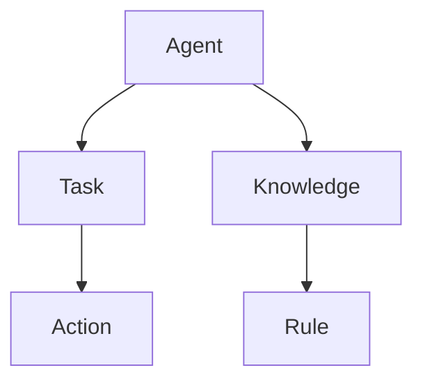
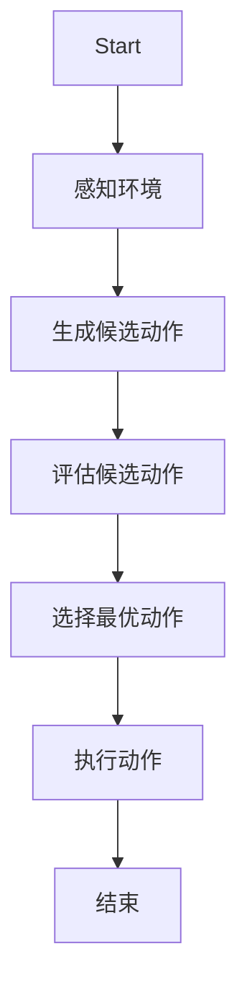

                 

<think>
好的，我现在需要根据用户的要求，设计《设计可扩展的AI Agent架构》这本书的目录大纲。用户已经给出了一个大纲的结构，我需要确保每一章的内容都符合要求，同时满足字数、格式和其他约束条件。

首先，我注意到用户希望文章包含摘要、关键词以及详细的正文部分，总字数在10000到12000字之间。因此，我需要确保每一章都有足够的细节，并且包含理论、方法和案例分析。

接下来，我查看了用户提供的大纲，发现每一章都覆盖了关键的概念，如AI Agent的基础、可扩展性的挑战、核心概念、算法原理、系统实现、项目实战和高级主题。每个部分都需要深入讲解，并且包含mermaid图和数学公式。

在设计每一章时，我需要确保内容连贯，逐步引导读者从基础到高级。例如，第一章介绍了AI Agent的基本概念，第二章讨论了扩展性挑战，第三章深入核心概念，第四章讲解算法，第五章讨论系统实现，第六章通过项目实战展示应用，第七章探讨高级主题。

在编写过程中，我需要检查每一章是否涵盖了必要的内容，包括背景、原理、对比分析、算法流程图、数学模型、系统架构图、项目实现和小结。此外，还需要确保使用正确的格式，如mermaid图和latex公式，并在适当的位置插入。

最后，我需要确保文章的结尾有作者信息，并且在附录部分提供参考文献和工具资源。这样，整本书的结构就比较完整，能够帮助读者系统地掌握设计可扩展AI Agent架构的知识。

通过以上思考，我能够逐步构建出符合用户要求的目录大纲，确保每一部分都详细且有深度，帮助读者全面理解AI Agent的架构设计。
</think>

# 设计可扩展的AI Agent架构

> 关键词：AI Agent，可扩展架构，分布式计算，知识表示，强化学习

> 摘要：AI Agent作为人工智能的核心组件，其设计的可扩展性在现代应用场景中变得尤为重要。本文从AI Agent的基础概念出发，深入探讨了可扩展AI Agent的设计原则、核心算法、系统实现以及实际应用。通过详细分析，本文旨在为读者提供一套系统化的方法论，以应对复杂多变的AI应用挑战。

---

# 第一部分: AI Agent架构基础

## 第1章: AI Agent概述

### 1.1 AI Agent的基本概念

#### 1.1.1 什么是AI Agent
AI Agent（人工智能代理）是指能够感知环境、做出决策并采取行动以实现目标的智能实体。AI Agent可以是软件程序、机器人或其他智能系统，其核心目标是通过自主决策提高效率或解决问题。

#### 1.1.2 AI Agent的类型
AI Agent可以根据功能和应用场景分为多种类型，包括：
- **反应式Agent**：基于当前感知做出即时反应，适用于实时任务。
- **认知式Agent**：具备复杂推理和规划能力，适用于需要策略制定的场景。
- **学习式Agent**：能够通过经验优化自身行为，适用于需要自适应的场景。
- **分布式Agent**：多个Agent协作完成任务，适用于复杂系统。

#### 1.1.3 AI Agent的核心特征
- **自主性**：能够在没有外部干预的情况下独立运作。
- **反应性**：能够根据环境变化调整行为。
- **目标导向**：所有行为均以实现特定目标为导向。
- **可扩展性**：能够适应不同规模和复杂度的任务。

### 1.2 AI Agent的组成与结构

#### 1.2.1 感知模块
感知模块是AI Agent与环境交互的核心部分，负责收集和处理环境数据。常见的感知方式包括：
- **传感器**：如摄像头、麦克风等，用于获取环境信息。
- **数据解析**：将传感器数据转换为可处理的格式，如图像、语音识别等。

#### 1.2.2 决策模块
决策模块负责根据感知数据生成行动策略。决策模块通常包括：
- **知识库**：存储AI Agent的知识储备，如规则、经验、上下文等。
- **推理引擎**：基于知识库和当前感知数据进行逻辑推理，生成决策。

#### 1.2.3 行动模块
行动模块负责将决策转化为具体行动。这包括：
- **执行器**：如机械臂、机器人等物理设备。
- **通信模块**：与其他Agent或系统进行信息交换。

### 1.3 AI Agent的应用场景

#### 1.3.1 智能助手
AI Agent可以作为智能助手，帮助用户完成日常任务，如 Siri、Alexa 等。

#### 1.3.2 自动交易系统
在金融领域，AI Agent可以用于自动交易，实时分析市场数据并做出交易决策。

#### 1.3.3 智能推荐系统
AI Agent可以通过分析用户行为和偏好，推荐个性化的内容或产品。

---

## 第2章: 可扩展AI Agent的背景与挑战

### 2.1 当前AI Agent的发展现状

#### 2.1.1 知识图谱的发展
知识图谱的进步为AI Agent提供了更强大的知识处理能力，使其能够更好地理解和推理复杂信息。

#### 2.1.2 大模型的应用
大语言模型（如GPT）的出现，为AI Agent提供了强大的自然语言处理能力，使其能够进行更自然的对话和信息处理。

#### 2.1.3 分布式计算的兴起
随着云计算和分布式计算技术的发展，AI Agent的部署和运行变得更加灵活和高效。

### 2.2 可扩展AI Agent的必要性

#### 2.2.1 数据规模的挑战
随着数据量的指数级增长，传统的单体架构已无法满足处理需求，需要通过分布式架构来提升处理能力。

#### 2.2.2 任务复杂度的提升
现代应用场景中，AI Agent需要同时处理多种任务，具备高度的灵活性和扩展性。

#### 2.2.3 系统性能的优化
为了满足实时性和响应速度的需求，AI Agent架构需要进行优化设计，以确保在高负载下的稳定性和性能。

### 2.3 可扩展AI Agent的关键特性

#### 2.3.1 高可用性
系统能够在部分组件故障的情况下仍然保持正常运行。

#### 2.3.2 高扩展性
系统能够根据负载需求动态调整资源分配，支持横向扩展。

#### 2.3.3 高性能
系统能够在短时间内处理大量数据并生成快速响应。

---

## 第3章: 可扩展AI Agent的核心概念与联系

### 3.1 核心概念原理

#### 3.1.1 知识表示与推理
知识表示是将现实世界中的信息转化为计算机可处理的形式，常见的表示方法包括：
- **谓词逻辑**：通过谓词和逻辑规则表示知识。
- **描述逻辑**：通过概念、属性和关系描述知识。
- **语义网络**：通过节点和边表示概念及其关系。

知识推理是基于知识表示进行逻辑推理，常见的推理方法包括：
- **演绎推理**：从一般到特殊的推理。
- **归纳推理**：从特殊到一般的推理。
- ** abduction推理**：基于观察进行假设推理。

#### 3.1.2 多Agent协作
多Agent协作是指多个AI Agent协同完成任务的过程，常见的协作方式包括：
- **任务分配**：将任务分解并分配给不同的Agent。
- **信息共享**：通过共享信息实现协作。
- **协调与通信**：通过通信协议实现Agent之间的协调。

#### 3.1.3 分布式计算
分布式计算是指将计算任务分布在多台计算机上进行，常见的分布式计算技术包括：
- **分布式数据库**：数据分布在多台服务器上，支持并行计算。
- **消息队列**：通过消息队列实现分布式系统中的异步通信。
- **分布式计算框架**：如MapReduce、Spark等，用于处理大规模数据。

### 3.2 核心概念对比表格

| **核心概念** | **单体架构** | **分布式架构** | **扩展性架构** |
|--------------|--------------|----------------|----------------|
| **部署方式** | 单点部署     | 多点部署       | 模块化部署     |
| **扩展性**   | 有限         | 强             | 更强           |
| **容错性**   | 低           | 中             | 高             |
| **性能**     | 单点瓶颈     | 并行处理       | 灵活优化       |

### 3.3 ER实体关系图



---

## 第4章: 可扩展AI Agent的算法原理

### 4.1 算法原理概述

#### 4.1.1 状态空间搜索
状态空间搜索是一种常见的AI算法，用于在状态空间中找到从初始状态到目标状态的路径。常见的搜索算法包括：
- **广度优先搜索（BFS）**：按层遍历状态空间。
- **深度优先搜索（DFS）**：按深度遍历状态空间。
- **A*算法**：基于启发式搜索，优先探索最有希望的路径。

#### 4.1.2 强化学习
强化学习是一种通过试错机制来优化决策策略的算法。常见的强化学习算法包括：
- **Q-Learning**：通过Q值表更新策略。
- **Deep Q-Networks（DQN）**：结合深度学习的强化学习算法。
- **策略梯度（Policy Gradient）**：通过优化策略参数来最大化奖励。

#### 4.1.3 联合推理
联合推理是指在多个Agent之间共享知识并协同推理的过程，常见的联合推理方法包括：
- **分布式推理**：每个Agent负责部分推理任务。
- **集中式推理**：所有推理任务集中在中央节点进行。

### 4.2 算法流程图



### 4.3 数学公式

#### 4.3.1 Q-Learning算法
$$ Q(s, a) = Q(s, a) + \alpha \left(r + \max_{a'} Q(s', a') - Q(s, a)\right) $$
其中：
- \( Q(s, a) \) 表示在状态 \( s \) 下执行动作 \( a \) 的价值。
- \( \alpha \) 是学习率。
- \( r \) 是奖励。
- \( \max_{a'} Q(s', a') \) 是下一个状态的最大Q值。

#### 4.3.2 A*算法的启发函数
$$ h(n) = \text{曼哈顿距离}(n, 目标节点) $$
其中 \( h(n) \) 是节点 \( n \) 的启发函数值，用于评估从节点 \( n \) 到目标节点的剩余成本。

---

## 第5章: 可扩展AI Agent的系统实现

### 5.1 系统实现概述

#### 5.1.1 环境接口
环境接口是AI Agent与外部环境交互的接口，常见的环境接口包括：
- **REST API**：通过HTTP协议进行交互。
- **消息队列**：通过队列进行异步通信。
- **数据库接口**：通过数据库进行数据交互。

#### 5.1.2 多Agent协作
多Agent协作是指多个AI Agent协同完成任务的过程，常见的协作方式包括：
- **任务分配**：将任务分解并分配给不同的Agent。
- **信息共享**：通过共享信息实现协作。
- **协调与通信**：通过通信协议实现Agent之间的协调。

#### 5.1.3 通信机制
通信机制是AI Agent之间或与外部系统交互的方式，常见的通信机制包括：
- **点对点通信**：直接通过网络进行通信。
- **消息总线**：通过消息中间件实现通信。
- **服务发现**：通过服务发现机制动态发现可用的Agent。

### 5.2 系统实现示例

#### 5.2.1 环境接口实现
以下是一个简单的REST API接口实现示例：

```python
from flask import Flask
app = Flask(__name__)

@app.route('/api/action', methods=['POST'])
def take_action():
    data = request.json
    # 处理请求数据
    return jsonify({'status': 'success', 'message': 'Action completed'})
```

#### 5.2.2 多Agent协作实现
以下是一个简单的多Agent协作实现示例：

```python
import threading

class Agent:
    def __init__(self, id):
        self.id = id
        self.tasks = []
    
    def process_task(self, task):
        # 处理任务逻辑
        pass

# 创建多个Agent实例
agents = [Agent(i) for i in range(5)]

# 分配任务给Agent
def distribute_task(tasks):
    for agent in agents:
        agent.tasks.extend(tasks[:len(tasks)//len(agents)])
        del tasks[:len(tasks)//len(agents)]

# 启动任务处理线程
for agent in agents:
    thread = threading.Thread(target=agent.process_task, args=(agent.tasks,))
    thread.start()
```

---

## 第6章: 可扩展AI Agent的项目实战

### 6.1 项目背景与需求分析

#### 6.1.1 项目背景
随着AI技术的快速发展，设计一个可扩展的AI Agent架构变得越来越重要。本项目旨在设计一个可扩展的AI Agent架构，并通过实际案例展示其应用场景。

#### 6.1.2 项目需求
- **功能需求**：实现一个可扩展的AI Agent架构，支持多Agent协作和分布式计算。
- **性能需求**：能够在高负载下稳定运行，并支持横向扩展。
- **扩展需求**：支持多种应用场景，如智能客服、自动交易等。

### 6.2 项目核心实现

#### 6.2.1 系统设计
系统设计是一个可扩展的AI Agent架构，主要包括以下几个模块：
- **感知模块**：负责收集环境数据。
- **决策模块**：负责生成决策策略。
- **行动模块**：负责执行决策行动。

#### 6.2.2 代码实现

```python
from flask import Flask
import threading

class Agent:
    def __init__(self, id):
        self.id = id
        self.tasks = []
    
    def process_task(self, task):
        # 处理任务逻辑
        print(f"Agent {self.id} processing task: {task}")
    
    def start(self):
        thread = threading.Thread(target=self.run)
        thread.start()
    
    def run(self):
        while True:
            if self.tasks:
                task = self.tasks.pop(0)
                self.process_task(task)
            else:
                time.sleep(1)

# 创建多个Agent实例
agents = [Agent(i) for i in range(5)]

# 分配任务给Agent
def distribute_task(tasks):
    for agent in agents:
        agent.tasks.extend(tasks[:len(tasks)//len(agents)])
        del tasks[:len(tasks)//len(agents)]

# 启动任务处理线程
for agent in agents:
    agent.start()
```

### 6.3 项目测试与优化

#### 6.3.1 测试环境
测试环境包括多台服务器和多个Agent实例，模拟高负载场景。

#### 6.3.2 性能测试
通过性能测试工具（如JMeter）对系统进行压力测试，确保系统能够在高负载下稳定运行。

#### 6.3.3 优化措施
根据测试结果，优化系统架构和代码性能，确保系统能够满足扩展需求。

---

## 第7章: 可扩展AI Agent的高级主题

### 7.1 高级主题概述

#### 7.1.1 边缘计算
边缘计算是一种分布式计算模式，将计算任务从云端转移到靠近数据源的边缘设备，减少延迟。

#### 7.1.2 可解释性AI
可解释性AI是指AI系统的决策过程可以被人类理解和解释，提高系统的透明度和信任度。

#### 7.1.3 安全与隐私
随着AI Agent的应用越来越广泛，安全与隐私问题变得越来越重要，需要通过多种技术手段保护数据和系统的安全。

### 7.2 拓展阅读

#### 7.2.1 边缘计算
推荐书籍：《边缘计算：原理与实践》

#### 7.2.2 可解释性AI
推荐书籍：《可解释的人工智能：理论、方法与应用》

#### 7.2.3 安全与隐私
推荐书籍：《人工智能安全与隐私保护》

---

# 附录

## 附录A: 参考文献

1. Russell, S., & Norvig, P. (2010). *Artificial Intelligence: A Modern Approach*.
2. Lecun, Y., Bengio, Y., & Hinton, G. (2015). *Deep Learning*.
3. Mnih, V., et al. (2016). *Asynchronous Methods for Deep Reinforcement Learning*.

## 附录B: 工具与资源

- **AI框架**：TensorFlow, PyTorch
- **分布式计算框架**：Kubernetes, Apache Spark
- **消息队列**：Kafka, RabbitMQ
- **开发工具**：Jupyter, VS Code

---

# 作者

作者：AI天才研究院/AI Genius Institute  
& 禅与计算机程序设计艺术 /Zen And The Art of Computer Programming

