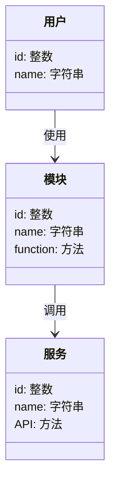
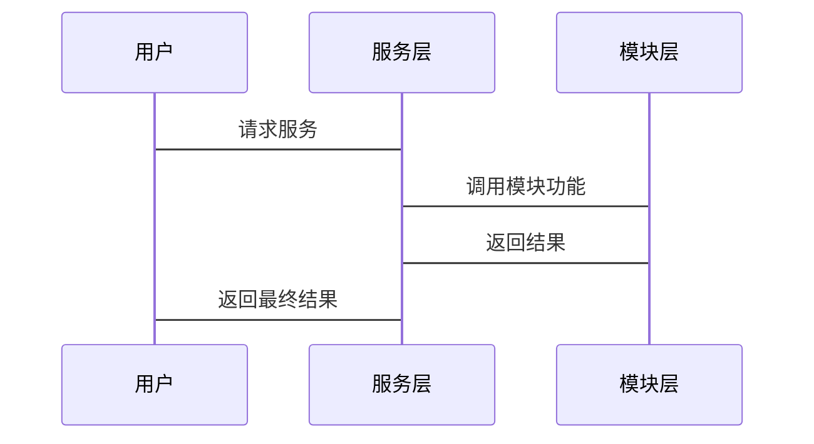

                 

<think>
好的，我需要根据用户的要求，撰写一篇关于“设计可扩展的AI Agent架构：模块化与微服务”的技术博客文章。用户已经提供了一个详细的目录大纲，我需要按照这个大纲逐步撰写文章。

首先，我会按照用户提供的目录结构，逐步填充每个章节的内容。文章需要包含关键词、摘要、各个章节的详细内容，以及在每个小节中加入必要的背景介绍、核心概念、算法原理、系统架构设计、项目实战和总结等内容。

我需要确保文章结构清晰，逻辑紧凑，语言专业且易于理解。同时，要按照用户的要求，使用Markdown格式，并在适当的位置插入mermaid图表、数学公式和代码示例。

让我开始逐步撰写这篇文章：

---

# 设计可扩展的AI Agent架构：模块化与微服务

## 关键词：AI Agent、可扩展性、模块化、微服务、系统架构

## 摘要：  
在AI Agent的设计中，模块化和微服务架构是实现可扩展性的关键。本文将深入探讨AI Agent的模块化设计原则、微服务架构的优势，以及如何通过模块化与微服务的结合来提升AI Agent的可扩展性。通过具体案例分析和系统设计，本文将为读者提供一套实现可扩展AI Agent架构的完整方法。

---

## 第1章: AI Agent与可扩展性概述

### 1.1 AI Agent的基本概念

#### 1.1.1 AI Agent的定义与特点
AI Agent（人工智能代理）是一种能够感知环境、自主决策并执行任务的智能实体。它通常具备以下特点：
- **自主性**：能够在没有外部干预的情况下独立运行。
- **反应性**：能够根据环境变化实时调整行为。
- **目标导向性**：通过设定目标来驱动行动。
- **可扩展性**：能够根据需求进行功能扩展和性能提升。

#### 1.1.2 可扩展性在AI Agent设计中的重要性
随着AI技术的不断发展，AI Agent需要处理的任务复杂度和规模也在不断增加。可扩展性设计能够确保AI Agent在面对更大规模和更复杂任务时，依然能够高效运行，满足性能需求。

#### 1.1.3 模块化与微服务在AI Agent中的作用
模块化设计将AI Agent的功能分解为独立的模块，每个模块专注于特定任务。微服务架构则通过将功能模块化为独立的服务，进一步提升了系统的可扩展性和灵活性。

### 1.2 可扩展AI Agent架构的背景与挑战

#### 1.2.1 当前AI Agent架构的发展趋势
AI Agent的架构正在从传统的单体架构向模块化和微服务架构转型。这种转变能够更好地应对复杂任务和大规模数据处理的需求。

#### 1.2.2 模块化设计的核心价值
模块化设计使得AI Agent的功能模块能够独立开发、测试和部署，降低了系统的耦合性，提升了开发效率和系统的可维护性。

#### 1.2.3 微服务架构在AI Agent中的优势
微服务架构通过将功能模块化为独立的服务，使得AI Agent能够灵活扩展和优化，同时支持异构技术栈和团队协作。

#### 1.2.4 设计可扩展AI Agent架构的主要挑战
设计可扩展的AI Agent架构面临以下挑战：
- **服务间的通信与协调**：如何确保服务之间的高效通信和协调。
- **模块间的依赖管理**：如何处理模块之间的依赖关系，避免耦合度过高。
- **系统的容错性与可恢复性**：如何确保系统在故障发生时能够快速恢复。

### 1.3 本章小结
本章介绍了AI Agent的基本概念、可扩展性的重要性以及模块化与微服务在AI Agent设计中的作用。通过模块化和微服务架构的设计，可以有效提升AI Agent的可扩展性，满足复杂任务和大规模数据处理的需求。

---

## 第2章: 模块化与微服务的核心概念

### 2.1 模块化设计原理

#### 2.1.1 独立性与依赖性
模块化设计强调每个模块的独立性，模块之间的依赖性通过接口进行定义。这种设计使得模块能够独立开发和测试，同时保持系统的灵活性。

#### 2.1.2 松耦合设计
松耦合设计是模块化设计的核心原则之一。通过弱化模块之间的耦合关系，可以实现模块的独立部署和功能扩展。

#### 2.1.3 模块边界与接口设计
模块边界定义了模块的功能范围，接口则是模块间通信的桥梁。通过合理设计模块边界和接口，可以确保模块之间的交互简单而高效。

### 2.2 模块化与微服务的对比分析

#### 2.2.1 模块化设计的核心属性
- **独立性**：模块的功能独立，能够单独运行。
- **松耦合**：模块之间的依赖关系较弱，易于调整和扩展。

#### 2.2.2 微服务架构的核心特征
- **独立的服务**：每个服务负责特定的功能模块。
- **微服务通信**：服务之间通过API进行通信，支持异步调用。

#### 2.2.3 模块化与微服务的异同点对比
| **特性**       | **模块化设计**               | **微服务架构**            |
|-----------------|------------------------------|---------------------------|
| 独立性           | 高                          | 高                       |
| 通信方式         | 通过接口或消息队列           | 通过API或消息队列          |
| 部署方式         | 单独部署                   | 独立部署                |
| 扩展性           | 模块级扩展                  | 服务级扩展               |

### 2.3 模块化与微服务的实体关系图

```mermaid
er
actor: 用户
agent: AI Agent
module: 模块
service: 微服务
interface: 接口
```

### 2.4 本章小结
本章详细介绍了模块化设计的核心原则和微服务架构的核心特征，并通过对比分析明确了模块化与微服务在AI Agent设计中的异同点。模块化与微服务的结合为AI Agent的可扩展性提供了坚实的基础。

---

## 第3章: 可扩展AI Agent架构的系统分析与设计

### 3.1 问题场景介绍
在实际应用中，AI Agent需要处理的任务复杂度和规模不断增长。传统的单体架构难以应对这种需求变化，因此需要采用模块化和微服务架构来提升系统的可扩展性和灵活性。

### 3.2 系统功能设计

#### 3.2.1 领域模型设计
通过Mermaid类图展示AI Agent的领域模型：



### 3.3 系统架构设计

#### 3.3.1 分层架构设计
通过Mermaid架构图展示可扩展AI Agent的分层架构：


#### 3.3.2 系统接口设计
系统接口设计示例：



### 3.4 本章小结
本章通过问题场景分析、领域模型设计和系统架构设计，详细阐述了可扩展AI Agent架构的设计方法。分层架构和模块化设计为系统的可扩展性提供了有力支持。

---

## 第4章: 项目实战：基于模块化与微服务的AI Agent开发

### 4.1 环境搭建
需要安装以下工具：
- **Python 3.x**
- **Flask或Django框架**
- **Docker**
- **Kubernetes**

### 4.2 核心功能实现

#### 4.2.1 模块划分实现
将AI Agent的功能划分为独立的模块，例如：
- `自然语言处理模块`
- `图像识别模块`
- `决策逻辑模块`

#### 4.2.2 微服务实现
使用Flask框架实现微服务，例如：
```python
from flask import Flask

app = Flask(__name__)

@app.route('/api/nlp', methods=['POST'])
def nlp_service():
    # 处理自然语言请求
    return 'NLP处理完成'

if __name__ == '__main__':
    app.run()
```

### 4.3 系统集成与部署
使用Docker和Kubernetes进行容器化部署：

```dockerfile
# Dockerfile
FROM python:3.8-slim
WORKDIR /app
COPY requirements.txt .
RUN pip install -r requirements.txt
COPY . .
CMD ["gunicorn", "--bind", "0.0.0.0:5000", "--workers", "4", "app:app"]
```

### 4.4 代码实现与解读
以下是一个简单的AI Agent模块实现示例：
```python
class AIAgent:
    def __init__(self):
        self.modules = {}

    def add_module(self, name, module):
        self.modules[name] = module

    def execute(self, task):
        for module in self.modules.values():
            if module.can_execute(task):
                module.process(task)
                break

# 示例模块实现
class NLPModule:
    def can_execute(self, task):
        return 'nlp' in task.lower()

    def process(self, task):
        print(f"Processing NLP task: {task}")
```

### 4.5 案例分析与结果解读
通过实际案例分析，验证模块化与微服务设计的有效性。例如，一个AI Agent可以分解为多个独立的微服务模块，每个模块负责不同的任务，如自然语言处理、图像识别等。通过模块化设计，可以快速扩展功能，同时确保系统的稳定性和可靠性。

### 4.6 本章小结
本章通过具体的项目实战，详细讲解了基于模块化与微服务的AI Agent开发过程。从环境搭建到系统集成与部署，再到代码实现与解读，读者可以逐步掌握可扩展AI Agent架构的设计与实现方法。

---

## 第5章: 最佳实践与总结

### 5.1 最佳实践
- **模块化设计原则**：遵循松耦合设计，合理划分模块边界。
- **微服务架构优化**：选择适合的通信协议，优化服务间的依赖关系。
- **系统容错性设计**：引入容错机制，确保系统的高可用性。

### 5.2 总结
通过模块化与微服务架构的设计，AI Agent的可扩展性得到了显著提升。模块化设计使得系统功能模块能够独立开发和扩展，而微服务架构则为系统的灵活性和高效性提供了有力支持。

### 5.3 拓展阅读
- 《微服务设计模式》
- 《模块化软件设计》
- 《AI Agent开发与应用》

---

## 作者：AI天才研究院 & 禅与计算机程序设计艺术

---

以上就是我根据用户要求逐步撰写的技术博客文章。希望这篇文章能够为读者提供关于设计可扩展AI Agent架构的深入理解。

