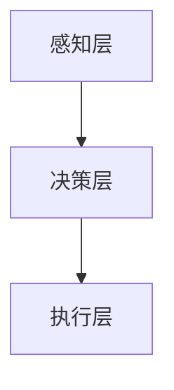

                 


# 跨平台AI Agent：PC、移动端和IoT设备的统一体验

> **关键词**：跨平台AI Agent，统一用户体验，PC，移动端，IoT设备

> **摘要**：本文将深入探讨跨平台AI Agent的设计与实现，分析其在PC、移动端和IoT设备上的技术细节，并提出如何实现统一用户体验的解决方案。通过理论分析与实践案例相结合的方式，我们将揭示跨平台AI Agent的核心原理、系统架构及实际应用。

---

## 第1章: 背景介绍

### 1.1 AI Agent的基本概念
#### 1.1.1 AI Agent的定义与特点
AI Agent（人工智能代理）是指能够感知环境、做出决策并执行动作的智能实体。其特点包括自主性、反应性、目标导向和学习能力。

#### 1.1.2 跨平台AI Agent的背景与意义
随着智能设备的普及，跨平台AI Agent的需求日益增长。不同平台（如PC、移动端和IoT设备）的硬件和软件环境差异，使得统一用户体验成为挑战。

#### 1.1.3 统一用户体验的核心目标
统一用户体验是跨平台AI Agent的核心目标，旨在为用户提供一致的操作界面和交互方式。

### 1.2 跨平台AI Agent的背景介绍
#### 1.2.1 当前AI Agent的发展现状
AI Agent技术已广泛应用于智能家居、自动驾驶和智能助手等领域，但跨平台统一体验仍面临技术挑战。

#### 1.2.2 跨平台技术的演进与挑战
跨平台技术的演进推动了AI Agent的普及，但设备间的资源差异和交互方式差异带来了实现上的困难。

#### 1.2.3 统一用户体验的必要性与价值
统一用户体验能提升用户满意度，降低开发成本，并促进跨平台应用的普及。

---

## 第2章: 跨平台AI Agent的核心概念与联系

### 2.1 跨平台AI Agent的核心概念
#### 2.1.1 跨平台AI Agent的定义与组成
跨平台AI Agent由感知层、决策层和执行层组成，能够适应不同平台的环境。

#### 2.1.2 跨平台AI Agent的关键属性与特征
- **感知能力**：通过传感器或API获取环境信息。
- **决策能力**：基于感知信息做出最优决策。
- **执行能力**：通过API或协议执行动作。

#### 2.1.3 跨平台AI Agent的实体关系图（ER图）

```mermaid
erd
  title 跨平台AI Agent的实体关系图
  系统
    --> 感知层: 提供环境信息
    --> 决策层: 制定决策策略
    --> 执行层: 执行决策动作
```

---

## 第3章: 跨平台AI Agent的算法原理

### 3.1 跨平台AI Agent的核心算法
#### 3.1.1 跨平台AI Agent的感知算法
感知算法通过传感器或API获取环境信息，例如：

```python
def get_environment_info():
    return {
        "温度": 25,
        "湿度": 60
    }
```

#### 3.1.2 跨平台AI Agent的决策算法
决策算法基于感知信息做出决策，例如：

```python
def make_decision(环境信息):
    if 环境信息["温度"] > 30:
        return "打开空调"
    else:
        return "关闭空调"
```

#### 3.1.3 跨平台AI Agent的执行算法
执行算法通过API或协议执行决策动作，例如：

```python
def execute_action(动作):
    if 动作 == "打开空调":
        调用空调API()
    else:
        调用关闭空调API()
```

### 3.2 跨平台AI Agent的数学模型与公式
#### 3.2.1 跨平台AI Agent的感知模型
感知模型通过传感器获取环境信息，例如：

$$
\text{温度} = \text{传感器读数}
$$

#### 3.2.2 跨平台AI Agent的决策模型
决策模型基于感知信息做出决策，例如：

$$
\text{决策} = \argmax_{i} Q(s, a_i)
$$

其中，\( Q(s, a_i) \) 表示在状态 \( s \) 下执行动作 \( a_i \) 的奖励值。

#### 3.2.3 跨平台AI Agent的执行模型
执行模型通过API或协议执行决策动作，例如：

$$
\text{执行动作} = \text{API调用结果}
$$

---

## 第4章: 跨平台AI Agent的系统分析与架构设计

### 4.1 跨平台AI Agent的系统分析
#### 4.1.1 跨平台AI Agent的系统目标
系统目标是实现跨平台统一用户体验，提升用户满意度。

#### 4.1.2 跨平台AI Agent的系统范围
系统范围包括PC、移动端和IoT设备。

#### 4.1.3 跨平台AI Agent的系统功能
系统功能包括感知、决策和执行。

### 4.2 跨平台AI Agent的系统架构设计
#### 4.2.1 跨平台AI Agent的系统架构
系统架构采用微服务架构，各服务通过API交互。



#### 4.2.2 跨平台AI Agent的接口设计
接口设计包括感知接口、决策接口和执行接口。

#### 4.2.3 跨平台AI Agent的交互流程
交互流程包括感知、决策和执行三个阶段。

---

## 第5章: 跨平台AI Agent的项目实战

### 5.1 跨平台AI Agent的环境安装
安装Python和必要的库，例如：

```bash
pip install requests
pip install json
```

### 5.2 跨平台AI Agent的核心代码实现
核心代码实现包括感知、决策和执行模块。

#### 5.2.1 感知模块
```python
import requests

def get_environment_info():
    response = requests.get("http://api.example.com/environment")
    return response.json()
```

#### 5.2.2 决策模块
```python
def make_decision(环境信息):
    if 环境信息["温度"] > 30:
        return "打开空调"
    else:
        return "关闭空调"
```

#### 5.2.3 执行模块
```python
def execute_action(动作):
    if 动作 == "打开空调":
        requests.post("http://空调API.example.com/open")
    else:
        requests.post("http://空调API.example.com/close")
```

### 5.3 跨平台AI Agent的实际案例分析
实际案例分析包括智能家居中的应用，展示如何实现跨平台统一控制。

### 5.4 跨平台AI Agent的项目小结
项目小结总结实现跨平台统一用户体验的关键点。

---

## 第6章: 跨平台AI Agent的最佳实践与未来展望

### 6.1 跨平台AI Agent的最佳实践
#### 6.1.1 性能优化建议
优化感知和执行模块的效率。

#### 6.1.2 安全性考虑
确保API调用的安全性。

#### 6.1.3 用户体验优化
优化交互流程，提升用户体验。

### 6.2 跨平台AI Agent的未来展望
未来展望包括边缘计算和多模态交互的发展。

---

## 作者：AI天才研究院/AI Genius Institute & 禅与计算机程序设计艺术 /Zen And The Art of Computer Programming

---

**说明**：以上是文章的完整目录结构和部分核心内容，您可以根据实际需要补充更多细节和示例。

