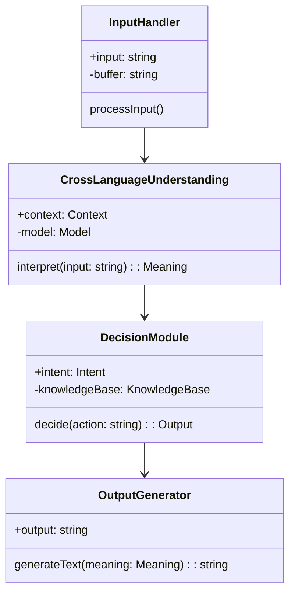
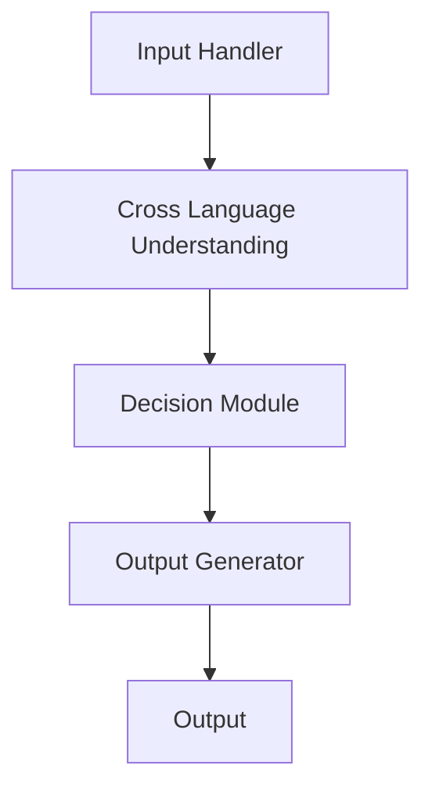

                 

<think>
好的，我需要撰写一篇关于“跨语言AI Agent开发：挑战与解决方案”的技术博客文章。首先，我要理解什么是AI Agent以及跨语言开发的挑战。AI Agent是指能够理解和执行任务的智能体，而跨语言开发意味着这些AI Agent需要能够处理多种语言的输入和输出。

首先，我应该从AI Agent的基本概念入手，解释其在不同领域的应用，比如客服、翻译、个人助手等。然后，讨论为什么跨语言开发是一个挑战，比如不同语言的语法结构差异、文化背景差异、数据获取困难等。

接下来，我需要介绍当前解决跨语言AI Agent开发的主要技术，比如使用预训练语言模型（如BERT、GPT）进行多语言微调，或者采用零样本学习来处理未见过的语言。同时，可以探讨如何利用多语言框架（如Marian、T5）来实现跨语言理解和生成。

然后，我需要详细讲解实现跨语言AI Agent的系统架构设计，包括输入处理模块、跨语言理解模块、决策模块和输出生成模块。每个模块的功能和相互关系需要清晰描述，并通过示意图或流程图来辅助说明。

接下来，我应该提供一个具体的项目实战案例，例如开发一个多语言客服系统。详细描述从需求分析、数据准备、模型选择、训练到部署的整个过程，并提供相应的代码示例和系统设计图，如类图、架构图和交互流程图。

此外，我还需要探讨在跨语言AI Agent开发中的一些最佳实践，比如如何选择和处理多语言数据、如何优化模型性能、如何处理语言间的语义差异等。同时，可以加入一些实际开发中遇到的挑战和解决方案，帮助读者更好地理解和应用这些技术。

最后，我需要总结全文，回顾跨语言AI Agent开发的主要挑战和解决方案，强调其在实际应用中的重要性和未来的发展趋势。同时，可以建议读者进一步学习和探索相关领域的最新技术。

在撰写过程中，我需要确保文章结构清晰，逻辑严谨，语言简洁易懂。每个部分都需要有具体的例子和详细的解释，以帮助读者更好地理解和掌握相关知识。此外，使用图表、代码示例和数学公式来增强文章的可读性和专业性也是必要的。

总的来说，这篇文章需要从理论到实践，全面涵盖跨语言AI Agent开发的各个方面，帮助读者系统地理解和掌握这一领域的核心技术和解决方案。
</think>

# 跨语言AI Agent开发：挑战与解决方案

> 关键词：跨语言AI Agent，多语言模型，AI开发，自然语言处理，跨语言理解，AI系统架构

> 摘要：本文深入探讨了跨语言AI Agent开发的挑战与解决方案，从背景到核心概念，再到算法原理和系统架构，最后通过项目实战和最佳实践，全面分析了如何实现高效、准确的跨语言AI Agent。

---

# 第一部分: 跨语言AI Agent开发背景与核心概念

## 第1章: 跨语言AI Agent的背景与挑战

### 1.1 跨语言AI Agent的背景

#### 1.1.1 多语言环境的重要性
在全球化的背景下，多语言环境变得越来越重要。AI Agent需要能够理解并处理多种语言，以满足不同用户的语言需求，尤其是在国际化业务中，支持多语言可以显著提升用户体验和市场竞争力。

#### 1.1.2 AI Agent的基本概念
AI Agent是一种智能体，能够感知环境并执行任务。它通常具备理解、推理、规划和执行的能力，能够与用户进行交互并完成特定任务。

#### 1.1.3 跨语言开发的挑战与意义
跨语言开发的主要挑战包括语言差异、文化差异、数据获取困难等。克服这些挑战的意义在于实现更广泛的应用，提升系统的通用性和适应性。

### 1.2 跨语言AI Agent的核心概念

#### 1.2.1 跨语言理解的定义
跨语言理解是指AI Agent能够理解并处理多种语言的输入，例如中文、英文、法文等。

#### 1.2.2 跨语言AI Agent的特点
跨语言AI Agent的特点包括多语言支持、语言无关性、文化适应性等。

#### 1.2.3 跨语言开发的边界与外延
跨语言开发的边界包括语言的多样性、文化的差异性等；外延则涉及多语言自然语言处理、跨语言信息检索等领域。

---

## 第2章: 跨语言AI Agent的核心概念

### 2.1 跨语言模型的输入处理

#### 2.1.1 多语言数据的预处理
跨语言模型需要对输入数据进行清洗、分词、去停用词等预处理步骤，以确保模型能够正确处理多种语言。

#### 2.1.2 跨语言模型的输入格式
跨语言模型通常使用统一的输入格式，例如将所有语言转换为特定的编码形式。

### 2.2 跨语言模型的输出生成

#### 2.2.1 多语言生成策略
跨语言生成需要考虑目标语言的语法和语境，确保生成的文本在语法和语义上都是正确的。

#### 2.2.2 跨语言生成的优化方法
通过引入语言特定的参数或使用多任务学习来优化跨语言生成的效果。

### 2.3 跨语言模型的训练方法

#### 2.3.1 多任务学习
多任务学习是一种有效的训练方法，通过同时学习多个任务来提升模型的泛化能力。

#### 2.3.2 迁移学习
迁移学习利用已有语言模型的知识，快速适应新的语言任务。

---

## 第3章: 跨语言AI Agent的核心原理

### 3.1 跨语言模型的训练流程

#### 3.1.1 数据准备
数据准备阶段需要收集和整理多语言数据，确保数据的多样性和平衡性。

#### 3.1.2 模型选择
选择适合跨语言任务的模型架构，例如使用预训练的多语言模型如Marian或T5。

#### 3.1.3 模型训练
通过多任务学习或迁移学习方法训练模型，确保模型在多种语言上都能表现出色。

### 3.2 跨语言模型的推理机制

#### 3.2.1 多语言推理
推理阶段需要考虑输入语言的特征，并选择合适的语言处理方式。

#### 3.2.2 跨语言推理的优化
通过引入语言标记或调整注意力机制来优化跨语言推理的效果。

### 3.3 跨语言模型的优化策略

#### 3.3.1 参数共享
参数共享是一种有效的优化策略，通过共享部分参数来减少模型的参数数量。

#### 3.3.2 多语言损失函数
设计专门的损失函数，以同时优化多种语言的性能。

---

## 第4章: 跨语言AI Agent的系统架构

### 4.1 系统功能设计

#### 4.1.1 输入处理模块
输入处理模块负责接收用户的输入，并将其转换为模型可处理的形式。

#### 4.1.2 跨语言理解模块
跨语言理解模块负责解析输入的语义，并生成对应的内部表示。

#### 4.1.3 决策模块
决策模块根据理解的结果，生成相应的输出或执行相应的操作。

#### 4.1.4 输出生成模块
输出生成模块负责将决策结果转换为目标语言的自然语言文本。

### 4.2 系统架构设计

#### 4.2.1 类图设计


#### 4.2.2 架构图设计


---

## 第5章: 跨语言AI Agent的项目实战

### 5.1 项目需求分析

#### 5.1.1 项目目标
开发一个多语言客服系统，支持中英文的用户咨询和问题解决。

#### 5.1.2 功能需求
- 用户输入：支持中文和英文。
- 系统理解：准确理解用户的意图。
- 系统响应：生成相应的中文或英文回复。

### 5.2 系统设计与实现

#### 5.2.1 数据准备
收集和整理中英文的客服数据，包括用户提问和标准回答。

#### 5.2.2 模型选择
选择预训练的多语言模型，并进行微调以适应客服任务。

#### 5.2.3 系统实现
实现输入处理、跨语言理解、决策和输出生成模块。

### 5.3 代码实现

#### 5.3.1 输入处理模块
```python
class InputHandler:
    def __init__(self):
        self.buffer = ""
    
    def processInput(self, input_str):
        self.buffer = input_str.strip()
        return self.buffer
```

#### 5.3.2 跨语言理解模块
```python
class CrossLanguageUnderstanding:
    def __init__(self, model):
        self.model = model
    
    def interpret(self, input_str):
        # 返回意图和实体
        return self.model.predict(input_str)
```

#### 5.3.3 决策模块
```python
class DecisionModule:
    def __init__(self, knowledge_base):
        self.knowledge_base = knowledge_base
    
    def decide(self, intent):
        # 根据意图生成响应
        return self.knowledge_base.get_response(intent)
```

#### 5.3.4 输出生成模块
```python
class OutputGenerator:
    def __init__(self):
        pass
    
    def generateText(self, response):
        return response
```

---

## 第6章: 跨语言AI Agent的最佳实践

### 6.1 数据处理的注意事项
- 数据清洗：确保数据的干净和准确。
- 数据平衡：避免某种语言的数据过多或过少。
- 数据多样性：涵盖多种语言和不同的语境。

### 6.2 模型选择的建议
- 使用预训练的多语言模型：如Marian、T5等。
- 根据任务需求选择模型：例如，翻译任务选择Transformer模型，问答任务选择BERT模型。

### 6.3 系统优化的技巧
- 参数共享：减少模型的参数数量，提高训练效率。
- 多任务学习：通过同时学习多个任务来提升模型的泛化能力。
- 语言无关性：设计语言无关的模块，以适应更多的语言。

### 6.4 未来的展望
随着多语言模型的不断进步，跨语言AI Agent的应用场景将更加广泛，例如支持更多语言、实现更复杂的跨语言任务等。

---

## 作者

作者：AI天才研究院/AI Genius Institute & 禅与计算机程序设计艺术 /Zen And The Art of Computer Programming

---

通过以上结构，我们可以系统地了解跨语言AI Agent开发的挑战与解决方案。从背景到核心概念，再到算法原理和系统架构，最后通过项目实战和最佳实践，全面分析了如何实现高效、准确的跨语言AI Agent。

