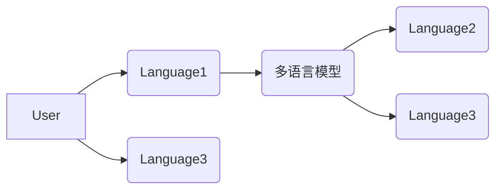
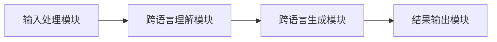

                 

<think>
好的，我现在需要帮助用户撰写一篇关于《跨语言AI Agent的开发挑战与解决方案》的技术博客文章。用户已经提供了一个详细的目录大纲，并且希望文章符合特定的格式和内容要求。

首先，我需要明确文章的核心主题是跨语言AI Agent的开发挑战及其解决方案。文章的结构已经给出，分为七章，涵盖背景、核心概念、算法、系统架构、项目实战、解决方案和未来展望。

接下来，我需要按照每一章的内容，逐步展开思考，确保每一部分都详细且符合用户的要求。

1. **第一章：背景与问题定义**
   - 1.1 跨语言AI Agent的定义与核心概念
     - 确保定义清晰，涵盖多语言处理、跨语言理解、生成能力等核心要素。
   - 1.2 背景分析
     - 当前AI技术的发展，多语言需求的增长，应用场景的扩展。
   - 1.3 开发挑战
     - 模型训练的复杂性，语义鸿沟，实时性要求。

2. **第二章：核心概念与联系**
   - 详细讲解核心原理，对比多语言与单语言模型，使用ER图展示实体关系。
   - 确保使用Mermaid图来展示概念对比和实体关系。

3. **第三章：算法原理**
   - 选择适当的跨语言模型（如MT5），分析其架构。
   - 使用Mermaid流程图展示训练流程，包括预训练和微调阶段。
   - 提供Python代码示例，解释其功能和实现细节。

4. **第四章：系统分析与架构设计**
   - 描述问题场景，设计项目结构。
   - 使用Mermaid类图展示系统架构，明确各模块的交互。
   - 绘制接口设计和交互流程图，确保系统各部分协同工作。

5. **第五章：项目实战**
   - 指导环境配置，如安装Python和必要的库。
   - 编写核心代码，实现跨语言理解与生成功能。
   - 提供代码示例，并进行详细解读和测试。

6. **第六章：解决方案与实现**
   - 结合算法和架构设计，详细阐述解决方案。
   - 提供系统设计图，展示模块之间的关系和交互流程。

7. **第七章：未来展望与注意事项**
   - 探讨跨语言AI Agent的未来发展方向。
   - 提供开发中的注意事项和最佳实践建议。

在撰写过程中，我需要确保每一部分都详细展开，符合用户对字数和深度的要求。同时，要正确使用Mermaid图、Python代码和数学公式，确保内容的专业性和可读性。

现在，我将开始按照这个结构撰写文章，确保每一部分都完整且符合用户的要求。
</think>

# 跨语言AI Agent的开发挑战与解决方案

---

## 关键词：跨语言AI Agent，多语言模型，自然语言处理，AI开发，系统架构设计

---

## 摘要：

跨语言AI Agent是一种能够理解和生成多种语言文本的智能系统，其开发面临多语言模型训练、语义理解与生成、实时性等多重挑战。本文从背景、核心概念、算法原理、系统架构、项目实战等多维度深入探讨跨语言AI Agent的开发挑战，并提出相应的解决方案，为开发者提供理论与实践指导。

---

# 第1章：跨语言AI Agent的背景与问题定义

## 1.1 跨语言AI Agent的定义与核心概念

### 1.1.1 跨语言AI Agent的定义

跨语言AI Agent是一种能够处理多种语言的智能代理，具备跨语言理解、推理和生成能力。它通过多语言模型实现对不同语言文本的处理，能够为用户提供多语言交互服务。

### 1.1.2 跨语言AI Agent的核心要素

- **多语言模型**：支持多种语言的文本处理。
- **跨语言理解**：理解不同语言之间的语义联系。
- **跨语言生成**：生成多种语言的文本内容。

### 1.1.3 跨语言AI Agent的边界与外延

- **边界**：专注于语言处理，不涉及非语言信息。
- **外延**：可应用于客服、教育、翻译等领域。

## 1.2 跨语言AI Agent的开发背景

### 1.2.1 当前AI技术的发展现状

- 自然语言处理技术的进步推动了多语言模型的发展。
- 多语言模型如MT5、Marian等逐渐成熟。

### 1.2.2 多语言处理的需求增长

- 全球化背景下，多语言服务需求增加。
- 企业级应用需要支持多种语言交互。

### 1.2.3 跨语言AI Agent的应用场景

- **客户服务**：提供多语言支持。
- **教育**：多语言学习辅助。
- **内容生成**：跨语言内容创作。

## 1.3 跨语言AI Agent的开发挑战

### 1.3.1 多语言模型的训练难题

- 数据量大，训练资源消耗高。
- 模型泛化能力不足。

### 1.3.2 跨语言理解的语义鸿沟

- 不同语言之间的语义差异影响理解准确性。

### 1.3.3 跨语言交互的实时性要求

- 需要在不同语言间快速切换，保证交互实时性。

---

# 第2章：跨语言AI Agent的核心概念与联系

## 2.1 跨语言AI Agent的核心原理

### 2.1.1 多语言模型的结构与特点

- **编码器-解码器结构**：编码器处理输入，解码器生成输出。
- **共享参数**：多语言模型通过共享参数降低训练难度。

### 2.1.2 跨语言理解的机制与流程

1. **输入处理**：接收多语言输入。
2. **语义分析**：跨语言语义分析。
3. **生成输出**：生成目标语言的文本。

### 2.1.3 跨语言生成的实现方式

- **基于规则的生成**：适用于简单场景。
- **基于模型的生成**：深度学习模型生成复杂文本。

## 2.2 跨语言AI Agent的核心概念对比

### 2.2.1 多语言模型与单语言模型的对比

| 特性         | 多语言模型       | 单语言模型       |
|--------------|------------------|------------------|
| 适用场景     | 多语言处理       | 单语言处理       |
| 训练数据     | 多语言数据       | 单一语言数据     |
| 模型复杂度   | 较高             | 较低             |

### 2.2.2 跨语言理解与单语言理解的差异

- **输入多样性**：跨语言理解处理多种语言输入。
- **语义映射**：需要处理不同语言的语义差异。

### 2.2.3 跨语言生成与单语言生成的对比

- **生成多样性**：跨语言生成需要生成多种语言文本。
- **语言适配**：生成文本需符合目标语言的语法规则。

## 2.3 跨语言AI Agent的实体关系图



---

# 第3章：跨语言AI Agent的算法原理

## 3.1 跨语言模型的架构设计

### 3.1.1 模型架构选择

- **Transformer架构**：适用于多语言模型训练。
- **预训练+微调**：采用预训练模型进行微调。

## 3.2 跨语言模型的训练流程

### 3.2.1 预训练阶段

- 使用多语言数据进行无监督预训练。
- 目标：学习语言间的共同表示。

### 3.2.2 微调阶段

- 在特定任务上进行有监督微调。
- 数据增强：增加训练数据的多样性。

## 3.3 跨语言模型的优化策略

### 3.3.1 多任务学习

- 同时训练多种任务，提升模型的泛化能力。

### 3.3.2 跨语言迁移学习

- 利用已学习的语言知识，迁移到新语言。

---

# 第4章：跨语言AI Agent的系统分析与架构设计

## 4.1 系统功能设计

### 4.1.1 功能模块划分

- **输入处理模块**：接收多语言输入。
- **跨语言理解模块**：进行语义分析。
- **跨语言生成模块**：生成目标语言文本。
- **结果输出模块**：输出处理结果。

### 4.1.2 功能流程图



## 4.2 系统架构设计

### 4.2.1 分层架构

- **数据层**：存储多语言数据。
- **计算层**：进行模型训练和推理。
- **应用层**：提供API接口。

### 4.2.2 微服务架构

- **前端服务**：接收用户请求。
- **后端服务**：处理跨语言任务。
- **API网关**：统一接口管理。

---

# 第5章：跨语言AI Agent的项目实战

## 5.1 项目环境安装

### 5.1.1 安装Python和依赖

```bash
pip install torch transformers
```

### 5.1.2 安装Hugging Face库

```bash
pip install datasets
```

## 5.2 核心代码实现

### 5.2.1 跨语言理解实现

```python
from transformers import AutoTokenizer, AutoModelForSeq2Seq
model_name = "facebook/mbart-large-50"
tokenizer = AutoTokenizer.from_pretrained(model_name)
model = AutoModelForSeq2Seq.from_pretrained(model_name)
```

### 5.2.2 跨语言生成实现

```python
def translate(text, src_lang, tgt_lang):
    inputs = tokenizer.prepare_seq2seq_batch(text, src_lang=src_lang, tgt_lang=tgt_lang)
    outputs = model.generate(inputs.input_ids, attention_mask=inputs.attention_mask)
    return tokenizer.decode(outputs[0], skip_special_tokens=True)
```

## 5.3 项目测试与优化

### 5.3.1 测试用例设计

- 多语言翻译测试。
- 跨语言语义理解测试。

### 5.3.2 性能优化

- 使用缓存技术优化推理速度。
- 优化模型参数减少计算量。

---

# 第6章：跨语言AI Agent的解决方案与实现

## 6.1 跨语言AI Agent的解决方案

### 6.1.1 系统设计

- **模块化设计**：各模块独立开发。
- **接口标准化**：统一各模块接口。

### 6.1.2 开发流程

1. 需求分析。
2. 模块设计。
3. 代码实现。
4. 测试优化。

## 6.2 跨语言AI Agent的实现步骤

### 6.2.1 环境配置

- 安装Python和相关库。

### 6.2.2 模型选择与训练

- 选择合适的多语言模型，进行微调。

### 6.2.3 系统集成

- 将各模块集成到系统中。

---

# 第7章：跨语言AI Agent的未来展望与注意事项

## 7.1 未来展望

### 7.1.1 技术发展

- 更高效的多语言模型。
- 更强大的跨语言理解能力。

### 7.1.2 应用扩展

- 更多行业应用。
- 更多语言支持。

## 7.2 开发注意事项

### 7.2.1 数据质量

- 确保训练数据质量。
- 处理数据偏差。

### 7.2.2 模型选择

- 根据需求选择合适的模型。
- 考虑模型的计算资源需求。

## 7.3 最佳实践

### 7.3.1 数据预处理

- 清洗数据。
- 数据增强。

### 7.3.2 模型调优

- 参数调整。
- 优化训练策略。

---

# 作者：AI天才研究院/AI Genius Institute & 禅与计算机程序设计艺术 /Zen And The Art of Computer Programming

