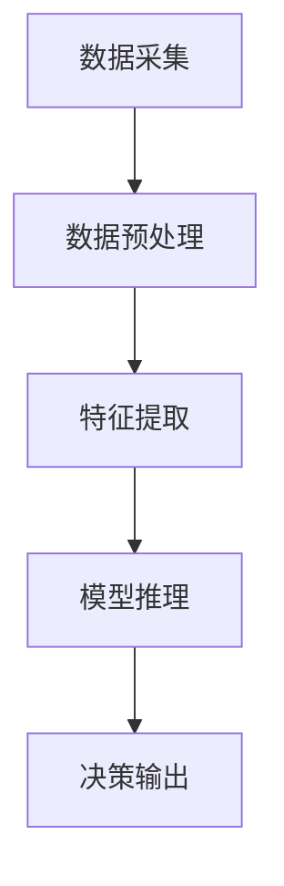
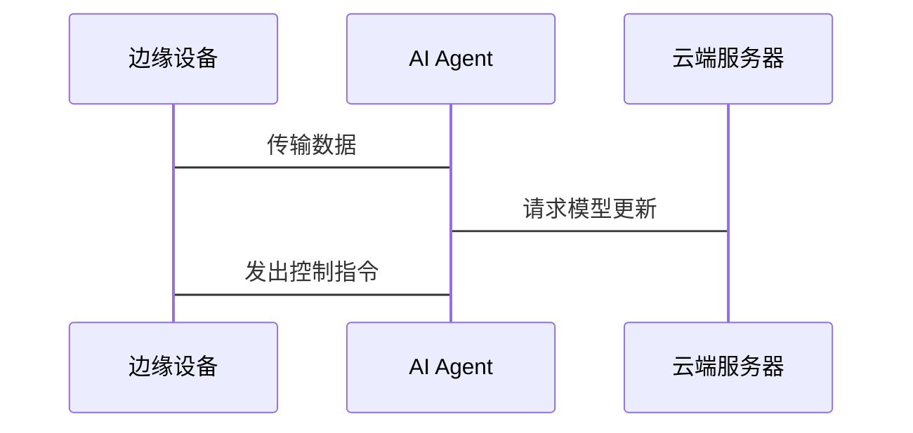

                 

<think>
好的，我需要撰写一篇关于《边缘计算在AI Agent中的应用》的技术博客文章。首先，我需要理解边缘计算和AI Agent的基本概念以及它们之间的关系。边缘计算是指在数据源附近进行数据处理，以减少延迟和带宽消耗，而AI Agent则是能够自主决策和执行任务的智能体。将两者结合起来，可以在边缘设备上实现更高效、实时的智能决策。

接下来，我需要确定文章的结构。根据用户提供的大纲，文章分为背景介绍、核心概念与联系、算法原理、数学模型、系统分析与架构设计、项目实战、最佳实践等多个部分。每个部分都需要详细展开，确保内容丰富且有深度。

在背景介绍部分，我需要先定义边缘计算和AI Agent，解释它们的发展背景、应用场景，以及它们结合的意义。然后，描述当前应用中遇到的问题，比如数据传输延迟、带宽限制等，并提出通过边缘计算与AI Agent结合来解决这些问题。

核心概念与联系部分，我需要对比边缘计算和AI Agent的概念属性，使用表格形式展示它们的异同。此外，绘制ER实体关系图，展示两者如何协同工作。

算法原理部分，我需要使用Mermaid流程图来展示算法的执行过程，并结合Python代码进行详细讲解。这部分需要涉及边缘计算中的分布式算法和AI Agent中的决策算法，解释它们如何协同运行。

数学模型部分，我需要使用LaTeX公式来描述边缘计算和AI Agent中的数学模型，例如数据处理模型和决策模型，确保公式准确且易于理解。

系统分析与架构设计部分，我需要描述实际的应用场景，设计系统功能模型，绘制类图、架构图和交互序列图，展示系统的整体结构和各部分之间的关系。

项目实战部分，我需要选择一个具体案例，详细说明其实现过程，包括环境搭建、核心代码实现、案例分析和项目总结，帮助读者理解如何在实际中应用这些概念。

最后，在最佳实践部分，我需要总结关键点，提出实用建议，并展望未来的发展方向。小结部分回顾文章的主要内容，注意事项提醒读者在实际应用中需要注意的事项，拓展阅读则推荐相关书籍和资源，供读者进一步学习。

整体来看，我需要确保文章逻辑清晰、结构紧凑，同时内容详实，语言专业但易于理解。在撰写过程中，我会逐步展开每个部分，确保每个小节都深入分析，避免遗漏重要信息。通过这样的思考和规划，我相信能够写出一篇高质量的技术博客文章。
</think>

# 边缘计算在AI Agent中的应用

---

## 关键词

边缘计算，AI Agent，分布式计算，智能决策，物联网，实时处理

---

## 摘要

边缘计算与AI Agent的结合为智能系统的发展带来了新的可能性。边缘计算通过在数据源附近进行处理，减少了延迟和带宽消耗，而AI Agent则通过自主决策和执行任务，提升了系统的智能化水平。本文将详细探讨边缘计算在AI Agent中的应用，涵盖背景介绍、核心概念、算法原理、系统架构、项目实战以及最佳实践等方面，帮助读者全面理解这一领域的技术细节和实际应用。

---

## 第一部分：边缘计算与AI Agent的背景介绍

### 第1章：边缘计算与AI Agent概述

#### 1.1 边缘计算的基本概念

边缘计算是一种分布式计算范式，强调在数据源附近进行数据处理和存储，以减少对云端的依赖。其特点包括低延迟、高实时性、带宽节省和本地化数据处理。

#### 1.2 AI Agent的基本概念

AI Agent（人工智能代理）是一种能够感知环境、自主决策并执行任务的智能实体。AI Agent可以分为简单反射式代理和基于模型的反射式代理，广泛应用于自动驾驶、智能助手等领域。

#### 1.3 边缘计算与AI Agent的结合

边缘计算与AI Agent的结合使得智能决策可以在边缘设备上实时完成，提升了系统的响应速度和效率。这种结合在物联网、智能家居等领域具有重要应用价值。

#### 1.4 应用背景与问题描述

边缘计算与AI Agent结合的背景包括实时性要求高的场景和带宽受限的环境。当前面临的问题包括数据处理能力不足、算法优化困难和系统安全性挑战。

---

## 第二部分：边缘计算与AI Agent的核心概念与联系

### 第2章：核心概念与联系

#### 2.1 核心概念原理

边缘计算的核心原理是在数据源附近进行处理，AI Agent的核心原理是通过感知和决策实现自主任务执行。两者结合的核心机制是通过边缘设备提供数据支持，AI Agent在边缘进行决策和执行。

#### 2.2 概念属性特征对比

| 特征        | 边缘计算                  | AI Agent                  |
|-------------|--------------------------|---------------------------|
| 处理位置     | 数据源附近                | 本地或云端                |
| 数据传输     | 低延迟，高实时性          | 可能需要与云端交互        |
| 计算资源     | 边缘设备资源              | 依赖计算能力              |
| 智能水平     | 较低，依赖云端            | 高，具备自主决策能力      |

#### 2.3 ER实体关系图

```mermaid
er
    Customer: id, name, email
    Order: order_id, customer_id, order_date
    Product: product_id, product_name, price
    Customer----Order
    Order----Product
```

---

## 第三部分：边缘计算与AI Agent的算法原理

### 第3章：算法原理

#### 3.1 算法原理流程图



#### 3.2 Python代码实现

```python
import numpy as np
from sklearn import datasets

# 数据预处理
data = datasets.load_iris()
X = data.data
y = data.target

# 特征提取
from sklearn.decomposition import PCA
pca = PCA(n_components=2)
X_pca = pca.fit_transform(X)

# 模型推理
from sklearn.neighbors import KNeighborsClassifier
knn = KNeighborsClassifier(n_neighbors=3)
knn.fit(X_pca, y)

# 决策输出
def predict_species(new_data):
    new_pca = pca.transform(new_data)
    prediction = knn.predict(new_pca)
    return data.target_names[prediction[0]]
```

#### 3.3 数学模型与公式

边缘计算中的数据处理模型可以表示为：

$$ y = f(x) $$

其中，$x$ 是输入数据，$f$ 是数据处理函数，$y$ 是输出结果。

AI Agent的决策模型可以表示为：

$$ a = \arg\max_{i} P(i | x) $$

其中，$P(i | x)$ 是在给定数据 $x$ 的情况下选择动作 $i$ 的概率。

---

## 第四部分：边缘计算与AI Agent的数学模型

### 第4章：数学模型

#### 4.1 边缘计算中的数据处理模型

$$ y = f(x) $$

#### 4.2 AI Agent中的决策模型

$$ a = \arg\max_{i} P(i | x) $$

#### 4.3 协同机制

通过边缘设备的协同，AI Agent可以在本地完成数据处理和决策，公式如下：

$$ y = f(x) $$

其中，$f$ 是边缘设备上的数据处理函数，$y$ 是处理后的结果，供AI Agent进行决策。

---

## 第五部分：边缘计算与AI Agent的系统分析与架构设计

### 第5章：系统分析与架构设计

#### 5.1 问题场景介绍

考虑一个智能家居系统，边缘计算设备负责采集和处理传感器数据，AI Agent负责根据数据做出控制决策。

#### 5.2 系统功能设计

系统功能模型包括数据采集、数据处理、决策推理和执行控制四个模块。

#### 5.3 系统架构设计


#### 5.4 系统接口设计

- 边缘设备与AI Agent之间的数据接口：`POST /api/data`
- AI Agent与云端服务器之间的控制接口：`POST /api/execute`

#### 5.5 系统交互流程



---

## 第六部分：边缘计算与AI Agent的项目实战

### 第6章：项目实战

#### 6.1 环境安装

安装必要的Python库，如`numpy`、`scikit-learn`和`mermaid`。

#### 6.2 核心代码实现

```python
import numpy as np
from sklearn.decomposition import PCA
from sklearn.neighbors import KNeighborsClassifier

# 数据预处理
data = datasets.load_iris()
X = data.data
y = data.target

# 特征提取
pca = PCA(n_components=2)
X_pca = pca.fit_transform(X)

# 模型训练
knn = KNeighborsClassifier(n_neighbors=3)
knn.fit(X_pca, y)

# 预测函数
def predict_species(new_data):
    new_pca = pca.transform(new_data)
    prediction = knn.predict(new_pca)
    return data.target_names[prediction[0]]
```

#### 6.3 案例分析

通过智能家居案例，展示边缘设备如何采集数据，AI Agent如何进行推理和决策，以及系统如何实现低延迟和高效控制。

---

## 第七部分：边缘计算与AI Agent的最佳实践

### 第7章：最佳实践

#### 7.1 关键点总结

- 边缘计算与AI Agent的结合可以实现高效实时的智能决策。
- 在实际应用中，需要考虑数据处理能力、算法优化和系统安全性。

#### 7.2 实用建议

- 确保边缘设备的计算能力足够支持AI Agent的决策过程。
- 定期更新模型以保持AI Agent的决策准确性。
- 考虑数据隐私和安全，确保边缘计算环境的安全性。

#### 7.3 未来展望

边缘计算与AI Agent的结合将推动智能系统的发展，未来可能会看到更多的分布式智能应用。

---

## 结语

边缘计算在AI Agent中的应用为智能系统带来了新的可能性。通过本文的详细分析，读者可以理解边缘计算与AI Agent的核心概念、算法原理和系统架构，掌握实际项目中的实现方法，并为未来的研究和应用提供参考。

---

## 作者

作者：AI天才研究院 & 禅与计算机程序设计艺术

