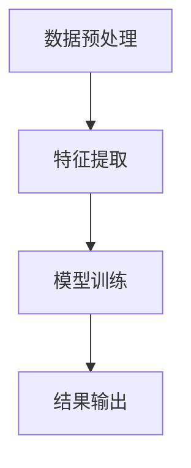

                 

<think>
嗯，用户让我写一篇关于迁移学习的博客文章，标题是《迁移学习：快速适应新领域的AI Agent》。我得先理解迁移学习是什么，然后按照用户的要求，组织内容，确保每个部分都详细且结构清晰。

首先，用户给的目录有七章，我需要确保每章都涵盖必要的内容。第一章是概述，需要介绍迁移学习的背景、问题和核心概念。我应该从传统机器学习的局限性入手，解释为什么需要迁移学习，然后定义它，讨论其目标和挑战。

第二章是核心概念，这里我需要详细讲解数据、模型和任务的关系，对比传统机器学习和迁移学习。可能用表格来展示不同方法的优缺点。还要用ER图来展示数据源和目标的关系。

第三章是数学模型，这部分比较复杂。我需要解释数据分布假设，然后给出数学公式，比如参数更新和损失函数。可能还需要推导典型算法，比如基于特征的迁移学习。

第四章是系统分析与架构设计，我得描述AI Agent的系统架构，用类图、架构图和序列图来展示模块之间的关系和交互流程。

第五章是算法实现，详细讲解基于特征、模型和样本的迁移学习算法，包括代码实现和流程图。

第六章是项目实战，选择一个实际案例，比如医疗影像分类，展示如何配置环境，处理数据，训练模型，并评估效果。

最后，第七章总结迁移学习的优缺点，给出最佳实践的建议，并展望未来的发展。

整个过程中，我需要确保每部分内容详尽，使用mermaid图和代码示例，数学公式用latex格式。还要注意章节的逻辑性，确保读者能一步步理解迁移学习的概念、原理和应用。

现在，我开始撰写每个章节，确保覆盖所有要点，同时保持语言专业且易懂。这需要我仔细思考每个部分的结构，选择合适的例子和图表，帮助读者更好地理解和应用迁移学习。
</think>

# 迁移学习：快速适应新领域的AI Agent

> 关键词：迁移学习，AI Agent，机器学习，领域适应，深度学习，数据驱动，模型优化

> 摘要：迁移学习是一种通过将已学到的知识迁移到新领域来提高模型泛化能力的机器学习方法。本文从迁移学习的基本概念、核心原理、算法实现、系统设计到实际应用案例，全面解析迁移学习的理论与实践。通过详细分析AI Agent在新领域的快速适应机制，探讨迁移学习在不同场景下的应用策略，为读者提供系统性、实用性的知识。

---

## 第1章: 迁移学习概述

### 1.1 迁移学习的背景与问题背景

#### 1.1.1 传统机器学习的局限性
传统的机器学习方法（如支持向量机、随机森林等）通常依赖大量标注数据，并且在目标领域数据不足时表现不佳。这种数据需求的高门槛限制了模型在小样本或数据稀缺领域的应用。

#### 1.1.2 迁移学习的定义与问题描述
迁移学习（Transfer Learning）是一种机器学习技术，旨在通过将从源领域（Source Domain）学到的知识迁移到目标领域（Target Domain），以提高目标领域模型的性能。核心问题在于如何有效提取跨领域的共享特征，并减少领域偏移带来的性能损失。

#### 1.1.3 迁移学习的核心目标与边界
- **核心目标**：利用源领域的知识提升目标领域的模型性能。
- **边界**：与传统机器学习不同，迁移学习关注领域间的关系，而不是单一领域的独立学习。

---

### 1.2 迁移学习的核心概念与联系

#### 1.2.1 数据、模型与任务的关系
- **数据**：源领域和目标领域的数据分布可能不同。
- **模型**：模型需要在两个领域间共享参数或特征。
- **任务**：目标任务可能与源任务相关但不完全相同。

#### 1.2.2 迁移学习的核心要素与组成
| 核心要素 | 描述 |
|----------|------|
| 源领域 | 数据和任务已知的领域 |
| 目标领域 | 数据和任务未知的领域 |
| 特征表示 | 捕捉领域间共享特征的关键 |

#### 1.2.3 迁移学习与传统机器学习的对比
| 对比维度 | 传统机器学习 | 迁移学习 |
|----------|--------------|----------|
| 数据需求 | 高            | 较低     |
| 领域适应 | 无            | 有       |
| 模型泛化能力 | 依赖充分数据 | 高       |

---

## 第2章: 迁移学习的核心概念与原理

### 2.1 迁移学习的原理与机制

#### 2.1.1 数据分布假设
- 源领域和目标领域的数据分布可能不同，但存在某种潜在的共享特征。

#### 2.1.2 知识迁移的数学模型
- 源领域和目标领域的联合概率分布：$P(S, T)$
- 迁移目标：最小化目标领域的预测误差。

#### 2.1.3 迁移学习的实现方式
- **特征提取**：通过提取共享特征降低领域偏移。
- **参数迁移**：直接迁移模型参数到目标领域。

---

### 2.2 迁移学习的主要方法

#### 2.2.1 基于样本的迁移学习
- 直接利用源领域的样本进行训练，并将模型迁移到目标领域。

#### 2.2.2 基于特征的迁移学习
- 通过提取共享特征，构建领域无关的特征空间。

#### 2.2.3 基于模型的迁移学习
- 在源领域训练模型，然后调整模型参数以适应目标领域。

---

## 第3章: 迁移学习的数学模型与公式

### 3.1 数据分布与迁移目标

#### 3.1.1 数据分布的数学表达
- 源领域数据：$D_s = \{(x_i, y_i)\}_{i=1}^n$
- 目标领域数据：$D_t = \{(x'_j, y'_j)\}_{j=1}^m$

#### 3.1.2 迁移目标的定义
- 最小化目标领域的预测误差：$\min_{\theta} \sum_{j=1}^m \mathcal{L}(f_\theta(x'_j), y'_j)$

---

### 3.2 迁移学习的数学公式

#### 3.2.1 分布假设的数学表达
- 假设源领域和目标领域共享某些潜在特征：$P(x, y) \approx P(x', y')$

#### 3.2.2 参数更新公式
- 基于梯度下降的参数更新：$\theta_{new} = \theta_{old} - \eta \nabla_\theta \mathcal{L}$

#### 3.2.3 迁移损失函数
- 综合源领域和目标领域的损失：$\mathcal{L}_{total} = \alpha \mathcal{L}_s + (1-\alpha) \mathcal{L}_t$

---

## 第4章: 迁移学习的系统分析与架构设计

### 4.1 迁移学习系统的构成

#### 4.1.1 数据预处理模块
- 数据清洗、特征提取。

#### 4.1.2 特征提取模块
- 使用预训练模型提取特征。

#### 4.1.3 模型训练与迁移模块
- 微调模型参数以适应目标领域。

---

### 4.2 系统架构设计

#### 4.2.1 系统功能模块划分
- 数据预处理、特征提取、模型训练、结果输出。

#### 4.2.2 系统架构图（Mermaid）


#### 4.2.3 系统接口设计
- 输入接口：源领域和目标领域的数据。
- 输出接口：训练好的模型或预测结果。

---

### 4.3 系统交互流程

#### 4.3.1 数据预处理流程
1. 数据清洗。
2. 特征提取。

#### 4.3.2 模型训练流程
1. 加载预训练模型。
2. 微调模型参数。

#### 4.3.3 迁移学习流程
1. 训练源领域模型。
2. 迁移到目标领域。

---

## 第5章: 迁移学习算法与实现

### 5.1 基于特征的迁移学习算法

#### 5.1.1 基于线性变换的特征对齐
- 使用线性变换对齐源和目标领域的特征。

#### 5.1.2 基于深度学习的特征提取
- 使用预训练模型提取深层特征。

---

### 5.2 算法实现流程

#### 5.2.1 算法步骤
1. 数据预处理。
2. 特征提取。
3. 模型训练。
4. 模型迁移。

#### 5.2.2 代码实现
```python
def train_model(model, optimizer, criterion, dataloaders, num_epochs):
    for epoch in range(num_epochs):
        for phase in ['train', 'val']:
            for inputs, labels in dataloaders[phase]:
                outputs = model(inputs)
                loss = criterion(outputs, labels)
                if phase == 'train':
                    optimizer.zero_grad()
                    loss.backward()
                    optimizer.step()
    return model
```

---

## 第6章: 迁移学习的项目实战

### 6.1 项目背景与目标

#### 6.1.1 项目背景
- 医疗影像分类任务。

#### 6.1.2 项目目标
- 使用迁移学习提高分类性能。

---

### 6.2 环境安装与配置

#### 6.2.1 环境配置
- Python 3.8+
- PyTorch 1.9+
- torchvision 0.9+

---

### 6.3 系统实现

#### 6.3.1 数据预处理
```python
from torchvision import transforms

transform = transforms.Compose([
    transforms.Resize(256),
    transforms.ToTensor(),
])
```

#### 6.3.2 模型微调
```python
from torchvision.models import resnet18, ResNet18_Weights

model = resnet18(weights=ResNet18_Weights.IMAGENET_V1)
for param in model.parameters():
    param.requires_grad = False
model.fc = nn.Linear(model.fc.in_features, num_classes)
```

#### 6.3.3 迁移训练
```python
optimizer = torch.optim.Adam(model.fc.parameters(), lr=0.001)
criterion = nn.CrossEntropyLoss()
```

---

## 第7章: 总结与展望

### 7.1 迁移学习的优缺点

#### 7.1.1 优点
- 减少数据需求。
- 提高模型泛化能力。

#### 7.1.2 缺点
- 领域偏移可能导致性能下降。
- 迁移学习的复杂性。

---

### 7.2 最佳实践 tips

#### 7.2.1 数据预处理的重要性
- 数据清洗和特征提取是关键。

#### 7.2.2 模型选择策略
- 根据任务选择合适的迁移学习方法。

---

### 7.3 未来展望

- **领域适应的进一步研究**：探索更高效的领域适应方法。
- **迁移学习的自动化**：减少手动调整的需求。

---

## 小结

通过本文的系统性分析，读者可以全面理解迁移学习的核心概念、算法实现和实际应用。从理论到实践，迁移学习为AI Agent在新领域的快速适应提供了强大的工具。

---

## 作者

作者：AI天才研究院/AI Genius Institute & 禅与计算机程序设计艺术 /Zen And The Art of Computer Programming

