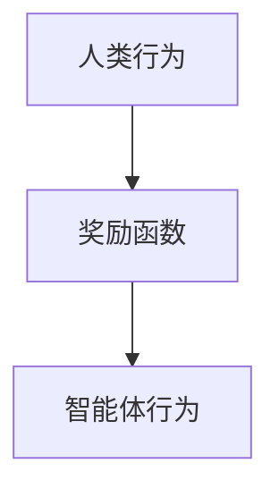
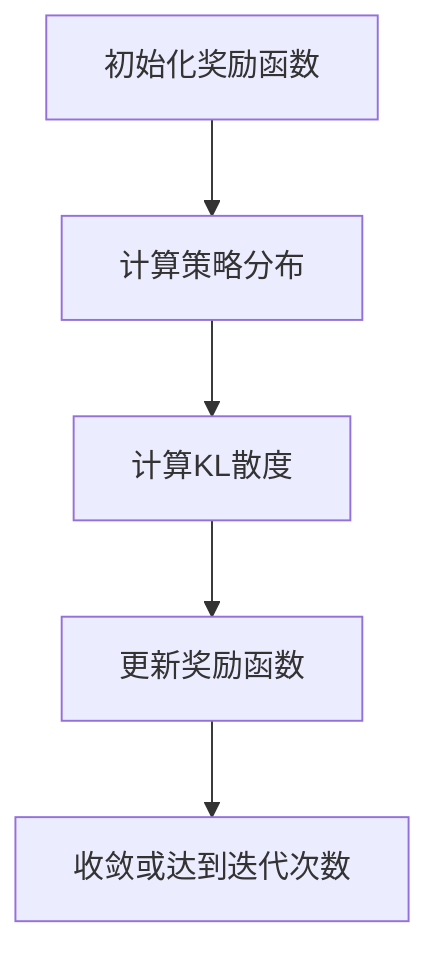
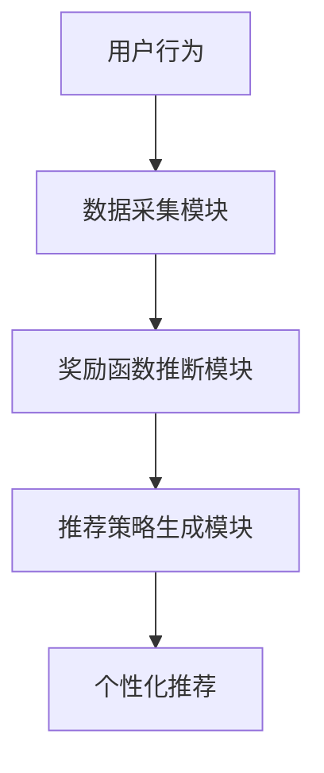

                 


# 逆强化学习：理解人类偏好的AI Agent

> 关键词：逆强化学习、人工智能、偏好建模、智能体、强化学习

> 摘要：逆强化学习（Inverse Reinforcement Learning，IRL）是一种通过观察人类行为来推断其偏好和目标的机器学习方法。本文将详细探讨逆强化学习的核心概念、算法原理、系统设计、项目实战及最佳实践，帮助读者理解如何构建能够理解人类偏好的AI代理。

---

## 第一部分：引言

### 第1章：逆强化学习概述

#### 1.1 逆强化学习的背景与意义

逆强化学习（IRL）是人工智能领域中的一个重要分支，旨在通过观察人类行为，推断出其背后的奖励函数或偏好。传统的强化学习（Reinforcement Learning，RL）通过设计奖励函数来训练智能体，使其在与环境的交互中不断优化行为以获得最大奖励。然而，这种方法需要人工设计奖励函数，这在复杂场景中往往非常困难。

逆强化学习则反其道而行之，通过观察人类的行为轨迹，推断出奖励函数。这种方法在人机协作、机器人控制、自动驾驶等领域具有重要的应用潜力，因为它能够帮助AI代理更好地理解人类的偏好和意图。

#### 1.2 问题背景与描述

在许多实际场景中，人类的决策过程往往受到复杂因素的影响，难以直接编码为明确的规则或奖励函数。例如，在医疗领域，医生的决策可能基于患者的病情、经验以及其他难以量化的因素。通过逆强化学习，我们可以从医生的决策轨迹中推断出其背后的奖励函数，从而帮助AI代理更好地辅助医生进行诊断。

逆强化学习的核心问题可以归结为：如何从有限的行为轨迹中推断出奖励函数，并利用这个奖励函数来指导智能体的行为。这涉及到多个方面的挑战，包括如何处理数据的稀缺性、如何避免过拟合、如何处理高维状态空间等。

#### 1.3 研究意义与应用前景

逆强化学习的研究意义主要体现在以下几个方面：

1. **人机协作**：通过理解人类的偏好，AI代理可以更好地与人类协作，提供更个性化的服务。
2. **复杂决策支持**：在自动驾驶、机器人控制等领域，逆强化学习可以帮助AI代理在复杂环境中做出更符合人类期望的决策。
3. **个性化推荐**：通过分析用户的交互行为，逆强化学习可以推断出用户的偏好，从而提供更精准的推荐服务。

---

## 第二部分：核心概念与联系

### 第2章：逆强化学习的核心概念

#### 2.1 奖励函数的定义与属性

奖励函数（Reward Function）是强化学习中的核心概念，用于衡量智能体在某一状态下采取某个动作的价值。它通常被定义为一个函数 \( R(s, a) \)，其中 \( s \) 是状态，\( a \) 是动作，输出是一个标量值。

奖励函数具有以下属性：

1. **即时性**：奖励函数只依赖于当前的状态和动作，而不考虑历史信息。
2. **标量性**：奖励函数的输出是一个标量值，而不是一个向量或其他复杂结构。
3. **可变性**：在不同的应用场景中，奖励函数的形式和参数可以发生变化。

#### 2.2 逆强化学习与强化学习的关系

逆强化学习与强化学习是两种相反但互补的方法。在强化学习中，智能体通过与环境交互，学习如何选择动作以最大化累计奖励；而在逆强化学习中，智能体的目标是通过观察人类的行为轨迹，推断出人类的奖励函数。

以下是强化学习和逆强化学习的对比：

| 对比维度 | 强化学习 | 逆强化学习 |
|----------|----------|------------|
| 输入 | 状态和动作 | 行为轨迹 |
| 输出 | 策略 | 奖励函数 |
| 目标 | 学习策略以最大化奖励 | 从行为中推断奖励函数 |

（ER实体关系图）



---

## 第三部分：算法原理讲解

### 第3章：逆强化学习的核心算法

#### 3.1 最大熵逆强化学习

最大熵逆强化学习（Max-Entropy Inverse Reinforcement Learning）是一种基于最大熵原理的逆强化学习方法。其核心思想是，在给定的行为轨迹下，选择能够使轨迹概率最大的奖励函数。

##### 3.1.1 算法原理

最大熵逆强化学习的目标是最小化以下损失函数：

$$
\mathcal{L} = -\sum_{t=1}^{T} \log p(a_t|s_t) + \lambda \cdot \text{KL}(p||q)
$$

其中，\( p(a|s) \) 是基于当前奖励函数的策略分布，\( q(a|s) \) 是行为轨迹的分布，\( \text{KL} \) 是Kullback-Leibler散度，\( \lambda \) 是调节参数。

##### 3.1.2 算法流程图



---

## 第四部分：系统分析与架构设计

### 第4章：逆强化学习系统设计

#### 4.1 项目介绍

本节将通过一个实际项目——“基于IRL的推荐系统”来展示逆强化学习的应用。该系统旨在通过分析用户的交互行为，推断出用户的偏好，并为用户提供个性化的推荐。

#### 4.2 系统功能设计

系统功能设计可以分为以下几个模块：

- **数据采集模块**：收集用户的行为轨迹，包括点击、购买等。
- **奖励函数推断模块**：基于收集的数据，推断出用户的奖励函数。
- **推荐策略生成模块**：根据推断出的奖励函数，生成推荐策略。

系统功能模块图如下：



---

## 第五部分：项目实战

### 第5章：基于IRL的推荐系统实现

#### 5.1 环境安装

要实现基于IRL的推荐系统，首先需要安装以下环境：

1. **Python 3.8+**
2. **TensorFlow或PyTorch**
3. **Mermaid工具**

#### 5.2 核心代码实现

以下是基于最大熵逆强化学习的推荐系统代码示例：

```python
import numpy as np
import tensorflow as tf

# 定义奖励函数
def reward_function(states, actions):
    return np.dot(states, actions)

# 初始化奖励函数参数
theta = tf.Variable(tf.random.truncated_normal([n_states, n_actions], mean=0.0, stddev=1.0))

# 定义损失函数
def loss(theta, states, actions):
    predicted_rewards = reward_function(states, theta)
    actual_rewards = get_true_rewards(states, actions)
    return tf.reduce_mean(tf.square(predicted_rewards - actual_rewards))

# 定义优化器
optimizer = tf.optimizers.Adam(learning_rate=0.01)

# 训练过程
for _ in range(1000):
    states = get_states()
    actions = get_actions()
    loss_value = loss(theta, states, actions)
    optimizer.minimize(loss_value, var_list=[theta])
```

#### 5.3 代码应用解读与分析

上述代码实现了基于梯度下降的最大熵逆强化学习算法。首先定义奖励函数，然后初始化奖励函数的参数，接着定义损失函数并使用Adam优化器进行训练。通过不断迭代，模型能够学习到能够解释用户行为的奖励函数。

#### 5.4 实际案例分析

假设我们有一个电商推荐系统，用户的行为数据包括点击、加购和购买。通过逆强化学习，我们可以推断出用户的偏好，例如用户更倾向于购买高性价比的商品。推荐系统可以根据推断出的偏好，为用户推荐相关商品。

---

## 第六部分：最佳实践

### 第6章：逆强化学习的注意事项与小结

#### 6.1 最佳实践 Tips

1. **数据质量**：确保行为轨迹数据的多样性和代表性，避免数据偏差。
2. **算法选择**：根据具体场景选择合适的逆强化学习算法，例如在处理高维状态空间时，可以采用基于最大熵的方法。
3. **模型解释性**：逆强化学习模型的解释性往往较差，可以通过可视化工具（如Mermaid图）来增强可解释性。

#### 6.2 项目小结

通过本文的讲解和实战，我们了解了逆强化学习的基本概念、算法原理和系统设计。逆强化学习在理解人类偏好、提升人机协作等方面具有重要的应用价值。

---

## 第七部分：结论

### 第7章：逆强化学习的未来展望

逆强化学习作为人工智能领域的重要研究方向，未来将在以下几个方面取得进一步的发展：

1. **多智能体协作**：研究如何在多智能体环境中应用逆强化学习，提升协作效率。
2. **实时推理**：探索逆强化学习在实时决策中的应用，例如实时推荐系统。
3. **跨领域应用**：将逆强化学习技术扩展到更多领域，如医疗、教育等。

---

## 作者信息

作者：AI天才研究院/AI Genius Institute & 禅与计算机程序设计艺术 /Zen And The Art of Computer Programming

---

通过本文的详细讲解，我们希望读者能够深入理解逆强化学习的核心思想和实际应用，为构建能够理解人类偏好的AI代理奠定基础。

