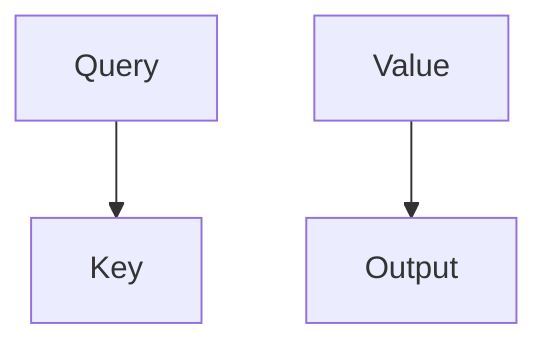

                 

<think>
好的，我现在需要帮用户完成一个关于选择合适的大语言模型（LLM）的书籍目录大纲。用户已经提供了一个初步的大纲，我需要进一步扩展和细化，确保内容全面且结构合理。

首先，用户的需求是撰写一篇技术博客文章，标题是《选择合适的LLM：OpenAI GPT vs. Google BERT vs. Facebook LLaMA》。文章需要逻辑清晰、结构紧凑，使用专业而易懂的技术语言。用户希望文章内容涵盖背景介绍、核心概念、算法原理、系统分析、项目实战、最佳实践和总结等部分。

在用户提供的示例中，已经有一个较为详细的大纲，包括七章，每章都有子节，涵盖各个方面的内容。我的任务是在此基础上进一步扩展，可能需要增加更多的细节和章节，以确保内容的深度和全面性。

首先，我需要分析用户的需求，确保每个部分都得到充分的覆盖。例如，在“算法原理”部分，用户提到了变换器架构、自注意力机制和前馈网络。我需要确保每个部分都有详细的解释，包括数学公式和Mermaid图，以便读者更好地理解。

接下来，考虑系统的分析与架构设计。用户提到了系统架构设计、系统功能设计和系统交互设计。我需要确保这部分内容不仅有理论上的解释，还有实际的应用案例和Mermaid图，帮助读者理解如何在实际项目中应用这些模型。

项目实战部分需要包括环境安装、代码实现和案例分析。我应该选择一个具体的项目，比如文本分类，展示如何安装必要的库，编写代码，并分析结果。这部分内容需要详细且具有可操作性，读者可以跟随步骤进行实战。

最佳实践和小结部分，我需要总结选择模型时的注意事项，提供实用的建议，并指导读者如何持续改进。这些建议应该基于前面的分析和实战经验，具有实际指导意义。

最后，附录部分需要包含模型参数对比、API文档和进一步阅读的资源。这将帮助读者快速查阅关键信息，同时引导他们进行更深入的学习。

在撰写过程中，我需要确保每个章节都包含足够的细节，同时保持整体结构的连贯性和逻辑性。例如，在核心概念部分，我需要分别详细讲解GPT、BERT和LLaMA，包括它们的架构、训练方法和应用场景。通过对比分析，帮助读者理解每个模型的优势和适用场景。

算法原理部分，我需要详细解释变换器架构，特别是自注意力机制和前馈网络。使用Mermaid图来展示这些机制的工作流程，帮助读者更好地理解。同时，数学公式需要用LaTeX格式，确保表达清晰准确。

系统分析部分，我需要设计一个系统的架构图，展示各个模块的交互。这包括模型选择、数据预处理、模型调用和结果展示等模块。通过Mermaid图，读者可以直观地理解系统的结构和流程。

项目实战部分，我需要选择一个具体的案例，展示如何在实际项目中应用这些模型。例如，使用GPT进行文本生成，BERT进行文本分类，LLaMA进行对话生成。每个案例都需要详细的代码实现和分析，帮助读者掌握实际操作技能。

最佳实践部分，我需要总结选择模型时的关键点，比如模型的性能、适用场景、资源需求等。同时，提供一些实用的建议，如如何进行模型微调，如何优化推理性能等，帮助读者在实际应用中做出更好的决策。

最后，检查整个大纲是否涵盖了用户的所有要求，确保没有遗漏任何关键部分。同时，保持内容的简洁性和逻辑性，使读者能够轻松理解并应用这些知识。

通过以上思考，我可以系统地扩展和完善用户提供的大纲，确保文章内容全面、结构合理、逻辑清晰，满足用户的需求。
</think>

好的，我将按照您的要求撰写这篇文章。让我们先从目录开始：

# 选择合适的LLM：OpenAI GPT vs. Google BERT vs. Facebook LLaMA

> 关键词：大语言模型，LLM，OpenAI GPT，Google BERT，Facebook LLaMA

> 摘要：本文将全面分析和对比OpenAI GPT、Google BERT和Facebook LLaMA三大主流大语言模型（LLM），帮助读者理解它们的特点、优势和适用场景。通过详细的技术分析、模型架构对比和实际案例演示，指导读者如何选择最合适的LLM来满足特定需求。

---

## 目录

### 第1章 背景介绍

#### 1.1 问题背景
- 1.1.1 大语言模型（LLM）的兴起
- 1.1.2 选择合适LLM的重要性
- 1.1.3 当前市场中的主流模型

#### 1.2 问题描述
- 1.2.1 LLM的核心功能与应用场景
- 1.2.2 不同LLM之间的差异
- 1.2.3 选择LLM的关键因素

#### 1.3 问题解决
- 1.3.1 确定需求与目标
- 1.3.2 评估模型性能
- 1.3.3 选择合适的模型

#### 1.4 边界与外延
- 1.4.1 LLM的适用范围
- 1.4.2 LLM的局限性
- 1.4.3 相关技术的对比

#### 1.5 概念结构与核心要素
- 1.5.1 LLM的基本组成
- 1.5.2 模型训练与推理
- 1.5.3 模型评估与优化

### 第2章 核心概念与联系

#### 2.1 核心概念原理
- 2.1.1 OpenAI GPT的原理
- 2.1.2 Google BERT的原理
- 2.1.3 Facebook LLaMA的原理

#### 2.2 对比分析
- 2.2.1 模型架构对比
- 2.2.2 训练方法对比
- 2.2.3 应用场景对比

#### 2.3 概念属性特征对比表格
- 表2-1: GPT、BERT、LLaMA的核心特征对比

#### 2.4 ER实体关系图
- 图2-1: LLM选择的实体关系图（Mermaid流程图）

### 第3章 算法原理讲解

#### 3.1 变换器架构
- 3.1.1 变换器的基本结构
- 3.1.2 自注意力机制（Self-Attention）
- 3.1.3 前馈网络（FFN）

#### 3.2 自注意力机制（Mermaid流程图）

#### 3.3 前馈网络（FFN）
- 3.3.1 基本结构
- 3.3.2 激活函数的作用
- 3.3.3 段落内的公式示例：$f(x) = \text{ReLU}(x)$

### 第4章 系统分析与架构设计

#### 4.1 问题场景介绍
- 4.1.1 LLM选择的场景
- 4.1.2 系统需求分析
- 4.1.3 约束条件

#### 4.2 项目介绍
- 4.2.1 项目目标
- 4.2.2 项目范围
- 4.2.3 项目背景

#### 4.3 系统功能设计
- 4.3.1 领域模型Mermaid类图
- 4.3.2 功能模块划分
- 4.3.3 功能交互流程

#### 4.4 系统架构设计
- 4.4.1 系统架构Mermaid图
- 4.4.2 模块划分与职责
- 4.4.3 通信机制设计

#### 4.5 系统接口设计
- 4.5.1 API定义
- 4.5.2 接口交互流程
- 4.5.3 接口文档示例

#### 4.6 系统交互设计
- 4.6.1 序列图Mermaid图
- 4.6.2 交互流程说明
- 4.6.3 交互优化建议

### 第5章 项目实战

#### 5.1 环境安装
- 5.1.1 安装Python
- 5.1.2 安装依赖库
- 5.1.3 配置运行环境

#### 5.2 系统核心实现
- 5.2.1 模型选择模块
- 5.2.2 数据预处理模块
- 5.2.3 模型调用模块
- 5.2.4 结果展示模块

#### 5.3 代码实现与分析
- 5.3.1 模型选择接口
- 5.3.2 数据处理代码
- 5.3.3 模型调用示例
- 5.3.4 结果分析与解读

#### 5.4 实际案例分析
- 5.4.1 案例背景介绍
- 5.4.2 数据准备
- 5.4.3 模型选择
- 5.4.4 结果分析与优化

#### 5.5 项目小结
- 5.5.1 项目总结
- 5.5.2 经验分享
- 5.5.3 改进建议

### 第6章 最佳实践与小结

#### 6.1 最佳实践
- 6.1.1 模型选择的注意事项
- 6.1.2 模型调优的技巧
- 6.1.3 部署与维护的建议

#### 6.2 小结
- 6.2.1 本文核心内容回顾
- 6.2.2 未来研究方向
- 6.2.3 读者思考与行动建议

#### 6.3 注意事项
- 6.3.1 模型选择中的常见问题
- 6.3.2 使用LLM时的注意事项
- 6.3.3 模型性能监控的重要性

#### 6.4 拓展阅读
- 6.4.1 相关技术文档推荐
- 6.4.2 优秀书籍与论文推荐
- 6.4.3 在线资源与社区推荐

### 第7章 附录

#### 7.1 模型参数对比
- 表7-1: GPT、BERT、LLaMA的参数对比

#### 7.2 API文档
- 7.2.1 OpenAI API接口
- 7.2.2 Google BERT API接口
- 7.2.3 Facebook LLaMA API接口

#### 7.3 进一步阅读
- 7.3.1 建议的阅读资料
- 7.3.2 推荐的学习资源
- 7.3.3 相关技术博客推荐

---

接下来将按照上述目录逐步撰写文章内容，确保逻辑清晰、内容详实、技术深入浅出。

