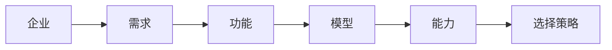
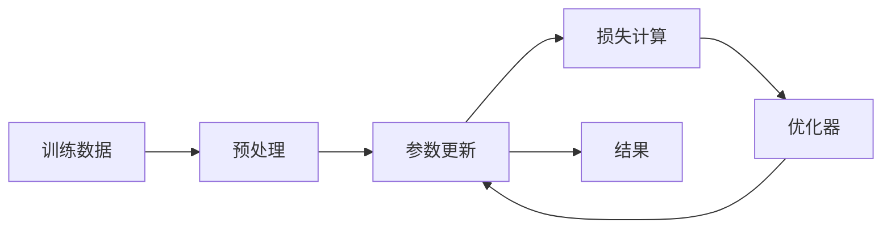
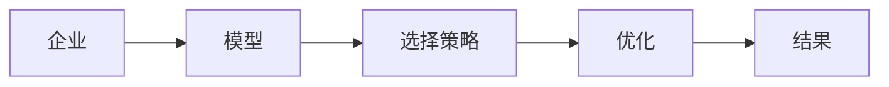

                 


# 选择适合企业的LLM大模型：考虑因素与决策框架

## 关键词：
- 大语言模型（LLM）
- 企业选择
- 决策框架
- 系统架构
- 数学模型

## 摘要：
随着人工智能技术的快速发展，大语言模型（LLM）在企业中的应用日益广泛。选择适合企业的LLM模型是企业智能化转型的关键一步。本文从背景介绍、核心概念、算法原理、系统架构、项目实战到最佳实践，全面分析企业选择LLM大模型的各个方面，为企业提供系统的决策框架和实践指导。

---

## 第一部分: 背景介绍与核心概念

### 第1章: 问题背景与问题描述

#### 1.1 问题背景
企业智能化转型是当前技术发展的主要趋势之一。随着大语言模型（LLM）的崛起，企业开始意识到LLM在提升效率、优化流程和增强用户体验方面的重要作用。然而，选择适合的LLM模型并非易事，需要考虑多方面的因素。

#### 1.2 问题描述
企业在选择LLM模型时，需要明确自身的需求场景，评估模型的能力，制定合适的选择策略。同时，企业还需要考虑模型的可扩展性、稳定性和成本效益。

### 第2章: 问题解决与核心要素

#### 2.1 问题解决框架
- **分析企业需求**：明确企业应用场景，确定核心需求。
- **评估LLM模型能力**：分析模型的性能、功能和适用性。
- **制定选择策略**：根据需求和模型能力，制定合适的决策框架。

#### 2.2 核心要素与边界
- **企业需求的边界**：明确需求的范围和限制。
- **LLM模型的能力边界**：了解模型的局限性和适用场景。
- **选择过程的边界**：设定选择过程中的关键节点和决策点。

#### 2.3 概念结构与核心要素
- **企业需求层次模型**：从基础需求到高级需求的层次结构。
- **LLM能力评估维度**：包括模型的准确率、响应速度、可解释性等。
- **选择框架的组成要素**：包括需求分析、模型评估、决策优化等。

---

## 第二部分: 核心概念与联系

### 第3章: LLM大模型的核心原理

#### 3.1 LLM的定义与技术特点
- **定义**：大语言模型是一种基于深度学习的自然语言处理模型，能够理解和生成人类语言。
- **技术特点**：
  - 基于Transformer架构。
  - 模型参数量大，训练数据丰富。
  - 具备上下文理解能力，支持多种任务。

#### 3.2 LLM的主要技术架构
- **基于Transformer的模型架构**：包括编码器和解码器，用于处理输入和生成输出。
- **模型的训练与推理流程**：从数据预处理到模型训练，再到最终的推理应用。
- **模型的可扩展性与灵活性**：支持多种任务，易于集成到企业系统中。

#### 3.3 LLM与企业需求的关联
- **企业需求的多样性**：不同企业对LLM的需求可能有所不同，例如客服自动化、内容生成等。
- **LLM能力的多样性**：模型支持多种任务，可以根据企业需求进行定制化开发。
- **两者匹配的逻辑关系**：通过需求分析和模型评估，找到最佳匹配点。

### 第4章: 核心概念对比与ER实体关系

#### 4.1 核心概念对比
- **企业需求维度对比**：从功能性、性能、成本等方面进行对比。
- **LLM模型能力对比**：从准确率、响应速度、可扩展性等方面进行对比。
- **选择框架维度对比**：从复杂度、成本、效果等方面进行对比。

#### 4.2 ER实体关系图


---

## 第三部分: 算法原理与数学模型

### 第5章: LLM的训练与推理算法

#### 5.1 算法原理
- **模型训练**：基于大规模数据集，使用Transformer架构进行预训练。
- **语言模型的损失函数**：交叉熵损失函数，用于衡量预测概率与真实概率的差异。
- **模型推理过程**：通过输入生成输出，支持多种任务，如文本生成、问答系统等。

#### 5.2 数学公式
- **交叉熵损失函数**：
  $$ \text{Loss} = -\sum_{i=1}^{n} y_i \log(p_i) $$
- **Adam优化器**：
  $$ \text{参数更新} = \text{学习率} \times \frac{\text{梯度}}{1 - \beta_1} $$

#### 5.3 模型训练流程图


---

## 第四部分: 系统分析与架构设计

### 第6章: 系统分析与架构设计方案

#### 6.1 问题场景介绍
企业需要选择适合的LLM模型，集成到现有系统中，提升业务效率。

#### 6.2 系统功能设计
- **领域模型类图**：
  ```mermaid
  classDiagram
      class 企业 {
          需求
          功能
          }
      class LLM模型 {
          能力
          参数
          }
      class 选择策略 {
          标准
          评估
          }
      企业 --> LLM模型: 需求匹配
      LLM模型 --> 选择策略: 能力评估
  ```

#### 6.3 系统架构设计
- **系统架构图**：
  ```mermaid
  graph LR
      C[企业] --> M[模型]
      M --> S[选择策略]
      S --> O[优化]
      O --> R[结果]
  ```

#### 6.4 系统接口设计
- **输入接口**：企业需求描述、模型参数配置。
- **输出接口**：模型评估结果、选择建议。

#### 6.5 系统交互流程图


---

## 第五部分: 项目实战与代码实现

### 第7章: 项目实战

#### 7.1 环境安装
- 安装必要的Python库：`transformers`, `torch`, `numpy`。

#### 7.2 系统核心实现源代码
```python
from transformers import AutoTokenizer, AutoModelForCausalLM
import torch

# 加载模型和分词器
model_name = "gpt2"
tokenizer = AutoTokenizer.from_pretrained(model_name)
model = AutoModelForCausalLM.from_pretrained(model_name)

# 定义生成函数
def generate_text(prompt, max_length=50):
    inputs = tokenizer.encode(prompt, return_tensors="pt")
    outputs = model.generate(inputs, max_length=max_length, do_sample=True)
    return tokenizer.decode(outputs[0], skip_special_tokens=True)

# 示例
prompt = "帮我写一封邮件，主题是..."
print(generate_text(prompt))
```

#### 7.3 代码应用解读与分析
- **生成函数**：根据输入的提示生成文本，支持多种场景。
- **模型选择**：可以根据需求更换模型名称，尝试不同的LLM模型。

#### 7.4 实际案例分析
- **案例分析**：在客服系统中使用LLM生成回复，提升用户体验。
- **代码解读**：通过具体案例展示模型的应用和优化过程。

#### 7.5 项目小结
通过实战项目，读者可以深入了解LLM模型的实现和应用，掌握模型选择的关键点。

---

## 第六部分: 最佳实践与总结

### 第8章: 最佳实践

#### 8.1 小结
- **选择模型的关键点**：明确需求、评估模型能力、制定选择策略。
- **注意事项**：关注模型的可扩展性、稳定性和成本效益。

#### 8.2 注意事项
- **模型的可扩展性**：确保模型能够适应企业未来的需求变化。
- **模型的稳定性**：选择可靠的模型，确保系统的稳定运行。
- **模型的成本效益**：在满足需求的前提下，选择成本最低的方案。

#### 8.3 未来趋势
- **多模态模型**：未来LLM将与图像、视频等多模态数据结合，提供更丰富的功能。
- **行业定制化**：模型将更加专业化，针对特定行业优化。

#### 8.4 拓展阅读
- 推荐书籍：《Deep Learning》、《Effective Python》。
- 推荐博客：技术博客、行业报告。

---

## 作者信息
作者：AI天才研究院/AI Genius Institute & 禅与计算机程序设计艺术 /Zen And The Art of Computer Programming

---

以上是文章的完整目录和内容概要，具体内容将按照上述结构详细展开，确保每部分都有丰富的细节和清晰的逻辑。

