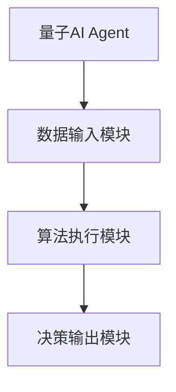
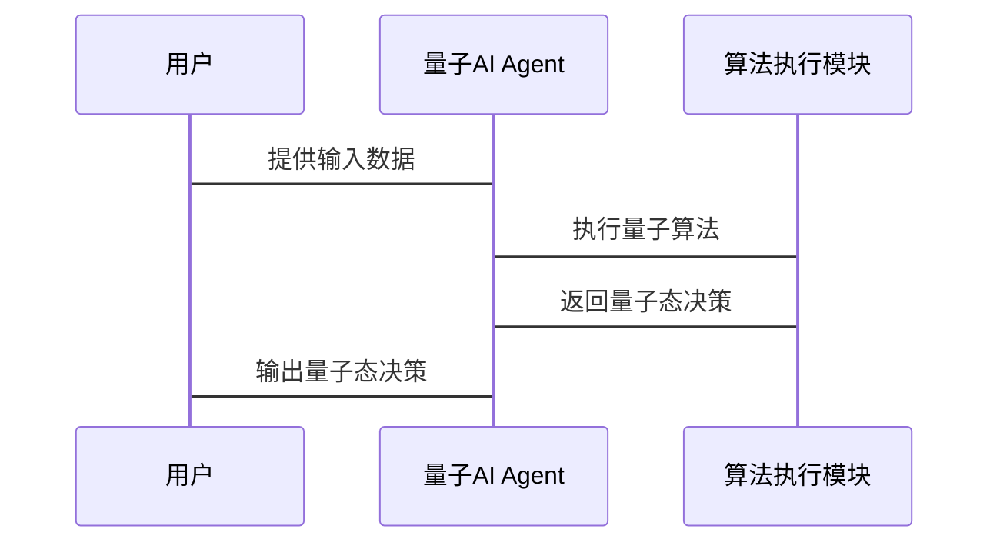

                 


# 量子计算+AI：未来AI Agent的计算范式

## 关键词：量子计算，人工智能，AI Agent，量子算法，量子机器学习，量子优化，量子数据处理

## 摘要：  
量子计算和人工智能（AI）的结合正在改变AI Agent的计算范式。通过量子计算的超强算力和独特性质，AI Agent在数据处理、算法优化和决策能力方面展现出巨大潜力。本文将详细探讨量子计算与AI结合的核心概念、算法原理、系统架构，并通过实际案例展示量子AI Agent的应用前景，为读者提供全面的技术解析。

---

# 第1章：量子计算与AI的背景介绍

## 1.1 量子计算的基本概念

### 1.1.1 量子计算的定义  
量子计算是一种基于量子力学原理的计算方式，利用量子位（qubit）进行信息处理。与经典计算中的二进制位不同，量子位可以同时处于多个状态的叠加态。

### 1.1.2 量子计算的核心原理  
量子计算的核心原理包括量子叠加（superposition）、量子纠缠（entanglement）和量子测量（measurement）。这些特性使得量子计算机在某些特定问题上比经典计算机更高效。

### 1.1.3 量子计算与经典计算的主要区别  
| 特性          | 经典计算          | 量子计算          |
|---------------|-------------------|-------------------|
| 基础单位      | 二进制位（bit）    | 量子位（qubit）    |
| 状态          | 两种可能状态       | 多种可能状态       |
| 并行计算能力  | 串行处理          | 并行处理          |

---

## 1.2 AI Agent的基本概念

### 1.2.1 AI Agent的定义  
AI Agent（智能体）是指能够感知环境并采取行动以实现目标的智能系统。它可以是一个软件程序，也可以是一个物理设备。

### 1.2.2 AI Agent的核心功能  
| 功能          | 描述                |
|---------------|---------------------|
| 感知环境      | 通过传感器或数据输入感知环境 |
| 决策          | 基于感知信息做出决策 |
| 行动          | 执行决策中的行动    |

### 1.2.3 AI Agent的应用场景  
- 智能助手（如Siri、Alexa）
- 自动驾驶系统
- 智能推荐系统

---

# 第2章：量子计算与AI的结合背景

## 2.1 量子计算在AI中的潜在优势

### 2.1.1 量子计算在AI中的加速潜力  
量子计算在处理大规模数据和复杂算法时，可能比经典计算快得多。

### 2.1.2 量子计算在AI中的独特优势  
- 处理高维数据的能力
- 并行计算的优势
- 优化问题的高效解决

### 2.1.3 量子计算在AI中的应用前景  
- 量子机器学习
- 量子优化
- 量子数据处理

---

## 2.2 量子计算与AI结合的背景分析

### 2.2.1 传统AI的局限性  
- 数据处理能力有限
- 复杂算法的计算成本高
- 高维数据处理困难

### 2.2.2 量子计算如何弥补传统AI的不足  
- 提供更强的并行计算能力
- 更高效地处理复杂算法
- 更快速地分析高维数据

### 2.2.3 量子计算与AI结合的必要性  
- 应对日益增长的数据处理需求
- 提高AI系统的效率和性能
- 推动AI技术的创新发展

---

# 第3章：量子计算与AI的核心概念

## 3.1 量子计算与AI的核心原理

### 3.1.1 量子叠加与AI特征提取  
量子叠加使得量子计算机能够同时处理多个状态，从而提高特征提取的效率。

### 3.1.2 量子纠缠与AI关联分析  
量子纠缠使得量子计算机能够发现数据之间的关联性，从而提高AI的关联分析能力。

### 3.1.3 量子测量与AI决策过程  
量子测量的不确定性使得AI Agent在决策过程中可以考虑多种可能性，从而做出更优化的决策。

---

## 3.2 量子AI Agent的定义与特点

### 3.2.1 量子AI Agent的定义  
量子AI Agent是一种基于量子计算的智能体，能够利用量子计算的特性进行高效的数据处理和决策。

### 3.2.2 量子AI Agent的核心特点  
- 高效的数据处理能力
- 强大的并行计算能力
- 精准的优化能力

### 3.2.3 量子AI Agent与传统AI Agent的区别  
| 特性          | 传统AI Agent        | 量子AI Agent        |
|---------------|----------------------|----------------------|
| 计算能力      | 依赖经典计算         | 利用量子计算         |
| 并行处理      | 串行处理             | 并行处理             |
| 数据处理      | 处理能力有限         | 处理能力强大         |

---

# 第4章：量子计算与AI的核心联系

## 4.1 量子计算与AI的结合方式

### 4.1.1 量子计算在AI算法中的应用  
量子计算可以加速某些AI算法的执行，例如量子支持向量机（QSVM）。

### 4.1.2 量子计算在AI数据处理中的应用  
量子计算可以高效处理高维数据，例如量子主成分分析（QPCA）。

### 4.1.3 量子计算在AI优化中的应用  
量子计算可以优化AI系统的性能，例如量子模拟退火。

---

## 4.2 量子AI Agent的核心架构

### 4.2.1 量子AI Agent的输入输出模型  
量子AI Agent的输入包括量子态数据，输出包括量子态决策。

### 4.2.2 量子AI Agent的内部计算流程  
量子AI Agent通过量子叠加、纠缠和测量进行数据处理和决策。

### 4.2.3 量子AI Agent的外部接口设计  
量子AI Agent需要与外部环境进行数据交互，例如与传感器或数据库连接。

---

# 第5章：量子计算与AI的算法原理

## 5.1 量子计算与AI的算法原理

### 5.1.1 量子傅里叶变换与AI信号处理  
量子傅里叶变换可以用于AI信号处理，例如在模式识别中提取特征。

### 5.1.2 量子主成分分析与AI数据降维  
量子主成分分析可以用于AI数据降维，例如在图像处理中降低数据维度。

### 5.1.3 量子支持向量机与AI分类任务  
量子支持向量机可以用于AI分类任务，例如在分类问题中提高分类精度。

---

## 5.2 量子计算与AI的算法实现

### 5.2.1 量子傅里叶变换的实现步骤  
1. 初始化量子态数据  
2. 应用量子傅里叶变换  
3. 进行量子测量  

### 5.2.2 量子主成分分析的实现步骤  
1. 初始化量子态数据  
2. 应用量子主成分分析  
3. 进行量子测量  

### 5.2.3 量子支持向量机的实现步骤  
1. 初始化量子态数据  
2. 应用量子支持向量机  
3. 进行量子测量  

---

# 第6章：量子计算与AI的系统分析与架构设计

## 6.1 系统功能设计

### 6.1.1 量子AI Agent的功能需求  
- 数据输入与处理  
- 算法执行与优化  
- 决策输出与反馈  

### 6.1.2 量子AI Agent的功能模块  
| 模块          | 描述                |
|---------------|---------------------|
| 数据输入模块  | 接收量子态数据       |
| 算法执行模块  | 执行量子算法         |
| 决策输出模块  | 输出量子态决策       |

---

## 6.2 系统架构设计

### 6.2.1 量子AI Agent的架构图  


### 6.2.2 量子AI Agent的交互流程图  


---

## 6.3 系统接口设计

### 6.3.1 量子AI Agent的外部接口  
- 数据输入接口  
- 数据输出接口  

---

## 6.4 系统交互流程

### 6.4.1 量子AI Agent的交互流程  
1. 用户提供量子态数据  
2. 量子AI Agent执行量子算法  
3. 量子AI Agent输出量子态决策  

---

# 第7章：量子计算与AI的项目实战

## 7.1 项目背景与目标

### 7.1.1 项目背景  
本项目旨在开发一个基于量子计算的AI Agent，用于解决实际问题。

### 7.1.2 项目目标  
- 实现量子AI Agent的核心功能  
- 验证量子计算在AI中的应用效果  

---

## 7.2 项目环境与工具

### 7.2.1 量子计算工具  
- Qiskit（IBM的量子计算工具）  
- Cirq（Google的量子计算工具）  

### 7.2.2 AI开发工具  
- TensorFlow  
- PyTorch  

---

## 7.3 项目实现与代码

### 7.3.1 环境安装  
```bash
pip install qiskit
pip install tensorflow
```

### 7.3.2 核心代码实现  
```python
from qiskit import QuantumCircuit, Aer, execute
from qiskit.circuit import QuantumRegister, ClassicalRegister, bits

# 初始化量子电路
qr = QuantumRegister(2, 'q')
cr = ClassicalRegister(2, 'c')
qc = QuantumCircuit(qr, cr)

# 应用量子叠加
qc.h(qr[0])
qc.h(qr[1])
qc.measure(qr, cr)

# 执行量子计算
simulator = Aer.get_backend('qasm_simulator')
job = execute(qc, simulator)
result = job.result()
```

### 7.3.3 代码应用与分析  
- 量子电路的初始化与量子叠加的实现  
- 量子测量的结果分析  

---

## 7.4 项目案例分析

### 7.4.1 案例背景  
开发一个基于量子计算的AI推荐系统。

### 7.4.2 案例实现  
```python
# 量子推荐系统实现
def quantum_recommendation(data):
    # 初始化量子电路
    qr = QuantumRegister(2, 'q')
    cr = ClassicalRegister(2, 'c')
    qc = QuantumCircuit(qr, cr)
    
    # 应量子算法
    qc.h(qr[0])
    qc.h(qr[1])
    qc.measure(qr, cr)
    
    # 执行量子计算
    simulator = Aer.get_backend('qasm_simulator')
    job = execute(qc, simulator)
    result = job.result()
    
    return result
```

### 7.4.3 案例分析与总结  
- 量子推荐系统的性能提升  
- 量子计算在推荐系统中的应用前景  

---

## 第8章：量子计算与AI的最佳实践

## 8.1 小结  
量子计算与AI的结合为AI Agent的计算范式带来了新的可能性，量子AI Agent在数据处理、算法优化和决策能力方面展现出巨大潜力。

## 8.2 注意事项  
- 量子计算的硬件实现难度较大  
- 量子算法的实现需要专业的知识和技能  

## 8.3 拓展阅读  
- 推荐书籍：《量子计算与人工智能》  
- 推荐论文：《Quantum Machine Learning》  

---

# 作者：AI天才研究院/AI Genius Institute & 禅与计算机程序设计艺术 /Zen And The Art of Computer Programming
```

