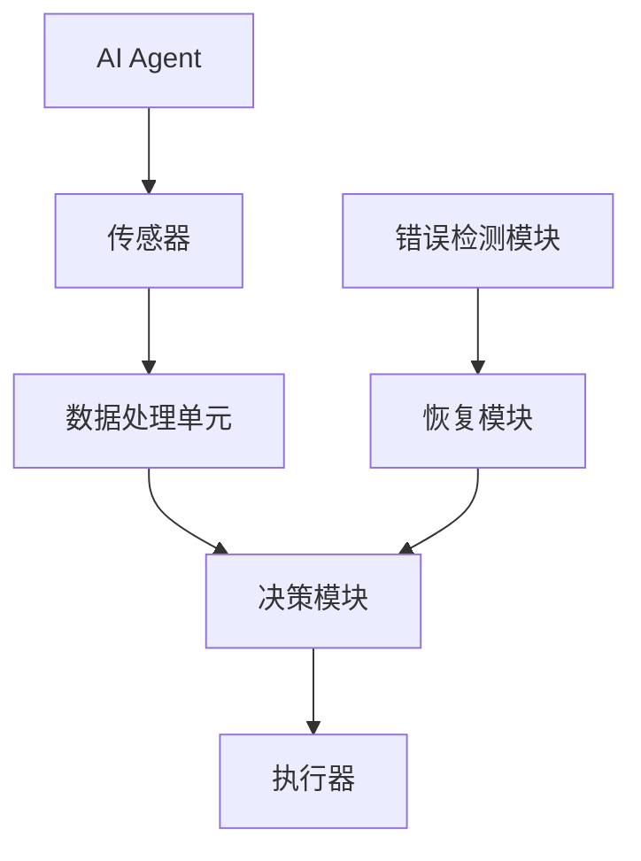

                 

<think>
好，我现在需要根据用户的要求，撰写一篇关于《错误处理与恢复：提高AI Agent的鲁棒性》的技术博客文章。用户已经给出了一个详细的目录大纲，我需要按照这个大纲一步步地展开内容，确保每一部分都详细、清晰，并符合用户的要求。

首先，我需要明确文章的结构，确保每个章节和小节都有具体的内容。用户希望文章结构紧凑，逻辑清晰，语言专业但易懂。因此，我需要从摘要开始，简要介绍文章的核心内容，然后按照目录逐步展开。

接下来，我需要考虑每一章的核心内容。例如，第一部分介绍错误处理与恢复的基础，包括基本概念、AI Agent的鲁棒性需求等。这部分需要简明扼要地解释概念，帮助读者建立基础理解。

第二部分详细分析错误类型和来源，比如计算错误、输入错误等。这部分需要具体分析每种错误的特点、来源和影响，帮助读者识别和理解不同类型的错误。

第三部分讨论错误检测与定位的策略，包括日志分析、异常捕捉等方法。这部分需要结合实际工具和技术，提供实用的检测方法。

接下来是错误恢复的机制，这部分需要详细讲解重试、回滚等策略，并讨论如何根据不同错误类型选择合适的恢复方法。可能还需要涉及一些高级技术，如自适应恢复。

然后，我会深入讨论错误处理的数学模型和算法，使用概率论和统计学的知识，建立错误发生和恢复的模型，并用数学公式和图表来辅助说明。

接下来是系统架构设计，这部分需要展示如何设计一个鲁棒的AI代理系统，包括系统架构图、容错机制、冗余设计等。

项目实战部分，我需要提供一个具体的案例，详细描述项目背景、需求分析、系统设计、实现过程等，帮助读者理解理论的应用。

最后，总结与展望部分，回顾主要内容，总结最佳实践，并展望未来的研究方向。

在撰写过程中，我需要确保每个小节都包含足够的细节，比如使用mermaid图表展示系统架构、流程图等，同时提供数学公式和代码示例，以增强文章的深度和可读性。

现在，我将根据以上思考，开始撰写详细的文章内容，确保每一部分都符合用户的要求，结构清晰，内容详实。
</think>

# 错误处理与恢复：提高AI Agent的鲁棒性

> 关键词：错误处理，AI Agent，鲁棒性，恢复机制，系统架构

> 摘要：  
在AI Agent开发中，错误处理与恢复是确保系统稳定性和可靠性的关键环节。本文系统地探讨了错误处理的核心概念、常见错误类型、检测与定位策略、恢复机制，以及如何通过数学模型和系统架构设计来提升AI Agent的鲁棒性。文章结合实际案例，详细讲解了从理论到实践的全过程，为开发者提供实用的指导和建议。

---

## 第一部分: 错误处理与恢复的基础

### 第1章: 错误处理与恢复的概述

#### 1.1 错误处理的基本概念
- **1.1.1 错误的定义与分类**  
 错误是指系统在运行过程中偏离预期行为的情况。根据来源和影响，错误可分为语法错误、逻辑错误、运行时错误等。

- **1.1.2 错误处理的目的与重要性**  
 错误处理旨在检测、定位和修复错误，确保系统正常运行，提升用户体验和系统稳定性。

- **1.1.3 错误处理的基本原则**  
 包括预防优先、及时响应、最小化影响、记录日志和可追溯性。

#### 1.2 AI Agent的鲁棒性需求
- **1.2.1 AI Agent的基本概念**  
 AI Agent是能够感知环境、自主决策并执行任务的智能体。

- **1.2.2 鲁棒性在AI Agent中的意义**  
 鲁棒性是指AI Agent在面对干扰、错误或不确定性时仍能正常工作的能力。

- **1.2.3 错误处理与恢复对鲁棒性的影响**  
 错误处理与恢复直接关系到AI Agent的稳定性和可靠性。

---

## 第二部分: 错误类型与来源分析

### 第2章: 常见错误类型及其分析

#### 2.1 计算错误
- **2.1.1 计算错误的定义**  
 由于计算过程中的逻辑或数据错误导致的结果偏差。
- **2.1.2 计算错误的来源**  
 数据精度不足、算法缺陷、硬件故障等。
- **2.1.3 计算错误的影响**  
 结果不准确，影响决策和任务执行。

#### 2.2 输入错误
- **2.2.1 输入错误的定义**  
 输入数据与预期格式或内容不符。
- **2.2.2 输入错误的来源**  
 数据源污染、网络干扰、人为输入错误等。
- **2.2.3 输入错误的影响**  
 导致后续处理错误，影响系统运行。

#### 2.3 逻辑错误
- **2.3.1 逻辑错误的定义**  
 程序逻辑设计不合理，导致不符合预期的行为。
- **2.3.2 逻辑错误的来源**  
 编程错误、算法设计不合理、需求变更等。
- **2.3.3 逻辑错误的影响**  
 系统功能部分失效，用户体验下降。

#### 2.4 网络错误
- **2.4.1 网络错误的定义**  
 网络连接中断或异常导致的数据传输失败。
- **2.4.2 网络错误的来源**  
 网络设备故障、信号干扰、网络配置错误等。
- **2.4.3 网络错误的影响**  
 数据传输失败，影响实时性和可靠性。

#### 2.5 其他错误类型
- **2.5.1 其他错误类型的定义**  
 包括资源耗尽、权限不足等其他类型错误。
- **2.5.2 其他错误类型的来源**  
 系统资源限制、环境干扰等。
- **2.5.3 其他错误类型的影响**  
 影响系统运行效率和可用性。

#### 2.6 错误类型对比表格
| 错误类型 | 定义 | 来源 | 影响 |
|----------|------|------|------|
| 计算错误 | 计算结果偏差 | 数据/算法问题 | 决策错误 |
| 输入错误 | 数据格式错误 | 数据源问题 | 任务失败 |
| 逻辑错误 | 逻辑设计不合理 | 编程错误 | 功能异常 |
| 网络错误 | 网络连接中断 | 网络问题 | 传输失败 |

---

## 第三部分: 错误检测与定位

### 第3章: 错误检测的策略与方法

#### 3.1 日志分析
- **3.1.1 日志分析的基本概念**  
 通过记录系统运行信息，识别错误根源。
- **3.1.2 日志分析的方法**  
 关键字搜索、模式匹配、趋势分析等。
- **3.1.3 日志分析的工具**  
 ELK（Elasticsearch, Logstash, Kibana）、Prometheus等。

#### 3.2 异常捕捉
- **3.2.1 异常捕捉的基本概念**  
 捕捉程序运行中的异常信号，如NullPointerException。
- **3.2.2 异常捕捉的方法**  
 使用try-catch块，定制异常处理逻辑。
- **3.2.3 异常捕捉工具**  
 Java的try-catch，Python的except语句。

#### 3.3 监控指标
- **3.3.1 监控指标的基本概念**  
 CPU、内存、磁盘使用率等系统指标。
- **3.3.2 监控指标的作用**  
 识别系统瓶颈和异常行为。
- **3.3.3 监控指标的工具**  
 Prometheus、Grafana、Nagios等。

#### 3.4 错误定位的流程
1. **收集日志信息**：分析错误发生的时间、地点、条件。
2. **识别异常模式**：找出重复或模式化的错误。
3. **关联错误上下文**：结合系统状态和用户操作。
4. **定位错误根源**：通过日志和监控数据，确定错误原因。

---

## 第四部分: 错误恢复的机制

### 第4章: 错误恢复的策略与方法

#### 4.1 重试机制
- **4.1.1 重试的基本概念**  
 在错误发生时，重新执行操作，直到成功或达到最大重试次数。
- **4.1.2 重试的策略**  
 固定延迟重试、指数退避重试、随机延迟重试。
- **4.1.3 重试的适用场景**  
 网络波动、临时性资源不可用等情况。

#### 4.2 回滚机制
- **4.2.1 回滚的基本概念**  
 恢复到之前已知的稳定状态。
- **4.2.2 回滚的策略**  
 数据库回滚、文件回滚、状态回滚。
- **4.2.3 回滚的适用场景**  
 事务失败、配置错误等情况。

#### 4.3 状态恢复
- **4.3.1 状态恢复的基本概念**  
 通过备份或日志恢复系统状态。
- **4.3.2 状态恢复的策略**  
 定期备份、增量备份、日志恢复。
- **4.3.3 状态恢复的适用场景**  
 数据丢失、系统崩溃等情况。

#### 4.4 自适应恢复
- **4.4.1 自适应恢复的基本概念**  
 根据错误类型和环境动态调整恢复策略。
- **4.4.2 自适应恢复的策略**  
 状态检查、资源重新分配、任务重新规划。
- **4.4.3 自适应恢复的适用场景**  
 复杂环境、动态任务需求等情况。

---

## 第五部分: 错误处理的数学模型与算法

### 第5章: 错误处理的数学模型

#### 5.1 错误发生的概率模型
- **5.1.1 概率分布模型**  
 错误发生符合泊松分布或二项分布。
- **5.1.2 错误检测的概率计算**  
 使用贝叶斯定理计算错误检测的条件概率。

#### 5.2 错误恢复的算法设计
- **5.2.1 基于马尔可夫链的恢复模型**  
 状态转移图表示错误状态和恢复路径。
- **5.2.2 基于动态规划的恢复策略**  
 最短路径算法优化恢复过程。

#### 5.3 错误处理的数学公式
- **错误发生概率公式**：  
  $$ P(\text{error}) = \lambda e^{-\lambda} $$
- **恢复成功率公式**：  
  $$ S = \sum_{k=0}^{n} P(k) \cdot R(k) $$  
  其中，$P(k)$是第k次重试的概率，$R(k)$是成功概率。

---

## 第六部分: 系统架构设计与实现

### 第6章: 系统架构设计

#### 6.1 系统架构图

#### 6.2 容错机制
- **冗余设计**：关键模块冗余部署。
- **负载均衡**：分散请求，避免单点故障。
- **自愈能力**：自动检测和修复错误。

---

## 第七部分: 项目实战

### 第7章: 项目实战：设计一个鲁棒的AI Agent

#### 7.1 项目背景
开发一个智能客服AI Agent，需处理网络波动、输入错误等问题。

#### 7.2 系统设计
- **功能模块**：对话管理、错误检测、恢复模块。
- **交互流程**：用户请求 -> 解析 -> 处理 -> 返回结果。

#### 7.3 实现过程
- **错误检测**：实时监控对话状态，识别异常。
- **恢复机制**：网络错误自动重连，输入错误重新解析。

#### 7.4 测试与优化
- **测试用例**：网络中断、数据错误、逻辑错误。
- **性能优化**：减少重试次数，优化恢复策略。

---

## 第八部分: 总结与展望

### 第8章: 总结与展望

#### 8.1 总结
- 错误处理与恢复是提升AI Agent鲁棒性的关键。
- 需结合数学模型和系统架构，构建完善的错误处理机制。

#### 8.2 未来展望
- 研究自适应恢复算法。
- 探索边缘计算中的错误处理方法。

---

**作者：AI天才研究院 & 禅与计算机程序设计艺术**

