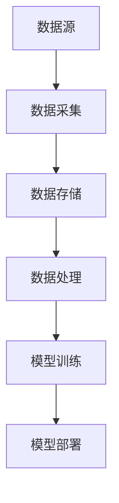

                 


# 隐私保护AI：在数据安全与功能之间寻找平衡

> 关键词：隐私保护、人工智能、数据安全、差分隐私、联邦学习、数据匿名化

> 摘要：随着人工智能技术的快速发展，隐私保护与数据安全问题日益凸显。本文深入探讨了隐私保护与AI功能之间的平衡，分析了差分隐私、联邦学习等核心技术，结合实际案例和系统设计，为读者提供了全面的技术指导。

---

# 第一章: 隐私保护与AI概述

## 1.1 隐私保护的基本概念

### 1.1.1 隐私的定义与重要性

隐私是个人或组织对其信息的自主控制权，是现代社会的基本权利。在数字时代，隐私保护尤为重要，因为数据泄露可能导致身份盗窃、金融损失等严重问题。

**图1-1：隐私保护的重要性**

![这里插入一张数据泄露对企业声誉影响的图表]

### 1.1.2 数据隐私与个人隐私的区别

- **数据隐私**：指数据的收集、存储和使用方式，确保数据不被未经授权的访问。
- **个人隐私**：涉及个人身份信息的保护，防止个人信息被滥用。

### 1.1.3 隐私保护的法律框架

- **GDPR**：欧盟《通用数据保护条例》要求企业明确数据处理目的，并获得用户同意。
- **CCPA**：美国加州消费者隐私法案赋予消费者对其数据的控制权。

## 1.2 AI技术的基本原理

### 1.2.1 人工智能的定义与分类

- **人工智能**：模拟人类智能的技术，包括机器学习、自然语言处理等。
- **机器学习**：通过数据训练模型，使其能够从经验中学习并做出预测。

### 1.2.2 机器学习的核心概念

- **监督学习**：基于标记数据进行训练，如分类和回归任务。
- **无监督学习**：从无标记数据中发现模式，如聚类和降维。

### 1.2.3 深度学习的基本原理

- **神经网络**：受生物神经系统的启发，通过多层网络结构进行特征提取。

## 1.3 隐私保护与AI的结合

### 1.3.1 AI在数据处理中的隐私风险

- **数据泄露**：模型训练可能泄露训练数据中的敏感信息。
- **模型反推**：通过对模型的分析，推断出训练数据中的具体信息。

### 1.3.2 隐私保护对AI功能的影响

- **数据可用性**：严格的隐私保护可能导致数据不足，影响模型性能。
- **计算效率**：隐私保护技术如差分隐私通常会增加计算开销。

### 1.3.3 平衡数据安全与功能的必要性

- **数据安全**：保护用户隐私，防止数据滥用。
- **AI功能**：确保模型在保护隐私的前提下仍能有效运行。

---

# 第二章: 数据安全与隐私保护的挑战

## 2.1 数据安全的基本原则

### 2.1.1 数据分类与分级

- **分类标准**：根据数据的敏感性、重要性进行分类。
- **分级处理**：对不同级别的数据采取不同的保护措施。

### 2.1.2 数据加密技术

- **加密方法**：包括对称加密和非对称加密，如AES和RSA。
- **加密场景**：数据存储和传输过程中使用加密技术。

### 2.1.3 数据匿名化处理

- **匿名化技术**：如数据脱敏和化名处理。
- **匿名化挑战**：确保匿名化后的数据无法被还原。

## 2.2 隐私保护的主要挑战

### 2.2.1 数据泄露的常见途径

- **内部威胁**：员工误操作或恶意泄露。
- **外部攻击**：黑客攻击导致数据泄露。

### 2.2.2 用户隐私意识的差异

- **用户认知**：部分用户不了解隐私保护的重要性。
- **使用习惯**：用户可能忽略隐私设置。

### 2.2.3 技术与法律的冲突

- **技术限制**：某些隐私保护技术可能无法完全满足法律要求。
- **法律滞后**：技术发展快于法律制定，导致法律空白。

## 2.3 AI技术对隐私保护的影响

### 2.3.1 AI模型的训练数据问题

- **数据来源**：训练数据可能包含敏感信息，如医疗记录。
- **数据处理**：如何在不泄露隐私的前提下训练模型。

### 2.3.2 模型推理中的隐私风险

- **模型预测**：模型可能泄露训练数据中的信息。
- **模型反推**：通过模型预测结果推断训练数据。

### 2.3.3 AI伦理与隐私保护的关系

- **伦理问题**：AI技术的使用是否符合伦理规范。
- **隐私保护**：如何在AI伦理框架下保护用户隐私。

---

# 第三章: 隐私保护AI的核心技术

## 3.1 差分隐私

### 3.1.1 差分隐私的定义与原理

- **定义**：差分隐私是一种隐私保护模型，确保查询结果仅依赖于输入数据的微小变化。
- **核心思想**：通过添加噪声，使得单个数据点的变化对结果影响微小。

### 3.1.2 差分隐私的数学模型

**公式1-1**：差分隐私的定义式

$$
\Pr[P(D) \in S] - \Pr[P(D') \in S] \leq \epsilon
$$

其中，$D$和$D'$是两个相邻的数据集，$S$是事件集合，$\epsilon$是隐私参数。

### 3.1.3 差分隐私在AI中的应用

- **数据发布**：在不泄露个体隐私的前提下发布数据。
- **模型训练**：在模型训练中加入差分隐私机制，保护训练数据。

## 3.2 联邦学习

### 3.2.1 联邦学习的定义与原理

- **定义**：联邦学习是一种分布式机器学习方法，多个参与方在不共享原始数据的情况下共同训练模型。
- **核心思想**：数据不出域，模型参数共享。

### 3.2.2 联邦学习的实现流程

1. **初始化**：各个参与方准备数据并初始化模型参数。
2. **训练**：各参与方本地训练模型，更新模型参数。
3. **聚合**：将各参与方的模型参数进行聚合，得到全局模型。
4. **迭代**：重复训练和聚合过程，直到模型收敛。

### 3.2.3 联邦学习的安全性与隐私保护

- **数据隐私**：参与方不共享原始数据，仅共享模型参数。
- **隐私保护**：通过加密通信和差分隐私技术进一步保护隐私。

---

# 第四章: 隐私保护的法律与伦理

## 4.1 隐私保护的法律框架

### 4.1.1 GDPR的主要内容

- **数据主体权利**：包括知情权、访问权、更正权等。
- **数据处理原则**：数据处理必须合法、透明、有限。

### 4.1.2 CCPA的主要内容

- **适用范围**：适用于收集、处理加州居民个人信息的企业。
- **用户权利**：包括删除权和数据携带权。

## 4.2 隐私保护的伦理问题

### 4.2.1 AI伦理的核心原则

- **隐私保护**：尊重用户隐私，避免数据滥用。
- **透明性**：确保用户了解数据的使用方式。
- **公平性**：避免算法偏见，确保公平性。

### 4.2.2 企业责任与道德规范

- **企业责任**：企业有责任保护用户隐私，遵守相关法律法规。
- **道德规范**：在技术开发中遵循伦理原则，避免伤害用户利益。

---

# 第五章: 隐私保护AI的系统设计

## 5.1 系统架构设计

### 5.1.1 系统功能设计

- **数据采集**：从多个来源收集数据，并进行预处理。
- **数据存储**：使用加密技术存储数据，确保数据安全。
- **模型训练**：在保护隐私的前提下训练AI模型。
- **模型部署**：将训练好的模型部署到实际应用中。

### 5.1.2 系统架构图



### 5.1.3 系统接口设计

- **数据接口**：负责数据的输入和输出。
- **模型接口**：负责模型的训练和推理。
- **用户接口**：提供用户交互界面，如网页或移动应用。

## 5.2 系统安全设计

### 5.2.1 数据安全策略

- **访问控制**：基于角色的访问控制，确保只有授权人员可以访问敏感数据。
- **加密传输**：使用HTTPS等安全协议，确保数据传输过程中的安全性。

### 5.2.2 系统监控

- **日志记录**：记录系统运行日志，便于审计和故障排查。
- **异常检测**：通过机器学习技术检测系统中的异常行为，及时发现潜在威胁。

---

# 第六章: 项目实战：构建一个隐私保护的图像分类系统

## 6.1 项目背景

- **项目目标**：在保护图像数据隐私的前提下，训练一个高效的图像分类模型。
- **项目需求**：确保训练数据不被泄露，同时保证分类准确率。

## 6.2 环境配置

### 6.2.1 安装必要的库

```bash
pip install numpy
pip install matplotlib
pip install tensorflow
pip install diffprivlib
```

### 6.2.2 创建项目目录

```bash
mkdir -p src/data src/model src/utils
```

## 6.3 核心代码实现

### 6.3.1 数据加载与预处理

```python
import numpy as np
import tensorflow as tf
from diffprivlib.models import TensorFlowModel
from diffprivlib.mechanisms import Laplace

# 加载数据
(x_train, y_train), (x_test, y_test) = tf.keras.datasets.mnist.load_data()

# 数据预处理
x_train = x_train.reshape(60000, 784) / 255.0
x_test = x_test.reshape(10000, 784) / 255.0
```

### 6.3.2 构建模型

```python
model = tf.keras.Sequential([
    tf.keras.layers.Dense(128, activation='relu'),
    tf.keras.layers.Dense(10, activation='softmax')
])

# 应用差分隐私机制
mechanism = Laplace(epsilon=1, delta=0.0001, sensitivity=1)
model.compile(optimizer='adam', loss='sparse_categorical_crossentropy', metrics=['accuracy'])
```

### 6.3.3 训练与评估

```python
model.fit(x_train, y_train, epochs=10, batch_size=32, validation_data=(x_test, y_test))
```

## 6.4 项目小结

- **实现成果**：成功构建了一个基于差分隐私的图像分类系统，确保了数据隐私的同时保持了较高的分类准确率。
- **经验总结**：差分隐私技术在实际应用中需要合理设置隐私参数，以平衡隐私保护和模型性能。

---

# 第七章: 隐私保护AI的未来趋势

## 7.1 新技术与新挑战

### 7.1.1 新兴技术

- **联邦学习**：通过分布式训练进一步保护数据隐私。
- **同态加密**：在加密状态下直接进行数据处理，保护数据隐私。

### 7.1.2 新挑战

- **数据多样性**：如何在数据多样化的背景下保护隐私。
- **模型复杂性**：复杂模型的隐私保护难度更大，需要新的技术突破。

## 7.2 未来发展方向

### 7.2.1 技术融合

- **技术融合**：将多种隐私保护技术结合使用，提高隐私保护效果。
- **技术创新**：研究新的隐私保护技术，如基于区块链的隐私保护。

### 7.2.2 应用拓展

- **医疗领域**：在医疗数据共享中应用隐私保护技术。
- **金融领域**：在金融 fraud detection 中应用隐私保护技术。

---

# 作者：AI天才研究院/AI Genius Institute & 禅与计算机程序设计艺术 /Zen And The Art of Computer Programming

---

这篇文章系统地探讨了隐私保护AI的核心技术与实际应用，通过理论分析与案例实践相结合的方式，为读者提供了全面的技术指导。希望本文能为隐私保护与AI技术的发展提供有价值的参考。

