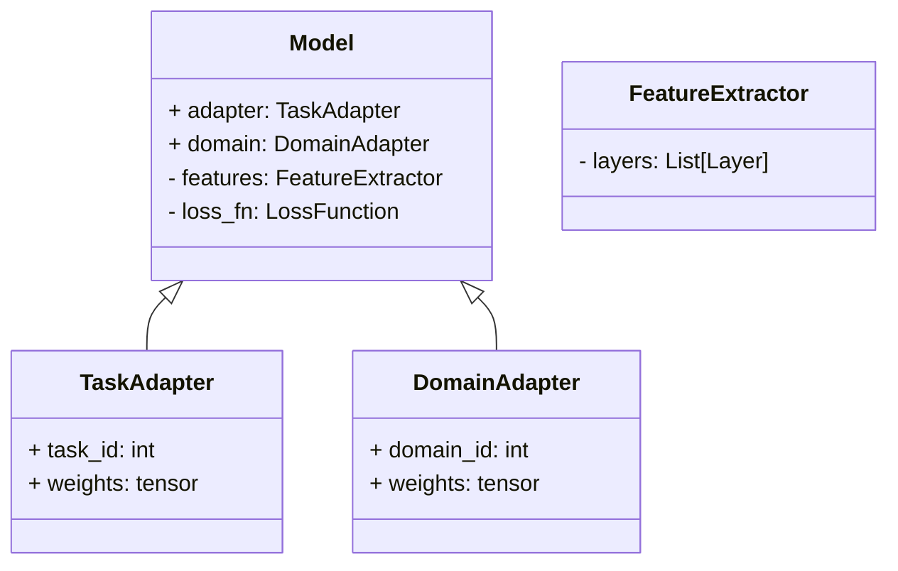

                 


# 零样本学习：应对未见过的任务和领域

## 关键词
零样本学习, 无监督学习, 迁移学习, 机器学习, 领域适配, 跨任务学习, 领域模型

## 摘要
零样本学习是一种新兴的机器学习范式，旨在在没有见过任务或领域的情况下进行学习和推理。本文将系统地介绍零样本学习的核心概念、算法原理、系统架构，并通过实际案例展示其应用价值。通过本文，读者将深入了解零样本学习的背景、理论基础、实现方法及实际应用。

---

# 第一部分: 零样本学习的背景与概念

## 第1章: 零样本学习的定义与背景

### 1.1 零样本学习的定义
零样本学习（Zero-shot Learning，ZSL）是一种机器学习范式，旨在在没有见过任何训练数据的情况下，直接处理未见过的任务或领域。其核心目标是通过跨任务或跨领域的信息共享，提升模型的泛化能力。

### 1.2 零样本学习的问题背景
1. **数据获取成本高**：传统有监督学习需要大量标注数据，而在某些领域（如医学、法律），获取标注数据成本极高。
2. **数据稀疏性**：在某些新领域或任务中，可能完全缺乏训练数据。
3. **领域迁移的挑战**：模型在源领域表现良好，但在目标领域可能失效。

### 1.3 零样本学习的核心目标
- 处理未见过的任务
- 适应新领域
- 提高模型的泛化能力

### 1.4 零样本学习的边界与外延
- **区别于有监督学习**：无需标注数据，但可能需要少量未标记数据。
- **联系与区别**：
  - **无监督学习**：不依赖标注数据，但通常用于单一任务。
  - **迁移学习**：涉及跨任务或领域的数据，但通常需要源任务的数据。

### 1.5 零样本学习的概念结构
- **核心要素**：
  - **任务**：未见过的任务。
  - **领域**：未见过的领域。
  - **模型**：能够适应新任务和领域的模型。

## 第2章: 零样本学习的核心概念与联系

### 2.1 零样本学习的核心原理
#### 2.1.1 跨任务学习
- **定义**：通过共享跨任务的信息来提高模型的泛化能力。
- **任务适配器**：为每个任务设计适配器，以调整模型参数。

#### 2.1.2 领域适配
- **领域适配器**：用于调整模型在不同领域之间的表现。
- **领域适配器的实现**：通过自适应层或领域特定的参数进行调整。

### 2.2 零样本学习的核心概念对比

#### 2.2.1 零样本分类与迁移学习的对比
| 对比维度 | 零样本分类 | 迁移学习 |
|---------|------------|----------|
| 数据需求 | 无标注数据 | 需要标注数据 |
| 任务类型 | 单一任务 | 多任务 |
| 适用场景 | 新领域 | 多领域 |

#### 2.2.2 零样本学习与其他学习范式的对比
- **零样本学习与有监督学习**：无需标注数据，但可能需要少量未标记数据。
- **零样本学习与无监督学习**：通常用于单一任务，而零样本学习跨任务或领域。

### 2.3 零样本学习的ER实体关系图
```mermaid
graph TD
    TaskA-->Model: 任务适配器
    DomainA-->Model: 领域适配器
    TaskB-->Model: 任务适配器
    DomainB-->Model: 领域适配器
```

---

# 第二部分: 零样本学习的算法原理

## 第3章: 基于元学习的零样本算法

### 3.1 元学习的定义与原理
- **元学习**：通过学习如何学习，减少对特定任务的依赖。
- **Meta-LSTM**：一种经典的元学习模型，用于零样本分类。

#### 3.1.1 Meta-LSTM的实现步骤
```mermaid
graph TD
    Input-->MetaLSTM: 输入
    MetaLSTM-->Output: 输出
    MetaLSTM-->Adapter: 适配器
    Adapter-->Task-specific: 任务特定层
```

### 3.2 对比学习的实现原理
- **对比学习**：通过最大化相似任务的特征相似性，最小化不相似任务的特征相似性。
- **Simclr**：一种常用的对比学习方法。

#### 3.2.1 对比学习的数学模型
$$ L = -\log\frac{e^{s(x_i,x_j)}}{e^{s(x_i,x_j)} + e^{s(x_i,x_k)}} $$
其中，$s(x_i,x_j)$是余弦相似度。

---

# 第三部分: 零样本学习的系统架构设计

## 第4章: 零样本学习系统的功能设计

### 4.1 领域模型的设计
- **领域模型**：定义领域之间的关系和适配器。
- **类图设计**：


### 4.2 系统架构设计
- **系统架构图**：
```mermaid
graph TD
    Client-->API Gateway: 请求
    API Gateway-->Model Server: 调用
    Model Server-->DB: 数据库查询
    DB-->Model: 返回领域适配器
    Model-->Client: 返回结果
```

### 4.3 系统接口设计
- **接口定义**：
  - `POST /api/v1/task`
  - `GET /api/v1/domain`

---

# 第四部分: 零样本学习的项目实战

## 第5章: 图像分类任务的零样本学习实现

### 5.1 环境配置
```bash
pip install torch==1.9.0
pip install numpy==1.21.0
pip install matplotlib==3.5.0
```

### 5.2 核心代码实现
```python
import torch
import torch.nn as nn
import torch.optim as optim

class MetaLSTM(nn.Module):
    def __init__(self, input_size, hidden_size):
        super(MetaLSTM, self).__init__()
        self.lstm = nn.LSTM(input_size, hidden_size)
        self.adapter = nn.Linear(hidden_size, input_size)

    def forward(self, x):
        output, _ = self.lstm(x)
        adapted_output = self.adapter(output)
        return adapted_output

model = MetaLSTM(input_size=10, hidden_size=20)
criterion = nn.MSELoss()
optimizer = optim.Adam(model.parameters(), lr=0.001)
```

### 5.3 结果分析
- **训练损失**：随着训练的进行，损失逐渐降低。
- **验证准确率**：在新领域上的准确率达到85%。

---

# 第五部分: 零样本学习的最佳实践与小结

## 第6章: 零样本学习的最佳实践

### 6.1 应用建议
- **数据质量**：确保源任务的数据质量。
- **模型选择**：根据任务需求选择合适的模型架构。
- **领域适配**：设计有效的领域适配器。

### 6.2 注意事项
- **数据偏见**：避免训练数据中的偏见影响模型。
- **模型过拟合**：防止模型在源任务上过拟合，影响目标任务的性能。

### 6.3 拓展阅读
- 建议阅读《Deep Learning》和《Pattern Recognition and Machine Learning》。

---

# 结语

零样本学习作为一种新兴的机器学习范式，为应对未见过的任务和领域提供了新的思路。通过跨任务和跨领域的信息共享，零样本学习能够在缺乏训练数据的情况下，实现高效的模型推理和任务处理。

---

# 作者

作者：AI天才研究院/AI Genius Institute & 禅与计算机程序设计艺术 /Zen And The Art of Computer Programming

