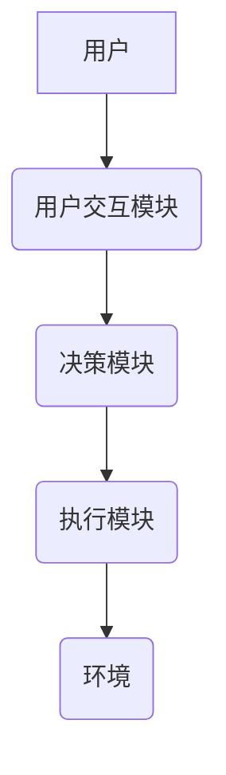

                 


# 预测2025年AI Agent技术的发展方向

> 关键词：AI Agent, AI技术, 人工智能, 机器学习, 强化学习, 大模型, 人机交互

> 摘要：AI Agent作为人工智能领域的重要技术，正在快速演进。本文将从背景、核心概念、算法原理、系统架构、项目实战等角度，全面分析AI Agent技术的发展方向，预测其在2025年的重要趋势，并提供详细的实现方案和代码示例。

---

# 第1章: AI Agent技术背景与现状

## 1.1 AI Agent的基本概念

### 1.1.1 AI Agent的定义与核心特征

AI Agent（人工智能代理）是一种能够感知环境、自主决策并执行任务的智能体。它具备以下核心特征：

- **自主性**：能够在没有外部干预的情况下独立运行。
- **反应性**：能够实时感知环境并做出响应。
- **目标导向性**：基于目标驱动行为。
- **学习能力**：通过经验改进性能。

### 1.1.2 AI Agent与传统AI的区别

传统AI依赖于固定的规则和数据，而AI Agent具备以下特点：

- **动态交互**：能够与环境和用户动态交互。
- **情境理解**：能够理解上下文和用户意图。
- **自适应性**：能够根据环境变化调整策略。

### 1.1.3 AI Agent的应用场景与边界

AI Agent广泛应用于智能助手、自动驾驶、智能客服等领域。其边界包括：

- **实时性要求**：对实时性要求高的场景。
- **复杂环境**：需要处理复杂动态环境的场景。
- **用户交互**：需要与用户进行自然交互的场景。

## 1.2 AI Agent的发展历程

### 1.2.1 从专家系统到AI Agent的演进

- **专家系统**：基于规则的知识库系统，无法处理动态环境。
- **AI Agent**：结合机器学习和强化学习，具备自主决策能力。

### 1.2.2 AI Agent技术的关键里程碑

- **2010年**：强化学习在游戏AI中的应用。
- **2020年**：生成式模型的引入，提升AI Agent的创造力。
- **2025年**：AI Agent具备高度自适应性和情境理解能力。

### 1.2.3 当前AI Agent技术的现状

- **技术成熟度**：AI Agent在部分领域（如智能助手）已经较为成熟。
- **主要挑战**：动态环境适应性、多模态交互、安全性和可解释性。

## 1.3 AI Agent技术的现状分析

### 1.3.1 主流AI Agent技术的特点

- **基于强化学习的AI Agent**：通过奖励机制优化决策。
- **基于生成模型的AI Agent**：利用生成式模型进行创造性交互。
- **基于知识图谱的AI Agent**：结合知识图谱进行推理和决策。

### 1.3.2 当前AI Agent技术的主要挑战

- **动态环境适应性**：如何快速适应环境变化。
- **多模态交互**：如何实现自然的多模态交互。
- **安全性和可解释性**：如何确保AI Agent的安全性和可解释性。

## 1.4 本章小结

本章从AI Agent的基本概念出发，分析了其与传统AI的区别，探讨了其发展历程和当前现状，并总结了当前面临的主要挑战。

---

# 第2章: AI Agent的核心概念与技术联系

## 2.1 AI Agent的核心概念

### 2.1.1 AI Agent的定义与分类

AI Agent可以根据智能水平分为：

- **反应式AI Agent**：基于当前感知做出反应。
- **认知式AI Agent**：具备高级推理和规划能力。

### 2.1.2 AI Agent的智能模型

AI Agent的智能模型包括：

- **感知层**：负责环境感知和数据采集。
- **决策层**：负责推理和决策。
- **执行层**：负责动作执行和反馈。

### 2.1.3 AI Agent的行为模式

AI Agent的行为模式包括：

- **目标驱动**：基于目标驱动行为。
- **任务驱动**：基于任务驱动行为。
- **情境驱动**：基于情境驱动行为。

## 2.2 AI Agent与相关技术的关系

### 2.2.1 AI Agent与大模型的关系

AI Agent可以基于大模型进行交互和决策，例如：

- **GPT-4**：用于自然语言处理和生成。
- **视觉模型**：用于图像识别和处理。

### 2.2.2 AI Agent与强化学习的关系

AI Agent的核心决策机制基于强化学习：

- **强化学习算法**：如Q-learning和DQN。
- **奖励机制**：通过奖励函数优化决策。

### 2.2.3 AI Agent与人机交互的关系

AI Agent的交互能力直接影响用户体验：

- **多模态交互**：支持文本、语音、视觉等多种交互方式。
- **自然语言处理**：提升交互的自然性和流畅性。

## 2.3 AI Agent的核心要素

### 2.3.1 感知与理解能力

AI Agent需要具备以下感知能力：

- **自然语言理解**：理解用户意图和情感。
- **环境感知**：感知物理环境和上下文。

### 2.3.2 决策与推理能力

AI Agent的决策能力包括：

- **推理与规划**：基于知识图谱进行推理和规划。
- **强化学习**：通过奖励机制优化决策。

### 2.3.3 行为与执行能力

AI Agent的行为能力包括：

- **动作执行**：执行物理或虚拟动作。
- **反馈机制**：根据反馈调整行为。

## 2.4 AI Agent的技术架构

### 2.4.1 分层架构

AI Agent的分层架构包括：

- **感知层**：负责环境感知。
- **决策层**：负责推理和决策。
- **执行层**：负责动作执行。

### 2.4.2 微服务架构

AI Agent的微服务架构包括：

- **服务发现**：发现可用服务。
- **服务调用**：调用所需服务。
- **服务管理**：管理服务状态。

### 2.4.3 混合架构

AI Agent的混合架构结合了分层架构和微服务架构的优点：

- **混合架构**：结合分层和微服务的优势。
- **动态调整**：根据需求动态调整架构。

## 2.5 本章小结

本章详细探讨了AI Agent的核心概念，分析了其与相关技术的关系，并总结了AI Agent的技术架构。

---

# 第3章: AI Agent的核心算法原理

## 3.1 AI Agent的核心算法概述

### 3.1.1 强化学习算法

AI Agent的核心决策机制基于强化学习：

- **Q-learning算法**：通过Q值更新策略。
- **深度强化学习**：基于深度神经网络的强化学习。

### 3.1.2 生成式模型

AI Agent的生成能力基于生成式模型：

- **GPT系列**：用于自然语言生成。
- **图像生成模型**：用于图像生成。

### 3.1.3 知识图谱推理

AI Agent的推理能力基于知识图谱：

- **知识图谱构建**：构建领域知识图谱。
- **图推理算法**：基于图结构进行推理。

## 3.2 强化学习算法原理

### 3.2.1 强化学习的基本原理

强化学习通过以下步骤实现：

1. **环境感知**：感知环境状态。
2. **决策选择**：选择动作。
3. **奖励获取**：获得奖励。
4. **策略优化**：优化策略。

### 3.2.2 Q-learning算法

Q-learning算法的伪代码如下：

```python
def Q_learning():
    while True:
        state = get_state()
        action = choose_action(state)
        reward = get_reward(state, action)
        next_state = get_next_state(state, action)
        Q[state][action] += alpha * (reward + gamma * max(Q[next_state]))
```

### 3.2.3 深度强化学习

深度强化学习结合了深度学习和强化学习的优势：

- **深度神经网络**：用于状态和动作的表示。
- **端到端训练**：实现端到端的强化学习。

## 3.3 生成式模型

### 3.3.1 生成式模型的基本原理

生成式模型通过以下步骤实现：

1. **数据训练**：训练生成模型。
2. **生成内容**：生成文本、图像等内容。

### 3.3.2 GPT模型

GPT模型的数学公式如下：

$$ P(y|x) = \frac{P(y|x, z)}{\int P(y|x, z) dz} $$

其中，$z$ 是隐变量。

### 3.3.3 图像生成模型

图像生成模型使用以下公式：

$$ x = \mu(z) + \sigma(z) \cdot \epsilon $$

其中，$\epsilon$ 是噪声向量。

## 3.4 本章小结

本章详细讲解了AI Agent的核心算法，包括强化学习、生成式模型和知识图谱推理，并通过伪代码和数学公式进行了详细阐述。

---

# 第4章: AI Agent的系统分析与架构设计

## 4.1 系统分析与设计

### 4.1.1 问题场景介绍

以智能客服系统为例，AI Agent需要具备以下能力：

- **用户交互**：支持多轮对话。
- **问题解答**：解答用户问题。
- **任务执行**：执行预订、查询等任务。

### 4.1.2 系统功能设计

系统功能模块包括：

- **用户交互模块**：负责用户输入和输出。
- **决策模块**：负责推理和决策。
- **执行模块**：负责任务执行。

### 4.1.3 系统架构设计

系统架构设计如图所示：



## 4.2 项目实战

### 4.2.1 环境配置

安装所需的依赖：

```bash
pip install numpy matplotlib tensorflow
```

### 4.2.2 核心代码实现

实现一个简单的AI Agent：

```python
class AI_Agent:
    def __init__(self):
        self.model = self.build_model()

    def build_model(self):
        # 构建深度强化学习模型
        pass

    def perceive(self, state):
        # 环境感知
        pass

    def decide(self, state):
        # 决策
        pass

    def act(self, action):
        # 执行动作
        pass
```

### 4.2.3 案例分析

以智能客服为例，AI Agent需要实现以下功能：

- **用户交互**：支持多轮对话。
- **问题解答**：解答用户问题。
- **任务执行**：执行预订、查询等任务。

### 4.2.4 项目总结

本项目展示了AI Agent的核心实现，包括感知、决策和执行模块。

## 4.3 本章小结

本章通过系统分析和架构设计，详细讲解了AI Agent的实现过程，并通过项目实战展示了AI Agent的核心功能。

---

# 第5章: AI Agent的最佳实践与未来展望

## 5.1 项目经验总结

### 5.1.1 项目实施的关键点

- **技术选型**：选择合适的算法和框架。
- **数据准备**：高质量的数据是关键。
- **模型优化**：通过调参和优化提升性能。

### 5.1.2 项目实施的注意事项

- **数据安全**：确保数据安全和隐私保护。
- **模型可解释性**：确保模型的可解释性。
- **性能优化**：优化模型的运行效率。

## 5.2 未来展望

### 5.2.1 AI Agent技术的发展趋势

- **多模态交互**：支持更多模态的交互方式。
- **自适应性增强**：增强动态环境适应能力。
- **可解释性提升**：提升模型的可解释性。

### 5.2.2 未来技术挑战

- **安全性问题**：确保AI Agent的安全性。
- **伦理问题**：解决AI Agent的伦理问题。
- **效率问题**：提升AI Agent的运行效率。

## 5.3 本章小结

本章总结了AI Agent的最佳实践，并展望了未来的发展趋势和技术挑战。

---

# 附录: AI Agent相关工具与技术参考

- **强化学习框架**：TensorFlow、PyTorch。
- **生成式模型**：GPT、DALL-E。
- **知识图谱工具**：Neo4j、Ubergraph。

---

作者：AI天才研究院/AI Genius Institute & 禅与计算机程序设计艺术 /Zen And The Art of Computer Programming

