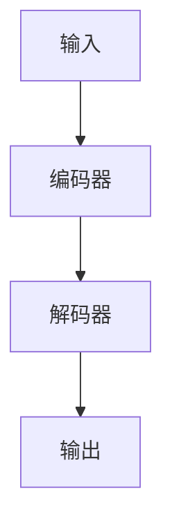
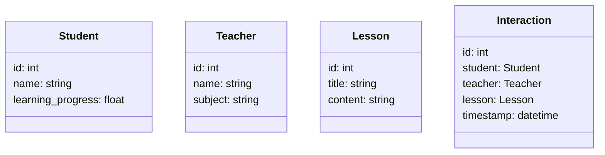
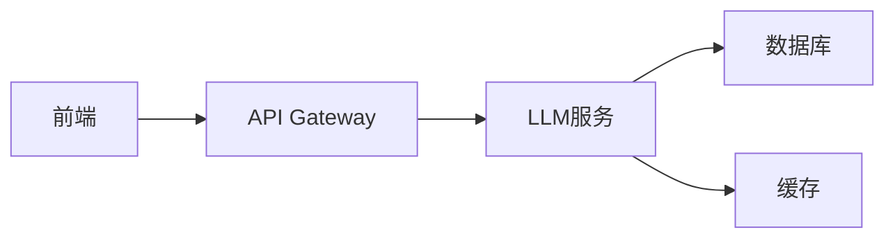
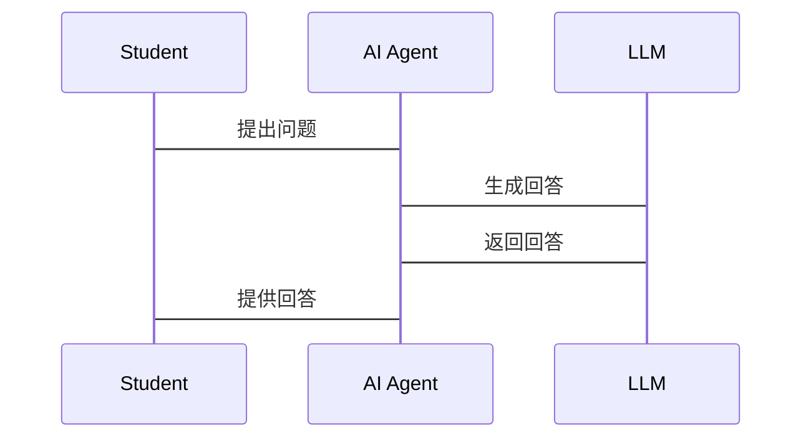

                 


# AI Agent在教育领域的应用：LLM驱动的智能导师

---

## 关键词：
AI Agent, LLM, 智能导师, 教育技术, 人工智能, 教学优化

---

## 摘要：
本文探讨了AI Agent在教育领域的应用，特别是通过大语言模型（LLM）实现智能导师系统的可能性和潜力。文章从AI Agent和LLM的基本概念出发，分析了其在教育场景中的优势和挑战，并详细介绍了LLM的数学模型、决策机制、系统架构以及实际应用案例。通过理论与实践的结合，本文旨在为教育技术的创新提供新的思路和方向。

---

# 第一部分: AI Agent与教育领域的背景与概述

## 第1章: AI Agent与LLM的概述

### 1.1 AI Agent的基本概念

#### 1.1.1 AI Agent的定义与特点
AI Agent（人工智能代理）是一种能够感知环境、自主决策并执行任务的智能实体。它具备以下特点：
- **自主性**：能够在没有外部干预的情况下独立运作。
- **反应性**：能够实时感知环境并做出响应。
- **目标导向性**：通过设定目标来指导行为和决策。
- **学习能力**：能够通过数据和经验不断优化自身的性能。

#### 1.1.2 LLM在AI Agent中的作用
大语言模型（LLM）通过其强大的文本生成和理解能力，为AI Agent提供了自然语言处理的核心支持。LLM能够帮助AI Agent完成以下任务：
- **文本生成**：根据输入生成自然语言文本，如回答问题、撰写文章。
- **意图识别**：通过分析用户输入，识别其意图和需求。
- **知识推理**：基于上下文进行推理和逻辑推断。

#### 1.1.3 教育领域的AI Agent应用前景
在教育领域，AI Agent可以通过LLM技术实现智能化的教学辅助功能，例如：
- **个性化教学**：根据学生的学习情况和兴趣，定制个性化的学习计划。
- **实时答疑**：为学生提供即时的问题解答和学习建议。
- **教学评估**：通过分析学生的表现，提供实时的反馈和评估。

### 1.2 教育领域的现状与挑战

#### 1.2.1 当前教育技术的发展现状
随着技术的进步，教育领域已经引入了许多创新工具，如在线学习平台、智能测验系统等。然而，这些工具大多基于规则引擎或简单的模式匹配，缺乏深度的智能化支持。

#### 1.2.2 传统教育模式的局限性
传统教育模式存在以下问题：
- **个性化不足**：难以满足每个学生的个性化学习需求。
- **效率低下**：教师的工作量巨大，难以实现高效的教学管理。
- **资源浪费**：教学资源的分配可能不均衡，导致部分学生无法充分发挥潜力。

#### 1.2.3 LLM驱动的智能导师的优势
LLM驱动的智能导师能够克服传统教育模式的局限性，实现以下优势：
- **个性化学习**：通过分析学生的学习数据，提供个性化的教学策略。
- **高效互动**：实时与学生互动，提供即时反馈和指导。
- **资源优化**：智能分配教学资源，提高教学效率。

### 1.3 本章小结
本章介绍了AI Agent和LLM的基本概念，并探讨了它们在教育领域的应用前景。通过分析当前教育技术的现状和传统教育模式的局限性，我们得出结论：LLM驱动的智能导师是教育技术未来发展的重要方向。

---

## 第2章: LLM的基本原理与数学模型

### 2.1 LLM的训练过程

#### 2.1.1 Transformer模型的结构
Transformer模型由编码器和解码器组成，其核心思想是通过自注意力机制（Self-Attention）捕捉文本中的长距离依赖关系。编码器将输入序列转换为高维向量表示，解码器则根据编码器的输出生成目标序列。

#### 2.1.2 注意力机制的数学公式
注意力机制的数学公式如下：
$$\text{Attention}(Q, K, V) = \text{softmax}\left(\frac{QK^T}{\sqrt{d_k}}\right)V$$
其中：
- $Q$、$K$、$V$分别为查询、键和值矩阵。
- $d_k$为键的维度。

#### 2.1.3 解码器的结构
解码器由多个层组成，每一层都包含自注意力机制和前馈神经网络。自注意力机制用于捕捉解码器内部的依赖关系，前馈网络则对输出进行非线性变换。

### 2.2 LLM的生成机制

#### 2.2.1 解码器的输出过程
解码器通过生成一个概率分布的输出序列，选择概率最高的词作为输出。生成过程可以表示为：
$$P(y_1, y_2, \ldots, y_n|x) = \prod_{i=1}^{n}P(y_i|x_{<i}, y_{<i})$$

#### 2.2.2 梯度下降与损失函数
训练过程中，模型通过最小化交叉熵损失函数来优化参数：
$$\text{Loss} = -\sum_{i=1}^{n}\text{log}P(y_i|x_{<i})$$

### 2.3 LLM的核心算法流程图



### 2.4 本章小结
本章详细介绍了LLM的基本原理和数学模型，重点讲解了Transformer模型的结构和注意力机制。通过这些内容，我们可以理解LLM如何生成高质量的文本输出。

---

## 第3章: AI Agent的决策机制与教育应用

### 3.1 AI Agent的决策模型

#### 3.1.1 基于LLM的决策树
AI Agent可以通过构建决策树来模拟人类的决策过程。决策树的每个节点代表一个决策点，叶子节点代表最终的决策结果。

#### 3.1.2 多目标优化的决策过程
AI Agent在教育场景中需要考虑多个目标，例如：
- 学生的学习效果
- 教学资源的利用效率
- 教学过程的个性化需求

决策过程可以表示为：
$$\text{Objective} = \alpha \cdot \text{Accuracy} + (1-\alpha) \cdot \text{Engagement}$$
其中，$\alpha$是学习效果的权重，$(1-\alpha)$是参与度的权重。

### 3.2 教学场景中的AI Agent应用

#### 3.2.1 个性化学习策略
AI Agent可以根据学生的学习数据，生成个性化的学习计划。例如，为不同学习阶段的学生提供不同的学习材料和练习题。

#### 3.2.2 实时互动与反馈
AI Agent可以实时与学生互动，根据学生的输入生成相应的回答和反馈。例如，当学生提出问题时，AI Agent可以通过LLM生成详细的解答过程。

#### 3.2.3 教学效果评估
AI Agent可以通过分析学生的学习数据，评估教学效果，并根据评估结果调整教学策略。例如，AI Agent可以生成学习报告，帮助教师了解学生的进步情况。

### 3.3 本章小结
本章探讨了AI Agent的决策机制及其在教育场景中的应用。通过基于LLM的决策树和多目标优化模型，AI Agent可以实现个性化的教学策略和实时互动。

---

## 第4章: 系统分析与架构设计

### 4.1 问题场景介绍
在教育领域，我们需要设计一个基于LLM的智能导师系统，该系统能够为学生提供个性化的学习支持。

### 4.2 系统功能设计

#### 4.2.1 领域模型


#### 4.2.2 系统架构


### 4.3 系统接口设计
系统接口包括：
- 学生与AI Agent的交互接口
- 教师与AI Agent的管理接口
- 系统与外部数据源的接口

### 4.4 系统交互序列图


### 4.5 本章小结
本章通过系统分析和架构设计，展示了如何构建一个基于LLM的智能导师系统。系统架构的设计为后续的实现奠定了基础。

---

## 第5章: 项目实战

### 5.1 环境安装

#### 5.1.1 安装Python
```bash
python --version
```

#### 5.1.2 安装依赖库
```bash
pip install transformers torch
```

### 5.2 系统核心实现

#### 5.2.1 智能导师系统代码实现
```python
from transformers import AutoModelForCausalLM, AutoTokenizer

model_name = "gpt2"
tokenizer = AutoTokenizer.from_pretrained(model_name)
model = AutoModelForCausalLM.from_pretrained(model_name)

def generate_response(prompt):
    inputs = tokenizer.encode(prompt, return_tensors="pt")
    outputs = model.generate(inputs, max_length=50, num_beams=5)
    response = tokenizer.decode(outputs[0], skip_special_tokens=True)
    return response

# 示例：生成回答
prompt = "如何学习编程？"
response = generate_response(prompt)
print(response)
```

#### 5.2.2 系统功能分析
通过上述代码，我们可以实现一个简单的智能导师系统。当学生提出问题时，系统会生成相应的回答。例如：
- 输入：如何学习编程？
- 输出：首先，建议从基础的编程语言开始学习，如Python。其次，可以通过在线课程和实践项目加深理解。

### 5.3 实际案例分析
假设我们有一个学生正在学习数学，他提出了一个问题：“如何解二次方程？”系统会通过LLM生成详细的解答过程。

### 5.4 本章小结
本章通过实际的项目实战，展示了如何使用Python代码实现一个基于LLM的智能导师系统。通过代码实现和案例分析，我们可以更好地理解系统的实现过程。

---

## 第6章: 总结与展望

### 6.1 小结
本文详细探讨了AI Agent在教育领域的应用，特别是通过LLM实现智能导师系统的可能性和潜力。通过理论与实践的结合，我们展示了如何构建一个基于LLM的智能导师系统，并分析了其在个性化学习、实时互动和教学评估等方面的优势。

### 6.2 注意事项
在实际应用中，需要注意以下几点：
- 数据隐私和安全
- 模型的可解释性
- 系统的稳定性和可靠性

### 6.3 未来趋势
随着AI技术的不断发展，未来AI Agent在教育领域的应用将更加广泛和深入。例如：
- 更加智能化的个性化学习系统
- 更加高效的教育资源分配
- 更加精准的教学评估和反馈

### 6.4 拓展阅读
- 《大语言模型：原理与应用》
- 《人工智能在教育中的创新应用》
- 《智能系统与教育技术》

---

## 作者
作者：AI天才研究院/AI Genius Institute  
联系邮箱：contact@aigenius.org  
文章地址：https://aigenius.org/ai-agent-in-education  

--- 

感谢您的阅读！如需转载请注明出处。

