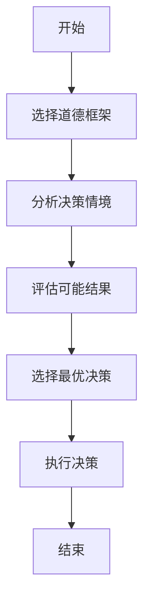
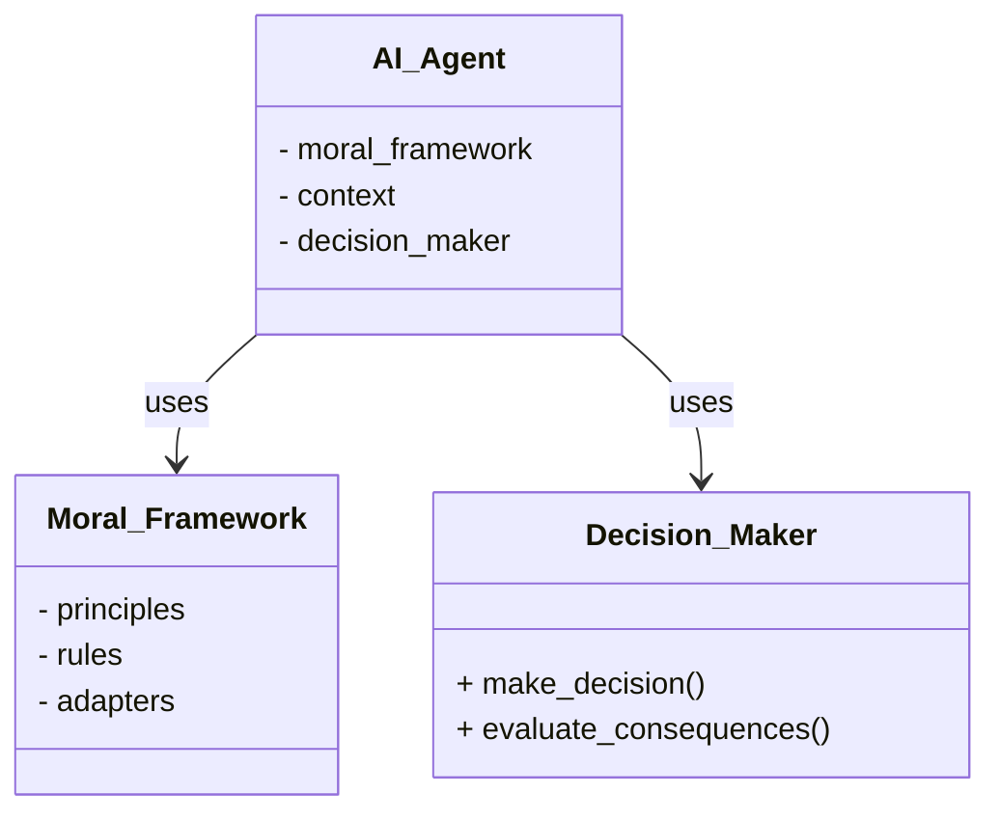
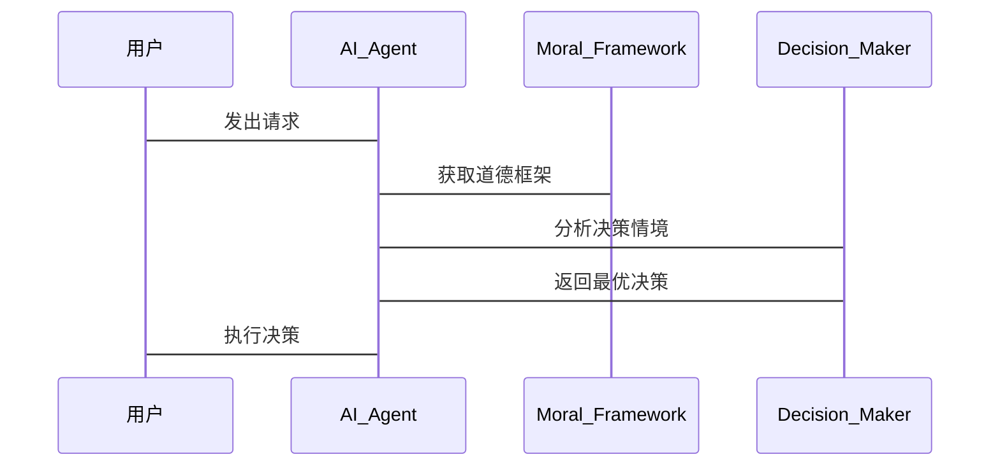

                 


```markdown
# AI Agent 的伦理决策：在 LLM 中植入道德框架

> 关键词：AI Agent，伦理决策，LLM，道德框架，伦理AI，人机交互

> 摘要：随着人工智能技术的迅速发展，AI Agent 在各个领域的应用越来越广泛。然而，AI Agent 在做出决策时，如何确保其符合伦理道德，成为一个亟待解决的问题。本文将深入探讨在 LLM（大语言模型）中植入道德框架的必要性与实现方法，从理论到实践，详细分析如何构建一个符合伦理的 AI Agent 决策系统。

---

## 第一部分: AI Agent 的伦理决策概述

### 第1章: AI Agent 的基本概念与伦理决策的重要性

#### 1.1 AI Agent 的定义与特点
- **AI Agent 的定义**：AI Agent 是指具有自主决策能力的智能体，能够感知环境并采取行动以实现特定目标。
- **AI Agent 的核心特点**：
  - 自主性：能够在没有外部干预的情况下独立运作。
  - 反应性：能够根据环境变化实时调整行为。
  - 目标导向：所有行为均以实现特定目标为导向。
  - 学习能力：能够通过经验不断优化决策策略。

- **AI Agent 的应用场景**：
  - 智能助手：如 Siri、Alexa 等。
  - 自动驾驶：如 Tesla 的自动驾驶系统。
  - 医疗决策支持：辅助医生进行诊断和治疗方案的选择。

#### 1.2 伦理决策的核心概念
- **伦理决策的定义**：在决策过程中，基于伦理原则和道德规范，选择最优的行为方式。
- **伦理决策的重要性**：
  - 确保 AI Agent 的行为符合人类社会的道德标准。
  - 避免 AI Agent 的决策对人类或社会造成负面影响。
  - 提高 AI Agent 的可信度和接受度。

- **伦理决策在 AI Agent 中的应用**：
  - 在自动驾驶中，AI Agent 需要在紧急情况下做出道德选择，如优先保护乘客还是路人。
  - 在医疗领域，AI Agent 需要确保治疗方案的伦理性和患者隐私的保护。

#### 1.3 在 LLM 中植入道德框架的必要性
- **LLM 的基本原理**：大语言模型通过深度学习技术，能够理解和生成人类语言，具备一定的推理和对话能力。
- **伦理决策在 LLM 中的挑战**：
  - LLM 的决策过程缺乏明确的伦理指导，可能导致输出内容不符合伦理标准。
  - LLM 的训练数据可能包含偏见，导致决策过程中出现伦理问题。
- **植入道德框架的意义**：
  - 确保 LLM 的输出内容符合伦理规范。
  - 提高 LLM 在复杂情境中的决策能力。
  - 为 LLM 提供明确的道德指导，避免潜在的伦理风险。

---

## 第二部分: 伦理决策的核心概念与联系

### 第2章: 道德框架的原理

#### 2.1 道德框架的定义与组成部分
- **道德框架的定义**：一套用于指导决策的伦理原则和规范的集合。
- **道德框架的组成部分**：
  - 基本原则：如诚实、公正、尊重等。
  - 具体规则：基于基本原则制定的具体行为规范。
  - 情境适应性：道德框架能够根据不同情境灵活调整决策。

#### 2.2 道德框架与伦理决策的关系
- **道德框架作为决策的基础**：伦理决策需要基于明确的道德框架，确保决策的合理性和合法性。
- **道德框架的动态调整**：在不同情境下，道德框架需要根据实际情况进行调整，以适应复杂多变的环境。

#### 2.3 道德框架与 AI Agent 的关系
- **AI Agent 依赖道德框架进行决策**：AI Agent 的决策过程需要道德框架的指导，以确保决策的伦理性和合理性。
- **道德框架对 AI Agent 的影响**：
  - 决策的正确性：道德框架能够帮助 AI Agent 做出符合伦理的决策。
  - 用户的信任度：遵循道德框架的 AI Agent 更容易获得用户的信任和接受。

### 第3章: 道德框架的属性特征

#### 3.1 道德框架的属性特征对比表格
| 属性 | 描述 |
|------|------|
| 目标导向 | 道德框架的目标是指导决策 |
| 原则导向 | 道德框架基于特定原则 |
| 情境适应性 | 道德框架能够适应不同情境 |

#### 3.2 道德框架的ER实体关系图
```mermaid
erDiagram
    actor 用户
    actor 开发者
    actor 伦理顾问
    actor 伦理框架
    actor AI Agent
    用户 --> 伦理框架 : 使用
    开发者 --> 伦理框架 : 设计
    伦理顾问 --> 伦理框架 : 审核
    伦理框架 --> AI Agent : 指导决策
```

---

## 第三部分: 伦理决策的算法原理

### 第4章: 伦理决策的算法原理

#### 4.1 伦理决策的基本流程
- **分析决策情境**：AI Agent 首先需要分析当前的决策情境，包括环境、目标、可能的行动及其后果。
- **评估可能结果**：对每个可能的行动进行评估，预测其可能的结果，并判断这些结果是否符合伦理标准。
- **选择最优决策**：基于伦理框架，选择一个最优的行动方案。
- **执行决策**：将选择的决策方案付诸实施。

#### 4.2 基于道德框架的决策算法
- **算法步骤**：
  1. 初始化道德框架。
  2. 分析当前决策情境。
  3. 评估每个可能的行动及其后果。
  4. 基于道德框架选择最优行动。
  5. 执行选择的行动。

- **算法流程图**：


#### 4.3 算法实现代码
```python
def ethical_decision-making(moral_framework, context):
    # 分析决策情境
    context_analysis = analyze_context(context)
    # 评估可能结果
    possible_actions = generate_possible_actions(context_analysis)
    # 基于道德框架选择最优决策
    selected_action = select_optimal_action(possible_actions, moral_framework)
    # 执行决策
    execute_action(selected_action)
    return selected_action
```

---

## 第四部分: 系统分析与架构设计

### 第5章: 系统分析与架构设计

#### 5.1 系统应用场景
- **自动驾驶**：AI Agent 需要在紧急情况下做出道德选择，如优先保护乘客还是路人。
- **医疗领域**：AI Agent 需要确保治疗方案的伦理性和患者隐私的保护。
- **金融领域**：AI Agent 需要确保投资决策的伦理性和合规性。

#### 5.2 系统功能设计
- **领域模型类图**：


- **系统架构图**：


- **系统交互流程图**：


---

## 第五部分: 项目实战

### 第6章: 项目实战

#### 6.1 环境安装
```bash
pip install transformers
pip install torch
pip install mermaid
```

#### 6.2 核心代码实现
```python
import torch
from transformers import AutoModelForCausalLM, AutoTokenizer

# 初始化模型和tokenizer
model_name = "facebook/llama"
model = AutoModelForCausalLM.from_pretrained(model_name)
tokenizer = AutoTokenizer.from_pretrained(model_name)

# 定义道德框架
moral_framework = {
    "principles": ["诚实", "公正", "尊重"],
    "rules": {
        "诚实": "在交流中保持真实",
        "公正": "在决策中避免偏见",
        "尊重": "尊重他人的权利和选择"
    }
}

def analyze_context(context):
    # 分析上下文
    pass

def generate_possible_actions(context_analysis):
    # 生成可能的行动
    pass

def select_optimal_action(possible_actions, moral_framework):
    # 基于道德框架选择最优行动
    pass

def execute_action(selected_action):
    # 执行决策
    pass

# 进行伦理决策
ethical_decision = ethical_decision-making(moral_framework, context)
```

#### 6.3 案例分析
- **案例1**：自动驾驶中的伦理决策。
  - **情境**：自动驾驶汽车在行驶过程中遇到紧急情况，需要在毫秒内做出决策，如是否刹车或转向。
  - **分析**：AI Agent 需要分析当前情境，评估可能的行动及其后果，并基于道德框架选择最优决策。

- **案例2**：医疗领域的伦理决策。
  - **情境**：AI Agent 需要辅助医生制定治疗方案，确保方案的伦理性和患者隐私的保护。
  - **分析**：AI Agent 需要分析患者的具体情况，评估不同治疗方案的可能后果，并基于道德框架选择最优方案。

---

## 第六部分: 总结与展望

### 第7章: 总结与展望

#### 7.1 总结
- **核心内容回顾**：
  - AI Agent 的基本概念与伦理决策的重要性。
  - 道德框架的原理与属性特征。
  - 伦理决策的算法原理与实现。
  - 系统分析与架构设计。
  - 项目实战与案例分析。

#### 7.2 未来展望
- **技术发展**：随着 AI 技术的不断进步，伦理决策的算法和道德框架将更加复杂和精细。
- **应用场景拓展**：伦理决策将在更多领域得到应用，如教育、司法、公共服务等。
- **挑战与机遇**：伦理决策的实现需要多学科的合作，同时也会带来新的技术挑战和商业机会。

---

## 第七部分: 最佳实践 tips

### 第8章: 最佳实践 tips

#### 8.1 小结
- **小结**：本文详细探讨了在 LLM 中植入道德框架的必要性与实现方法，从理论到实践，全面分析了如何构建一个符合伦理的 AI Agent 决策系统。

#### 8.2 注意事项
- **道德框架的设计**：道德框架的设计需要充分考虑不同情境和文化背景，确保其普适性和适应性。
- **算法的可解释性**：伦理决策算法需要具备较高的可解释性，以便用户理解和信任。
- **系统的安全性**：确保系统的安全性，防止恶意攻击和滥用。

#### 8.3 拓展阅读
- **推荐书籍**：
  - 《伦理学入门》
  - 《人工智能的伦理挑战》
- **推荐论文**：
  - "Ethics in AI: Challenges and Opportunities"
  - "Designing Ethical AI Systems"

---

## 作者：AI天才研究院/AI Genius Institute & 禅与计算机程序设计艺术 /Zen And The Art of Computer Programming

---

**感谢您的阅读！希望本文对您理解 AI Agent 的伦理决策有所帮助。如果需要进一步探讨或有其他问题，请随时联系！**
```

