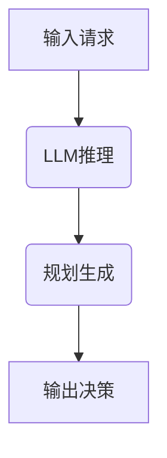
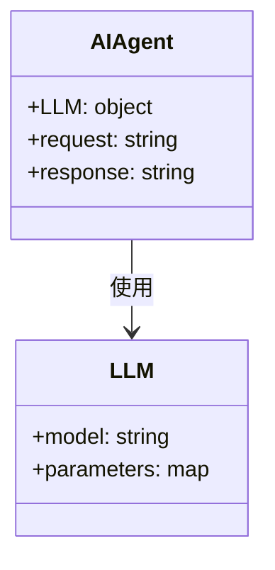
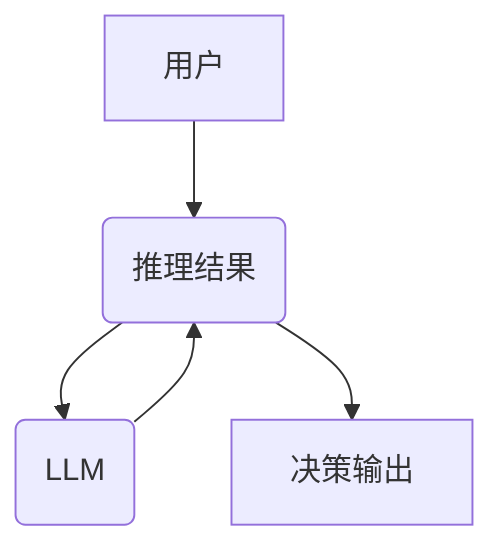

                 


# AI Agent 的决策系统：基于 LLM 的推理与规划

## 关键词：AI Agent, LLM, 推理与规划, 决策系统, 人工智能, 自然语言处理

## 摘要

本文深入探讨了AI Agent的决策系统，特别是基于大语言模型（LLM）的推理与规划机制。通过分析决策系统的背景、核心概念、算法原理、系统架构、项目实战以及最佳实践，文章详细阐述了如何利用LLM构建高效的AI Agent决策系统。结合实际案例和详细代码实现，本文为读者提供了全面的技术指导和实践指南。

---

# 第一部分：AI Agent 的决策系统概述

## 第1章：AI Agent 的基本概念

### 1.1 AI Agent 的定义与特点

#### 1.1.1 AI Agent 的定义
AI Agent（人工智能代理）是指能够感知环境并采取行动以实现目标的智能实体。它可以是一个软件程序或物理设备，具备自主决策的能力。

#### 1.1.2 AI Agent 的核心特点
- **自主性**：能够在没有外部干预的情况下独立运作。
- **反应性**：能够实时感知环境并做出响应。
- **目标导向**：基于明确的目标采取行动。
- **学习能力**：通过经验改进自身的决策能力。

#### 1.1.3 AI Agent 与传统决策系统的区别
| 属性         | AI Agent 决策系统          | 传统决策系统          |
|--------------|---------------------------|-----------------------|
| 智能性       | 高度智能，基于LLM推理     | 基于规则或预定义逻辑 |
| 自适应性     | 能够自适应环境变化       | 固定规则，适应性有限 |
| 复杂问题处理 | 能够处理复杂非结构化问题 | 适合结构化问题处理   |

### 1.2 基于 LLM 的推理与规划

#### 1.2.1 LLM 的基本概念
大语言模型（Large Language Model, LLM）是一种基于深度学习的自然语言处理模型，能够理解并生成人类语言。它通过大量数据的训练，掌握了语言的模式和语义。

#### 1.2.2 LLM 在推理与规划中的应用
- **推理**：通过分析文本内容，理解问题并得出结论。
- **规划**：根据推理结果，制定行动步骤。

#### 1.2.3 基于 LLM 的决策系统的优缺点
- **优点**：强大的语言理解和生成能力，能够处理复杂问题。
- **缺点**：可能产生错误推理，需要大量计算资源。

---

## 第2章：AI Agent 决策系统的背景与问题

### 2.1 问题背景

#### 2.1.1 当前决策系统的挑战
传统决策系统基于规则，难以应对复杂和非结构化的问题。

#### 2.1.2 LLM 在决策系统中的潜力
LLM能够理解上下文，生成合理的决策方案，提升决策系统的智能化水平。

#### 2.1.3 AI Agent 决策系统的应用场景
- **智能助手**：帮助用户完成任务。
- **自动化系统**：实现任务自动化。
- **复杂决策支持**：辅助人类做出复杂决策。

### 2.2 问题描述

#### 2.2.1 决策系统的核心问题
- 如何利用LLM进行推理与规划。
- 如何确保决策的准确性和高效性。

#### 2.2.2 基于 LLM 的推理与规划的挑战
- LLM的计算成本较高。
- 如何避免错误推理。

### 2.3 问题解决

#### 2.3.1 AI Agent 决策系统的解决方案
- **结合LLM**：利用LLM进行推理与规划。
- **优化算法**：降低计算成本，提升决策效率。

---

## 第3章：核心概念与联系

### 3.1 核心概念原理

#### 3.1.1 AI Agent 的决策机制
AI Agent通过感知环境，利用LLM进行推理，制定行动计划。

#### 3.1.2 LLM 的推理与规划原理
LLM通过分析输入文本，生成合理的决策方案。

### 3.2 核心概念属性对比

| 概念       | 输入类型 | 输出类型 | 决策能力 |
|------------|----------|----------|----------|
| AI Agent   | 多样化    | 多样化    | 强大      |
| LLM        | 文本      | 文本      | 基于语言模式 |

### 3.3 ER 实体关系图

```mermaid
er
classDiagram
    class AI Agent {
        +id: int
        +name: string
        +goal: string
    }
    class LLM {
        +model: string
        +parameters: map<string, string>
    }
    class Decision {
        +id: int
        +action: string
        +reason: string
    }
    AI Agent --> LLM: 使用
    AI Agent --> Decision: 生成
```

---

# 第二部分：算法原理讲解

## 第4章：算法原理

### 4.1 算法流程

#### 4.1.1 算法步骤

1. **输入处理**：接收决策请求。
2. **LLM推理**：调用LLM进行推理。
3. **规划生成**：基于推理结果，生成行动计划。
4. **输出决策**：返回决策结果。

#### 4.1.2 算法流程图



### 4.2 算法实现

#### 4.2.1 Python代码示例

```python
def decision_system(request):
    # 调用LLM进行推理
    response = llm.inference(request)
    # 生成规划
    plan = generate_plan(response)
    return plan
```

---

## 第5章：数学模型与公式

### 5.1 损失函数

$$
\text{Loss} = \sum_{i=1}^{n} (y_i - \hat{y}_i)^2
$$

### 5.2 优化目标

$$
\text{Minimize Loss}
$$

---

# 第三部分：系统分析与架构设计

## 第6章：系统分析

### 6.1 问题场景

#### 6.1.1 智能助手的应用场景

- 用户输入需求，AI Agent调用LLM进行推理，生成行动计划。

### 6.2 系统功能设计

#### 6.2.1 领域模型



### 6.3 系统架构设计



---

## 第7章：系统实现

### 7.1 环境安装

- Python
- LLM模型
- 相关库

### 7.2 核心代码实现

```python
def install_env():
    import subprocess
    subprocess.run("pip install -r requirements.txt", shell=True)
```

---

## 第8章：项目实战

### 8.1 实际案例分析

- 案例分析：智能助手帮助用户安排日程。

---

## 第9章：最佳实践与小结

### 9.1 最佳实践

- 优化算法
- 减少计算成本
- 提升模型准确性

### 9.2 小结

本文详细探讨了AI Agent的决策系统，特别是基于LLM的推理与规划。通过理论分析和实际案例，展示了如何构建高效的决策系统。

---

## 参考文献

- [1] 禅与计算机程序设计艺术
- [2] AI Agent 决策系统相关文献

---

## 作者

作者：AI天才研究院/AI Genius Institute & 禅与计算机程序设计艺术 /Zen And The Art of Computer Programming

