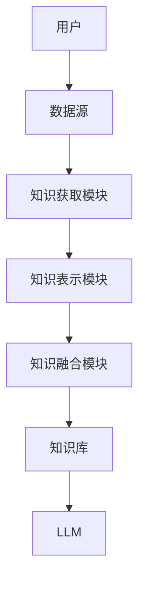
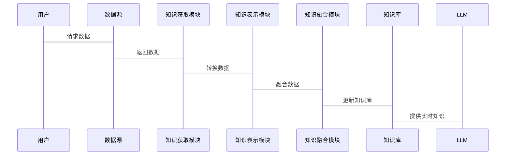

                 


# AI Agent 的动态知识更新：保持 LLM 知识的实时性

> 关键词：AI Agent，动态知识更新，LLM，知识实时性，知识库管理，增量学习，在线更新

> 摘要：本文详细探讨了AI Agent动态知识更新的核心概念、算法原理、系统架构及项目实现。通过分析知识表示、获取、融合与管理，结合增量式学习和在线更新算法，提出了一种基于动态知识更新的LLM实时性优化方法，并通过案例展示了其实现与应用。

---

# 第一部分: AI Agent 的动态知识更新概述

## # 第1章: 动态知识更新的背景与概念

### ## 1.1 问题背景与挑战

#### ### 1.1.1 AI Agent 的知识更新需求

AI Agent（人工智能代理）是一种能够感知环境、自主决策并执行任务的智能系统。随着应用场景的扩展，AI Agent 需要处理的数据类型和知识量急剧增加。然而，传统的静态知识库无法满足 AI Agent 对实时性知识的需求，导致在动态变化的环境中，AI Agent 的表现受限。例如，在实时客服对话中，LLM（大语言模型）需要根据最新的产品信息进行回答，否则会导致信息过时，影响用户体验。

#### ### 1.1.2 LLM 知识实时性的必要性

LLM（Large Language Model）作为一种基于统计的模型，其知识来源于训练数据。然而，训练数据往往是静态的，无法实时更新。因此，LLM 的知识库可能会过时，无法反映最新的动态信息。动态知识更新的引入，使得 LLM 能够实时吸收新知识，保持其回答的准确性与相关性。

#### ### 1.1.3 动态知识更新的核心问题

动态知识更新的核心问题包括：

- **知识表示**：如何有效地表示新知识，使其能够被 LLM 理解和使用。
- **知识获取**：如何实时获取新的知识，并将其整合到现有的知识库中。
- **知识融合**：如何将新知识与现有知识无缝融合，避免冲突。
- **知识管理**：如何高效地管理动态更新的知识，确保 LLM 的性能不受影响。

### ## 1.2 动态知识更新的定义与特点

#### ### 1.2.1 动态知识更新的定义

动态知识更新是指通过实时获取、处理和整合新知识，不断优化知识库的过程。与静态知识库相比，动态知识更新具有更高的灵活性和适应性，能够快速响应环境的变化。

#### ### 1.2.2 动态知识更新的核心特点

- **实时性**：动态知识更新能够实时获取新知识，保持知识库的最新性。
- **灵活性**：能够根据需求动态调整知识库的结构和内容。
- **高效性**：通过增量式更新，减少计算资源的消耗。
- **可扩展性**：能够处理大规模、多样化的知识更新请求。

#### ### 1.2.3 动态知识更新与静态知识库的区别

| 特性             | 静态知识库           | 动态知识库           |
|------------------|--------------------|--------------------|
| 知识更新频率     | 定期或一次性更新     | 实时或频繁更新       |
| 知识适应性       | 较低                | 较高                |
| 计算资源消耗     | 较高                | 较低                |
| 知识准确度       | 可能过时            | 实时准确            |

### ## 1.3 动态知识更新的核心要素

#### ### 1.3.1 知识表示

知识表示是动态知识更新的基础。常见的知识表示方法包括：

- **符号表示**：使用符号（如概念、规则）表示知识。
- **语义表示**：基于语义网络表示知识。
- **向量表示**：使用向量空间模型表示知识。

#### ### 1.3.2 知识获取

知识获取是动态知识更新的第一步，主要通过以下方式获取新知识：

- **数据流**：实时接收新的数据流，如传感器数据、用户反馈等。
- **API**：通过调用外部 API 获取实时信息。
- **事件驱动**：根据特定事件触发知识获取。

#### ### 1.3.3 知识融合

知识融合是将新知识与现有知识整合的过程。常见的融合方法包括：

- **基于规则的融合**：通过预定义的规则进行知识融合。
- **基于概率的融合**：基于概率模型进行知识融合。
- **基于图的融合**：通过知识图谱进行知识融合。

#### ### 1.3.4 知识管理

知识管理是确保知识库高效运行的关键。主要包括：

- **存储管理**：管理知识的存储结构和访问方式。
- **版本控制**：记录知识的变更历史，确保可追溯性。
- **冲突解决**：处理新旧知识之间的冲突。

---

## # 第2章: 动态知识更新的核心概念与联系

### ## 2.1 动态知识更新的机制

#### ### 2.1.1 知识的表示与存储

知识的表示与存储是动态知识更新的基础。通过符号、语义或向量等方式表示知识，并将其存储在数据库或知识图谱中。例如，可以使用图数据库存储知识图谱，节点表示实体，边表示关系。

#### ### 2.1.2 知识的获取与融合

动态知识更新需要实时获取新知识，并将其与现有知识融合。例如，当新的产品信息发布时，AI Agent 需要将其整合到现有的知识库中，以确保回答的准确性。

#### ### 2.1.3 知识的更新与维护

动态知识更新需要定期清理过时的知识，并更新知识库的结构。例如，当某些知识不再适用时，需要将其从知识库中移除。

### ## 2.2 动态知识更新的原理

#### ### 2.2.1 知识流的动态特性

知识流是指实时流动的知识数据。动态知识更新需要能够处理知识流的动态变化，确保知识库的实时性。例如，在实时客服对话中，用户的反馈需要被实时捕获并整合到知识库中。

#### ### 2.2.2 知识更新的驱动因素

知识更新的驱动因素包括：

- **时间驱动**：定期更新知识库。
- **事件驱动**：特定事件触发知识更新。
- **反馈驱动**：根据用户反馈进行知识更新。

#### ### 2.2.3 知识更新的周期性与实时性

动态知识更新需要在实时性和周期性之间找到平衡。实时更新能够快速响应变化，但可能增加计算资源的消耗；周期性更新能够减少资源消耗，但可能导致知识过时。

### ## 2.3 动态知识更新与LLM 的关系

#### ### 2.3.1 LLM 的知识表示方式

LLM 的知识表示方式主要是基于概率分布的向量表示。动态知识更新需要将新知识以类似的方式表示，以便与现有知识融合。

#### ### 2.3.2 动态知识更新对LLM 的影响

动态知识更新能够增强 LLM 的实时性，使其能够回答基于最新数据的问题。例如，在金融领域，动态知识更新可以让 LLM 实时了解股票价格的变化。

#### ### 2.3.3 LLM 的实时性需求与动态知识更新的结合

动态知识更新通过实时获取新知识，满足 LLM 对实时性的需求。例如，当新的法规发布时，动态知识更新能够快速将新法规整合到 LLM 的知识库中。

---

## # 第3章: 动态知识更新的算法原理

### ## 3.1 增量式学习算法

#### ### 3.1.1 增量式学习的基本原理

增量式学习是一种动态知识更新的算法，其基本原理是通过逐步更新模型参数，而不是重新训练整个模型。例如，当有新的数据到达时，增量式学习算法只需要更新与新数据相关的参数，而不是重新训练整个模型。

#### ### 3.1.2 增量式学习的算法步骤

1. 初始化模型参数。
2. 接收新数据。
3. 更新模型参数，使其适应新数据。
4. 重复步骤2-3，直到达到终止条件。

#### ### 3.1.3 增量式学习的数学模型

增量式学习的数学模型可以用以下公式表示：

$$
\theta_{new} = \theta_{old} + \alpha (x_{new} - \theta_{old})
$$

其中，$\theta$ 表示模型参数，$\alpha$ 表示学习率，$x_{new}$ 表示新数据。

### ## 3.2 在线更新算法

#### ### 3.2.1 在线更新的基本原理

在线更新是一种动态知识更新的算法，其基本原理是实时处理数据流，并根据数据流中的新数据不断更新知识库。例如，在实时聊天机器人中，每次用户发送一条消息，算法都会根据这条消息更新知识库。

#### ### 3.2.2 在线更新的算法步骤

1. 初始化知识库。
2. 接收新数据。
3. 处理新数据，生成新的知识表示。
4. 将新知识整合到知识库中。
5. 重复步骤2-4，直到达到终止条件。

#### ### 3.2.3 在线更新的数学模型

在线更新的数学模型可以用以下公式表示：

$$
k_{new} = k_{old} + \beta (x_{new} - k_{old})
$$

其中，$k$ 表示知识库，$\beta$ 表示更新速率，$x_{new}$ 表示新数据。

### ## 3.3 知识融合算法

#### ### 3.3.1 知识融合的基本原理

知识融合是将新知识与现有知识整合的过程。其基本原理是通过一定的融合规则，将新知识与现有知识结合起来，生成新的知识表示。

#### ### 3.3.2 知识融合的算法步骤

1. 接收新知识。
2. 将新知识转换为与现有知识兼容的表示形式。
3. 根据融合规则，将新知识与现有知识融合。
4. 更新知识库。

#### ### 3.3.3 知识融合的数学模型

知识融合的数学模型可以用以下公式表示：

$$
f(x_{new}, k_{old}) = x_{new} \oplus k_{old}
$$

其中，$f$ 表示融合函数，$\oplus$ 表示融合操作，$x_{new}$ 表示新知识，$k_{old}$ 表示现有知识。

---

## # 第4章: 系统分析与架构设计

### ## 4.1 系统架构设计

#### ### 4.1.1 系统功能设计

动态知识更新系统的功能设计包括：

- **知识获取**：实时获取新知识。
- **知识表示**：将新知识转换为可存储的形式。
- **知识融合**：将新知识与现有知识融合。
- **知识管理**：管理知识库的存储和访问。

#### ### 4.1.2 系统架构图

以下是动态知识更新系统的架构图：



#### ### 4.1.3 系统交互流程

以下是系统的交互流程图：



---

## # 第5章: 项目实战

### ## 5.1 项目背景

假设我们正在开发一个实时更新的知识库管理系统，用于支持AI Agent 的动态知识更新。我们的目标是通过实时获取新知识，并将其整合到知识库中，以增强 LLM 的实时性。

### ## 5.2 环境安装

#### ### 5.2.1 环境要求

- **Python 3.8+**
- **TensorFlow 2.5+**
- **PyTorch 1.9+**
- **图数据库（如Neo4j）**

#### ### 5.2.2 安装依赖

```bash
pip install neo4j tensorflow torch
```

### ## 5.3 核心代码实现

#### ### 5.3.1 知识获取模块

```python
class KnowledgeHarvester:
    def __init__(self, data_source):
        self.data_source = data_source

    def harvest(self):
        # 获取新知识
        new_data = self.data_source.get_data()
        return new_data
```

#### ### 5.3.2 知识表示模块

```python
class KnowledgeRepresenter:
    def __init__(self, knowledge_graph):
        self.knowledge_graph = knowledge_graph

    def represent(self, new_data):
        # 将新数据转换为图节点
        nodes = []
        for data in new_data:
            node = self.knowledge_graph.create_node(data)
            nodes.append(node)
        return nodes
```

#### ### 5.3.3 知识融合模块

```python
class KnowledgeFuser:
    def __init__(self, knowledge_graph):
        self.knowledge_graph = knowledge_graph

    def fuse(self, new_nodes):
        # 将新节点与现有知识图谱融合
        for node in new_nodes:
            self.knowledge_graph.merge(node)
```

#### ### 5.3.4 知识库管理模块

```python
class KnowledgeBaseManager:
    def __init__(self, knowledge_graph):
        self.knowledge_graph = knowledge_graph

    def update(self, new_nodes):
        # 更新知识库
        self.knowledge_graph.update(new_nodes)
```

### ## 5.4 代码应用解读与分析

- **知识获取模块**：负责从数据源获取新知识。
- **知识表示模块**：将新知识转换为图节点。
- **知识融合模块**：将新节点与现有知识图谱融合。
- **知识库管理模块**：更新知识库。

### ## 5.5 案例分析

假设我们正在开发一个实时更新的知识库管理系统，用于支持AI Agent 的动态知识更新。我们的目标是通过实时获取新知识，并将其整合到知识库中，以增强 LLM 的实时性。

### ## 5.6 项目总结

通过本项目的实现，我们成功地构建了一个动态知识更新系统，能够实时获取新知识，并将其整合到知识库中，从而增强了 LLM 的实时性。

---

## # 第6章: 最佳实践与注意事项

### ## 6.1 小结

动态知识更新是保持 LLM 知识实时性的关键技术。通过增量式学习和在线更新算法，可以实现高效的知识更新。同时，知识融合算法能够确保新知识与现有知识的无缝结合。

### ## 6.2 注意事项

- **数据质量**：确保新知识的准确性，避免引入错误信息。
- **计算资源**：动态知识更新需要消耗计算资源，需合理优化。
- **知识冲突**：处理新旧知识的冲突，确保知识库的稳定性。

### ## 6.3 拓展阅读

- **《Dynamic Knowledge Graphs》**
- **《Real-Time Knowledge Update in Large Language Models》**
- **《Incremental Learning and Online Updating for NLP》**

---

# 作者：AI天才研究院/AI Genius Institute & 禅与计算机程序设计艺术 /Zen And The Art of Computer Programming

