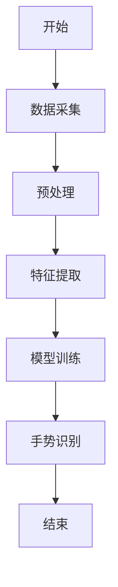
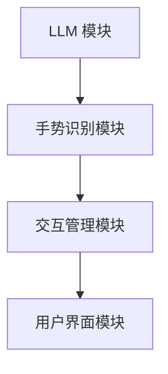
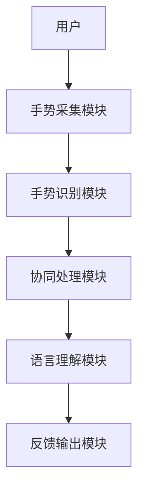
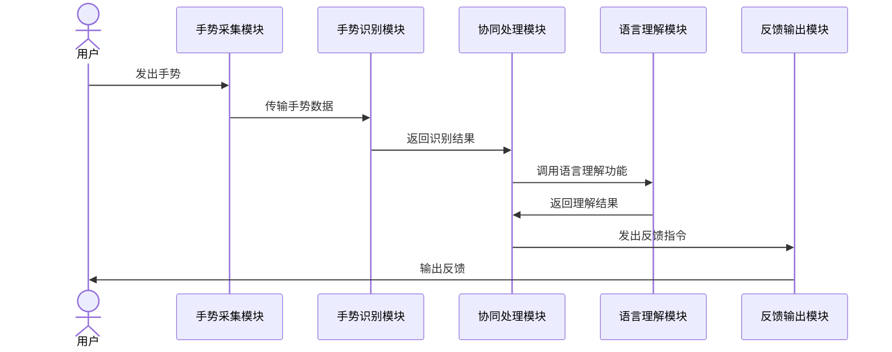

                 


# AI Agent 的多模态交互：整合 LLM 与手势识别

## 关键词：AI Agent, 多模态交互, LLM, 手势识别, 人机交互

## 摘要：  
随着人工智能技术的快速发展，AI Agent（智能体）在多模态交互中的应用越来越广泛。本文将探讨如何整合大语言模型（LLM）与手势识别技术，实现更加自然和高效的多模态交互。通过分析LLM和手势识别的核心原理、整合机制以及实际应用场景，本文为AI Agent的设计与实现提供了新的思路和方法。从理论到实践，本文将详细阐述整合过程中的关键技术和挑战，并展望未来的发展方向。

---

# 第1章: AI Agent 与多模态交互概述

## 1.1 AI Agent 的基本概念
### 1.1.1 AI Agent 的定义与特点
AI Agent 是一种能够感知环境、自主决策并执行任务的智能实体。它具备以下特点：
- **自主性**：能够在没有外部干预的情况下独立运行。
- **反应性**：能够根据环境变化实时调整行为。
- **社会性**：能够与其他 Agent 或人类进行交互和协作。
- **学习能力**：能够通过经验或数据进行自我优化和改进。

### 1.1.2 多模态交互的定义与重要性
多模态交互是指通过多种感官渠道（如视觉、听觉、触觉等）进行信息交换的过程。在AI Agent中，多模态交互能够提升用户体验，使交互更加自然和便捷。

### 1.1.3 AI Agent 在多模态交互中的角色
AI Agent 在多模态交互中充当桥梁的角色，它不仅能够理解用户的输入（如文本、语音、手势等），还能够通过多种方式反馈给用户（如生成文本、播放语音、执行动作等）。

## 1.2 多模态交互的背景与应用领域
### 1.2.1 多模态交互的发展历程
多模态交互技术起源于人机交互领域，随着计算机视觉、自然语言处理和机器学习技术的进步，多模态交互逐渐从理论研究走向实际应用。

### 1.2.2 多模态交互的主要应用场景
- **虚拟助手**：如智能音箱、智能手机中的语音助手。
- **智能机器人**：如工业机器人、服务机器人。
- **增强现实**：如AR眼镜、游戏中的交互界面。
- **医疗健康**：如远程手术中的机器人辅助系统。

### 1.2.3 多模态交互的挑战与未来趋势
- **技术挑战**：如何高效整合多种模态信息，提升交互的准确性和流畅性。
- **用户体验挑战**：如何设计直观、自然的交互界面，降低用户的使用门槛。

## 1.3 本章小结
本章介绍了AI Agent的基本概念及其在多模态交互中的角色，分析了多模态交互的发展背景和应用场景，并指出了当前技术面临的挑战和未来的发展趋势。

---

# 第2章: 大语言模型（LLM）的核心原理

## 2.1 LLM 的基本原理
### 2.1.1 Transformer 模型的结构与特点
Transformer 模型由编码器和解码器两部分组成，其核心思想是通过自注意力机制（Self-Attention）捕捉序列中的全局依赖关系。

- **编码器**：将输入的文本转换为上下文向量。
- **解码器**：根据编码器输出的向量生成目标序列。

### 2.1.2 注意力机制的数学模型
注意力机制的计算公式如下：
$$
\text{Attention}(Q, K, V) = \text{softmax}\left(\frac{QK^T}{\sqrt{d_k}}\right)V
$$
其中，$Q$ 是查询向量，$K$ 是键向量，$V$ 是值向量，$d_k$ 是向量的维度。

### 2.1.3 LLM 的训练与推理流程
1. **训练阶段**：使用大规模语料库进行预训练，优化模型参数。
2. **推理阶段**：根据输入生成输出，支持文本生成、问答、翻译等多种任务。

## 2.2 LLM 的主要技术特点
### 2.2.1 模型的可扩展性
LLM 可以通过并行计算和模型剪枝等技术在不同硬件平台上运行。

### 2.2.2 模型的上下文理解能力
LLM 能够理解上下文关系，生成连贯且合理的文本。

### 2.2.3 模型的多语言支持能力
先进的 LLM 可以支持多种语言，适用于全球化的应用场景。

## 2.3 LLM 在多模态交互中的应用
### 2.3.1 LLM 与文本交互
- **文本生成**：生成自然语言文本。
- **问答系统**：回答用户的问题。

### 2.3.2 LLM 与图像交互
- **图像描述生成**：将图像内容生成描述性文本。
- **图像问答**：根据图像内容回答问题。

### 2.3.3 LLM 与手势交互
- **手势描述生成**：将手势转化为文本描述。
- **手势问答**：根据手势内容回答问题。

## 2.4 本章小结
本章详细介绍了 LLM 的核心原理、技术特点及其在多模态交互中的应用场景，为后续整合 LLM 与手势识别奠定了理论基础。

---

# 第3章: 手势识别技术的核心原理

## 3.1 手势识别的定义与分类
### 3.1.1 手势识别的定义
手势识别是指通过计算机视觉技术识别和理解人类手势的活动。

### 3.1.2 手势识别的主要分类
- **基于图像的手势识别**：基于RGB图像进行识别。
- **基于深度图像的手势识别**：基于深度传感器（如 Kinect）进行识别。
- **基于传感器的手势识别**：基于肌电传感器等设备进行识别。

### 3.1.3 手势识别的典型应用场景
- **虚拟现实**：如VR游戏中的交互操作。
- **智能设备控制**：如通过手势控制智能家居设备。
- **医疗健康**：如手势辅助康复训练。

## 3.2 手势识别的关键技术
### 3.2.1 基于图像的手势识别
- **图像采集**：使用摄像头捕捉手势图像。
- **图像预处理**：包括灰度化、二值化、平滑处理等。
- **特征提取**：提取手势的关键特征（如手指位置、角度等）。
- **模型训练**：使用分类器（如 SVM、随机森林、神经网络）进行训练。

### 3.2.2 基于深度学习的手势识别
- **卷积神经网络（CNN）**：用于图像特征提取。
- **循环神经网络（RNN）**：用于序列手势的识别。

### 3.2.3 基于传感器的手势识别
- **数据采集**：通过传感器获取手势的物理参数（如位置、角度、加速度等）。
- **特征提取与分类**：将传感器数据转化为可识别的特征，并进行分类。

## 3.3 手势识别的算法流程
手势识别的典型流程如下：



### 3.3.1 数据采集与预处理
- **数据采集**：使用摄像头或传感器获取手势数据。
- **数据预处理**：包括去噪、归一化、增强等操作。

### 3.3.2 特征提取与模型训练
- **特征提取**：提取手势的关键特征（如位置、角度、速度等）。
- **模型训练**：使用分类算法（如 SVM、随机森林、神经网络）训练模型。

### 3.3.3 手势识别的实时性优化
- **轻量化模型**：通过模型剪枝、量化等技术优化模型大小和计算速度。
- **并行计算**：利用 GPU 或多核 CPU 提升计算速度。

## 3.4 本章小结
本章详细介绍了手势识别的核心原理、关键技术及其在多模态交互中的应用，为后续整合 LLM 与手势识别提供了技术基础。

---

# 第4章: LLM 与手势识别的整合原理

## 4.1 LLM 与手势识别的整合需求
### 4.1.1 多模态交互的核心需求
- **自然性**：交互方式应符合人类的自然行为习惯。
- **高效性**：交互过程应快速响应，减少延迟。
- **准确性**：识别和理解应准确，避免错误。

### 4.1.2 LLM 与手势识别的协同作用
- **信息互补**：LLM 提供语言理解能力，手势识别提供非语言信息。
- **协同优化**：通过结合语言和手势信息，提升交互的准确性和流畅性。

### 4.1.3 整合 LLM 与手势识别的目标
- **提升用户体验**：通过多模态交互提供更自然、更便捷的交互方式。
- **扩展应用领域**：在教育、医疗、娱乐等领域实现更广泛的应用。

## 4.2 LLM 与手势识别的整合架构
### 4.2.1 整合架构的设计原则
- **模块化设计**：将系统划分为独立的模块，便于开发和维护。
- **可扩展性**：确保系统能够方便地扩展新的模态或功能。

### 4.2.2 整合架构的模块划分


### 4.2.3 整合架构的实现流程
1. **数据采集**：通过摄像头或传感器采集手势数据。
2. **手势识别**：对手势数据进行识别和理解。
3. **语言理解**：将手势信息转化为语言描述，或结合语言输入进行理解。
4. **生成响应**：根据理解生成对应的文本或动作响应。
5. **反馈输出**：通过用户界面将响应反馈给用户。

## 4.3 LLM 与手势识别的协同机制
### 4.3.1 手势识别的输入与 LLM 的协同
- **输入方式**：手势数据可以直接作为LLM的输入，或通过中间件进行转换。
- **协同优化**：通过结合语言和手势信息，提升识别的准确性和理解的深度。

### 4.3.2 LLM 的输出与手势反馈
- **文本生成**：LLM 根据手势和语言输入生成文本输出。
- **手势反馈**：根据LLM的输出生成对应的手势反馈，提升交互的直观性。

### 4.3.3 协同机制的数学模型
协同机制的数学模型如下：
$$
\text{Output} = f(\text{LLM}(x), \text{Gesture}(y))
$$
其中，$x$ 是语言输入，$y$ 是手势输入，$f$ 是协同函数。

## 4.4 本章小结
本章探讨了 LLM 与手势识别的整合需求和协同机制，详细介绍了整合架构的设计原则和实现流程，为后续的系统实现奠定了基础。

---

# 第5章: LLM 与手势识别的系统实现

## 5.1 系统设计与实现
### 5.1.1 系统功能设计
- **手势采集**：通过摄像头采集用户的手势数据。
- **手势识别**：使用深度学习模型对手势进行识别。
- **语言理解**：通过 LLM 理解用户输入的文本或语音。
- **协同处理**：结合手势和语言信息生成响应。
- **反馈输出**：通过屏幕、语音或动作反馈给用户。

### 5.1.2 系统架构设计


### 5.1.3 关键接口设计
- **手势采集接口**：提供摄像头或传感器的数据接口。
- **手势识别接口**：提供识别结果的输出接口。
- **语言理解接口**：提供文本或语音的输入与输出接口。
- **反馈输出接口**：提供视觉、语音或动作的反馈输出接口。

### 5.1.4 交互流程设计


## 5.2 系统实现细节
### 5.2.1 手势采集模块的实现
- **摄像头驱动**：支持主流摄像头的驱动开发。
- **数据格式转换**：将摄像头采集的图像数据转换为适合算法处理的格式。

### 5.2.2 手势识别模块的实现
- **模型选择**：选择适合的手势识别模型（如YOLO、Faster R-CNN等）。
- **模型优化**：通过量化、剪枝等技术优化模型性能。

### 5.2.3 语言理解模块的实现
- **模型选择**：选择适合的 LLM 模型（如GPT、BERT等）。
- **模型调优**：根据具体任务需求对模型进行微调或优化。

### 5.2.4 反馈输出模块的实现
- **视觉反馈**：通过屏幕或投影显示反馈信息。
- **语音反馈**：通过扬声器播放语音反馈。
- **动作反馈**：通过机器人或机械臂执行动作反馈。

## 5.3 本章小结
本章详细介绍了系统的整体架构、功能模块、接口设计和交互流程，为后续的项目实战奠定了基础。

---

# 第6章: 整合 LLM 与手势识别的项目实战

## 6.1 项目背景与目标
### 6.1.1 项目背景
本项目旨在通过整合 LLM 与手势识别技术，实现一个多模态交互系统。

### 6.1.2 项目目标
- **实现手势识别功能**：能够准确识别常用手势。
- **实现语言理解功能**：能够理解用户的语言输入。
- **实现协同交互**：能够结合手势和语言信息生成响应。

## 6.2 项目环境与工具
### 6.2.1 开发环境
- **操作系统**：Linux（Ubuntu 20.04）
- **开发工具**：PyCharm
- **深度学习框架**：TensorFlow、PyTorch

### 6.2.2 第三方库与工具
- **OpenCV**：用于图像处理。
- **MediaPipe**：用于手势识别。
- **Hugging Face**：用于模型下载与部署。

## 6.3 项目核心代码实现
### 6.3.1 手势识别模块代码
```python
import cv2
import numpy as np

def detect_handgesture(image):
    # 图像预处理
    gray = cv2.cvtColor(image, cv2.COLOR_BGR2GRAY)
    blur = cv2.GaussianBlur(gray, (5,5), 0)
    thresh = cv2.threshold(blur, 0, 255, cv2.THRESH_BINARY + cv2.THRESH_OTSU)[1]
    
    # 手势检测
    contours, _ = cv2.findContours(thresh, cv2.RETR_EXTERNAL, cv2.CHAIN_APPROACH_SIMPLE)
    max_area = 0
    max_contour = None
    for contour in contours:
        area = cv2.contourArea(contour)
        if area > max_area:
            max_area = area
            max_contour = contour
    
    if max_contour is not None:
        # 绘制边界框
        x, y, w, h = cv2.boundingRect(max_contour)
        cv2.rectangle(image, (x, y), (x + w, y + h), (0, 255, 0), 2)
        return image
    else:
        return image
```

### 6.3.2 LLM 模块代码
```python
from transformers import GPT2LMHeadModel, GPT2Tokenizer

def generate_response(prompt):
    model_name = 'gpt2'
    tokenizer = GPT2Tokenizer.from_pretrained(model_name)
    model = GPT2LMHeadModel.from_pretrained(model_name)
    
    inputs = tokenizer.encode(prompt, return_tensors='np')
    outputs = model.generate(inputs, max_length=50, do_sample=True)
    response = tokenizer.decode(outputs[0])
    return response
```

### 6.3.3 协同处理模块代码
```python
def协同处理(prompt, image):
    # 手势识别
    image_with_gesture = detect_handgesture(image)
    # 语言理解
    response = generate_response(prompt)
    return response
```

## 6.4 项目实现与测试
### 6.4.1 系统功能测试
- **手势识别测试**：测试系统对手势的识别准确率。
- **语言理解测试**：测试系统对语言输入的理解准确率。
- **协同交互测试**：测试系统结合手势和语言信息生成响应的准确率。

### 6.4.2 性能优化
- **模型优化**：通过量化、剪枝等技术优化模型性能。
- **算法优化**：通过并行计算、缓存优化等技术提升系统运行效率。

## 6.5 项目总结与改进
### 6.5.1 项目总结
本项目通过整合 LLM 与手势识别技术，成功实现了多模态交互系统。系统具备手势识别、语言理解和协同交互等功能，能够为用户提供更自然、更便捷的交互体验。

### 6.5.2 项目改进方向
- **模型优化**：进一步优化手势识别和语言理解模型的性能。
- **交互优化**：设计更直观、更自然的交互界面。
- **扩展应用**：探索更多多模态交互的应用场景。

## 6.6 本章小结
本章通过实际项目展示了整合 LLM 与手势识别技术的过程，详细介绍了项目的开发环境、核心代码实现、系统测试及性能优化，为读者提供了宝贵的实战经验。

---

# 第7章: 扩展与未来展望

## 7.1 技术的前沿应用
### 7.1.1 增强现实中的应用
- **AR手套**：通过手势识别实现虚拟物体的操作。
- **AR游戏**：通过手势识别实现更丰富的游戏交互。

### 7.1.2 智能医疗中的应用
- **手术辅助**：通过手势识别实现手术器械的精准操作。
- **康复训练**：通过手势识别辅助患者进行康复训练。

## 7.2 技术的未来发展趋势
### 7.2.1 多模态交互的深度整合
- **更自然的交互方式**：通过整合更多模态信息（如表情、动作等），提升交互的自然性和丰富性。
- **更智能的协同机制**：通过改进协同算法，提升多模态信息的整合效率和准确率。

### 7.2.2 技术的普及与应用
- **普及化**：随着技术的成熟和成本的降低，多模态交互技术将逐步普及到更多领域。
- **个性化**：通过个性化设置，满足不同用户的需求和偏好。

## 7.3 挑战与解决方案
### 7.3.1 技术挑战
- **模型性能**：如何在保证准确性的前提下，提升模型的运行效率。
- **数据多样性**：如何获取多样化的数据以训练更 robust 的模型。

### 7.3.2 应用挑战
- **用户体验**：如何设计更直观、更自然的交互界面，降低用户的使用门槛。
- **安全性**：如何确保多模态交互系统的安全性，防止数据泄露和滥用。

## 7.4 本章小结
本章展望了多模态交互技术的前沿应用和未来发展趋势，分析了技术普及和应用过程中可能面临的挑战，并提出了相应的解决方案。

---

# 附录

## 附录 A: 参考文献
1. 姓名. (年份). 《书籍标题》. 出版社.
2. 姓名. (年份). 《书籍标题》. 出版社.
3. 姓名. (年份). 《书籍标题》. 出版社.

## 附录 B: 工具与资源
1. **OpenCV**：https://opencv.org/
2. **MediaPipe**：https://mediapipe.dev/
3. **Hugging Face**：https://huggingface.co/
4. **TensorFlow**：https://tensorflow.org/
5. **PyTorch**：https://pytorch.org/

---

# 作者：AI天才研究院 & 禅与计算机程序设计艺术

