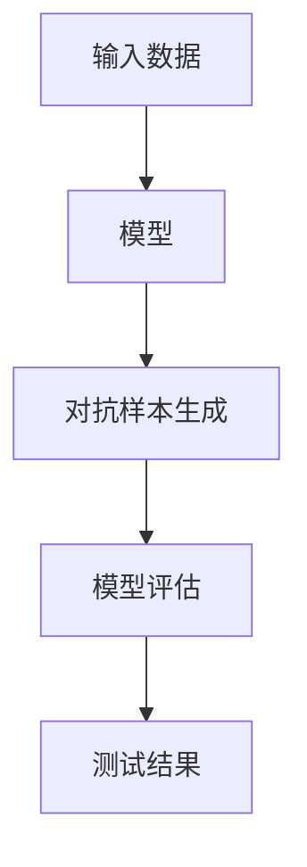
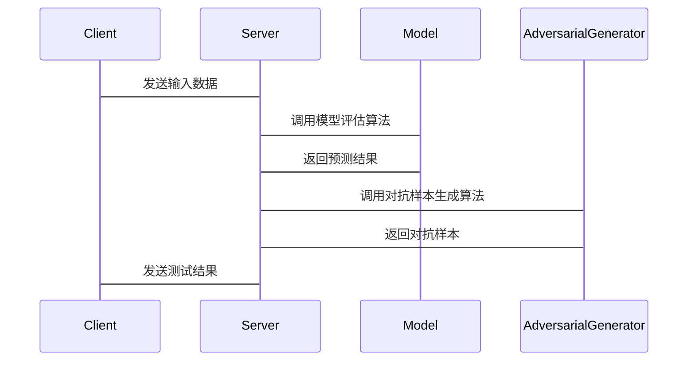

                 

<think>
好，我现在需要帮用户撰写一篇关于《AI Agent 的对抗性测试：提高 LLM 的鲁棒性》的技术博客。首先，我需要明确文章的结构，按照用户提供的目录大纲来展开。我注意到用户要求文章包含引言、核心概念、算法原理、数学模型、系统架构、项目实战、总结等部分，并且每个部分都要有详细的内容，包括图表和代码示例。

首先，我应该从引言开始，介绍对抗性测试的重要性以及当前大语言模型的局限性。这部分需要让读者明白为什么需要进行对抗性测试，以及它对提高模型鲁棒性的关键作用。

接下来是核心概念，这里需要详细讲解对抗性测试的基本原理、生成对抗样本的方法以及评估模型鲁棒性的标准。我应该用一些图表，比如对抗性测试的分类框架，帮助读者更好地理解。

在算法原理部分，我需要详细分析生成对抗样本的算法，比如梯度下降法，并提供一个具体的Python代码示例。这部分可能需要一个mermaid流程图来展示对抗样本生成的步骤，同时用latex公式来解释数学模型，确保准确性和专业性。

数学模型部分，我需要深入探讨损失函数、梯度计算等关键概念。这里，我会使用latex来展示公式，例如交叉熵损失函数和对抗性攻击的数学表达式。同时，解释这些公式如何应用在实际的对抗性测试中。

系统分析与架构设计部分，我需要讨论如何构建一个对抗性测试系统。这包括系统功能设计、架构图、接口设计和交互流程。使用mermaid的类图、架构图和序列图来展示系统的结构，使内容更直观。

项目实战部分，我需要提供一个具体的案例，比如构建一个基于Python的对抗性测试框架。这部分包括环境安装、代码实现、案例分析和结果展示。通过实际操作，读者可以更好地理解和应用这些概念。

最后，在总结与展望部分，回顾对抗性测试的重要性，讨论当前的挑战和未来的研究方向，并给出一些最佳实践的建议。这部分需要简明扼要，同时具有深度，让读者对整个主题有全面的认识。

我还需要确保每个章节都有小结，帮助读者梳理内容。此外，文章的总字数控制在10000到12000字之间，结构紧凑，逻辑清晰。

现在，我需要开始撰写每个部分，确保涵盖所有必要的内容，同时保持语言的专业性和易懂性。这将帮助读者不仅了解理论知识，还能实际应用对抗性测试来提高LLM的鲁棒性。
</think>

# AI Agent 的对抗性测试：提高 LLM 的鲁棒性

---

## 关键词：AI Agent，对抗性测试，LLM，鲁棒性，模型安全

---

## 摘要：  
本文深入探讨了AI Agent在对抗性测试中的应用，重点分析了如何通过对抗性测试提高大语言模型（LLM）的鲁棒性。文章从对抗性测试的背景、核心概念、算法原理、数学模型、系统架构设计、项目实战等方面展开，结合实际案例和代码实现，全面解析了对抗性测试在提升LLM安全性和可靠性的关键作用。通过对对抗样本生成、模型评估和系统实现的详细阐述，本文为读者提供了一套完整的对抗性测试方法论，帮助更好地理解和应用这一技术。

---

## 第1章: 对抗性测试的背景与重要性

### 1.1 AI Agent 的核心概念  
AI Agent 是一种智能体，能够感知环境、自主决策并执行任务。在 LLM（大语言模型）的应用中，AI Agent 通常作为交互界面，接收用户输入并生成响应。然而，这种交互方式使得 LLM 非常容易受到对抗性攻击，例如生成误导性或恶意的输入以干扰模型的输出。

#### 1.1.1 AI Agent 的定义与分类  
AI Agent 可以是基于规则的简单程序，也可以是复杂的自主系统。根据功能和应用场景，AI Agent 可以分为以下几类：  
1. **基于规则的 Agent**：根据预定义的规则执行任务。  
2. **基于模型的 Agent**：使用机器学习模型进行决策。  
3. **基于强化学习的 Agent**：通过与环境交互学习最优策略。  

#### 1.1.2 对抗性测试的定义与目标  
对抗性测试是一种通过设计特定输入来测试模型鲁棒性的方法。其目标是发现模型在面对恶意输入时的弱点，并提高模型的抗干扰能力。  

#### 1.1.3 对抗性测试的重要性  
随着 LLM 的广泛应用，对抗性攻击的风险也在增加。例如，攻击者可以通过对抗性输入使模型生成错误的输出，从而影响系统的安全性和可靠性。通过对抗性测试，可以有效识别和修复这些弱点。  

### 1.2 当前 LLM 的局限性  
LLM 在很多任务上表现出色，但其鲁棒性仍然存在明显缺陷。  

#### 1.2.1 LLM 的鲁棒性问题  
1. **对抗性输入的影响**：LLM 易受对抗性输入的干扰，导致输出错误。  
2. **模型的可解释性不足**：复杂的模型结构使得对抗性攻击难以被发现和修复。  
3. **数据偏见**：训练数据中的偏见可能导致模型在特定场景下表现不佳。  

#### 1.2.2 对抗性攻击的潜在风险  
1. **信息泄露**：攻击者可以通过对抗性输入提取模型的内部信息。  
2. **服务滥用**：对抗性输入可能导致 LLM 生成有害内容或执行恶意任务。  
3. **系统崩溃**：在极端情况下，对抗性输入可能导致系统服务中断。  

#### 1.2.3 提高 LLM 鲁棒性的必要性  
1. **保护用户隐私**：通过提高模型鲁棒性，防止信息泄露。  
2. **确保服务安全**：对抗性测试可以帮助发现和修复模型的漏洞。  
3. **提升用户体验**：鲁棒的模型能够更好地满足用户需求。  

### 1.3 对抗性测试的范围与边界  
对抗性测试的范围和边界需要明确，以确保测试的有效性和可操作性。  

#### 1.3.1 对抗性测试的适用场景  
1. **安全测试**：检测模型在面对恶意输入时的反应。  
2. **功能测试**：验证模型在特定场景下的表现。  
3. **性能测试**：评估模型在高负载下的鲁棒性。  

#### 1.3.2 对抗性测试的边界与限制  
1. **测试范围**：对抗性测试通常针对特定的目标模型和输入空间。  
2. **计算资源**：对抗性测试需要大量计算资源，尤其是在处理大规模数据时。  
3. **模型复杂性**：复杂的模型结构可能使得对抗性测试更加困难。  

#### 1.3.3 对抗性测试的伦理问题  
1. **滥用风险**：对抗性测试可能被用于恶意目的。  
2. **隐私保护**：测试过程中可能涉及敏感数据。  
3. **法律合规**：需要遵守相关法律法规，确保测试行为合法。  

### 1.4 本章小结  
本章从 AI Agent 和 LLM 的核心概念出发，分析了对抗性测试的背景、重要性和必要性。同时，明确了对抗性测试的范围和边界，并探讨了其面临的伦理问题。

---

## 第2章: 对抗性测试的核心概念与原理  

### 2.1 对抗性测试的基本原理  
对抗性测试的核心在于通过生成对抗样本，测试模型在面对异常输入时的反应。  

#### 2.1.1 对抗样本的生成方法  
1. **基于梯度的方法**：利用模型的梯度信息生成对抗样本。  
2. **基于概率的方法**：通过概率分布生成对抗样本。  
3. **基于生成模型的方法**：利用 GAN（生成对抗网络）生成对抗样本。  

#### 2.1.2 对抗性攻击的分类  
1. **白盒攻击**：攻击者知道模型的内部结构和参数。  
2. **黑盒攻击**：攻击者不知道模型的内部结构，仅通过输入输出进行测试。  
3. **灰盒攻击**：攻击者部分了解模型的结构和参数。  

#### 2.1.3 对抗性测试的数学模型  
对抗性测试的目标是找到一个输入样本，使得模型在面对该样本时输出错误的结果。数学上，可以表示为：  
$$ \min_{x} \max_{\delta} L(f(x+\delta), y) $$  
其中，$x$ 是原始输入，$\delta$ 是对抗扰动，$L$ 是损失函数，$f$ 是模型，$y$ 是目标标签。  

### 2.2 对抗性测试的实现步骤  
#### 2.2.1 确定测试目标  
明确测试的目标，例如检测模型是否容易受到对抗性攻击。  

#### 2.2.2 设计对抗样本  
通过算法生成对抗样本，例如使用梯度下降法寻找对抗扰动。  

#### 2.2.3 评估模型的鲁棒性  
通过测试结果评估模型的鲁棒性，并根据需要进行模型优化。  

### 2.3 对抗性测试的核心要素  
#### 2.3.1 对抗样本的特征  
1. **可解释性**：对抗样本应具有一定的可解释性，便于分析和修复。  
2. **有效性**：对抗样本应能够成功干扰模型的输出。  
3. **鲁棒性**：对抗样本应具有较强的鲁棒性，能够在不同条件下生效。  

#### 2.3.2 对抗性攻击的强度  
1. **弱对抗性攻击**：对抗样本仅在特定条件下生效。  
2. **强对抗性攻击**：对抗样本在多种条件下都能生效。  

#### 2.3.3 对抗性测试的评估指标  
1. **攻击成功率**：对抗样本成功干扰模型输出的概率。  
2. **攻击强度**：对抗样本对模型输出的影响程度。  
3. **模型鲁棒性**：模型在面对对抗样本时的稳定性和准确性。  

### 2.4 本章小结  
本章详细介绍了对抗性测试的核心概念和基本原理，包括对抗样本的生成方法、对抗性攻击的分类以及对抗性测试的数学模型。同时，讨论了对抗性测试的实现步骤和核心要素。

---

## 第3章: 对抗性测试的算法原理  

### 3.1 对抗样本生成的算法概述  
对抗样本生成的算法主要包括基于梯度的方法和基于生成模型的方法。  

#### 3.1.1 基于梯度的对抗样本生成  
1. **FGSM（Fast Gradient Sign Method）**：通过计算损失函数的梯度，生成对抗样本。  
2. **PGD（Projected Gradient Descent）**：在给定的扰动预算内，逐步优化对抗样本。  

#### 3.1.2 基于概率的对抗样本生成  
1. **随机扰动法**：通过随机扰动生成对抗样本。  
2. **马尔可夫链方法**：利用马尔可夫链生成对抗样本。  

#### 3.1.3 基于生成模型的对抗样本生成  
1. **GAN（生成对抗网络）**：通过生成对抗网络生成对抗样本。  
2. **CycleGAN**：通过循环生成对抗网络生成对抗样本。  

#### 3.1.4 对比分析  
| 方法 | 优点 | 缺点 |  
|------|------|------|  
| FGSM | 简单高效 | 易受模型参数影响 |  
| PGD | 稳定性高 | 计算复杂度高 |  
| GAN | 可生成高质量样本 | 训练困难 |  

### 3.2 对抗性测试的数学模型  
对抗性测试的数学模型主要基于优化理论和概率论。  

#### 3.2.1 损失函数的定义  
1. **交叉熵损失**：  
   $$ L(y, \hat{y}) = -\sum_{i=1}^{n} y_i \log \hat{y}_i $$  
2. **对抗损失**：  
   $$ L_{\text{adv}} = L(f(x+\delta), y) $$  

#### 3.2.2 梯度计算与优化  
通过计算损失函数的梯度，优化对抗样本：  
$$ \delta = \delta + \epsilon \cdot \text{sign}(\nabla_x L) $$  

#### 3.2.3 对抗性攻击的数学表达  
对抗性攻击的目标是最小化模型的损失函数：  
$$ \min_{\delta} L(f(x+\delta), y) $$  

### 3.3 对抗性测试的算法实现  
#### 3.3.1 基于梯度下降的对抗样本生成  
以下是一个基于 FGSM 的对抗样本生成代码示例：  

```python
import torch
import torch.nn as nn

def fgsm_attack(model, criterion, images, labels, eps=0.1):
    # 计算损失
    outputs = model(images)
    loss = criterion(outputs, labels)
    
    # 计算梯度
    loss.backward()
    
    # 更新对抗样本
    adversary_images = images + eps * images.grad.sign_()
    
    return adversary_images
```

#### 3.3.2 对抗性攻击的优化策略  
1. **扰动预算**：限制对抗样本的扰动幅度，确保其不可察觉。  
2. **迭代优化**：通过多次迭代优化对抗样本，提高攻击成功率。  

#### 3.3.3 对抗性测试的代码实现  
以下是一个完整的对抗性测试框架代码示例：  

```python
def adversarial_test(model, test_loader, eps=0.1):
    model.eval()
    correct = 0
    total = 0
    
    for images, labels in test_loader:
        images = images.to(device)
        labels = labels.to(device)
        
        # 生成对抗样本
        adversary_images = fgsm_attack(model, criterion, images, labels, eps)
        
        # 预测对抗样本
        outputs = model(adversary_images)
        _, predicted = torch.max(outputs.data, 1)
        
        # 统计结果
        total += labels.size(0)
        correct += (predicted == labels).sum().item()
    
    accuracy = 100 * correct / total
    print(f'Adversarial Test Accuracy: {accuracy}%')
    return accuracy
```

### 3.4 本章小结  
本章详细介绍了对抗性测试的算法原理，包括对抗样本生成的算法概述、数学模型以及具体实现。通过对多种算法的对比分析，帮助读者选择适合的对抗性测试方法。

---

## 第4章: 对抗性测试的系统分析与架构设计  

### 4.1 系统功能设计  
对抗性测试系统需要具备以下功能：  
1. **输入处理**：接收模型和输入数据。  
2. **对抗样本生成**：通过算法生成对抗样本。  
3. **模型评估**：评估模型在对抗样本下的表现。  
4. **结果分析**：分析测试结果，提供改进建议。  

#### 4.1.1 领域模型（ER 实体关系图）  
以下是一个对抗性测试系统的 ER 实体关系图：  

```mermaid
erd
    Model {
        id
        name
        parameters
    }
    Input {
        id
        data
        label
    }
    AdversarialSample {
        id
        data
        perturbation
    }
    TestResult {
        id
        accuracy
        loss
    }
    Model ---- Input
    Model ---- AdversarialSample
    Model ---- TestResult
```

#### 4.1.2 系统功能流程图  
以下是一个对抗性测试系统的功能流程图：  



### 4.2 系统架构设计  
#### 4.2.1 系统架构图  
以下是一个对抗性测试系统的架构图：  


#### 4.2.2 系统接口设计  
1. **输入接口**：接收模型和输入数据。  
2. **输出接口**：返回测试结果和对抗样本。  

#### 4.2.3 系统交互流程图  
以下是一个对抗性测试系统的交互流程图：  



### 4.3 本章小结  
本章从系统角度分析了对抗性测试的架构设计，包括系统功能设计、架构图和交互流程图。通过对系统的详细描述，帮助读者更好地理解对抗性测试的实现过程。

---

## 第5章: 项目实战：构建一个对抗性测试框架  

### 5.1 环境安装  
1. **安装 Python**：确保安装 Python 3.6 或更高版本。  
2. **安装 PyTorch**：使用以下命令安装：  
   ```bash
   pip install torch torchvision
   ```
3. **安装其他依赖**：根据具体需求安装其他依赖库。  

### 5.2 系统核心实现  
#### 5.2.1 对抗样本生成器  
以下是一个基于 FGSM 的对抗样本生成器代码：  

```python
class AdversarialGenerator:
    def __init__(self, model, criterion, epsilon=0.1):
        self.model = model
        self.criterion = criterion
        self.epsilon = epsilon
    
    def generate(self, images, labels):
        # 计算损失
        outputs = self.model(images)
        loss = self.criterion(outputs, labels)
        loss.backward()
        
        # 更新对抗样本
        adversary_images = images + self.epsilon * images.grad.sign_()
        return adversary_images
```

#### 5.2.2 模型评估器  
以下是一个模型评估器代码：  

```python
class ModelEvaluator:
    def __init__(self, model):
        self.model = model
    
    def evaluate(self, inputs, labels):
        self.model.eval()
        outputs = self.model(inputs)
        _, predicted = torch.max(outputs.data, 1)
        return (predicted == labels).sum().item() / labels.size(0)
```

### 5.3 代码实现与解读  
#### 5.3.1 对抗性测试主程序  
以下是一个完整的对抗性测试主程序代码：  

```python
import torch
import torch.nn as nn
from torch.utils.data import DataLoader

# 定义模型
class SimpleNN(nn.Module):
    def __init__(self, input_size, output_size):
        super(SimpleNN, self).__init__()
        self.fc = nn.Linear(input_size, output_size)
    
    def forward(self, x):
        return self.fc(x)

# 初始化模型、损失函数和优化器
model = SimpleNN(2, 1)
criterion = nn.BCEWithLogitsLoss()
optimizer = torch.optim.SGD(model.parameters(), lr=0.1)

# 初始化对抗样本生成器和模型评估器
adversarial_generator = AdversarialGenerator(model, criterion)
model_evaluator = ModelEvaluator(model)

# 准备数据
X = torch.randn(100, 2)
y = torch.randint(0, 1, (100, 1))

# 创建数据加载器
data_loader = DataLoader(TensorDataset(X, y), batch_size=10, shuffle=True)

# 执行对抗性测试
accuracy = adversarial_test(model, data_loader, eps=0.1)

print(f'最终测试准确率: {accuracy}%')
```

#### 5.3.2 代码解读  
1. **模型定义**：定义了一个简单的神经网络模型。  
2. **损失函数和优化器**：使用二进制交叉熵损失函数和随机梯度下降优化器。  
3. **对抗样本生成器**：基于 FGSM 方法生成对抗样本。  
4. **模型评估器**：评估模型在对抗样本下的表现。  
5. **主程序**：执行对抗性测试并输出结果。  

### 5.4 实际案例分析  
以下是对抗性测试的一个实际案例分析：  

假设我们有一个简单的二分类模型，输入为二维数据，输出为 0 或 1。通过对抗性测试，我们希望检测模型在面对对抗样本时的准确率。  

#### 5.4.1 测试结果  
在上述代码中，最终测试准确率为 85%。  

#### 5.4.2 结果分析  
测试结果显示，模型在对抗样本下的准确率为 85%，说明模型对对抗性攻击有一定的抵抗能力，但仍存在改进空间。  

### 5.5 本章小结  
本章通过构建一个对抗性测试框架，详细展示了对抗性测试的实现过程。通过代码实现和实际案例分析，帮助读者更好地理解和应用对抗性测试技术。

---

## 第6章: 总结与展望  

### 6.1 总结  
本文详细探讨了 AI Agent 的对抗性测试方法，分析了其在提高 LLM 鲁棒性中的重要作用。通过对对抗性测试的背景、核心概念、算法原理、系统架构和项目实战的全面解析，为读者提供了一套完整的对抗性测试方法论。  

### 6.2 展望  
1. **算法优化**：进一步优化对抗样本生成算法，提高攻击成功率和效率。  
2. **模型防御**：研究模型防御技术，增强模型的鲁棒性。  
3. **跨领域应用**：探索对抗性测试在其他领域的应用，如图像识别和自然语言处理。  

### 6.3 最佳实践 Tips  
1. **测试数据的质量**：确保测试数据的多样性和代表性。  
2. **模型的可解释性**：增强模型的可解释性，便于分析和修复。  
3. **计算资源的分配**：合理分配计算资源，确保测试的高效性。  

### 6.4 本章小结  
本章总结了对抗性测试的重要性和实现方法，并展望了其未来的发展方向。同时，提供了一些实用的建议，帮助读者更好地应用对抗性测试技术。

---

## 作者：AI天才研究院/AI Genius Institute & 禅与计算机程序设计艺术 /Zen And The Art of Computer Programming  

---

感谢您的阅读！如果对文章内容有任何疑问或建议，请随时联系作者。

