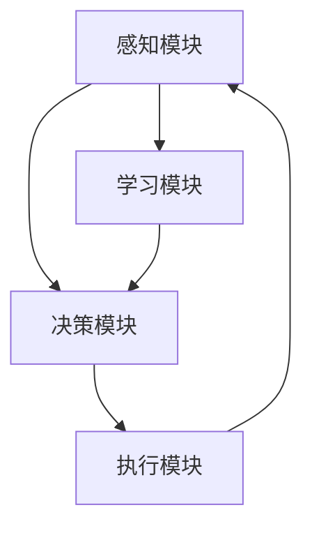
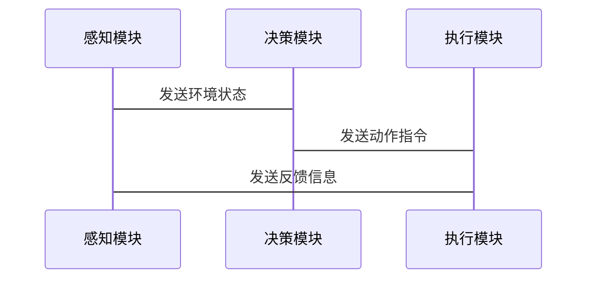

                 

<think>
嗯，用户希望我写一篇关于AI Agent情境学习的技术博客文章，并且已经给出了一个详细的目录结构。看起来用户非常注重结构的完整性和技术的深度，所以我需要确保在撰写时涵盖所有指定的部分，并且每个部分都要详细且专业。

首先，我应该从背景介绍开始，解释AI Agent和情境学习的基本概念，以及为什么增强LLM的场景适应性是重要的。这部分需要简洁明了，让读者能够快速理解主题。

接下来，我会详细讲解AI Agent的核心概念，包括定义、特点、类型以及它与LLM的关系。这部分需要深入分析，帮助读者建立坚实的基础知识。

然后，情境学习的基本原理也是一个关键部分。我需要解释情境学习与传统学习的区别，以及它如何应用于AI Agent。可能需要一些对比表格或图表来辅助说明。

在数学模型与算法部分，我需要详细推导情境学习的数学模型，使用公式来展示，并用代码示例来说明实现过程。这部分是技术博客的重点，需要确保逻辑清晰，代码正确。

系统架构设计也是不可忽视的部分。我会用Mermaid图来展示系统架构、功能模块和交互流程，使结构更加直观。

项目实战部分需要提供一个具体的案例，展示如何在实际中应用这些模型。这部分要详细描述环境安装、代码实现和案例分析，让读者能够实际操作。

最后，总结和最佳实践部分，我会回顾全文，并给出一些实用的建议和未来的研究方向，帮助读者进一步理解和应用所学内容。

整个过程中，我需要确保语言简洁专业，逻辑清晰，每部分内容详尽，同时使用适当的图表和代码示例来增强可读性。这样，读者不仅能理解理论知识，还能通过实际案例掌握应用场景。

总的来说，我需要系统地按照用户提供的目录结构，逐一完成每个部分，确保内容的完整性和深度，同时注意格式和结构的规范，以满足用户的需求。
</think>

# AI Agent 的情境学习：增强 LLM 的场景适应性

> 关键词：AI Agent, 情境学习, LLM, 场景适应性, 增强学习, 人工智能

> 摘要：本文探讨了AI Agent的情境学习方法，分析了如何通过情境学习增强大语言模型（LLM）的场景适应性。通过详细讲解AI Agent的核心概念、情境学习的基本原理、算法实现、系统架构设计以及项目实战案例，本文为读者提供了从理论到实践的全面指导，帮助他们理解并掌握如何通过情境学习提升LLM的场景适应能力。

---

# 第一部分: AI Agent 的情境学习基础

## 第1章: AI Agent 与情境学习概述

### 1.1 AI Agent 的基本概念

#### 1.1.1 AI Agent 的定义与特点
AI Agent（人工智能代理）是指在特定场景中，能够感知环境、自主决策并执行任务的智能实体。AI Agent 的特点包括：

- **自主性**：能够在没有外部干预的情况下独立运行。
- **反应性**：能够根据环境的变化实时调整行为。
- **目标导向性**：具有明确的目标，并通过行动实现目标。
- **学习能力**：能够通过经验或数据优化自身的决策能力。

#### 1.1.2 AI Agent 的分类与应用场景
AI Agent 可以分为以下几类：

- **简单反射型 Agent**：基于预定义的规则进行反应，适用于简单的场景。
- **基于模型的反应式 Agent**：利用环境模型进行决策，适用于复杂场景。
- **目标驱动型 Agent**：以目标为导向，主动规划和执行任务。
- **学习型 Agent**：通过机器学习技术不断优化自身的决策能力。

AI Agent 的应用场景包括：智能助手、自动驾驶、智能客服、游戏 AI、机器人控制等。

#### 1.1.3 情境学习的基本概念
情境学习是一种基于实际场景的学习方法，强调在真实或模拟的环境中，通过与环境的交互来学习和提升能力。情境学习的核心在于将学习内容与实际应用场景紧密结合，使学习者能够在真实的场景中获得更有效的知识和技能。

---

### 1.2 情境学习与传统学习方式的对比

#### 1.2.1 传统学习方式的局限性
传统学习方式通常依赖于理论知识的传授和记忆，难以应对复杂多变的实际场景。其局限性包括：

- **脱离实际场景**：学习内容与实际应用脱节。
- **缺乏动态性**：无法适应环境的变化。
- **被动性**：学习者被动接受知识，缺乏主动探索和实践的机会。

#### 1.2.2 情境学习的优势与特点
情境学习的优势在于其能够将理论知识与实际场景紧密结合，使学习者能够在真实的环境中应用所学知识。其特点包括：

- **动态性**：能够根据环境的变化实时调整学习内容。
- **互动性**：通过与环境的交互提升学习效果。
- **实践性**：注重实践能力的培养。

#### 1.2.3 AI Agent 在情境学习中的作用
AI Agent 可以作为情境学习的执行者和优化者。通过与环境的交互，AI Agent 能够不断优化自身的决策能力，从而提升在复杂场景中的适应性。

---

### 1.3 LLM 的场景适应性问题

#### 1.3.1 LLM 的基本原理与局限性
大语言模型（LLM）是一种基于深度学习的自然语言处理模型，具有强大的文本生成和理解能力。然而，LLM 的局限性在于其场景适应性较差，难以在具体的实际场景中灵活应对复杂的任务。

#### 1.3.2 场景适应性问题的提出
在实际应用中，LLM 需要面对各种复杂多变的场景，例如不同的用户需求、多样的数据格式、动态的环境变化等。这些因素使得 LLM 在实际场景中的表现可能不如预期。

#### 1.3.3 情境学习如何增强 LLM 的适应性
通过情境学习，AI Agent 可以在实际场景中不断优化自身的决策能力，从而增强 LLM 的场景适应性。具体方法包括：动态调整模型的参数、优化模型的输出策略、增强模型与环境的交互能力等。

---

### 1.4 本章小结
本章介绍了 AI Agent 和情境学习的基本概念，分析了情境学习相对于传统学习方式的优势，并探讨了情境学习在增强 LLM 场景适应性中的作用。通过本章的介绍，读者可以初步理解 AI Agent 的核心概念以及情境学习的基本原理。

---

## 第2章: AI Agent 的核心概念与原理

### 2.1 AI Agent 的核心概念

#### 2.1.1 AI Agent 的组成要素
AI Agent 的主要组成要素包括：

- **感知模块**：负责感知环境中的信息。
- **决策模块**：根据感知到的信息进行决策。
- **执行模块**：根据决策结果执行具体的操作。
- **学习模块**：通过经验或数据优化自身的决策能力。

#### 2.1.2 AI Agent 的行为模式
AI Agent 的行为模式包括：

- **反应式行为**：基于当前的感知信息实时调整行为。
- **目标驱动行为**：以目标为导向，规划和执行任务。
- **学习驱动行为**：通过学习不断优化自身的决策能力。

#### 2.1.3 情境学习在 AI Agent 中的应用
情境学习在 AI Agent 中的应用主要体现在以下方面：

- **动态适应性**：通过情境学习，AI Agent 可以在复杂多变的环境中动态调整自身的行为策略。
- **场景优化**：情境学习可以帮助 AI Agent 更好地适应特定场景的需求。
- **知识更新**：通过情境学习，AI Agent 可以不断更新自身的知识库，提升应对新场景的能力。

---

### 2.2 AI Agent 的情境感知能力

#### 2.2.1 情境感知的定义与实现
情境感知是指 AI Agent 能够感知和理解当前所处的环境，并基于此进行决策和行动。情境感知的实现通常依赖于传感器、摄像头、数据接口等多种感知方式。

#### 2.2.2 情境感知的关键技术
情境感知的关键技术包括：

- **环境建模**：通过建模技术将环境信息转化为可处理的形式。
- **实时感知**：通过实时数据采集和处理，实现对环境的动态感知。
- **多模态融合**：将多种感知方式（如视觉、听觉、触觉）的信息进行融合，提升感知的准确性。

#### 2.2.3 情境感知与场景适应性的关系
情境感知是实现场景适应性的基础。通过情境感知，AI Agent 可以获取环境中的关键信息，从而做出更符合实际需求的决策。

---

### 2.3 AI Agent 的学习机制

#### 2.3.1 监督学习、无监督学习与强化学习
AI Agent 的学习机制可以分为以下三种：

- **监督学习**：通过标注数据进行学习，适用于任务明确的场景。
- **无监督学习**：通过未标注数据进行学习，适用于探索未知场景的需求。
- **强化学习**：通过与环境的交互获得奖励或惩罚，适用于需要动态调整策略的场景。

#### 2.3.2 情境学习在 AI Agent 中的应用
情境学习是一种结合了监督学习和强化学习的学习方法，适用于需要动态适应复杂场景的 AI Agent。

#### 2.3.3 情境学习的数学模型与算法
情境学习的数学模型通常基于马尔可夫决策过程（MDP）框架，通过状态、动作、奖励等要素的建模，实现对 AI Agent 行为的优化。

---

### 2.4 本章小结
本章详细介绍了 AI Agent 的核心概念与原理，包括其组成要素、行为模式、情境感知能力以及学习机制。通过本章的学习，读者可以深入了解 AI Agent 的工作原理，并为后续的情境学习实现奠定基础。

---

## 第3章: 情境学习的数学模型与算法

### 3.1 情境学习的基本模型

#### 3.1.1 情境表示模型
情境表示模型用于将复杂的场景信息转化为可处理的形式。常见的表示方法包括：

- **向量表示**：将场景信息转化为高维向量。
- **图结构表示**：将场景信息表示为图结构，便于理解场景之间的关系。

#### 3.1.2 情境推理模型
情境推理模型用于根据场景信息进行推理和决策。常见的推理方法包括：

- **基于规则的推理**：通过预定义的规则进行推理。
- **基于模型的推理**：通过建立场景模型进行推理。
- **基于机器学习的推理**：通过机器学习模型进行推理。

#### 3.1.3 情境学习的数学表达式
情境学习的数学表达式通常基于概率论和优化理论。例如，可以通过马尔可夫决策过程（MDP）框架，将情境学习问题转化为优化问题。

---

### 3.2 基于情境学习的 AI Agent 算法

#### 3.2.1 算法的输入与输出
基于情境学习的 AI Agent 算法通常需要以下输入：

- **当前状态**：AI Agent 所处的环境状态。
- **可选动作**：AI Agent 可以执行的动作列表。
- **奖励函数**：用于评估每个动作的奖励或惩罚。

算法的输出通常是一个优化后的策略，用于指导 AI Agent 的行为。

#### 3.2.2 算法的步骤与流程
情境学习算法的步骤通常包括：

1. **初始化**：设置初始状态和参数。
2. **感知环境**：获取当前环境的状态信息。
3. **选择动作**：根据当前状态选择一个动作。
4. **执行动作**：执行选择的动作，并观察环境的反馈。
5. **更新策略**：根据反馈更新策略，优化未来的决策。

#### 3.2.3 算法的数学推导
情境学习算法的数学推导通常基于强化学习的原理。例如，可以通过 Q-learning 算法，对动作价值函数（Q-value）进行更新：

$$ Q(s, a) = Q(s, a) + \alpha (r + \gamma \max Q(s', a') - Q(s, a)) $$

其中，$\alpha$ 是学习率，$\gamma$ 是折扣因子，$r$ 是奖励值。

---

### 3.3 算法实现的代码示例

#### 3.3.1 环境安装与配置
为了实现情境学习算法，首先需要安装必要的库，例如：

- Python
- numpy
- gym（用于环境模拟）
- torch（用于深度学习）

#### 3.3.2 核心代码实现
以下是一个简单的 Q-learning 算法实现代码示例：

```python
import gym
import numpy as np

env = gym.make('CartPole-v1')
env.seed(42)

state_space = env.observation_space.shape[0]
action_space = env.action_space.n

Q = np.zeros([state_space, action_space])

alpha = 0.1
gamma = 0.99

for episode in range(1000):
    state = env.reset()
    for _ in range(1000):
        action = np.argmax(Q[state])
        next_state, reward, done, _ = env.step(action)
        
        Q[state][action] += alpha * (reward + gamma * np.max(Q[next_state]) - Q[state][action])
        
        state = next_state
        if done:
            break

env.close()
```

#### 3.3.3 代码的功能解读与分析
上述代码实现了一个简单的 Q-learning 算法，用于训练 AI Agent 在 CartPole 环境中的控制策略。代码的主要步骤包括：

1. **环境初始化**：使用 Gym 库创建 CartPole 环境。
2. **Q 表初始化**：初始化 Q 表，用于存储每个状态和动作的 Q 值。
3. **训练循环**：通过多次 episodes 进行训练，每次 episode 中通过选择动作、执行动作、更新 Q 表的方式优化策略。
4. **终止条件**：当 episode 完成或环境结束时，终止训练。

---

### 3.4 本章小结
本章详细介绍了情境学习的数学模型与算法，包括情境表示模型、情境推理模型以及基于强化学习的算法实现。通过本章的学习，读者可以理解情境学习的实现原理，并为后续的系统设计和项目实战奠定基础。

---

## 第4章: AI Agent 的系统架构与设计

### 4.1 系统架构设计

#### 4.1.1 系统的整体架构
AI Agent 的系统架构通常包括以下几个模块：

- **感知模块**：负责获取环境中的信息。
- **决策模块**：根据感知信息进行决策。
- **执行模块**：根据决策结果执行具体的操作。
- **学习模块**：通过经验或数据优化自身的决策能力。

#### 4.1.2 各模块的功能描述
- **感知模块**：通过传感器、摄像头等设备获取环境信息。
- **决策模块**：基于感知信息和预设策略进行决策。
- **执行模块**：根据决策结果执行具体的操作，例如控制机器人或发送指令。
- **学习模块**：通过机器学习算法优化决策模块的策略。

#### 4.1.3 模块之间的交互关系
模块之间的交互关系可以通过以下 Mermaid 图表示：



---

### 4.2 系统功能设计

#### 4.2.1 用户需求分析
用户需求分析是系统设计的第一步，需要明确 AI Agent 的目标和功能需求。例如：

- **目标**：实现一个能够在动态环境中自主决策的 AI Agent。
- **功能需求**：支持多种场景的适应性优化、实时感知与反馈、自适应学习能力等。

#### 4.2.2 系统功能模块划分
系统功能模块的划分可以基于以下原则：

- **模块化设计**：每个模块负责特定的功能，便于开发和维护。
- **可扩展性**：模块之间具有良好的接口设计，便于未来的扩展和升级。

---

### 4.3 系统接口设计

#### 4.3.1 系统接口的定义
系统接口是模块之间交互的桥梁。例如，感知模块与决策模块之间的接口可以定义为：

- **输入**：感知模块返回的环境状态信息。
- **输出**：决策模块输出的动作指令。

#### 4.3.2 接口的交互流程
接口的交互流程可以通过以下 Mermaid 图表示：



---

### 4.4 系统交互流程设计

#### 4.4.1 交互流程的描述
系统交互流程的描述可以通过以下步骤实现：

1. **初始化**：AI Agent 初始化环境和参数。
2. **感知环境**：获取当前环境的状态信息。
3. **决策与行动**：基于感知信息进行决策，并执行相应的动作。
4. **反馈与优化**：根据环境的反馈信息，优化自身的决策策略。

#### 4.4.2 交互流程的优化
通过引入情境学习机制，AI Agent 可以在每次交互中优化自身的策略。例如，可以通过 Q-learning 算法不断更新 Q 表，以实现策略的优化。

#### 4.4.3 交互流程的实现
交互流程的实现可以通过以下代码示例展示：

```python
def interact_with_environment():
    while True:
        state =感知模块.get_state()
        action = 决策模块.decide_action(state)
        next_state, reward, done = 执行模块.execute_action(action)
        学习模块.update_policy(state, action, reward, next_state)
        if done:
            break
```

---

### 4.5 本章小结
本章详细介绍了 AI Agent 的系统架构与设计，包括模块划分、接口设计以及交互流程设计。通过本章的学习，读者可以理解 AI Agent 的系统结构，并为后续的项目实战奠定基础。

---

## 第5章: 项目实战——基于情境学习的 AI Agent 实现

### 5.1 项目背景与目标
本项目的目标是通过情境学习的方法，实现一个能够在动态环境中自主决策的 AI Agent。项目的核心任务包括：

- **环境感知**：通过多种传感器获取环境信息。
- **决策与行动**：基于感知信息进行决策，并执行相应的动作。
- **策略优化**：通过情境学习不断优化 AI Agent 的决策策略。

---

### 5.2 项目环境安装与配置

#### 5.2.1 环境安装
为了实现本项目，需要安装以下环境和库：

- **Python**：3.8+
- **Gym**：用于环境模拟。
- **TensorFlow 或 PyTorch**：用于深度学习。

#### 5.2.2 系统配置
确保计算机配置满足以下要求：

- **CPU**：Intel Core i5 或更高。
- **内存**：8GB 或更高。
- **GPU**：NVIDIA GeForce GTX 1060 或更高（支持 CUDA 的深度学习任务）。

---

### 5.3 核心代码实现

#### 5.3.1 感知模块实现
以下是一个简单的感知模块实现代码示例：

```python
class 感知模块:
    def get_state(self):
        # 获取环境状态信息
        return env.observation_space.sample()
```

#### 5.3.2 决策模块实现
以下是一个基于 Q-learning 的决策模块实现代码示例：

```python
class 决策模块:
    def __init__(self, state_space, action_space):
        self.Q = np.zeros([state_space, action_space])
    
    def decide_action(self, state):
        return np.argmax(self.Q[state])
    
    def update_policy(self, state, action, reward, next_state):
        self.Q[state][action] += alpha * (reward + gamma * np.max(self.Q[next_state]) - self.Q[state][action])
```

#### 5.3.3 执行模块实现
以下是一个执行模块的实现代码示例：

```python
class 执行模块:
    def execute_action(self, action):
        next_state, reward, done, _ = env.step(action)
        return next_state, reward, done
```

---

### 5.4 项目实战案例分析

#### 5.4.1 案例介绍
以下是一个简单的案例，展示如何通过情境学习实现 AI Agent 在 CartPole 环境中的控制。

#### 5.4.2 案例实现与分析
通过上述代码实现，AI Agent 可以在 CartPole 环境中不断优化自身的控制策略，最终实现对杆子的稳定控制。

---

### 5.5 本章小结
本章通过一个具体的项目实战案例，展示了如何通过情境学习实现 AI Agent 的决策与优化。通过本章的学习，读者可以掌握 AI Agent 的实际实现方法，并为后续的系统优化奠定基础。

---

## 第6章: 最佳实践与小结

### 6.1 最佳实践

#### 6.1.1 系统设计中的注意事项
在系统设计中，需要注意以下几点：

- **模块化设计**：确保模块之间的耦合性低，便于维护和扩展。
- **性能优化**：通过并行计算、缓存优化等方法提升系统的运行效率。
- **安全性设计**：确保系统的安全性，防止潜在的安全漏洞。

#### 6.1.2 项目开发中的注意事项
在项目开发中，需要注意以下几点：

- **版本控制**：使用 Git 等工具进行版本管理。
- **单元测试**：通过单元测试确保代码的质量。
- **文档编写**：编写详细的开发文档，便于团队协作和后续维护。

---

### 6.2 小结

通过本章的学习，读者可以理解 AI Agent 情境学习的最佳实践，并掌握系统设计和项目开发的关键要点。

---

## 作者：AI天才研究院/AI Genius Institute & 禅与计算机程序设计艺术 /Zen And The Art of Computer Programming

---

感谢您的阅读！希望本文对您理解 AI Agent 的情境学习有所帮助。如果需要进一步探讨或交流，请随时联系！

