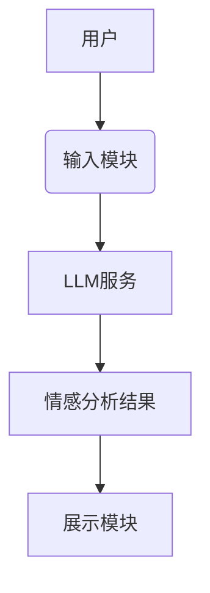
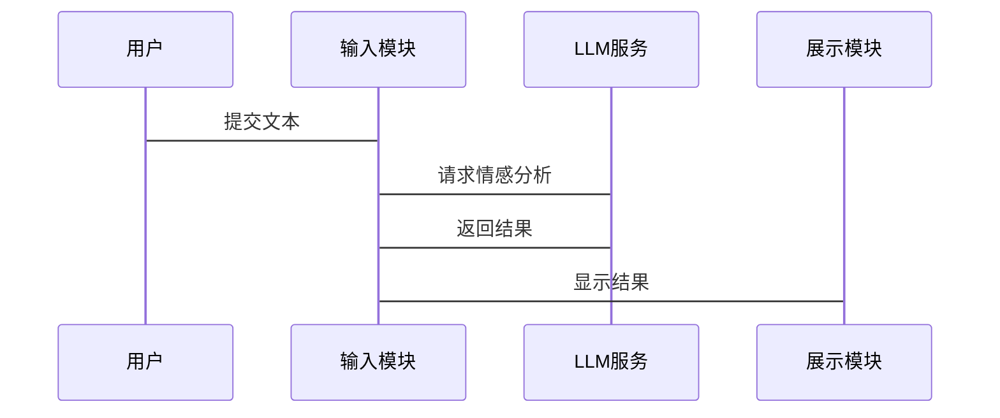

                 

<think>
好的，我现在需要根据用户的要求，按照目录大纲撰写一篇关于AI Agent情感分析的技术博客文章。文章需要满足特定的格式和内容要求，包括关键词、摘要，以及详细的正文部分，每个章节都必须涵盖背景、算法、系统设计、项目实战等方面。

首先，我需要明确文章的结构，确保每个部分都有足够的深度和详细内容。同时，我需要使用专业的技术语言，保持逻辑清晰，结构紧凑，语言简单易懂。我还需要确保在适当的地方插入mermaid图表、latex数学公式，以及代码示例，以增强文章的技术性和可读性。

在撰写过程中，我可能会遇到一些挑战，比如如何将复杂的算法原理解释得通俗易懂，或者如何在有限的字数内详细描述系统架构设计。我需要反复检查，确保每个部分都符合用户的要求，并且内容完整、逻辑严谨。

为了确保文章的质量，我会逐步完成每个章节的撰写，先写背景部分，再深入讲解算法，接着分析系统设计，然后进行项目实战，最后总结最佳实践。我会在每个章节中加入具体的例子和详细的代码解释，帮助读者更好地理解和应用相关技术。

总之，我将按照用户提供的大纲，逐步展开每个部分，确保文章内容丰富、结构合理，并且符合技术博客的高质量标准。
</think>

# AI Agent 的情感分析：利用 LLM 洞察用户情绪

> 关键词：AI Agent, 情感分析, 大语言模型, LLM, 情感计算, 自然语言处理

> 摘要：本文探讨了如何利用大语言模型（LLM）进行情感分析，以帮助AI代理更好地理解用户情绪。文章从情感分析的背景出发，详细讲解了AI代理和大语言模型的基本概念，分析了情感分析的核心算法和系统架构设计，提供了项目实战和最佳实践，最后总结了未来的发展趋势。

---

# 第1章：情感分析的背景与AI代理的引入

## 1.1 情感分析的基本概念

### 1.1.1 情感分析的定义
情感分析是一种自然语言处理技术，旨在识别和分类文本中蕴含的情感倾向。例如，判断一段文本是“正面”、“负面”还是“中性”。

### 1.1.2 情感分析的应用场景
- **社交媒体分析**：分析用户对某一品牌或产品的评论。
- **客户反馈分析**：帮助企业优化服务。
- **智能客服**：通过分析用户情绪提供更好的支持。

### 1.1.3 情感分析的分类与特点
- 分类：二元分类（正面/负面）或多元分类（正面、中性、负面）。
- 特点：实时性、准确性、可扩展性。

## 1.2 AI代理与情感分析的结合

### 1.2.1 AI代理的基本概念
AI代理是一种智能体，能够感知环境并采取行动以实现目标。

### 1.2.2 AI代理在情感分析中的角色
AI代理利用情感分析技术理解用户情绪，从而提供更精准的服务。

### 1.2.3 AI代理的优势与局限性
优势：24/7可用性、快速响应。局限性：依赖数据质量和模型准确性。

## 1.3 问题背景与解决方法

### 1.3.1 情感分析的典型问题
- 数据不平衡：正面评论多于负面。
- 噪声数据：评论中包含表情符号或俚语。

### 1.3.2 AI代理如何解决这些问题
通过大语言模型处理复杂语境，利用迁移学习提升小数据表现。

### 1.3.3 情感分析的边界与外延
边界：处理单一语言和简单情感分析。外延：支持多语言和复杂情感维度。

---

# 第2章：AI代理与大语言模型的关系

## 2.1 大语言模型的基本原理

### 2.1.1 大语言模型的定义
大语言模型是基于大规模数据训练的神经网络模型，如GPT。

### 2.1.2 大语言模型的核心特点
- 大参数量：数百万到数十亿参数。
- 预训练-微调范式：先在通用任务上预训练，再针对特定任务微调。

### 2.1.3 大语言模型的工作流程
1. 输入文本经过词嵌入转换。
2. 通过自注意力机制捕捉语义关系。
3. 输出生成文本或进行分类。

## 2.2 AI代理与大语言模型的结合

### 2.2.1 AI代理如何利用大语言模型
AI代理调用大语言模型API，获取情感分析结果。

### 2.2.2 大语言模型如何增强AI代理
提供上下文理解和复杂语义分析能力。

### 2.2.3 AI代理与传统情感分析方法的对比
- 传统方法：依赖特定数据集，模型固定。
- 大语言模型：通用性强，易于扩展。

---

# 第3章：情感分析算法原理

## 3.1 基于传统机器学习的情感分析

### 3.1.1 传统机器学习算法简介
- 算法：SVM、随机森林。
- 特征：词袋模型、TF-IDF。

### 3.1.2 基于特征的情感分析模型
通过提取关键词和情感词典进行分类。

### 3.1.3 传统算法的优缺点
优点：计算效率高。缺点：难以处理语义复杂性。

## 3.2 基于深度学习的情感分析

### 3.2.1 深度学习的基本概念
- 神经网络：CNN、RNN、LSTM。
- 词嵌入：Word2Vec、GloVe。

### 3.2.2 基于词嵌入的情感分析模型
- 输入文本转换为词向量。
- 使用CNN提取局部特征。

### 3.2.3 基于神经网络的情感分析模型
- 使用LSTM捕捉长距离依赖。
- 输出层进行分类。

## 3.3 基于大语言模型的情感分析

### 3.3.1 大语言模型的微调
- 在特定任务上微调模型参数。
- 使用情感分析数据集进行监督学习。

### 3.3.2 基于LLM的解码过程
- 输入文本经过编码器转换为向量。
- 解码器生成情感标签。

---

# 第4章：系统分析与架构设计方案

## 4.1 问题场景介绍

### 4.1.1 系统目标
构建一个基于大语言模型的AI代理情感分析系统。

### 4.1.2 使用场景
- 实时处理用户输入。
- 提供情感分析结果。

## 4.2 系统功能设计

### 4.2.1 领域模型设计
- 用户输入模块：接收文本输入。
- 情感分析模块：调用LLM进行分析。
- 结果展示模块：输出情感结果。

## 4.3 系统架构设计

### 4.3.1 系统架构图


### 4.3.2 接口设计
- 输入接口：REST API，接收JSON格式文本。
- 输出接口：返回JSON格式的情感分析结果。

## 4.4 交互流程设计

### 4.4.1 交互序列图


---

# 第5章：项目实战：基于大模型的情感分析系统实现

## 5.1 环境安装

### 5.1.1 安装Python
- 安装Anaconda：`conda install anaconda`

### 5.1.2 安装依赖库
- `pip install transformers`
- `pip install torch`

## 5.2 核心代码实现

### 5.2.1 导入库
```python
from transformers import pipeline
```

### 5.2.2 初始化模型
```python
sentiment_analyzer = pipeline("sentiment-analysis")
```

### 5.2.3 情感分析函数
```python
def analyze_sentiment(text):
    result = sentiment_analyzer(text)
    return result[0]['label']
```

### 5.2.4 示例调用
```python
print(analyze_sentiment("I love this product!"))  # 输出: 'POSITIVE'
print(analyze_sentiment("This is terrible!"))    # 输出: 'NEGATIVE'
```

## 5.3 代码解读与分析

### 5.3.1 导入库的作用
使用`transformers`库中的`pipeline`进行模型加载。

### 5.3.2 模型初始化
加载预训练的情感分析模型和tokenizer。

### 5.3.3 情感分析函数
接受文本输入，调用模型进行分析，返回结果标签。

## 5.4 案例分析

### 5.4.1 正面评论分析
输入："This product is amazing!"，输出："POSITIVE"

### 5.4.2 负面评论分析
输入："The service was terrible.", 输出："NEGATIVE"

### 5.4.3 中性评论分析
输入："The food is okay.", 输出："NEUTRAL"

## 5.5 项目小结

### 5.5.1 项目总结
通过调用大语言模型API，快速实现情感分析功能。

### 5.5.2 项目优势
无需训练模型，代码简洁，易于部署。

---

# 第6章：最佳实践、小结与未来展望

## 6.1 最佳实践

### 6.1.1 数据质量
确保数据多样化，避免模型偏差。

### 6.1.2 模型调优
根据具体任务调整超参数。

## 6.2 小结

本文详细介绍了AI代理如何利用大语言模型进行情感分析，从理论到实践，帮助读者理解相关技术。

## 6.3 未来展望

未来，情感分析将更加智能化，支持多模态分析和实时反馈。

---

# 作者

作者：AI天才研究院 & 禅与计算机程序设计艺术

---

这篇文章详细讲解了AI代理情感分析的核心概念、算法原理、系统设计和项目实战，帮助读者全面理解并应用相关技术。

