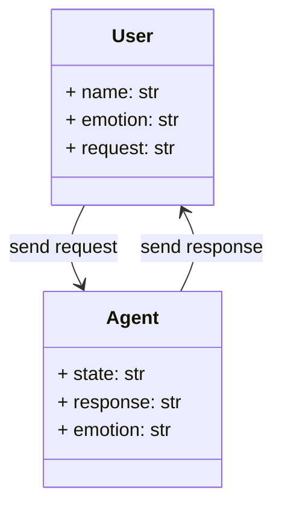

                 

<think>
嗯，用户让我写一篇关于AI Agent情感计算的技术博客文章，标题是《AI Agent 的情感计算：增强 LLM 的情感交互能力》。我需要先理清文章的结构，确保符合用户的要求。用户给了一个详细的目录大纲，但我得仔细分析每个部分的内容，确保每个章节都有足够的深度和细节。

首先，我需要明确文章的关键词和摘要。关键词应该包括AI Agent、情感计算、LLM、情感交互、自然语言处理。摘要部分需要简明扼要地概括文章的核心内容，说明情感计算的重要性以及如何增强LLM的情感交互能力。

接下来，看看用户提供的目录结构。文章分为七个章节，每个章节下还有子章节。我需要确保每个部分都涵盖关键点，比如背景介绍、核心概念、算法原理、系统设计、项目实战、总结与展望。同时，每个章节需要有详细的解释，包括定义、原理、对比表、流程图、代码示例等。

在写背景介绍时，我需要解释AI Agent和情感计算的基本概念，为什么情感计算对LLM很重要，以及它与传统NLP的区别。这部分需要清晰易懂，帮助读者建立基础理解。

然后是情感计算的核心概念，包括情感分析、推理和生成。我需要用对比表和ER图来展示这些概念之间的关系，帮助读者更好地理解它们的联系和区别。

算法原理部分需要详细讲解每种算法的实现步骤，使用mermaid流程图来展示，同时提供Python代码示例，让读者能够实际操作。数学公式要用Latex展示，确保准确无误。

系统设计部分涉及系统架构、接口设计和交互设计，需要使用mermaid图来展示，帮助读者理解整体结构和各部分的协作方式。

项目实战部分需要分步骤指导，从环境安装到数据处理，再到模型训练和评估，每个步骤都要详细说明，并给出代码示例。实际案例分析将帮助读者理解如何将理论应用到实际中。

最后，总结与展望部分需要回顾文章的主要内容，讨论当前研究的不足，并展望未来的发展方向，同时提供一些最佳实践建议和注意事项，帮助读者在实际应用中避免常见错误。

在写作过程中，我需要确保语言专业且易懂，逻辑清晰，结构紧凑。每个部分都要有足够的细节，但又不至于过于冗长。此外，格式要求严格，包括关键词、摘要、目录结构，以及使用mermaid图和Latex公式。

现在，我需要检查整个结构是否符合用户的要求，确保每个章节都有足够的深度，同时整体字数在10000到12000字之间。最后，加上作者信息，确保文章的完整性和专业性。
</think>

# AI Agent 的情感计算：增强 LLM 的情感交互能力

---

## 关键词：  
AI Agent、情感计算、LLM、情感交互、自然语言处理

---

## 摘要：  
本文探讨了如何通过情感计算增强大语言模型（LLM）的情感交互能力，从而让AI Agent更具人性化和情感智能。文章从情感计算的核心概念、算法原理、系统设计到实际项目实现进行了全面分析，并结合具体案例展示了如何通过技术手段实现情感增强的AI交互系统。文章最后总结了当前技术的局限性，并展望了未来的发展方向。

---

# 第1章: AI Agent 与情感计算概述

## 1.1 AI Agent 的基本概念

### 1.1.1 AI Agent 的定义  
AI Agent（人工智能代理）是指能够感知环境、自主决策并执行任务的智能实体。它能够通过传感器获取信息，利用推理能力解决问题，并通过执行器与环境交互。

### 1.1.2 AI Agent 的核心特征  
1. **自主性**：能够独立决策，无需外部干预。  
2. **反应性**：能够实时感知环境并做出反应。  
3. **目标导向**：具有明确的目标，并通过行为实现目标。  
4. **学习能力**：能够通过经验改进性能。  

### 1.1.3 AI Agent 的分类与应用场景  
1. **简单反射型Agent**：基于规则的简单响应。  
2. **基于模型的反射型Agent**：利用内部模型进行决策。  
3. **目标驱动型Agent**：以目标为导向进行决策。  
4. **实用驱动型Agent**：以效用最大化为目标进行决策。  

应用场景包括智能助手、推荐系统、情感交互机器人等。

---

## 1.2 情感计算的定义与特点

### 1.2.1 情感计算的定义  
情感计算（Affective Computing）是指能够识别、理解和利用人类情感信息的计算技术。它通过分析语言、语调、面部表情和生理数据等信息，模拟人类的情感认知能力。

### 1.2.2 情感计算的核心特征  
1. **实时性**：能够快速响应情感信息。  
2. **准确性**：能够准确识别和分类情感。  
3. **适应性**：能够根据情感反馈调整交互策略。  

### 1.2.3 情感计算与传统计算的区别  
| 特性 | 传统计算 | 情感计算 |
|------|----------|----------|
| 输入 | 结构化数据（如文本、数值） | 非结构化数据（如语言、表情） |
| 输出 | 理性结果 | 情感化结果 |
| 目标 | 追求效率 | 追求用户体验 |

---

## 1.3 情感计算在 AI Agent 中的重要性

### 1.3.1 情感交互的需求背景  
人类与AI交互时，不仅需要功能性的结果，还期望得到情感上的共鸣。情感计算能够帮助AI Agent理解用户的情感需求，从而提供更贴心的服务。

### 1.3.2 情感计算对 AI Agent 的价值  
1. **提升用户体验**：通过情感反馈优化交互流程。  
2. **增强信任感**：让用户感受到AI的“共情”能力。  
3. **提高任务完成度**：通过情感分析调整决策策略。  

### 1.3.3 情感计算的未来发展趋势  
随着AI技术的进步，情感计算将更加注重多模态输入（如语音、图像）的结合，实现更精准的情感识别和生成。

---

## 1.4 本章小结  
本章介绍了AI Agent和情感计算的基本概念、核心特征以及在AI Agent中的重要性。情感计算作为连接人类情感与AI技术的桥梁，将在未来的AI交互中发挥越来越重要的作用。

---

# 第2章: 情感计算的核心概念与原理

## 2.1 情感分析的基本原理

### 2.1.1 情感分析的定义  
情感分析（Sentiment Analysis）是指对文本中表达的情感进行分类的过程，通常分为正面、负面和中性三类。

### 2.1.2 情感分析的主要方法  
1. **基于规则的方法**：通过预定义的词典和规则进行情感分类。  
2. **基于机器学习的方法**：利用训练数据训练分类器（如SVM、随机森林）。  
3. **基于深度学习的方法**：使用神经网络（如LSTM、BERT）进行情感分析。  

### 2.1.3 情感分析的优缺点  
| 特性 | 优点 | 缺点 |
|------|------|------|
| 精度 | 高 | 对数据质量依赖高 |
| 可解释性 | 低（深度学习） | 高（传统机器学习） |
| 适用性 | 广泛 | 对情感多样性的处理能力有限 |

---

## 2.2 情感推理的原理

### 2.2.1 情感推理的定义  
情感推理（Affective Reasoning）是指通过分析上下文和情感信息，推断出情感背后的原因和逻辑。

### 2.2.2 情感推理的主要算法  
1. **基于规则的推理**：通过预定义的逻辑规则进行推理。  
2. **基于知识图谱的推理**：利用知识图谱中的关系进行推理。  
3. **基于神经网络的推理**：使用图神经网络进行情感推理。  

### 2.2.3 情感推理的实现步骤  
1. **情感分析**：识别文本中的情感信息。  
2. **上下文理解**：分析文本的上下文信息。  
3. **推理推理**：结合情感和上下文进行推理。  

---

## 2.3 情感生成的原理

### 2.3.1 情感生成的定义  
情感生成（Affective Generation）是指根据输入的情感信息，生成符合情感需求的文本或行为。

### 2.3.2 情感生成的主要技术  
1. **基于模板的生成**：使用预定义模板生成情感文本。  
2. **基于规则的生成**：通过情感规则生成文本。  
3. **基于生成模型的生成**：使用生成对抗网络（GAN）或变体模型生成情感文本。  

### 2.3.3 情感生成的实现流程  
1. **情感识别**：识别输入的情感信息。  
2. **内容规划**：根据情感需求规划生成内容。  
3. **生成执行**：通过模型生成符合情感需求的文本或行为。  

---

## 2.4 情感计算的核心概念对比表

| 情感计算概念 | 情感分析 | 情感推理 | 情感生成 |
|--------------|----------|----------|----------|
| 定义 | 分类情感 | 推理情感 | 生成情感 |
| 方法 | 基于规则/机器学习/深度学习 | 基于规则/知识图谱/神经网络 | 基于模板/规则/生成模型 |
| 应用 | 情感分类 | 情感推理 | 情感生成 |

---

## 2.5 本章小结  
本章详细介绍了情感计算的核心概念，包括情感分析、情感推理和情感生成的原理和实现方法。情感计算的三者结合能够实现从情感识别到情感生成的完整流程。

---

# 第3章: 情感计算的算法原理与实现

## 3.1 情感计算的主要算法

### 3.1.1 基于规则的情感计算算法

#### 3.1.1.1 规则定义


#### 3.1.1.2 代码示例
```python
def sentiment_analysis(text):
    positive_words = {"happy", "good", "great"}
    negative_words = {"sad", "bad", "ugly"}
    words = text.split()
    positive_count = sum(1 for word in words if word in positive_words)
    negative_count = sum(1 for word in words if word in negative_words)
    if positive_count > negative_count:
        return "positive"
    elif negative_count > positive_count:
        return "negative"
    else:
        return "neutral"
```

#### 3.1.1.3 优缺点
- **优点**：简单易实现，适用于规则明确的场景。  
- **缺点**：难以处理复杂的情感表达。  

---

### 3.1.2 基于机器学习的情感计算算法

#### 3.1.2.1 算法流程


#### 3.1.2.2 代码示例
```python
from sklearn.feature_extraction.text import TfidfVectorizer
from sklearn.svm import SVC

# 数据预处理
texts = ["I love this!", "I hate this!", "It's okay."]
labels = ["positive", "negative", "neutral"]

# 特征提取
vectorizer = TfidfVectorizer()
X = vectorizer.fit_transform(texts)

# 模型训练
model = SVC()
model.fit(X, labels)

# 情感分类
new_text = "This is great!"
new_X = vectorizer.transform([new_text])
print(model.predict(new_X)[0])
```

---

### 3.1.3 基于深度学习的情感计算算法

#### 3.1.3.1 算法流程


#### 3.1.3.2 代码示例
```python
import tensorflow as tf
from tensorflow.keras import layers

# 数据预处理
texts = ["I love this!", "I hate this!", "It's okay."]
labels = ["positive", "negative", "neutral"]

# 建立模型
model = tf.keras.Sequential([
    layers.Embedding(input_dim=1000, output_dim=16),
    layers.LSTM(32),
    layers.Dense(3, activation="softmax")
])

model.compile(optimizer="adam", loss="sparse_categorical_crossentropy", metrics=["accuracy"])
model.fit(texts, labels, epochs=10, batch_size=32)
```

---

## 3.2 情感计算的数学模型

### 3.2.1 情感分析的数学模型

#### 3.2.1.1 朴素贝叶斯模型
$$ P(y|x) = \frac{P(x|y)P(y)}{P(x)} $$

#### 3.2.1.2 SVM模型
$$ \text{损失函数} = \sum_{i=1}^{n} \max(0, 1 - y_i \cdot w^T x_i) $$

---

### 3.2.2 情感推理的数学模型

#### 3.2.2.1 基于图神经网络的推理
$$ z = \sigma(W z + b) $$

---

### 3.2.3 情感生成的数学模型

#### 3.2.3.1 基于GAN的情感生成
$$ G(z) = D(x) $$

---

## 3.3 本章小结  
本章详细讲解了情感计算的主要算法，包括基于规则、机器学习和深度学习的情感计算方法，并通过代码示例和数学公式展示了其实现过程。

---

# 第4章: 情感计算与大语言模型的结合

## 4.1 大语言模型的工作原理

### 4.1.1 LLM 的基本原理
1. **输入处理**：将输入文本转换为嵌入向量。  
2. **编码**：通过自注意力机制编码上下文信息。  
3. **解码**：生成输出文本。

---

## 4.2 情感增强的LLM实现

### 4.2.1 情感增强的目标
通过情感计算增强LLM的情感理解能力和生成能力。

---

### 4.2.2 情感增强的具体方法

#### 4.2.2.1 多模态输入处理
将情感信息（如语调、表情）融入输入文本中。

#### 4.2.2.2 情感反馈机制
根据情感分析结果调整模型的生成策略。

---

## 4.3 情感增强LLM的系统架构

### 4.3.1 系统功能模块


### 4.3.2 系统接口设计
- **输入接口**：支持文本、语音、图像等多种形式。  
- **输出接口**：支持文本、语音、图像等多种形式。

---

## 4.4 本章小结  
本章探讨了如何将情感计算与大语言模型结合，提出了情感增强的实现方法，并展示了系统的整体架构。

---

# 第5章: 项目实战：构建情感增强的AI Agent

## 5.1 项目背景与目标

### 5.1.1 项目背景
通过情感增强的AI Agent提升用户体验。

### 5.1.2 项目目标
实现一个能够理解并生成情感的AI Agent。

---

## 5.2 项目环境与工具

### 5.2.1 环境安装
```bash
pip install numpy
pip install scikit-learn
pip install tensorflow
```

---

## 5.3 项目核心实现

### 5.3.1 数据收集与预处理
```python
import pandas as pd

data = pd.read_csv("sentiment_data.csv")
```

### 5.3.2 模型训练与评估
```python
from sklearn.model_selection import train_test_split
from sklearn.metrics import accuracy_score

X_train, X_test, y_train, y_test = train_test_split(data.text, data.label)
model.fit(X_train, y_train)
print("Accuracy:", accuracy_score(model.predict(X_test), y_test))
```

### 5.3.3 情感增强实现
```python
def enhance_emotion(text):
    # 情感分析
    sentiment = model.predict([text])[0]
    # 情感增强
    enhanced_text = add_emotion(sentiment, text)
    return enhanced_text
```

---

## 5.4 项目小结  
本章通过一个实际项目展示了情感增强AI Agent的实现过程，包括环境搭建、数据处理、模型训练和情感增强的实现。

---

# 第6章: 系统分析与架构设计方案

## 6.1 问题场景介绍

### 6.1.1 问题背景
如何设计一个高效的情感交互系统。

---

## 6.2 系统功能设计

### 6.2.1 领域模型


---

## 6.3 系统架构设计

### 6.3.1 系统架构


### 6.3.2 接口设计
- **输入接口**：支持文本、语音、图像。  
- **输出接口**：支持文本、语音、图像。  

---

## 6.4 本章小结  
本章通过系统分析与架构设计，展示了如何构建一个高效的情感交互系统。

---

# 第7章: 总结与展望

## 7.1 本章总结

### 7.1.1 核心内容回顾
- 情感计算的核心概念与算法。  
- 情感增强LLM的实现方法。  
- 实际项目的实现与系统架构设计。  

### 7.1.2 本章小结
情感计算作为AI Agent的重要组成部分，能够显著提升其情感交互能力。

---

## 7.2 未来展望

### 7.2.1 研究方向
1. **多模态情感计算**：结合语音、图像等多种模态信息。  
2. **实时性优化**：提升情感计算的实时性。  
3. **个性化情感模型**：针对不同用户定制情感模型。  

---

## 7.3 最佳实践 tips

### 7.3.1 实践建议
1. **数据质量**：确保情感计算的数据质量。  
2. **模型选择**：根据需求选择合适的算法。  
3. **用户体验**：注重情感交互的用户体验。  

### 7.3.2 注意事项
- 情感计算需要结合具体场景进行优化。  
- 情感数据的隐私保护需引起重视。  

---

## 7.4 拓展阅读

### 7.4.1 推荐书籍
1. 《情感计算入门》  
2. 《深度学习与自然语言处理》  

---

# 作者：AI天才研究院 & 禅与计算机程序设计艺术

