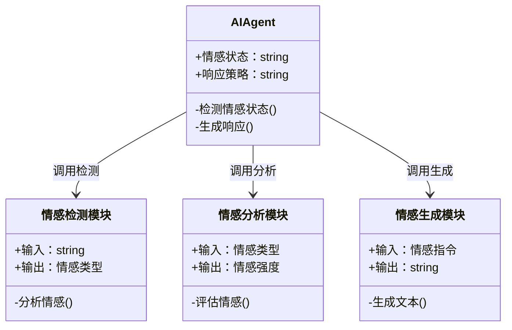
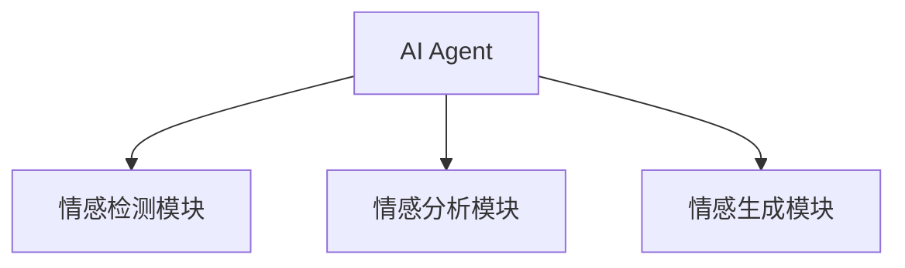
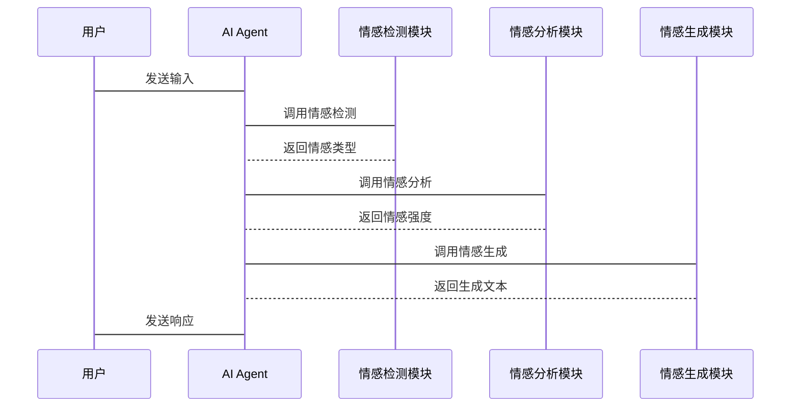

                 


# AI Agent 的情感调节：利用 LLM 进行情绪管理

**关键词：** AI Agent, 情感调节, LLM, 情绪管理, 情感计算, 深度学习

**摘要：** 本文探讨了利用大语言模型（LLM）对AI Agent进行情感调节的方法，详细分析了情感计算、情感分析与生成的实现机制，并通过系统架构设计和项目实战展示了如何在实际场景中应用这些技术，最后给出了最佳实践和总结。

---

## 第一部分: AI Agent 的情感调节概述

### 第1章: 问题背景与核心概念

#### 1.1 问题背景

##### 1.1.1 当前AI Agent的挑战
AI Agent（智能体）在与人类交互时，需要具备处理复杂情感的能力。然而，现有的AI Agent在情感管理方面存在以下问题：
- 情感理解不够准确，难以捕捉人类复杂的情感变化。
- 情感生成缺乏灵活性，难以适应不同情境的需求。
- 缺乏情感调节的能力，无法主动调整交互策略以改善用户体验。

##### 1.1.2 情感管理的必要性
情感管理是人机交互中的关键环节。通过情感调节，AI Agent可以更好地理解用户的情感状态，并根据此调整其行为，从而提升用户体验和交互效率。

##### 1.1.3 问题的解决方向
利用大语言模型（LLM）进行情感调节，可以通过以下方式解决问题：
- 利用LLM的强大生成能力，实现情感分析与生成。
- 通过训练模型，使AI Agent能够理解和生成情感化语言。

##### 1.1.4 核心概念
AI Agent：具备自主决策能力的智能实体，能够在环境中感知、推理、规划和执行任务。
情感调节：通过分析和生成情感信息，调整AI Agent的行为以适应用户情感需求。
LLM：基于深度学习的大语言模型，具有强大的文本生成和理解能力。

---

### 第2章: 核心概念与联系

#### 2.1 情感计算原理

##### 2.1.1 情感计算的定义
情感计算是指通过计算手段分析和处理情感信息，理解人类情感状态的技术。

##### 2.1.2 情感计算的关键技术
- 情感分析：识别文本中的情感倾向。
- 情感生成：基于情感信息生成文本。
- 情感记忆：记录和记忆用户情感变化。

##### 2.1.3 情感计算与LLM的关系
LLM通过大规模数据训练，能够自然地理解和生成情感化文本，为情感计算提供了强大的技术支持。

#### 2.2 情感分析与生成

##### 2.2.1 情感分析的基本原理
情感分析通过对文本特征的提取和分类，判断文本的情感倾向（如正面、负面、中性）。

##### 2.2.2 基于LLM的情感生成
LLM可以生成与情感相关联的文本，例如根据用户的情绪生成相应的安慰或鼓励的话语。

##### 2.2.3 情感分析与生成的对比
| 对比维度 | 情感分析 | 情感生成 |
|----------|----------|----------|
| 目标     | 判断情感倾向 | 生成情感化文本 |
| 输入     | 文本       | 情感指令 |
| 输出     | 情感标签   | 文本       |

#### 2.3 情感调节的实现机制

##### 2.3.1 情感调节的定义
情感调节是指通过分析用户情感状态，并调整AI Agent的响应策略，以改善用户体验。

##### 2.3.2 情感调节的实现步骤
1. 情感检测：识别用户当前的情感状态。
2. 情感分析：判断情感的强度和类型。
3. 情感调节策略生成：根据情感状态生成相应的调节策略。

##### 2.3.3 情感调节的效果评估
- 用户满意度：用户对AI Agent响应的满意度。
- 情感一致性：AI Agent的响应是否与用户情感状态一致。
- 情感变化趋势：用户情感状态的变化是否符合预期。

---

### 第3章: 算法原理与实现

#### 3.1 情感分析算法

##### 3.1.1 基于传统机器学习的情感分析
- 使用特征工程提取文本特征。
- 使用SVM、随机森林等模型进行分类。

##### 3.1.2 基于深度学习的情感分析
- 使用词嵌入（如Word2Vec、GloVe）表示文本。
- 构建深度神经网络（如RNN、LSTM）进行情感分类。

##### 3.1.3 基于LLM的情感分析
- 使用预训练的LLM（如GPT-3、BERT）进行情感分类。
- 通过微调模型，使其适应特定任务。

#### 3.2 情感生成算法

##### 3.2.1 基于规则的情感生成
- 根据预设的规则生成情感化文本。
- 适用于简单场景，如固定的回复模板。

##### 3.2.2 基于模板的情感生成
- 使用模板生成情感化文本。
- 适用于复杂场景，如根据情感类型生成多种回复。

##### 3.2.3 基于LLM的情感生成
- 使用LLM生成情感化文本。
- 通过输入情感指令，生成与情感相关联的文本。

#### 3.3 情感调节算法

##### 3.3.1 情感检测与分类
- 使用情感分析算法检测用户情感状态。
- 分类情感类型（如愤怒、悲伤、快乐）。

##### 3.3.2 情感分析结果的处理
- 根据情感分类结果，调整AI Agent的响应策略。
- 例如，当检测到用户愤怒时，生成更温和的回复。

##### 3.3.3 情感调节策略的生成
- 根据情感分析结果，生成相应的调节策略。
- 例如，生成安慰性文本以缓解用户的负面情绪。

---

### 第4章: 系统分析与架构设计

#### 4.1 问题场景介绍

##### 4.1.1 问题场景
- 用户与AI Agent进行交互时，AI Agent需要能够理解用户的情感状态，并根据此调整其响应策略。

##### 4.1.2 项目介绍
本项目旨在开发一个能够进行情感调节的AI Agent，利用LLM技术实现情感分析与生成。

#### 4.2 系统功能设计

##### 4.2.1 系统功能模块
- 情感检测模块：检测用户情感状态。
- 情感分析模块：分析用户情感倾向。
- 情感生成模块：生成情感化文本。
- 情感调节模块：根据情感分析结果，调整AI Agent的响应策略。

##### 4.2.2 领域模型设计


#### 4.3 系统架构设计

##### 4.3.1 系统架构图


##### 4.3.2 系统接口设计
- 输入接口：接收用户的输入文本。
- 输出接口：输出AI Agent的响应文本。

##### 4.3.3 系统交互设计


---

### 第5章: 项目实战

#### 5.1 环境安装

##### 5.1.1 安装Python
```bash
python --version
pip install --upgrade pip
```

##### 5.1.2 安装相关库
```bash
pip install numpy
pip install scikit-learn
pip install transformers
pip install matplotlib
```

#### 5.2 核心代码实现

##### 5.2.1 情感检测模块
```python
from transformers import pipeline

# 初始化情感分析管道
sentiment_analyzer = pipeline("sentiment-analysis")

# 情感检测函数
def detect_emotion(text):
    result = sentiment_analyzer(text)
    return result[0]['label'], result[0]['score']
```

##### 5.2.2 情感生成模块
```python
from transformers import AutoModelForCausalLM, AutoTokenizer

# 加载预训练模型
model_name = "gpt2"
tokenizer = AutoTokenizer.from_pretrained(model_name)
model = AutoModelForCausalLM.from_pretrained(model_name)

# 情感生成函数
def generate_emotional_text(emotion, input_text):
    # 构建输入
    input_ids = tokenizer.encode(f"{emotion}: {input_text}", return_tensors="pt")
    # 生成文本
    output = model.generate(input_ids, max_length=50, do_sample=True)
    return tokenizer.decode(output[0], skip_special_tokens=True)
```

#### 5.3 代码解读与分析

##### 5.3.1 情感检测模块
- 使用Hugging Face的Transformers库中的预训练模型进行情感分析。
- 返回情感标签和置信度得分。

##### 5.3.2 情感生成模块
- 使用GPT-2模型生成情感化文本。
- 根据输入的情感指令生成相应的文本。

#### 5.4 实际案例分析

##### 5.4.1 案例一
输入文本：“我今天很生气。”
- 情感检测结果：anger，置信度0.95。
- 情感生成结果：生成安慰性文本：“我能理解你现在的感受，如果你愿意，我们可以一起探讨一下发生了什么事情。”

##### 5.4.2 案例二
输入文本：“我感到非常开心。”
- 情感检测结果：joy，置信度0.85。
- 情感生成结果：生成鼓励性文本：“太好了！有什么值得庆祝的事情吗？”

---

### 第6章: 最佳实践与总结

#### 6.1 最佳实践Tips

##### 6.1.1 模型选择
- 根据具体任务选择合适的模型，例如使用BERT进行情感分析，使用GPT-3进行情感生成。

##### 6.1.2 数据预处理
- 对数据进行清洗和标注，确保数据质量。

##### 6.1.3 模型调优
- 根据任务需求对模型进行微调，提升性能。

#### 6.2 小结
本文详细介绍了利用LLM进行AI Agent情感调节的方法，从理论到实践，展示了如何通过情感分析与生成技术实现情感调节。

#### 6.3 注意事项
- 情感调节需要结合具体场景，避免泛化应用。
- 注意数据隐私和伦理问题，确保合法合规。

#### 6.4 拓展阅读
- [Transformers官方文档](https://huggingface.co/transformers)
- [情感计算相关论文](https://scholar.google.com)

---

**作者：AI天才研究院/AI Genius Institute & 禅与计算机程序设计艺术 /Zen And The Art of Computer Programming**

