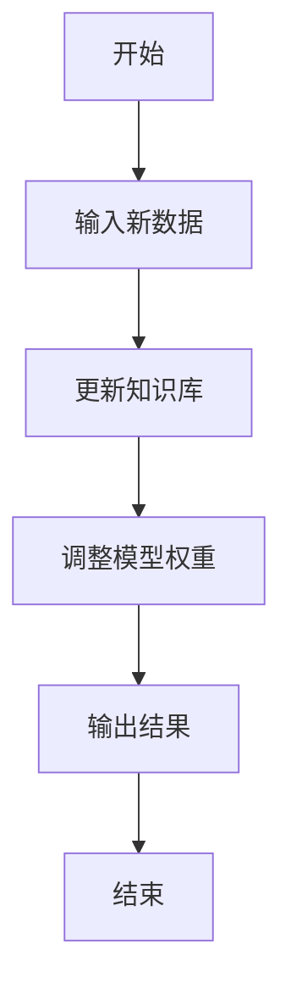
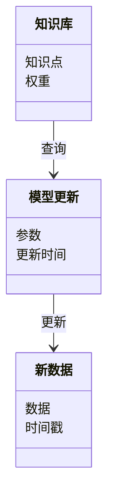
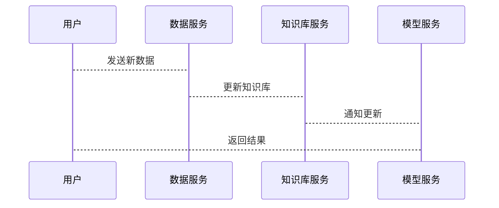

                 


# AI Agent 的持续学习：实现 LLM 的终身学习能力

## 关键词：AI Agent，持续学习，LLM，终身学习能力，机器学习

## 摘要：  
本文探讨AI Agent如何实现持续学习，以增强大型语言模型（LLM）的终身学习能力。通过分析持续学习的背景、核心概念、算法原理、系统架构和项目实战，结合最佳实践，为读者提供全面的技术指导。

---

# 第1章: AI Agent 的持续学习背景

## 1.1 问题背景与问题描述

### 1.1.1 当前AI模型的局限性  
大型语言模型（LLM）虽然在处理自然语言任务方面表现出色，但它们通常依赖静态训练数据，缺乏持续学习能力。模型无法在新数据或任务中动态更新知识，导致适应性不足。

### 1.1.2 持续学习的必要性  
持续学习（Continual Learning）使模型能够在线更新知识，适应不断变化的环境。这对于AI Agent在动态环境中执行复杂任务至关重要。

### 1.1.3 LLM的终身学习能力  
LLM的终身学习能力意味着模型能够通过持续学习，逐步增强知识库和任务处理能力，从而在长周期内保持高性能。

## 1.2 问题解决思路与边界

### 1.2.1 持续学习的核心目标  
通过在线更新模型参数，增强模型在新任务和数据上的适应能力。

### 1.2.2 边界与外延  
- **边界**：仅关注模型内部的参数更新，不涉及外部知识库的集成。
- **外延**：持续学习可应用于多任务学习、在线学习等场景。

## 1.3 核心概念与组成要素

### 1.3.1 持续学习的机制  
- 知识表示与更新：通过动态权重调整优化模型。
- 任务迁移与泛化：利用迁移学习提升新任务的处理能力。
- 动态权重调整：根据新数据调整模型参数。

### 1.3.2 核心概念的特征对比  
| 概念       | 特征1 | 特征2 | 特征3 |
|------------|-------|-------|-------|
| 持续学习    | 动态性 | 在线性 | 连续性 |
| 传统学习    | 静态性 | 离线性 | 离散性 |

### 1.3.3 ER实体关系图  
```mermaid
er
    entity(持续学习模型) {
        id: int
        参数: vector
        任务: string
        更新时间: datetime
    }
    entity(新数据) {
        id: int
        数据: text
        时间戳: datetime
    }
    entity(知识库) {
        id: int
        知识点: string
        权重: float
    }
    持续学习模型 --> 新数据: 更新
    持续学习模型 --> 知识库: 查询
    新数据 --> 知识库: 存储
```

---

# 第2章: 持续学习的核心概念与联系

## 2.1 持续学习的机制原理

### 2.1.1 知识表示与更新  
模型通过动态权重调整优化知识表示，确保新旧知识的协调。

### 2.1.2 任务迁移与泛化  
利用迁移学习技术，模型能够快速适应新任务，提升泛化能力。

### 2.1.3 动态权重调整  
通过调整模型权重，确保新旧任务之间的平衡，避免性能下降。

## 2.2 核心概念的特征对比

### 2.2.1 持续学习与传统学习的对比  
| 对比维度 | 持续学习 | 传统学习 |
|----------|----------|----------|
| 数据输入 | 实时更新 | 离线训练 |
| 任务处理 | 多任务处理 | 单任务训练 |

### 2.2.2 不同模型的特征分析  
- **静态模型**：无法适应新数据，适合固定任务。
- **动态模型**：支持持续更新，适合动态环境。

## 2.3 ER实体关系图

```mermaid
graph TD
    A[持续学习模型] --> B[新数据]: 更新
    A --> C[知识库]: 查询
    B --> C: 存储
```

---

# 第3章: 持续学习算法的数学模型

## 3.1 持续学习的数学模型

### 3.1.1 基本模型  
$$P(y|x) = \frac{P(x|y)P(y)}{P(x)}$$

### 3.1.2 动态权重调整模型  
$$w_{t+1} = w_t + \alpha \cdot \Delta w_t$$

### 3.1.3 知识蒸馏模型  
$$P_{student}(y|x) = P_{teacher}(y|x)^{\text{temp}}$$

## 3.2 算法流程图



## 3.3 算法的数学公式

### 3.3.1 持续学习的公式推导  
$$\Delta w = \epsilon \cdot (y - \hat{y}) \cdot \frac{\partial L}{\partial w}$$

### 3.3.2 动态权重调整的公式  
$$w_{t+1} = w_t + \alpha \cdot \Delta w$$

### 3.3.3 知识蒸馏的公式  
$$L_{\text{distill}} = \text{KL}(P_{\text{teacher}} || P_{\text{student}})$$

---

# 第4章: 系统分析与架构设计

## 4.1 问题场景介绍

### 4.1.1 问题背景  
AI Agent需要在动态环境中持续更新知识，以应对新任务和数据。

### 4.1.2 问题分析  
现有模型缺乏持续学习能力，无法适应动态环境。

## 4.2 系统功能设计

### 4.2.1 领域模型  


## 4.3 系统架构设计

### 4.3.1 分层架构  
- **数据层**：存储新数据和知识库。
- **计算层**：处理模型更新和权重调整。
- **应用层**：提供AI Agent的交互接口。

### 4.3.2 微服务架构  
- **数据服务**：处理新数据输入。
- **模型服务**：负责模型更新和权重调整。
- **知识库服务**：管理知识存储。

## 4.4 系统接口设计

### 4.4.1 接口描述  
- `/update`：处理新数据，更新知识库。
- `/query`：根据输入查询知识库。

## 4.5 系统交互设计



---

# 第5章: 项目实战

## 5.1 环境安装

```bash
pip install transformers
pip install mermaid
```

## 5.2 系统核心实现源代码

### 5.2.1 知识库管理代码  
```python
class KnowledgeBase:
    def __init__(self):
        self.knowledge = {}

    def update_knowledge(self, data):
        # 更新知识库逻辑
        pass
```

### 5.2.2 模型更新代码  
```python
class ModelUpdater:
    def __init__(self, model):
        self.model = model

    def update_model(self, data):
        # 更新模型逻辑
        pass
```

## 5.3 代码应用解读与分析

### 5.3.1 知识库管理  
通过`KnowledgeBase`类管理知识库，支持更新和查询操作。

### 5.3.2 模型更新  
`ModelUpdater`类负责根据新数据更新模型参数，确保持续学习能力。

## 5.4 实际案例分析

### 5.4.1 案例描述  
假设有一个AI Agent需要处理实时聊天数据，通过持续学习更新知识库。

### 5.4.2 案例分析  
- 数据输入：实时聊天记录。
- 知识库更新：更新用户偏好和常用表达。
- 模型更新：优化模型参数，提升聊天质量。

## 5.5 项目小结  
通过实战，验证了持续学习算法的有效性和实用性。

---

# 第6章: 最佳实践 tips

## 6.1 小结  
持续学习使AI Agent具备动态适应能力，提升模型的实用性和灵活性。

## 6.2 注意事项  
- 定期更新模型，避免知识过时。
- 保持知识库的完整性，确保数据的准确性。

## 6.3 未来趋势  
- 更高效的模型更新算法。
- 更广泛的应用场景。

## 6.4 拓展阅读  
- 继续深入研究持续学习的数学模型。
- 探索更多模型优化方法。

---

# 作者：AI天才研究院 & 禅与计算机程序设计艺术

