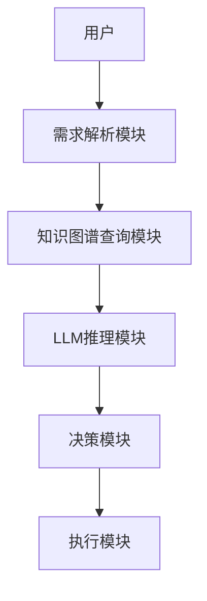
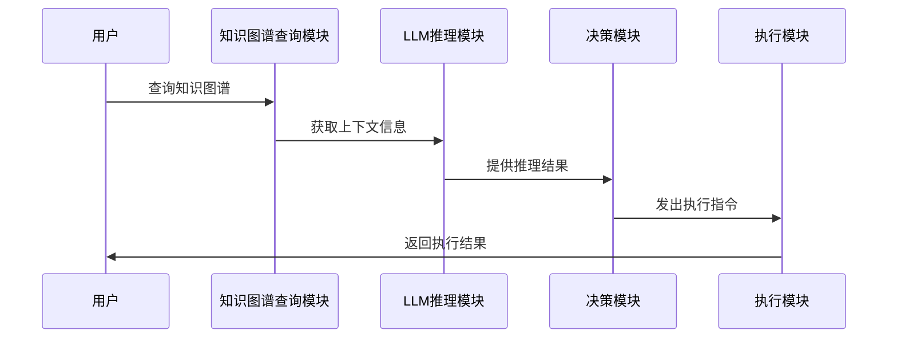

                 


# AI Agent 的知识图谱集成：增强 LLM 的结构化知识

---

## 关键词  
AI Agent, 知识图谱, 大语言模型, 结构化知识, 知识增强, 自然语言处理, 人工智能

---

## 摘要  
随着人工智能技术的快速发展，AI Agent（人工智能代理）在各个领域的应用日益广泛。然而，现有的AI Agent在处理复杂任务时，常常面临知识结构化不足、推理能力有限等问题。为了提升AI Agent的智能水平，将知识图谱与大语言模型（LLM）相结合成为一种有效的解决方案。知识图谱作为一种结构化的知识表示方式，能够为LLM提供丰富的上下文信息，从而增强其理解和推理能力。本文将详细探讨AI Agent与知识图谱的集成方法，分析知识图谱如何增强LLM的结构化知识，并通过实际案例展示其应用价值。

---

# 第1章: AI Agent与知识图谱概述

## 1.1 AI Agent的基本概念  
### 1.1.1 AI Agent的定义与分类  
AI Agent是一种能够感知环境、自主决策并执行任务的智能体。根据功能和应用场景的不同，AI Agent可以分为简单反射型、基于模型的反应型、基于目标的和基于效用的四种类型。

### 1.1.2 AI Agent的核心功能与特点  
- **感知能力**：通过传感器或数据输入感知环境。  
- **推理能力**：基于知识库进行逻辑推理。  
- **决策能力**：根据推理结果做出最优决策。  
- **执行能力**：通过执行机构或API调用完成任务。  

### 1.1.3 AI Agent在AI技术中的地位与作用  
AI Agent是实现人机交互、自动化系统和智能决策的核心技术，广泛应用于机器人、自动驾驶、智能助手等领域。

---

## 1.2 知识图谱的基本概念  
### 1.2.1 知识图谱的定义与特点  
知识图谱是一种以图结构形式表示知识的语义网络，节点表示实体或概念，边表示实体之间的关系。知识图谱具有结构化、语义化和可扩展性强的特点。

### 1.2.2 知识图谱的构建过程与方法  
- **数据采集**：从结构化数据（如数据库）和非结构化数据（如文本）中提取信息。  
- **实体识别与抽取**：通过NLP技术识别文本中的实体和概念。  
- **关系抽取**：识别实体之间的关系并构建边。  
- **知识融合**：将多个来源的知识整合到统一的知识图谱中。  

### 1.2.3 知识图谱的应用场景与价值  
知识图谱广泛应用于搜索引擎优化、智能问答、推荐系统和语义搜索等领域，能够显著提升系统的理解和推理能力。

---

## 1.3 LLM的基本原理与应用  
### 1.3.1 大语言模型的定义与特点  
大语言模型（LLM）是基于深度学习的自然语言处理模型，具有参数规模大、上下文理解能力强和生成能力突出的特点。

### 1.3.2 LLM的核心算法与训练方法  
- **Transformer架构**：通过自注意力机制和前馈网络实现序列建模。  
- **预训练与微调**：通过大规模数据预训练，再针对具体任务进行微调。  

### 1.3.3 LLM在自然语言处理中的应用  
- **文本生成**：如自动写作、代码生成。  
- **问答系统**：如智能客服、知识问答。  
- **文本摘要**：如新闻摘要、会议纪要生成。  

---

## 1.4 AI Agent与知识图谱集成的意义  
### 1.4.1 知识图谱对AI Agent的增强作用  
知识图谱为AI Agent提供了结构化的知识库，增强了其理解和推理能力。  

### 1.4.2 LLM与知识图谱的结合优势  
通过结合知识图谱，LLM能够更好地理解上下文，提升生成内容的准确性和相关性。  

### 1.4.3 集成后的AI Agent在实际应用中的潜力  
- **智能问答**：能够准确回答复杂问题。  
- **推荐系统**：基于知识图谱提供个性化推荐。  
- **复杂任务处理**：如自动驾驶、智能医疗等领域的决策支持。  

---

## 1.5 本章小结  
本章介绍了AI Agent和知识图谱的基本概念、特点及其在AI技术中的作用。同时，分析了知识图谱与LLM结合的意义和潜力，为后续章节的深入探讨奠定了基础。

---

# 第2章: 知识图谱与LLM的集成背景  

## 2.1 当前AI Agent的技术挑战  
### 2.1.1 AI Agent的知识获取与表达问题  
现有AI Agent的知识来源单一，难以应对复杂场景。  

### 2.1.2 LLM的结构化知识处理能力不足  
大语言模型虽然擅长文本处理，但缺乏结构化知识的组织和推理能力。  

### 2.1.3 知识图谱在AI Agent中的应用需求  
通过集成知识图谱，AI Agent可以更好地理解和处理复杂任务。  

---

## 2.2 知识图谱与LLM的结合趋势  
### 2.2.1 知识图谱在LLM中的应用现状  
知识图谱已经在搜索引擎、问答系统等领域展现出显著优势。  

### 2.2.2 LLM对知识图谱的增强作用  
通过LLM的自然语言处理能力，知识图谱可以更好地实现语义理解和生成。  

### 2.2.3 未来AI Agent与知识图谱集成的发展方向  
结合知识图谱与LLM的优势，开发更智能、更高效的AI Agent。  

---

## 2.3 本章小结  
本章分析了知识图谱与LLM集成的背景和趋势，强调了两者结合的重要性和未来发展方向。

---

# 第3章: 知识图谱与LLM的集成原理  

## 3.1 知识图谱的构建与表示  
### 3.1.1 知识图谱的构建方法  
通过数据清洗、实体识别和关系抽取等步骤构建知识图谱。  

### 3.1.2 知识图谱的表示形式  
知识图谱可以用RDF（资源描述框架）或图数据库（如Neo4j）进行存储和表示。  

### 3.1.3 知识图谱的标准化与共享  
通过标准化接口和共享平台，促进知识图谱的广泛应用。  

---

## 3.2 LLM的结构化知识处理能力  
### 3.2.1 LLM的文本理解能力  
通过上下文理解和意图识别，LLM能够准确解析用户需求。  

### 3.2.2 LLM的文本生成能力  
基于预训练和微调，LLM能够生成高质量的文本内容。  

### 3.2.3 LLM的推理能力  
通过结合知识库，LLM可以进行简单的逻辑推理。  

---

## 3.3 知识图谱与LLM的集成方式  
### 3.3.1 知识图谱作为LLM的外部知识库  
将知识图谱作为LLM的外部知识库，通过查询获取相关信息。  

### 3.3.2 知识图谱与LLM的联合训练  
在训练过程中整合知识图谱，提升模型的结构化知识能力。  

### 3.3.3 知识图谱与LLM的混合推理  
结合知识图谱和LLM的优势，进行联合推理和决策。  

---

## 3.4 本章小结  
本章详细探讨了知识图谱与LLM的集成方式和原理，为后续的系统设计和实现提供了理论基础。

---

# 第4章: 知识图谱与LLM集成的核心算法  

## 4.1 知识图谱的构建算法  
### 4.1.1 实体识别与抽取算法  
- **规则抽取**：基于预定义的规则进行实体识别。  
- **模式匹配**：通过正则表达式匹配特定模式。  

### 4.1.2 关系抽取与构建算法  
- **基于相似度的推理**：通过计算实体之间的相似度构建关系。  
- **基于规则的推理**：通过预定义的规则构建关系。  

### 4.1.3 知识融合与优化算法  
- **冲突检测与解决**：检测知识图谱中的冲突并进行优化。  
- **知识扩展与更新**：动态更新知识图谱以适应新数据。  

---

## 4.2 LLM的知识增强算法  
### 4.2.1 基于知识图谱的提示学习  
通过向LLM提供知识图谱中的上下文信息，提升生成结果的准确性。  

### 4.2.2 知识图谱与LLM的联合训练  
在训练过程中整合知识图谱，提升模型的结构化知识能力。  

### 4.2.3 知识图谱驱动的推理增强算法  
通过知识图谱中的关系推理，提升LLM的逻辑推理能力。  

---

## 4.3 算法实现与优化  
### 4.3.1 算法实现的步骤与流程  
1. 数据预处理：清洗和标注数据。  
2. 实体识别与关系抽取：使用NLP工具识别实体和关系。  
3. 知识图谱构建：存储实体和关系到图数据库。  
4. LLM的训练与优化：结合知识图谱进行微调。  

### 4.3.2 算法优化的关键点  
- **数据质量**：确保数据的准确性和完整性。  
- **模型参数**：优化模型的超参数以提升性能。  
- **计算效率**：通过并行计算和分布式训练提升效率。  

### 4.3.3 算法实现的代码示例  
```python
import neo4j
from neo4j.exceptions import Neo4jError

# 连接到知识图谱数据库
driver = neo4j.Driver('bolt://localhost:7687', auth=('neo4j', 'password'))

# 插入数据
def insert_data(tx, entity, relation, target):
    tx.run("MATCH (a {name: $entity}) "
            "CREATE (a)-[r:$relation]->(b {name: $target})",
            entity=entity, relation=relation, target=target)

with driver.session() as session:
    session.write_transaction(insert_data, "Alice", "knows", "Bob")
```

---

## 4.4 本章小结  
本章详细探讨了知识图谱与LLM集成的核心算法，包括知识图谱的构建算法和LLM的知识增强算法，并通过代码示例展示了算法的实现过程。

---

# 第5章: 系统架构与设计  

## 5.1 系统功能设计  
### 5.1.1 知识图谱构建模块  
- 实体识别与关系抽取。  
- 知识图谱的存储与管理。  

### 5.1.2 LLM集成模块  
- LLM的训练与微调。  
- 知识图谱与LLM的交互接口。  

### 5.1.3 AI Agent功能模块  
- 感知环境并解析需求。  
- 基于知识图谱和LLM进行推理和决策。  
- 执行任务并反馈结果。  

---

## 5.2 系统架构设计  
### 5.2.1 系统功能模型  


### 5.2.2 系统架构图  


### 5.2.3 系统接口设计  
- **知识图谱查询接口**：提供基于实体和关系的查询功能。  
- **LLM调用接口**：提供LLM的API接口，支持文本生成和推理。  

---

## 5.3 系统交互设计  
### 5.3.1 系统交互流程  


---

## 5.4 本章小结  
本章从系统架构和功能设计的角度，详细描述了AI Agent与知识图谱集成的整体框架，并通过图示展示了系统的交互流程和架构设计。

---

# 第6章: 项目实战与案例分析  

## 6.1 项目环境安装  
### 6.1.1 知识图谱数据库安装  
- **Neo4j**：下载并安装Neo4j社区版。  
- **PythonNeo4j库**：通过pip安装`python-neo4j`库。  

### 6.1.2 LLM框架安装  
- **Hugging Face**：安装`transformers`和`torch`库。  
- **OpenAI API**：安装`openai`库并配置API密钥。  

---

## 6.2 系统核心实现  
### 6.2.1 知识图谱构建  
```python
# 数据清洗
import pandas as pd
df = pd.read_csv('data.csv')
df.dropna(inplace=True)

# 实体识别
from spacy.lang.zh import Chinese
nlp = Chinese()
doc = nlp(df['text'][0])
entities = [ent.text for ent in doc.ents]

# 关系抽取
from spacy.matcher import Matcher
matcher = Matcher(nlp.vocab)
pattern = [{'POS': 'NOUN'}, {'REL': '主谓关系'}]
matcher.add('Relation', None, pattern)
matches = matcher(doc)
```

### 6.2.2 LLM的知识增强  
```python
from transformers import AutoTokenizer, AutoModelForCausalLM
tokenizer = AutoTokenizer.from_pretrained('gpt2')
model = AutoModelForCausalLM.from_pretrained('gpt2')
inputs = tokenizer("Given the knowledge graph, answer the following question:", return_tensors='np')
outputs = model.generate(**inputs, max_length=50)
print(tokenizer.decode(outputs[0].tolist()[0]))
```

---

## 6.3 案例分析与详细解读  
### 6.3.1 案例背景  
假设我们正在开发一个智能医疗AI Agent，用于辅助医生进行诊断和治疗建议。  

### 6.3.2 知识图谱构建  
构建包含疾病、症状、治疗方法等实体和关系的知识图谱。  

### 6.3.3 系统实现  
- **需求解析**：用户输入症状，系统解析需求。  
- **知识图谱查询**：查询相关疾病和治疗方法。  
- **LLM推理**：结合知识图谱和LLM生成诊断建议。  

### 6.3.4 案例结果  
系统能够准确识别用户症状，并结合知识图谱和LLM生成个性化的诊断建议。  

---

## 6.4 本章小结  
本章通过一个实际案例，详细展示了知识图谱与LLM集成的实现过程，包括环境安装、系统核心实现和案例分析。

---

# 第7章: 最佳实践与总结  

## 7.1 最佳实践 tips  
### 7.1.1 知识图谱的构建与管理  
- 确保数据质量和多样性。  
- 定期更新和优化知识图谱。  

### 7.1.2 LLM的训练与优化  
- 选择适合的模型和训练数据。  
- 优化模型参数和推理策略。  

### 7.1.3 系统的部署与维护  
- 确保系统的可扩展性和稳定性。  
- 定期监控和维护系统性能。  

---

## 7.2 总结与展望  
本章总结了知识图谱与LLM集成的关键点和最佳实践，并展望了未来的发展方向，包括更智能的知识图谱构建算法和更高效的LLM推理方法。

---

## 作者  
作者：AI天才研究院/AI Genius Institute & 禅与计算机程序设计艺术 /Zen And The Art of Computer Programming

