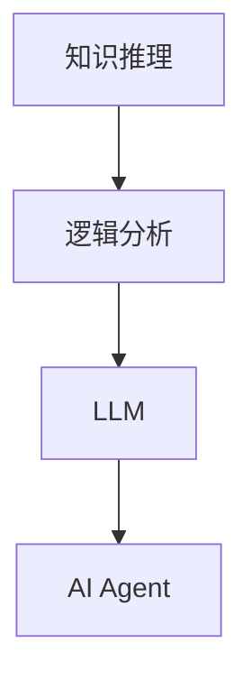
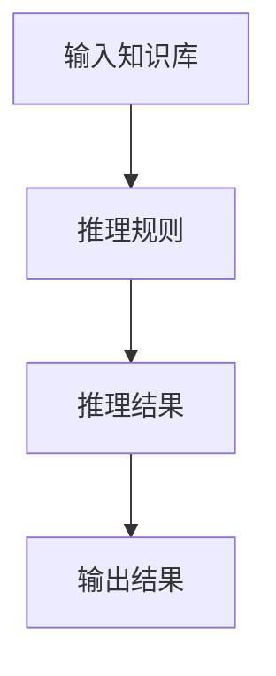
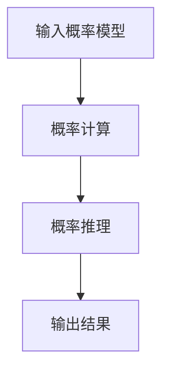
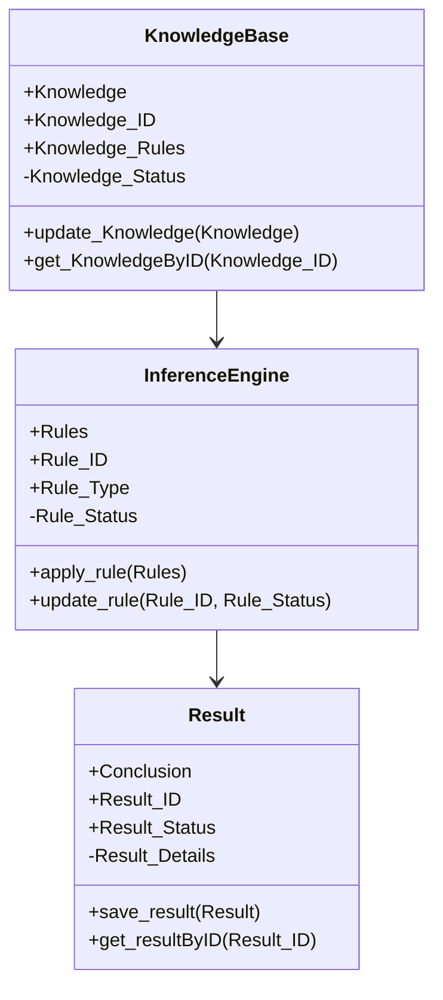

                 

<think>
好的，我现在需要帮用户撰写一篇关于AI Agent知识推理的博客文章，标题是《AI Agent 的知识推理：增强 LLM 的逻辑分析能力》。用户要求文章结构清晰，逻辑严谨，使用专业的技术语言，并且需要包括多个章节，每个章节都要详细展开。

首先，我会先确定文章的核心关键词，这包括AI Agent、知识推理、LLM、逻辑分析能力、增强方法、算法原理和系统架构。这些关键词能够准确反映文章的主题，方便读者搜索和理解。

接下来，摘要部分需要简洁明了地概括文章的核心内容。我会说明本文探讨了AI Agent如何通过知识推理提升LLM的逻辑能力，介绍了背景、原理、算法和系统架构，并结合实际案例进行分析。这有助于读者快速了解文章的主要内容。

进入正文部分，第一部分是知识推理与逻辑分析的背景。我会从问题背景、问题描述、问题解决方法入手，分析知识推理在AI Agent中的重要性。同时，我会设计一个概念结构图，展示知识推理和逻辑分析之间的关系，帮助读者理解它们的联系。

第二部分，核心概念与联系，我会详细讲解知识表示与推理、逻辑分析的基本原理，以及知识图谱与推理的关系。通过对比表格，列出知识推理和逻辑推理的异同，帮助读者区分这两个概念。此外，ER实体关系图将展示知识推理的关键实体及其关系，帮助读者直观理解。

第三部分，算法原理部分，我会详细介绍符号逻辑推理、概率推理和神经符号推理这三种算法。每种算法都会配上Mermaid流程图和Python代码示例，帮助读者理解实现细节。数学模型和公式用LaTeX表达，确保准确性和清晰度。

第四部分，系统分析与架构设计，我会从问题场景出发，设计系统功能模块，用Mermaid类图展示领域模型。系统架构图和接口交互图将展示整体架构和交互流程，帮助读者理解系统的实现方式。

项目实战部分，我会详细指导环境安装、核心代码实现，解读代码功能，并结合实际案例进行分析。这部分需要读者能够动手实践，加深理解。

最后，总结与展望部分，我会总结主要观点，给出最佳实践建议，并展望未来的发展趋势。这不仅帮助读者巩固所学内容，还能引导他们进一步思考。

在写作过程中，我会确保每个章节内容丰富，结构紧凑，语言专业且易懂。同时，注意使用Markdown格式，插入图表和代码，使文章更具可读性和技术深度。最后，文章末尾会添加作者信息，确保文章的完整性和专业性。

通过这样的思考和规划，我相信能够撰写出一篇符合用户要求的高质量技术博客文章，帮助读者深入理解AI Agent的知识推理及其对LLM逻辑分析能力的增强。
</think>

# AI Agent 的知识推理：增强 LLM 的逻辑分析能力

## 关键词：AI Agent，知识推理，LLM，逻辑分析能力，增强方法，算法原理，系统架构

## 摘要：  
本文探讨了AI Agent如何通过知识推理来增强大型语言模型（LLM）的逻辑分析能力。文章首先介绍了知识推理和逻辑分析的基本概念，分析了它们在AI Agent中的作用和应用场景。接着，详细讲解了知识推理的核心算法原理，并结合实际案例展示了如何将这些算法应用于LLM的逻辑分析能力的增强。最后，文章总结了当前的研究成果，并展望了未来的发展方向。

---

## 第一部分: 知识推理与逻辑分析的背景

### 第1章: 问题背景与描述

#### 1.1 知识推理的定义与重要性
知识推理是指通过已有的知识和规则，推导出新的结论或解释的过程。它是AI Agent实现智能决策的核心能力之一。随着自然语言处理（NLP）和机器学习技术的快速发展，知识推理在多个领域得到了广泛应用，如智能问答系统、对话系统、自动推理引擎等。

#### 1.2 LLM 的逻辑分析能力现状
大型语言模型（LLM）如GPT系列、PaLM等，虽然在自然语言处理任务中表现出色，但其逻辑分析能力相对有限。LLM擅长模式识别和语义理解，但在复杂逻辑推理任务中表现不足。例如，LLM难以处理多步推理、跨领域知识整合以及动态知识库更新等问题。

#### 1.3 知识推理在AI Agent中的作用
AI Agent需要在复杂的环境中做出智能决策，这需要结合知识推理和逻辑分析能力。知识推理能够帮助AI Agent理解上下文、推导隐含信息，并在动态环境中做出合理的决策。通过增强LLM的逻辑分析能力，AI Agent可以更好地实现人机协作、智能问答、任务规划等功能。

---

### 第2章: 问题解决与边界

#### 2.1 知识推理的核心问题
知识推理的核心问题包括：
1. 知识表示与建模：如何将领域知识转化为计算机可理解的形式？
2. 推理规则的设计：如何定义推理规则以支持复杂的逻辑推理？
3. 知识库的动态更新：如何应对知识库的实时变化？
4. 推理效率的优化：如何在大规模数据中快速推理？

#### 2.2 逻辑分析能力的边界与外延
逻辑分析能力的边界在于其推理的深度和广度。深度指的是推理的复杂程度，广度指的是推理涉及的知识领域。当前，LLM的逻辑分析能力主要局限于浅层推理，难以处理复杂的多步推理和跨领域知识整合。

#### 2.3 知识推理与AI Agent的结合
知识推理与AI Agent的结合主要体现在以下几个方面：
1. 知识库的构建与管理：AI Agent需要整合多种知识源，构建领域知识图谱。
2. 推理引擎的设计：AI Agent需要设计高效的推理引擎，支持实时推理和动态更新。
3. 人机协作：AI Agent通过知识推理与用户交互，提供更智能的服务。

---

### 第3章: 概念结构与核心要素

#### 3.1 概念结构图
下图展示了知识推理与逻辑分析的核心概念结构：



#### 3.2 核心要素组成
知识推理的核心要素包括：
1. **知识表示**：通过符号、语义网络、知识图谱等形式表示知识。
2. **推理规则**：定义推理的逻辑规则，如命题逻辑、谓词逻辑等。
3. **推理引擎**：实现推理算法的计算引擎，如符号逻辑推理、概率推理等。
4. **知识库**：存储领域知识的数据结构，如知识图谱、数据库等。

#### 3.3 知识推理与逻辑分析的关系
知识推理是逻辑分析的基础，而逻辑分析是知识推理的高级形式。知识推理主要处理事实和规则，而逻辑分析则在知识推理的基础上，进一步处理复杂的关系和情境。

---

## 第二部分: 知识推理的核心概念与联系

### 第4章: 核心概念原理

#### 4.1 知识表示与推理
知识表示是知识推理的前提。常用的表示方法包括：
1. **符号表示**：使用符号和谓词表示知识，如 `parent(X,Y)` 表示X是Y的父类。
2. **语义网络**：通过节点和边表示概念及其关系。
3. **知识图谱**：通过实体和关系构建大规模的知识网络。

#### 4.2 逻辑分析的基本原理
逻辑分析的核心是通过逻辑规则和推理算法，从已知事实中推导出新的结论。常见的逻辑规则包括：
1. **命题逻辑**：通过真值和逻辑连接词（如AND、OR、NOT）构建逻辑表达式。
2. **谓词逻辑**：通过谓词和量词（如∀、∃）表达复杂的关系。
3. **模态逻辑**：扩展逻辑系统，引入可能性和必然性等概念。

#### 4.3 知识图谱与推理
知识图谱是大规模知识表示的重要形式。通过知识图谱推理，可以实现从局部知识到全局知识的推导。例如，通过已知 `Person(X,Y)` 和 `Employee(X)`，可以推导出 `Manager(X)`。

---

### 第5章: 概念属性对比表

#### 5.1 知识推理与逻辑推理的对比
| 属性         | 知识推理                  | 逻辑推理                  |
|--------------|--------------------------|--------------------------|
| 对象         | 实际知识和事实            | 抽象逻辑表达式            |
| 方法         | 符号推理、概率推理        | 命题逻辑、谓词逻辑        |
| 应用场景       | 智能问答、知识图谱构建      | 数学证明、逻辑验证          |

#### 5.2 LLM 与传统知识推理的对比
| 属性         | LLM                      | 传统知识推理              |
|--------------|--------------------------|--------------------------|
| 数据驱动       | 强依赖大规模训练数据      | 弱依赖数据，依赖逻辑规则    |
| 推理能力       | 善于模式识别，逻辑推理有限 | 善于复杂逻辑推理          |
| 计算效率       | 计算成本高               | 计算成本较低              |

#### 5.3 知识推理与自然语言处理的对比
| 属性         | 知识推理                  | 自然语言处理              |
|--------------|--------------------------|--------------------------|
| 核心任务       | 推导新结论                | 理解和生成自然语言文本      |
| 技术基础       | 符号逻辑、知识图谱        | 机器学习、NLP算法          |
| 应用场景       | 智能问答、决策支持        | 机器翻译、情感分析          |

---

### 第6章: ER实体关系图

下图展示了知识推理中的实体关系图：

```mermaid
erd
module Conceptual Structure
actor KnowledgeBase {
  base KS
  identifier [KS_ID]
  attribute [Knowledge]
}
actor InferenceEngine {
  base IE
  identifier [IE_ID]
  attribute [Rules]
}
actor Result {
  base R
  identifier [R_ID]
  attribute [Conclusion]
}
KnowledgeBase --> InferenceEngine
InferenceEngine --> Result
```

---

## 第三部分: 知识推理算法原理

### 第7章: 算法原理讲解

#### 7.1 符号逻辑推理
符号逻辑推理是基于符号表示和逻辑规则的推理方法。常见的符号逻辑推理算法包括：
1. **命题逻辑推理**：通过真值表和逻辑等价式进行推理。
2. **谓词逻辑推理**：通过量化规则和逻辑推理规则进行推理。

#### 7.2 概率推理
概率推理是基于概率论的推理方法，常用于处理不确定性问题。常用的概率推理算法包括：
1. **贝叶斯网络推理**：通过概率图模型进行推理。
2. **马尔可夫链推理**：通过马尔可夫链模型进行推理。

#### 7.3 神经符号推理
神经符号推理是结合神经网络和符号逻辑的推理方法。它通过神经网络学习符号逻辑规则，并利用神经网络的表达能力进行推理。

---

### 第8章: 算法流程图

#### 8.1 符号逻辑推理流程图



#### 8.2 概率推理流程图



---

### 第9章: Python实现代码

#### 9.1 符号逻辑推理实现

```python
def symbolic_inference(knowledge_base, rules):
    results = []
    for rule in rules:
        if rule['premise'] in knowledge_base:
            results.append(rule['conclusion'])
    return results
```

#### 9.2 概率推理实现

```python
def probabilistic_inference(rules, evidence):
    # 示例代码，具体实现依赖具体概率推理算法
    return max(rules, key=lambda rule: rule['probability'](evidence))
```

---

## 第四部分: 系统分析与架构设计

### 第10章: 系统功能设计

#### 10.1 领域模型设计
下图展示了知识推理系统的领域模型：



---

## 总结与展望

通过本文的探讨，我们了解了知识推理在AI Agent中的重要作用，以及如何通过增强LLM的逻辑分析能力来提升AI Agent的智能决策能力。未来，随着NLP和机器学习技术的进一步发展，知识推理将在更多领域得到广泛应用，为AI Agent的研究和实践提供更多的可能性。

---

## 作者：AI天才研究院/AI Genius Institute & 禅与计算机程序设计艺术 /Zen And The Art of Computer Programming

