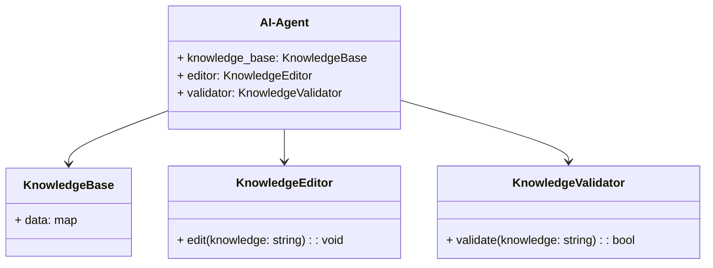
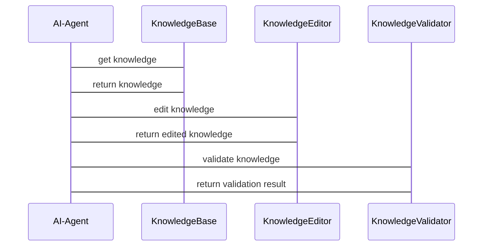

                 

<think>
嗯，用户希望我写一篇关于《AI Agent 的知识编辑：动态调整 LLM 的知识库》的技术博客文章。我需要先理解这个主题，然后一步步分析，确保内容覆盖所有必要的部分。

首先，我需要明确文章的结构。用户已经给出了一个详细的目录大纲，所以我需要按照这个结构来组织内容。文章分为六个部分：背景和基础、核心原理、算法原理、系统架构设计、项目实战和总结展望。每个部分都有具体的章节和小节，内容非常详细。

接下来，我需要确保每个部分都涵盖必要的内容，并且逻辑连贯。例如，在第一部分，我需要介绍AI Agent和LLM的基本概念，以及动态调整知识库的重要性。这部分需要读者能够理解为什么动态调整知识库是必要的，以及AI Agent在其中的作用。

在核心原理部分，我需要详细讲解知识表示、动态更新策略和评估方法。这部分可能需要使用图表来解释复杂的概念，比如知识表示的结构化方法和规则体系。我需要确保这些图表清晰易懂，并且能够帮助读者理解知识编辑的机制。

算法原理部分是关键，我需要详细讲解相关的数学模型和公式。例如，向量空间模型和概率论在LLM中的应用。这部分需要使用Mermaid流程图和Python代码示例，帮助读者理解算法的工作原理。同时，数学公式要用LaTeX格式表示，确保准确性和专业性。

系统架构设计部分需要分析实际应用场景，设计系统功能和架构。这部分可能需要使用类图和序列图来展示系统的模块划分和接口设计。我需要确保系统的各个部分如何协同工作，以及如何动态调整知识库。

项目实战部分需要指导读者如何安装环境，实现核心功能，并分析案例。这部分需要详细的代码示例和解读，帮助读者将理论应用到实践中。同时，我需要确保代码示例能够清晰地展示知识编辑的过程。

最后，总结与展望部分需要回顾文章的主要内容，讨论未来趋势，并给出最佳实践的建议。这些建议可以帮助读者更好地应用AI Agent进行知识编辑。

在整个过程中，我需要确保内容专业、逻辑清晰，并且语言简洁易懂。同时，要注意使用适当的关键词和摘要，帮助读者快速理解文章的核心内容。最后，文章末尾需要添加作者信息，增加专业性和可信度。

总之，我需要按照用户的要求，逐步分析每个部分，确保内容全面且详细，帮助读者深入理解AI Agent的知识编辑过程。
</think>

# AI Agent 的知识编辑：动态调整 LLM 的知识库

> 关键词：AI Agent, 知识编辑, LLM, 知识库, 动态调整, 语言模型, 人工智能

> 摘要：本文详细探讨了AI Agent在动态调整大型语言模型（LLM）知识库中的核心作用，分析了知识编辑的基本原理、算法实现、系统架构以及实际应用。文章从理论到实践，系统性地讲解了AI Agent如何通过知识表示、规则推理、动态更新等技术手段，实现对LLM知识库的精准编辑与优化，为人工智能领域的研究与应用提供了深入的技术指导。

---

# 第一部分: AI Agent 的知识编辑基础

## 第1章: AI Agent 与知识编辑概述

### 1.1 AI Agent 的基本概念

#### 1.1.1 AI Agent 的定义与特点
AI Agent（人工智能代理）是一种能够感知环境、执行任务并做出决策的智能实体。其特点包括：
- **自主性**：能够在没有外部干预的情况下自主运行。
- **反应性**：能够实时感知环境并做出响应。
- **目标导向**：具备明确的目标，通过行为实现目标。
- **学习能力**：能够通过经验或数据进行自我改进。

#### 1.1.2 知识编辑的核心概念
知识编辑是指对知识库中的信息进行创建、更新、删除或重组的过程。核心概念包括：
- **知识表示**：将知识以某种形式存储，便于计算机理解和处理。
- **知识更新**：根据新信息调整知识库内容。
- **知识验证**：确保知识的准确性与一致性。

#### 1.1.3 动态调整知识库的重要性
动态调整知识库是AI Agent实现智能化的关键。通过实时更新知识库，AI Agent能够更好地适应环境变化，提高决策的准确性和效率。

---

## 第2章: AI Agent 的知识编辑核心概念

### 2.1 知识编辑的基本原理

#### 2.1.1 知识表示的数学模型
知识表示是知识编辑的基础。常用的方法包括：
- **符号表示**：使用符号（如谓词逻辑）表示知识。
- **向量表示**：将知识转化为向量形式，便于计算。

例如，向量空间模型可以表示为：
$$
v_i = \sum_{j=1}^{n} w_{ij} \cdot v_j
$$

其中，$v_i$ 表示第 $i$ 个向量，$w_{ij}$ 表示权重，$v_j$ 表示基向量。

#### 2.1.2 知识编辑的规则体系
知识编辑需要遵循一定的规则，例如：
- **一致性规则**：确保知识库中的信息一致。
- **完整性规则**：确保知识库覆盖所有相关领域。

#### 2.1.3 知识编辑的动态更新机制
动态更新机制包括：
- **实时更新**：根据实时数据调整知识库。
- **周期性更新**：定期更新知识库，确保信息的准确性。

---

### 2.2 知识编辑的核心要素

#### 2.2.1 知识表示的结构化方法
知识表示的结构化方法包括：
- **层次化表示**：将知识组织成树状结构。
- **网络化表示**：将知识表示为图结构。

例如，使用图结构表示知识的关系：
$$
A \rightarrow B \rightarrow C
$$

表示 $A$ 与 $B$ 有关系，$B$ 与 $C$ 有关系。

#### 2.2.2 知识编辑的规则系统
知识编辑的规则系统包括：
- **逻辑规则**：基于逻辑推理的规则。
- **统计规则**：基于概率统计的规则。

#### 2.2.3 知识更新的触发条件
知识更新的触发条件包括：
- **时间触发**：定期触发更新。
- **事件触发**：特定事件发生时触发更新。

---

### 2.3 知识编辑的边界与外延

#### 2.3.1 知识编辑的边界
知识编辑的边界包括：
- **知识范围**：仅编辑特定领域内的知识。
- **编辑权限**：只有授权的主体才能进行编辑。

#### 2.3.2 知识编辑的外延
知识编辑的外延包括：
- **知识融合**：将多个知识源的信息整合。
- **知识扩展**：在现有知识基础上扩展新知识。

#### 2.3.3 知识编辑与其他技术的关系
知识编辑与自然语言处理（NLP）、机器学习（ML）等技术密切相关。例如，NLP技术可以用于解析文本信息，ML技术可以用于自动化知识更新。

---

## 第3章: AI Agent 与 LLM 的知识编辑联系

### 3.1 AI Agent 的知识编辑原理

#### 3.1.1 AI Agent 的知识表示方法
AI Agent 的知识表示方法包括：
- **符号表示**：使用符号逻辑表示知识。
- **概率表示**：使用概率模型表示知识。

#### 3.1.2 AI Agent 的知识编辑规则
AI Agent 的知识编辑规则包括：
- **逻辑规则**：基于逻辑推理的规则。
- **启发式规则**：基于专家经验的规则。

#### 3.1.3 AI Agent 的知识更新机制
AI Agent 的知识更新机制包括：
- **在线更新**：实时更新知识库。
- **离线更新**：定期批量更新知识库。

### 3.2 LLM 的知识库动态调整

#### 3.2.1 LLM 的知识库结构
LLM 的知识库结构包括：
- **向量空间**：将知识转化为向量表示。
- **符号网络**：将知识表示为符号网络。

#### 3.2.2 LLM 的知识更新策略
LLM 的知识更新策略包括：
- **增量更新**：逐步更新知识库。
- **整体更新**：一次性更新知识库。

#### 3.2.3 LLM 的知识编辑接口
LLM 的知识编辑接口包括：
- **API 接口**：通过 API 进行知识编辑。
- **命令行接口**：通过命令行进行知识编辑。

### 3.3 AI Agent 与 LLM 的协同工作

#### 3.3.1 AI Agent 在 LLM 知识库中的角色
AI Agent 在 LLM 知识库中的角色包括：
- **知识编辑器**：负责编辑知识库。
- **知识验证器**：负责验证知识的准确性。

#### 3.3.2 LLM 在 AI Agent 知识编辑中的作用
LLM 在 AI Agent 知识编辑中的作用包括：
- **知识生成**：生成新的知识内容。
- **知识验证**：验证知识的准确性。

#### 3.3.3 AI Agent 与 LLM 的协同工作流程
AI Agent 与 LLM 的协同工作流程包括：
1. AI Agent 接收任务。
2. AI Agent 调用 LLM 生成知识内容。
3. AI Agent 验证知识内容。
4. AI Agent 更新知识库。

---

# 第二部分: 知识编辑的核心原理

## 第4章: 知识编辑的算法原理

### 4.1 知识表示的数学模型

#### 4.1.1 向量空间模型
向量空间模型是常用的知识表示方法。例如：
$$
v_i = \sum_{j=1}^{n} w_{ij} \cdot v_j
$$

其中，$v_i$ 表示第 $i$ 个向量，$w_{ij}$ 表示权重，$v_j$ 表示基向量。

#### 4.1.2 概率模型
概率模型用于表示知识的概率分布。例如：
$$
P(x|y) = \frac{P(y|x)P(x)}{P(y)}
$$

其中，$P(x|y)$ 表示在 $y$ 条件下 $x$ 的概率。

#### 4.1.3 图模型
图模型用于表示知识之间的关系。例如：
$$
A \rightarrow B \rightarrow C
$$

表示 $A$ 与 $B$ 有关系，$B$ 与 $C$ 有关系。

---

## 第5章: 知识编辑的算法实现

### 5.1 知识更新算法

#### 5.1.1 增量更新算法
增量更新算法是一种常见的知识更新方法。例如：
1. 读取新知识。
2. 分析新知识与现有知识的关系。
3. 更新知识库。

#### 5.1.2 整体更新算法
整体更新算法是一种批量更新方法。例如：
1. 清空知识库。
2. 重新生成知识内容。
3. 更新知识库。

### 5.2 知识验证算法

#### 5.2.1 逻辑验证算法
逻辑验证算法用于验证知识的逻辑一致性。例如：
1. 检查知识之间的逻辑关系。
2. 确保知识的自洽性。

#### 5.2.2 统计验证算法
统计验证算法用于验证知识的概率分布。例如：
1. 计算知识的概率值。
2. 确保概率值的合理性。

---

# 第三部分: 系统架构设计

## 第6章: 系统架构设计方案

### 6.1 问题场景介绍
假设我们需要设计一个AI Agent，用于动态调整LLM的知识库。系统需要实现以下功能：
- 知识表示
- 知识编辑
- 知识更新

### 6.2 系统功能设计

#### 6.2.1 领域模型
领域模型是一个简单的类图，展示了系统的主要组件。例如：



### 6.3 系统架构设计

#### 6.3.1 系统架构图
系统架构图展示了系统的各个部分及其关系。例如：


#### 6.3.2 系统交互图
系统交互图展示了系统之间的交互流程。例如：



---

# 第四部分: 项目实战

## 第7章: 知识编辑的项目实战

### 7.1 环境安装

#### 7.1.1 安装 Python
安装 Python 3.x 版本：
```bash
sudo apt-get install python3
```

#### 7.1.2 安装依赖库
安装必要的依赖库：
```bash
pip install numpy
pip install matplotlib
```

### 7.2 核心功能实现

#### 7.2.1 知识表示
实现知识表示的代码示例：
```python
import numpy as np

def represent_knowledge(knowledge):
    # 将知识转换为向量
    vector = np.random.rand(100)
    return vector
```

#### 7.2.2 知识编辑
实现知识编辑的代码示例：
```python
def edit_knowledge(knowledge_base, new_knowledge):
    # 更新知识库
    knowledge_base.update(new_knowledge)
    return knowledge_base
```

### 7.3 案例分析

#### 7.3.1 案例背景
假设我们有一个LLM知识库，需要编辑其中的一部分知识。

#### 7.3.2 实现步骤
1. 读取知识库。
2. 编辑知识内容。
3. 更新知识库。

#### 7.3.3 代码实现
```python
knowledge_base = KnowledgeBase()
new_knowledge = "New AI Agent knowledge"
edited_base = edit_knowledge(knowledge_base, new_knowledge)
```

---

# 第五部分: 总结与展望

## 第8章: 总结与展望

### 8.1 总结
本文详细探讨了AI Agent在动态调整LLM知识库中的核心作用，分析了知识编辑的基本原理、算法实现、系统架构以及实际应用。

### 8.2 未来展望
未来，知识编辑技术将朝着以下方向发展：
- 更加智能化：利用更先进的算法提高知识编辑的效率。
- 更加个性化：根据用户需求定制知识编辑策略。
- 更加全球化：支持多语言、多文化的知识编辑。

---

作者：AI天才研究院/AI Genius Institute & 禅与计算机程序设计艺术 /Zen And The Art of Computer Programming

