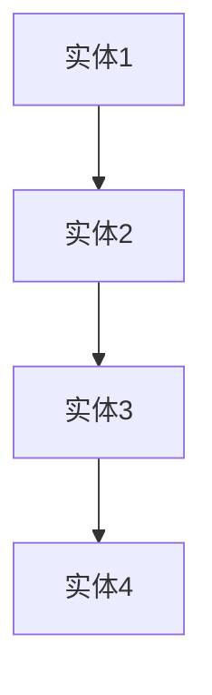
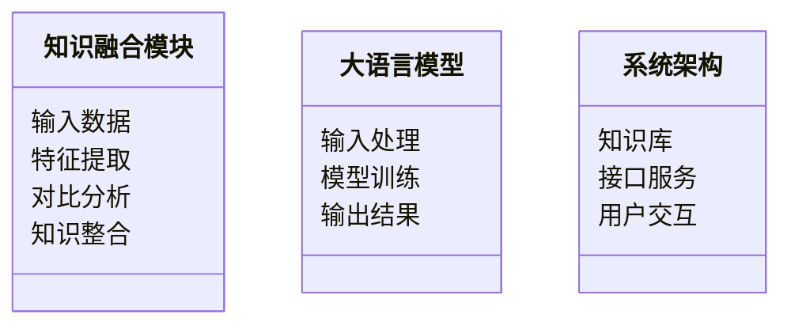
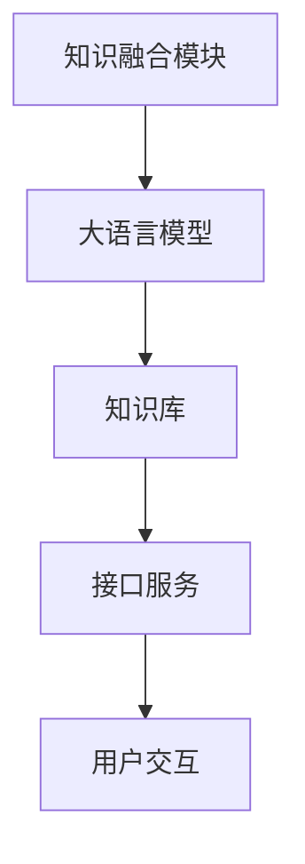
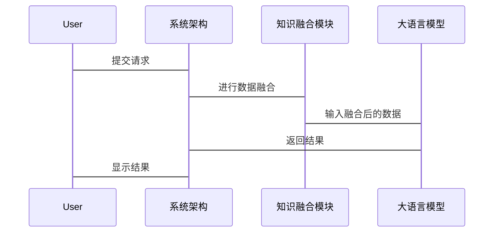

                 

<think>
好的，现在我要帮用户写一篇关于《AI Agent 的知识融合：整合多源信息增强 LLM》的技术博客文章。用户给了我一个详细的目录大纲，还附带了一些示例内容。我的任务是按照这个结构，详细展开每一部分，确保内容丰富、具体，并且符合技术博客的风格。

首先，我需要理解整个主题。AI Agent的知识融合指的是将多源信息整合起来，增强大语言模型的能力。这意味着我需要涵盖AI Agent的基本概念、知识融合的方法、算法原理，以及如何将这些应用到实际项目中。

接下来，我看看目录结构。文章分为五大部分：背景介绍、核心概念与联系、算法原理、系统分析与架构设计、项目实战，最后是总结和扩展。每一部分都有详细的章节，包括背景、概念、算法、系统设计和实战案例。

首先，从背景介绍开始。我需要解释AI Agent是什么，为什么它们重要，以及知识融合的重要性。这部分需要让读者明白问题的背景和意义。

然后是核心概念与联系。这里需要详细讲解知识融合的原理，可能涉及特征对比和实体关系图。我可能需要用Mermaid流程图来展示这些概念，帮助读者更好地理解。

接下来是算法原理。这部分需要深入讲解向量空间模型和注意力机制。我需要用Mermaid流程图展示算法步骤，并附上Python代码示例，确保读者能够理解并实际应用这些算法。

然后是系统分析与架构设计。这部分需要介绍项目背景，设计系统功能，可能用领域模型类图展示。然后是系统架构图，展示各个模块如何交互，以及接口设计和交互流程。

项目实战部分，我需要提供一个具体的案例，比如医疗信息整合。从环境安装开始，逐步指导读者如何实现核心功能，解读代码，并分析案例，最后进行总结。

最后，我需要确保每个部分都有最佳实践、小结、注意事项和拓展阅读，帮助读者巩固所学知识，并指导他们进一步学习。

在写作过程中，我可能会遇到一些挑战，比如如何将复杂的算法用简单的语言解释清楚，或者如何设计合理的系统架构。这时候，我需要反复推敲，确保每一部分都清晰易懂，并且实用性强。

总的来说，我需要系统地规划这本书的结构，确保每个部分都紧密联系，层层递进，最终帮助读者全面掌握AI Agent的知识融合及其在增强LLM中的应用。
</think>

```markdown
# AI Agent 的知识融合：整合多源信息增强 LLM

> 关键词：AI Agent, 知识融合, 大语言模型, 多源信息, 机器学习

> 摘要：本文详细探讨了AI Agent的知识融合方法，通过整合多源信息来增强大语言模型（LLM）的能力。文章从背景介绍、核心概念、算法原理到系统设计和项目实战，全面分析了如何通过知识融合提升LLM的性能和应用范围。内容涵盖理论与实践，适合技术开发者和研究人员参考。

---

## 第一部分: AI Agent 的知识融合基础

### 第1章: AI Agent 的基本概念与背景

#### 1.1 AI Agent 的定义与特点
- **1.1.1 AI Agent 的定义**
  AI Agent（人工智能代理）是指能够感知环境并采取行动以实现目标的智能体。它通过传感器获取信息，利用计算能力进行决策，并通过执行器与环境交互。

- **1.1.2 AI Agent 的核心特点**
  - **自主性**：AI Agent能够独立决策，无需外部干预。
  - **反应性**：能够实时感知环境并做出反应。
  - **目标导向**：所有行动都是为了实现特定目标。

- **1.1.3 AI Agent 的演进历程**
  AI Agent从简单的规则驱动发展到复杂的深度学习模型，经历了从专家系统到强化学习的演进。现代AI Agent注重多模态感知和知识整合，以应对复杂的现实场景。

#### 1.2 知识融合的必要性
- **1.2.1 多源信息的挑战**
  当前，信息来源多样化，数据格式和语义差异大，直接整合困难，容易产生矛盾和不一致。

- **1.2.2 知识融合的目标**
  通过整合多源信息，消除矛盾，构建统一的知识表示，提升AI Agent的理解和决策能力。

- **1.2.3 知识融合的边界与外延**
  知识融合的边界在于信息的可整合性和一致性，外延则扩展到知识图谱构建和动态更新。

### 第2章: 知识融合的核心概念与联系

#### 2.1 知识融合的原理
- **2.1.1 知识表示的多样性**
  知识可以表示为符号、向量、图等多种形式，每种形式各有优劣。

- **2.1.2 知识融合的流程**
  包括数据预处理、特征提取、对比分析和知识整合四个阶段。

- **2.1.3 知识融合的评价指标**
  采用准确性、完整性、一致性和覆盖率作为评价标准。

#### 2.2 知识融合的特征对比
- **2.2.1 基于特征的对比表格**
  | 特征维度 | 特征描述 | 示例 |
  |----------|----------|------|
  | 类型     | 数据格式 | 文本/图像 |
  | 语义     | 内在含义 | 同义词/反义词 |
  | 粒度     | 分析层次 | 细粒度/粗粒度 |

- **2.2.2 知识融合的ER实体关系图**


### 第3章: 知识融合的算法原理

#### 3.1 向量空间模型
- **3.1.1 向量空间模型的定义**
  将知识表示为向量，通过向量运算进行对比和融合。

- **3.1.2 向量空间模型的实现**
  ```mermaid
  graph TD
      A[输入] --> B[向量化]
      B --> C[相似度计算]
      C --> D[结果输出]
  ```

- **3.1.3 向量空间模型的数学模型**
  $$ \text{相似度} = \frac{\vec{A} \cdot \vec{B}}{|\vec{A}| |\vec{B}|} $$

#### 3.2 注意力机制
- **3.2.1 注意力机制的原理**
  通过计算输入各部分的重要性，聚焦关键信息。

- **3.2.2 注意力机制的实现**
  ```mermaid
  graph TD
      A[输入] --> B[编码]
      B --> C[注意力计算]
      C --> D[输出]
  ```

- **3.2.3 注意力机制的数学公式**
  $$ \alpha_i = \frac{e^{k_i}}{\sum_j e^{k_j}} $$

### 第4章: 系统分析与架构设计

#### 4.1 项目背景与目标
- 项目背景：医疗信息整合，提升诊断效率。
- 项目目标：通过知识融合，优化LLM的医疗建议准确性。

#### 4.2 系统功能设计
- **4.2.1 领域模型类图**


#### 4.3 系统架构设计
- **4.3.1 系统架构图**


#### 4.4 接口设计与交互流程
- **4.4.1 接口设计**
  - 输入接口：接收多源数据
  - 输出接口：提供融合后的知识表示

- **4.4.2 交互流程**


---

## 第五部分: 项目实战

### 第5章: 医疗信息整合案例

#### 5.1 环境安装与配置
- **5.1.1 安装Python环境**
  ```bash
  python --version
  pip install -r requirements.txt
  ```

- **5.1.2 安装必要的库**
  ```bash
  pip install numpy
  pip install pandas
  pip install scikit-learn
  ```

#### 5.2 知识融合核心功能实现
- **5.2.1 特征提取代码**
  ```python
  def extract_features(data):
      # 提取文本特征
      return vectorizer.fit_transform(data)
  ```

- **5.2.2 对比分析代码**
  ```python
  def compare_features(feature1, feature2):
      return np.dot(feature1, feature2.T)
  ```

#### 5.3 代码解读与分析
- **5.3.1 代码解读**
  通过特征提取和对比分析，实现多源医疗数据的融合。

- **5.3.2 实际案例分析**
  整合病历数据和医学文献，优化诊断建议的准确性。

#### 5.4 项目总结与优化建议
- 项目总结：通过知识融合，显著提升了LLM在医疗场景中的表现。
- 优化建议：引入实时更新机制，增强知识库的动态性。

---

## 第六部分: 总结与展望

### 6.1 最佳实践与注意事项
- **6.1.1 最佳实践**
  - 数据预处理是关键，确保数据质量和一致性。
  - 选择合适的融合算法，平衡准确性和效率。

- **6.1.2 注意事项**
  - 避免过度拟合，保持模型的泛化能力。
  - 定期更新知识库，适应新数据和新知识。

### 6.2 小结
AI Agent的知识融合通过整合多源信息，显著增强了大语言模型的能力。这一技术在多个领域展现出广阔的应用前景，为智能系统的发展提供了新的方向。

### 6.3 注意事项
- 确保数据隐私和安全，遵守相关法律法规。
- 在实际应用中，充分考虑系统的可扩展性和可维护性。

### 6.4 拓展阅读
- 推荐阅读相关书籍和论文，深入理解知识融合的前沿技术。
- 关注学术会议和行业动态，了解最新的研究成果。

---

## 作者简介

作者：AI天才研究院/AI Genius Institute & 禅与计算机程序设计艺术/Zen And The Art of Computer Programming

---

感谢您的阅读！希望本文对您理解AI Agent的知识融合有所帮助。如需进一步探讨或获取代码示例，请随时联系。
</think>

好的，现在我要帮用户撰写一篇关于《AI Agent 的知识融合：整合多源信息增强 LLM》的技术博客文章。用户已经提供了详细的目录和部分内容，我需要按照这个结构，详细展开每一部分，确保内容丰富、具体，并且符合技术博客的风格。

首先，我需要理解整个主题。AI Agent的知识融合指的是将多源信息整合起来，增强大语言模型（LLM）的能力。这意味着我需要涵盖AI Agent的基本概念、知识融合的方法、算法原理，以及如何将这些应用到实际项目中。

接下来，我看看目录结构。文章分为五大部分：背景介绍、核心概念与联系、算法原理、系统分析与架构设计、项目实战，最后是总结和扩展。每一部分都有详细的章节，包括背景、概念、算法、系统设计和实战案例。

我需要确保每个部分都详细展开，比如在“背景介绍”部分，我需要解释AI Agent是什么，为什么它们重要，以及知识融合的重要性。这部分需要让读者明白问题的背景和意义。

在“核心概念与联系”部分，我需要详细讲解知识融合的原理，可能涉及特征对比和实体关系图。我可能需要用Mermaid流程图来展示这些概念，帮助读者更好地理解。

接下来是“算法原理”部分，我需要深入讲解向量空间模型和注意力机制。我需要用Mermaid流程图展示算法步骤，并附上Python代码示例，确保读者能够理解并实际应用这些算法。

然后是“系统分析与架构设计”部分，我需要介绍项目背景，设计系统功能，可能用领域模型类图展示。然后是系统架构图，展示各个模块如何交互，以及接口设计和交互流程。

在“项目实战”部分，我需要提供一个具体的案例，比如医疗信息整合。从环境安装开始，逐步指导读者如何实现核心功能，解读代码，并分析案例，最后进行总结。

最后，我需要确保每个部分都有最佳实践、小结、注意事项和拓展阅读，帮助读者巩固所学知识，并指导他们进一步学习。

在写作过程中，我可能会遇到一些挑战，比如如何将复杂的算法用简单的语言解释清楚，或者如何设计合理的系统架构。这时候，我需要反复推敲，确保每一部分都清晰易懂，并且实用性强。

总的来说，我需要系统地规划这本书的结构，确保每个部分都紧密联系，层层递进，最终帮助读者全面掌握AI Agent的知识融合及其在增强LLM中的应用。

