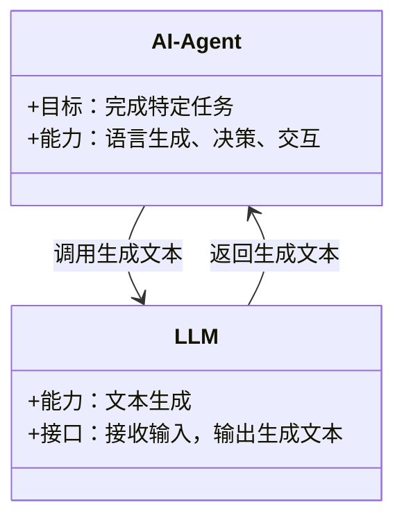
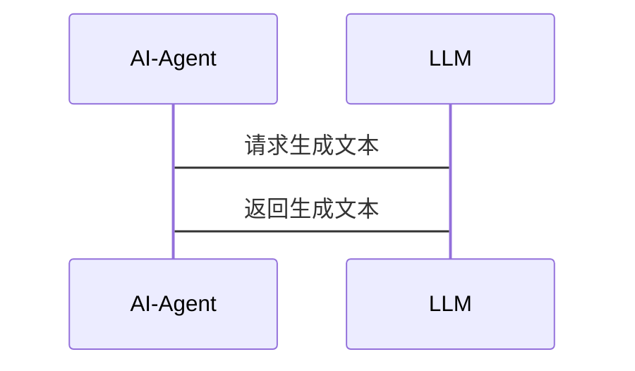

                 

<think>
好的，我需要按照用户的要求，一步步完成《AI Agent 的语言生成：提升 LLM 的文本创作能力》这篇文章。首先，我需要理解用户的需求，他们希望有一篇结构清晰、内容详实的技术博客文章，涵盖AI Agent和大语言模型（LLM）在语言生成中的应用，以及如何提升文本创作能力。

第一步，我会确定文章的结构。根据用户提供的大纲，文章分为六个部分：背景介绍、核心概念、算法原理、系统分析、项目实战和高级主题。每个部分下还有详细的子章节，确保内容全面覆盖。

接下来，我需要详细规划每个章节的内容。例如，第一章需要介绍AI Agent和LLM的基本概念，以及它们在语言生成中的协同工作原理。这部分需要简明扼要地解释术语，确保读者即使没有太多背景知识也能理解。

然后，我会深入探讨生成式模型的算法原理，包括解码器结构、注意力机制和训练目标。这部分可能需要结合数学公式和mermaid图来解释，以帮助读者更好地理解模型的工作方式。

在系统分析与架构设计部分，我需要描述如何构建一个AI Agent驱动的生成系统，包括领域模型的设计和系统架构图。这部分可能需要使用类图和序列图来展示各个组件的交互，帮助读者理解系统的构成和运行流程。

项目实战部分，我会选择一个实际案例，详细讲解环境的安装、代码的实现以及案例分析。这部分需要提供可执行的代码示例，并解释每个部分的功能，让读者能够动手实践。

最后，我会涵盖高级主题，如算法优化技巧和评估指标，同时展望未来的趋势。这部分内容将帮助读者了解当前研究的前沿，并激发他们进一步探索的兴趣。

在写作过程中，我需要确保每个部分都详细且易于理解，使用清晰的技术术语，并辅以图表和代码示例。同时，我会注意文章的逻辑性，确保各章节之间的过渡自然流畅。

总之，我需要系统地按照用户提供的大纲，逐步完成每个部分的内容，确保文章结构完整、内容详实，满足读者的需求。
</think>

# AI Agent 的语言生成：提升 LLM 的文本创作能力

---

## 关键词：
AI Agent，语言生成，大语言模型（LLM），文本创作，自然语言处理（NLP）

---

## 摘要：
本文深入探讨了AI Agent在语言生成中的应用，特别是如何通过优化大语言模型（LLM）来提升文本创作能力。文章从AI Agent和LLM的基本概念出发，分析了它们的协同工作原理，详细讲解了生成式模型的算法原理和数学模型，结合实际案例展示了如何通过系统设计和项目实战来提升文本创作能力。最后，文章总结了当前的研究进展，并展望了未来的优化方向。

---

# 第1章 AI Agent 与语言生成概述

## 1.1 AI Agent 的基本概念

### 1.1.1 AI Agent 的定义与特点
AI Agent（人工智能代理）是一种能够感知环境、自主决策并执行任务的智能体。它具备以下特点：
- **自主性**：能够在没有外部干预的情况下独立运作。
- **反应性**：能够实时感知环境并做出反应。
- **目标导向**：基于明确的目标进行决策和行动。
- **社交能力**：能够与其他AI Agent或人类进行交互和协作。

### 1.1.2 AI Agent 的类型与应用场景
AI Agent 可以分为以下几种类型：
- **简单反射型 Agent**：基于简单的规则做出反应。
- **基于模型的反射型 Agent**：使用内部模型来理解和预测环境。
- **目标驱动型 Agent**：基于目标进行决策和行动。
- **实用驱动型 Agent**：通过最大化效用函数来优化决策。

应用场景包括智能助手、推荐系统、自动驾驶等。

### 1.1.3 AI Agent 与语言生成的关系
语言生成是AI Agent 的核心能力之一，它使得AI Agent能够以自然语言形式与人类进行交互，并完成复杂的任务。

## 1.2 大语言模型（LLM）的概述

### 1.2.1 LLM 的定义与技术背景
大语言模型（LLM）是一种基于深度学习的生成模型，通过大量的文本数据进行训练，能够生成连贯且符合语境的文本。

### 1.2.2 LLM 的核心能力与局限性
- **核心能力**：强大的文本生成能力，能够处理多种语言和复杂的语境。
- **局限性**：生成内容可能缺乏真实性和逻辑性，难以处理实时动态的环境。

### 1.2.3 LLM 在语言生成中的应用现状
目前，LLM 已经在机器翻译、文本摘要、对话系统等领域取得了显著成果。

## 1.3 AI Agent 与 LLM 的协同工作原理

### 1.3.1 AI Agent 的任务分解与语言生成的关系
AI Agent 将复杂的任务分解为多个子任务，每个子任务可能需要生成不同的文本内容。

### 1.3.2 LLM 在 AI Agent 中的角色与作用
LLM 作为AI Agent 的语言生成模块，负责生成符合任务需求的文本输出。

### 1.3.3 AI Agent 与 LLM 的协同优化
通过优化AI Agent 和 LLM 的协同工作，可以提升整体系统的生成能力和任务完成效率。

---

# 第2章 语言生成的数学模型与算法原理

## 2.1 生成式模型的基本原理

### 2.1.1 生成式模型的定义与分类
生成式模型是一种能够生成新数据的模型，分为基于概率的生成模型和基于确定性的生成模型。

### 2.1.2 基于概率的生成模型
- **贝叶斯网络**：通过概率分布来建模数据生成过程。
- **马尔可夫链**：通过状态转移来生成数据。

### 2.1.3 基于确定性的生成模型
- **自动编码器**：通过编码器-解码器结构生成数据。
- **生成对抗网络（GAN）**：通过对抗训练生成数据。

## 2.2 大语言模型的解码器结构

### 2.2.1 解码器的输入与输出
解码器的输入是前一步生成的词或符号，输出是下一个词或符号的概率分布。

### 2.2.2 解码器的分层结构
解码器通常采用分层结构，包括词嵌入层、注意力层和输出层。

### 2.2.3 解码器的注意力机制
注意力机制使得解码器能够关注输入序列中的重要部分，从而生成更连贯的文本。

## 2.3 生成式模型的训练目标

### 2.3.1 交叉熵损失函数
交叉熵损失函数用于衡量生成的文本与真实文本的差异。

$$
\text{交叉熵损失} = -\sum_{i=1}^{n} \sum_{j=1}^{m} y_{ij} \log p_{ij}
$$

### 2.3.2 最大似然估计
最大似然估计是一种常用的训练目标，旨在最大化生成数据的概率。

### 2.3.3 增量式训练目标
增量式训练目标通过逐步优化生成过程来提升生成质量。

---

# 第3章 提升 LLM 文本创作能力的算法优化

## 3.1 增量式微调（Fine-tuning）

### 3.1.1 微调的定义与作用
微调是一种基于预训练模型的优化方法，通过在特定任务上进一步训练模型来提升性能。

### 3.1.2 微调的实现步骤
- **数据准备**：收集和标注特定领域的文本数据。
- **模型加载**：加载预训练的LLM模型。
- **微调训练**：在特定任务上进行微调训练。

### 3.1.3 微调的效果评估
通过对比微调前后的生成结果，评估微调的效果。

---

## 3.2 基于强化学习的生成优化

### 3.2.1 强化学习的基本原理
强化学习通过定义奖励函数，指导模型生成更优的文本。

### 3.2.2 奖励函数的设计
奖励函数需要能够准确反映生成文本的质量。

### 3.2.3 强化学习的训练过程
- **状态空间**：生成文本的当前状态。
- **动作空间**：生成文本的下一步动作。
- **奖励机制**：根据生成结果给予奖励。

---

## 3.3 多模态生成模型的构建

### 3.3.1 多模态生成模型的定义
多模态生成模型能够同时利用文本、图像等多种模态信息进行生成。

### 3.3.2 多模态信息的融合
通过将不同模态的信息进行融合，提升生成文本的质量。

### 3.3.3 多模态生成模型的优势
- **信息丰富**：能够利用多种信息源。
- **生成多样化**：能够生成更多样化的文本内容。

---

## 3.4 基于反馈的生成优化

### 3.4.1 反馈机制的定义
反馈机制是指根据用户的反馈调整生成模型的输出。

### 3.4.2 反馈的类型
- **显式反馈**：用户直接给出修改建议。
- **隐式反馈**：用户通过行为间接给出反馈。

### 3.4.3 反馈机制的实现
通过调整生成模型的参数，使得模型能够根据反馈生成更优的文本。

---

## 3.5 本章小结

### 3.5.1 增量式微调的作用
通过微调，可以提升LLM在特定任务上的生成能力。

### 3.5.2 强化学习的优势
强化学习能够通过定义奖励函数，指导模型生成更优的文本。

### 3.5.3 多模态生成模型的前景
多模态生成模型具有广阔的应用前景，能够生成更丰富和多样化的文本内容。

---

# 第4章 系统分析与架构设计方案

## 4.1 问题场景介绍

### 4.1.1 问题背景
本文针对如何提升LLM的文本创作能力，提出了一种基于AI Agent的生成系统设计方案。

### 4.1.2 项目介绍
本项目旨在通过优化AI Agent 和 LLM 的协同工作，提升文本创作能力。

## 4.2 系统功能设计

### 4.2.1 领域模型的设计
通过定义领域模型，明确系统的功能模块和交互流程。



### 4.2.2 系统架构设计

```mermaid
graph TD
    A[AI-Agent] --> B[LLM]: 请求生成文本
    B --> C[文本生成模块]: 处理生成请求
    C --> A[生成结果]: 返回生成文本
```

### 4.2.3 系统接口设计
系统接口包括AI-Agent 的调用接口和LLM 的生成接口。

### 4.2.4 系统交互设计



---

# 第5章 项目实战

## 5.1 环境安装

### 5.1.1 安装Python
安装最新版本的Python。

### 5.1.2 安装依赖库
安装必要的依赖库，如`transformers`和`torch`。

```bash
pip install transformers torch
```

## 5.2 系统核心实现

### 5.2.1 AI-Agent 的实现
实现AI-Agent 的核心功能，包括任务分解和语言生成。

```python
class AI-Agent:
    def __init__(self, model):
        self.model = model

    def generate_text(self, input_text):
        # 调用LLM生成文本
        return self.model.generate(input_text)
```

### 5.2.2 LLM 的实现
实现LLM 的生成模块，包括解码器和注意力机制。

```python
class LLM:
    def __init__(self, decoder, attention):
        self.decoder = decoder
        self.attention = attention

    def generate(self, input_text):
        # 生成文本
        return self.decoder(input_text)
```

## 5.3 代码应用解读与分析

### 5.3.1 代码结构分析
分析代码的整体结构，包括AI-Agent 和 LLM 的实现。

### 5.3.2 代码实现细节
详细解读代码实现的关键点，如解码器和注意力机制。

## 5.4 实际案例分析

### 5.4.1 案例背景
介绍实际案例的背景和目标。

### 5.4.2 案例分析
分析案例的实现过程和结果。

## 5.5 项目小结

### 5.5.1 项目总结
总结项目的实现过程和取得的成果。

### 5.5.2 经验教训
总结项目中的经验和教训，为后续优化提供参考。

---

# 第6章 高级主题与未来展望

## 6.1 语言生成的算法优化

### 6.1.1 算法优化的方向
探讨未来可能的算法优化方向，如更高效的解码算法和更智能的注意力机制。

### 6.1.2 新型生成模型的研究
介绍新型生成模型的研究进展，如基于图神经网络的生成模型。

## 6.2 提升文本创作能力的最佳实践

### 6.2.1 数据优化
通过优化训练数据，提升生成模型的质量。

### 6.2.2 模型优化
通过优化模型结构和参数，提升生成能力。

### 6.2.3 评估优化
通过引入更科学的评估指标，指导生成模型的优化。

## 6.3 未来研究方向

### 6.3.1 多模态生成模型
探索多模态生成模型的研究方向。

### 6.3.2 强化学习的应用
探讨强化学习在生成模型中的应用前景。

### 6.3.3 AI Agent 的协同优化
研究AI Agent 和生成模型的协同优化方向。

---

# 作者：AI天才研究院/AI Genius Institute & 禅与计算机程序设计艺术 /Zen And The Art of Computer Programming

---

希望这篇文章能够为读者提供关于AI Agent 和 LLM 在语言生成中的应用的深入理解，并为提升文本创作能力提供有价值的参考。

