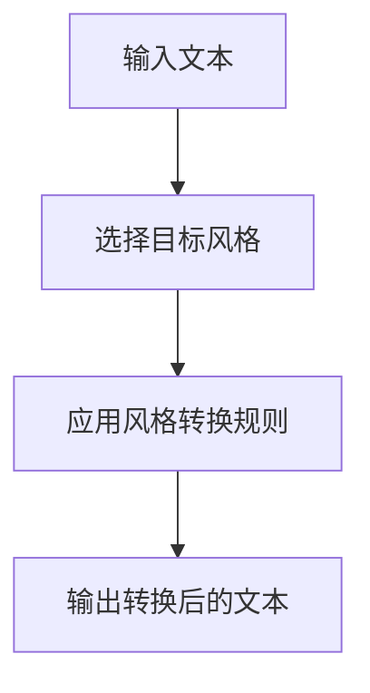

                 


# AI Agent 的语言风格转换：调整 LLM 的表达方式

## 关键词：AI Agent, 语言风格转换, LLM, 自然语言处理, AI 技术, 文本生成

## 摘要

随着人工智能技术的快速发展，AI Agent（人工智能代理）在自然语言处理领域发挥着越来越重要的作用。AI Agent能够根据特定需求调整大型语言模型（LLM）的表达方式，从而实现语言风格的转换。本文将深入探讨AI Agent如何通过调整LLM的输出，实现语言风格的多样化与优化。从基本原理到实际应用，我们将一步步解析这一过程，帮助读者全面理解AI Agent在语言风格转换中的核心作用。

---

## 第一部分: AI Agent 的语言风格转换背景与基础

## 第1章: AI Agent 的基本概念与背景

### 1.1 AI Agent 的定义与特点

#### 1.1.1 AI Agent 的定义

AI Agent（人工智能代理）是一种能够感知环境、理解用户需求并执行相应任务的智能实体。它通过分析输入信息，生成符合用户期望的输出，从而实现与用户的交互。AI Agent的核心目标是通过智能化的处理，提升人机交互的效率和体验。

#### 1.1.2 AI Agent 的核心特点

- **智能性**：AI Agent能够理解上下文、识别意图，并根据需求生成相应的响应。
- **适应性**：AI Agent能够根据不同的场景和用户偏好，调整其输出内容和表达方式。
- **自主性**：AI Agent能够在没有人工干预的情况下，独立完成任务。
- **交互性**：AI Agent能够通过多种渠道与用户互动，包括文本、语音、图形界面等。

#### 1.1.3 AI Agent 的分类与应用场景

AI Agent可以根据功能和应用场景分为多种类型：

- **任务型AI Agent**：专注于完成特定任务，如智能助手、自动化工具等。
- **对话型AI Agent**：专注于与用户进行自然语言对话，如智能客服、虚拟助手等。
- **内容生成型AI Agent**：专注于生成特定内容，如文本创作、翻译、风格转换等。

### 1.2 语言风格转换的背景与意义

#### 1.2.1 语言风格转换的定义

语言风格转换是指将一段文本从一种表达方式转换为另一种风格，以满足特定需求。例如，将正式的商务文本转换为更口语化的表达，或将复杂的学术语言简化为通俗易懂的内容。

#### 1.2.2 语言风格转换的背景

随着自然语言处理技术的不断进步，语言风格转换的需求日益增加。在商业、教育、娱乐等领域，用户对多样化、个性化的文本输出需求越来越高。传统的文本生成方式难以满足这些需求，因此，通过AI Agent实现语言风格转换成为一种趋势。

#### 1.2.3 语言风格转换在 AI Agent 中的作用

AI Agent通过语言风格转换，能够更好地满足用户的个性化需求。例如：

- **个性化沟通**：在客服场景中，AI Agent可以根据用户的背景和偏好，调整沟通风格，使其更贴近用户的习惯。
- **内容优化**：在内容创作中，AI Agent可以根据目标受众的特点，调整语言风格，以提高内容的吸引力和效果。
- **多场景应用**：AI Agent可以根据不同的场景需求，灵活调整语言风格，从而提高其适应性和实用性。

### 1.3 LLM 的基本原理与工作方式

#### 1.3.1 大语言模型的定义

大语言模型（LLM, Large Language Model）是一种基于深度学习的自然语言处理模型，通过大量数据的训练，能够理解和生成人类语言。LLM的核心是其巨大的参数规模和复杂的神经网络结构，使其具备强大的文本生成能力。

#### 1.3.2 LLM 的核心工作原理

1. **数据训练**：LLM通过监督学习的方式，利用海量的文本数据进行训练，学习语言的模式和规律。
2. **生成机制**：在生成文本时，LLM通过概率预测的方式，逐步生成每个字符或单词，最终形成完整的文本输出。
3. **上下文理解**：LLM能够理解上下文关系，根据前面的文本内容生成后续内容。

#### 1.3.3 LLM 的输出特性与局限性

- **输出特性**：
  - 多样性：能够生成多种不同的表达方式。
  - 自然性：生成的文本具有较高的可读性和流畅性。
  - 适应性：可以根据输入的提示或指令，生成符合特定需求的文本。

- **局限性**：
  - 可控性不足：生成的文本可能难以完全按照用户的要求进行调整。
  - 计算资源需求高：运行LLM需要大量的计算资源和存储空间。
  - 过度依赖数据：生成内容的质量高度依赖训练数据的质量和多样性。

---

## 第2章: 语言风格转换的核心概念与联系

### 2.1 AI Agent 与语言风格转换的关系

#### 2.1.1 AI Agent 如何影响语言风格转换

AI Agent通过分析用户的需求和上下文，可以动态调整LLM的输出风格。例如，在用户要求生成正式邮件时，AI Agent可以指示LLM采用正式的语言风格；而在用户需要写一条社交媒体帖子时，AI Agent可以指示LLM采用更口语化和活泼的风格。

#### 2.1.2 语言风格转换如何增强 AI Agent 的能力

语言风格转换使得AI Agent能够适应更多场景和用户需求。通过调整语言风格，AI Agent可以更好地与用户互动，提供更个性化的服务，从而提升用户体验和满意度。

### 2.2 核心概念对比分析

#### 2.2.1 AI Agent 与传统语言处理工具的对比

| 对比维度           | AI Agent                             | 传统语言处理工具                     |
|--------------------|--------------------------------------|--------------------------------------|
| **智能性**         | 高度智能，能够理解上下文             | 较低智能，主要依赖规则和关键词匹配    |
| **适应性**         | 能够根据用户需求动态调整输出风格     | 输出风格固定，难以根据需求调整       |
| **交互性**         | 支持自然语言交互，用户体验更好       | 交互性有限，主要适用于特定任务       |

#### 2.2.2 语言风格转换与文本生成的对比

| 对比维度           | 语言风格转换                          | 文本生成                            |
|--------------------|--------------------------------------|--------------------------------------|
| **目标**           | 转换已有文本的风格                    | 生成新的文本内容                    |
| **输入**           | 需要输入待转换的文本和目标风格       | 需要输入生成内容的提示或指令          |
| **输出**           | 输出风格转换后的文本                 | 输出生成的全新文本                  |

### 2.3 实体关系图与流程图

#### 2.3.1 AI Agent 语言风格转换的 ER 实体关系图

```mermaid
er
actor(AI Agent) --> goal: 调整语言风格
goal --> action: 生成符合目标风格的文本
```

#### 2.3.2 语言风格转换的流程图



---

## 总结

通过以上分析，我们可以看到AI Agent在语言风格转换中的重要作用。AI Agent通过动态调整LLM的输出风格，能够满足用户在不同场景下的多样化需求。随着技术的不断进步，AI Agent和语言风格转换的结合将为自然语言处理领域带来更多的创新和应用。

接下来，我们将深入探讨AI Agent调整LLM表达方式的算法原理，以及如何通过系统设计实现语言风格转换的功能。让我们继续探索这一激动人心的技术领域！

