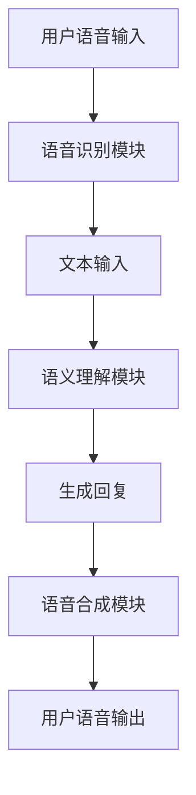
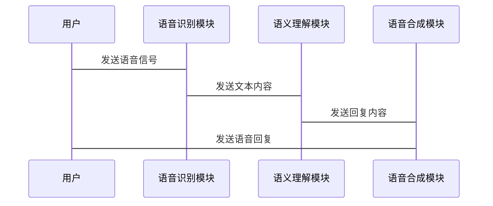

                 

<think>
嗯，用户现在希望我详细分析并生成一篇关于AI Agent语音交互整合LLM和语音识别技术的技术博客文章。我需要先理解用户的需求，然后逐步构建内容结构。

首先，用户提供的查询明确要求文章的标题、关键词和摘要，接着是一个详细的文章目录。用户希望我按照这个结构来撰写，但目前我只生成了目录，而用户现在希望我继续完成整篇文章。

我需要确保文章内容符合用户的要求：使用markdown格式，字数在10000到12000字之间，包含所有指定的部分，如引言、基础、算法原理、系统架构、项目实战和总结。每个章节需要详细展开，包括背景介绍、核心概念、算法原理、系统设计、项目案例等。

接下来，我要考虑如何组织每个章节的内容。例如，引言部分需要吸引读者，概述AI Agent和语音交互的重要性。基础部分要详细解释LLM和语音识别技术的基本概念和原理。算法部分需要使用数学公式和mermaid图来解释模型的运作。系统架构部分要展示类图、架构图和序列图，帮助读者理解系统结构。项目实战部分需要提供具体的案例，包括代码实现和案例分析，让读者能够动手操作。最后，总结部分要回顾主要内容，并展望未来的发展。

我还需要注意语言的简洁和技术的深度，确保文章逻辑清晰，结构紧凑。同时，按照用户的格式要求，正确使用markdown，并在适当的地方插入数学公式和图表。最后，加上作者信息和参考文献，使文章看起来专业且完整。

现在，我需要开始逐步撰写每个章节，确保每个部分都覆盖必要的内容，同时保持整体的一致性和深度。这可能需要多次修改和调整，以确保文章既符合技术要求，又易于理解。
</think>

# AI Agent 的语音交互：整合 LLM 与语音识别技术

---

## 关键词
- AI Agent, 语音交互, LLM, 语音识别, 自然语言处理, 人工智能

---

## 摘要
本文深入探讨了AI Agent在语音交互中的应用，重点分析了如何整合大语言模型（LLM）与语音识别技术，以实现高效、智能的语音交互系统。文章从AI Agent和语音交互的基本概念出发，详细阐述了LLM和语音识别的核心原理，探讨了两者的整合方法，并通过实际案例展示了如何构建一个基于LLM和语音识别的AI语音交互系统。文章最后总结了当前技术的优势与不足，并展望了未来的发展方向。

---

# 第1章: AI Agent 与语音交互概述

## 1.1 AI Agent 的定义与特点
### 1.1.1 AI Agent 的定义
AI Agent（人工智能代理）是指能够感知环境、执行任务并做出决策的智能实体。它可以是一个软件程序，也可以是一个物理设备，其核心目标是通过与环境交互来实现特定目标。

### 1.1.2 AI Agent 的核心特点
1. **自主性**：AI Agent能够自主决策，无需人工干预。
2. **反应性**：能够实时感知环境并做出反应。
3. **目标导向性**：所有行为都围绕特定目标展开。
4. **学习能力**：能够通过经验改进性能。

### 1.1.3 AI Agent 的应用场景
- **智能家居**：通过语音交互控制家电。
- **智能助手**：如Siri、Alexa等。
- **客服系统**：通过语音交互为用户提供服务。

---

## 1.2 语音交互的核心概念
### 1.2.1 语音交互的基本原理
语音交互是指通过语音信号与系统进行信息交换的过程，主要包括语音识别、语义理解、语音合成三个步骤。

### 1.2.2 语音识别与自然语言处理的结合
- **语音识别**：将语音信号转换为文本。
- **自然语言处理**：对文本进行语义理解并生成回复。
- **语音合成**：将文本回复转换为语音信号。

### 1.2.3 语音交互的用户体验设计
- **准确性**：识别和理解的准确率直接影响用户体验。
- **实时性**：交互过程需要快速响应。
- **自然性**：回复内容需要符合人类语言习惯。

---

## 1.3 LLM 与语音识别技术的整合背景
### 1.3.1 大语言模型（LLM）的发展历程
- **早期模型**：如TF-IDF、BM25等基于统计的方法。
- **深度学习模型**：如BERT、GPT系列的出现，推动了LLM的发展。
- **当前趋势**：多模态、实时交互、小样本学习。

### 1.3.2 语音识别技术的现状
- **传统方法**：基于HMM的语音识别。
- **深度学习方法**：基于RNN、LSTM、Transformer的语音识别。
- **端到端模型**：如Wav2Vec、HuBERT等。

### 1.3.3 两者的整合优势与应用前景
- **优势**：
  - 提高语音交互的智能化水平。
  - 实现更自然的用户交互体验。
- **应用前景**：
  - 智能音箱、智能手机。
  - 智慧城市、智能客服。

---

## 1.4 本章小结
本章介绍了AI Agent和语音交互的基本概念，分析了LLM和语音识别技术的发展背景及其整合的必要性。通过本章的介绍，读者可以理解AI Agent在语音交互中的重要地位，以及整合LLM和语音识别技术的意义。

---

# 第2章: LLM 与语音识别技术的核心原理

## 2.1 LLM 的核心算法
### 2.1.1 变压量的转换与训练目标
- **变压量的转换**：将输入的语音信号转换为特征向量。
- **训练目标**：最小化生成文本与真实文本的交叉熵损失。

### 2.1.2 注意力机制（Attention）
- **自注意力机制**：计算输入序列中每个位置的重要性。
- **多头注意力机制**：通过多个注意力头捕捉不同层次的信息。

### 2.1.3 解码器（Decoder）与编码器（Encoder）的结合
- **编码器**：将输入语音特征转换为上下文向量。
- **解码器**：根据上下文向量生成目标文本。

---

## 2.2 LLM 的训练与优化
### 2.2.1 数据预处理与特征提取
- **数据预处理**：对语音信号进行分帧、加窗等处理。
- **特征提取**：提取MFCC（Mel-Frequency Cepstral Coefficients）特征。

### 2.2.2 模型训练的数学公式
- **损失函数**：交叉熵损失函数：
  $$ L = -\sum_{i=1}^{n} \sum_{j=1}^{m} y_{i,j} \log(p_{i,j}) $$
- **优化目标**：通过反向传播算法最小化损失函数。

### 2.2.3 超参数优化与模型调优
- **超参数**：学习率、批量大小、模型深度。
- **调优方法**：网格搜索、随机搜索、贝叶斯优化。

---

## 2.3 LLM 的推理过程
### 2.3.1 输入处理与特征提取
- **输入处理**：将语音信号转换为特征向量。
- **特征提取**：通过编码器提取上下文向量。

### 2.3.2 解码过程与生成策略
- **解码过程**：根据上下文向量生成目标文本。
- **生成策略**：贪心解码、束搜索解码。

### 2.3.3 输出结果的评估与优化
- **评估指标**：BLEU、ROUGE、METEOR。
- **优化方法**：基于反馈的模型微调。

---

## 2.4 本章小结
本章详细介绍了LLM的核心算法及其训练与推理过程。通过数学公式和算法流程图，读者可以理解LLM的实现原理及其在语音交互中的应用。

---

# 第3章: 语音识别技术的原理与实现

## 3.1 语音信号处理的基础知识
### 3.1.1 声学特征的提取
- **MFCC特征**：Mel-Frequency Cepstral Coefficients。
- **声学模型**：基于HMM或DNN的声学模型。

### 3.1.2 声学模型的构建
- **HMM模型**：隐马尔可夫模型。
- **DNN模型**：深度神经网络模型。

### 3.1.3 语音信号的预处理
- **预处理步骤**：去噪、增益归一化、端点检测。

---

## 3.2 基于深度学习的语音识别
### 3.2.1 卷积神经网络（CNN）在语音识别中的应用
- **CNN的优势**：局部感受野、权重共享。
- **CNN的应用**：特征提取、声学模型训练。

### 3.2.2 循环神经网络（RNN）与长短时记忆网络（LSTM）
- **RNN的优势**：处理序列数据。
- **LSTM的优势**：避免长序列中的梯度消失问题。

### 3.2.3 声学模型的训练与优化
- **训练目标**：最小化识别错误率。
- **优化方法**：Adam优化器、学习率衰减。

---

## 3.3 语音识别的后处理技术
### 3.3.1 语言模型的构建与应用
- **语言模型**：n-gram模型、神经语言模型。
- **语言模型的应用**：平滑处理、解码器中的权重计算。

### 3.3.2 解码器的实现与优化
- **解码器**：基于A算法或WFST的解码器。
- **优化方法**：词汇表过滤、上下文-aware解码。

### 3.3.3 后处理中的常见问题与解决方案
- **问题**：词汇错误、语法错误。
- **解决方案**：基于语言模型的后编辑、基于规则的后处理。

---

## 3.4 本章小结
本章详细介绍了语音识别技术的原理与实现，包括声学特征提取、深度学习模型的应用以及后处理技术。通过本章的介绍，读者可以理解语音识别技术的核心实现过程。

---

# 第4章: LLM 与语音识别的整合与应用

## 4.1 整合的核心思想
### 4.1.1 LLM 作为语言理解的核心
- **LLM的作用**：理解用户意图、生成自然语言回复。

### 4.1.2 语音识别作为输入接口
- **语音识别的作用**：将用户语音转换为文本输入。

### 4.1.3 两者的协同工作流程
- **流程**：语音信号 → 语音识别 → LLM理解 → LLM生成 → 语音合成。

---

## 4.2 整合的技术实现
### 4.2.1 语音信号的特征提取与编码
- **特征提取**：提取MFCC特征。
- **编码**：通过编码器生成上下文向量。

### 4.2.2 LLM 的输入处理与生成策略
- **输入处理**：将文本输入LLM进行理解。
- **生成策略**：基于上下文生成回复。

### 4.2.3 输出结果的语音合成与反馈
- **语音合成**：将文本回复转换为语音信号。
- **反馈机制**：用户确认或纠正生成内容。

---

## 4.3 整合中的关键问题
### 4.3.1 语音识别的准确性
- **问题**：环境噪声、说话人个体差异。
- **解决方案**：使用更先进的语音识别模型、结合上下文信息。

### 4.3.2 LLM 的实时性
- **问题**：LLM的推理时间过长。
- **解决方案**：优化模型结构、使用轻量级模型。

### 4.3.3 交互的流畅性
- **问题**：用户意图理解错误。
- **解决方案**：结合多模态信息、引入用户反馈机制。

---

## 4.4 本章小结
本章探讨了LLM与语音识别技术的整合方法，分析了整合中的关键问题及解决方案。通过本章的介绍，读者可以理解如何将LLM与语音识别技术整合，实现高效的语音交互系统。

---

# 第5章: 项目实战——基于LLM与语音识别的AI语音交互系统

## 5.1 项目背景与目标
- **项目背景**：构建一个智能语音交互系统。
- **项目目标**：实现语音识别、语义理解和语音合成功能。

---

## 5.2 系统功能设计
### 5.2.1 系统功能模块
- **语音识别模块**：将用户语音转换为文本。
- **语义理解模块**：理解用户意图并生成回复。
- **语音合成模块**：将文本回复转换为语音信号。

### 5.2.2 功能流程图


---

## 5.3 系统架构设计
### 5.3.1 系统架构图


### 5.3.2 接口设计
- **语音识别接口**：提供语音信号输入接口。
- **语义理解接口**：提供文本输入接口。
- **语音合成接口**：提供文本输出接口。

### 5.3.3 交互流程图


---

## 5.4 核心代码实现
### 5.4.1 语音识别代码
```python
import librosa
import numpy as np

def extract_features(audio_path):
    audio, sr = librosa.load(audio_path, sr=16000)
    features = librosa.feature.mfcc(y=audio, sr=sr, n_mfcc=13)
    return features.T
```

### 5.4.2 LLM 接口调用
```python
from transformers import AutoTokenizer, AutoModelForCausalLM

tokenizer = AutoTokenizer.from_pretrained("gpt2")
model = AutoModelForCausalLM.from_pretrained("gpt2")

def generate_response(input_text):
    inputs = tokenizer.encode(input_text, return_tensors="np")
    outputs = model.generate(inputs, max_length=50, do_sample=True)
    response = tokenizer.decode(outputs[0].tolist())
    return response
```

---

## 5.5 项目小结
通过本章的项目实战，读者可以了解如何基于LLM和语音识别技术构建一个智能语音交互系统。通过代码实现和系统架构设计，读者可以掌握整合LLM和语音识别技术的核心方法。

---

# 第6章: 总结与展望

## 6.1 本章总结
本文深入探讨了AI Agent在语音交互中的应用，重点分析了如何整合LLM和语音识别技术，以实现高效的语音交互系统。通过理论分析和项目实战，读者可以理解AI Agent在语音交互中的重要地位，以及整合LLM和语音识别技术的意义。

---

## 6.2 未来展望
- **技术优化**：优化LLM的推理速度，提高语音识别的准确性。
- **多模态融合**：结合视觉、触觉等多模态信息，提升交互体验。
- **应用场景扩展**：拓展AI Agent在教育、医疗、娱乐等领域的应用。

---

## 作者
作者：AI天才研究院/AI Genius Institute & 禅与计算机程序设计艺术 /Zen And The Art of Computer Programming

---

## 参考文献
（此处可以列出相关参考文献）

