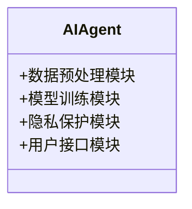
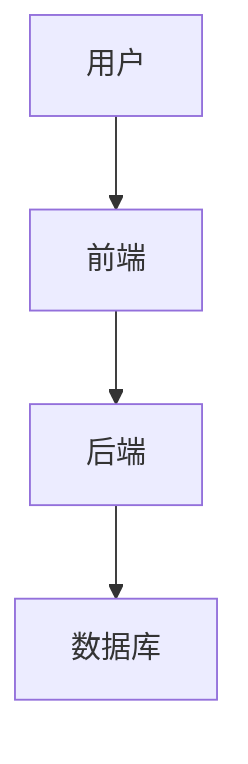
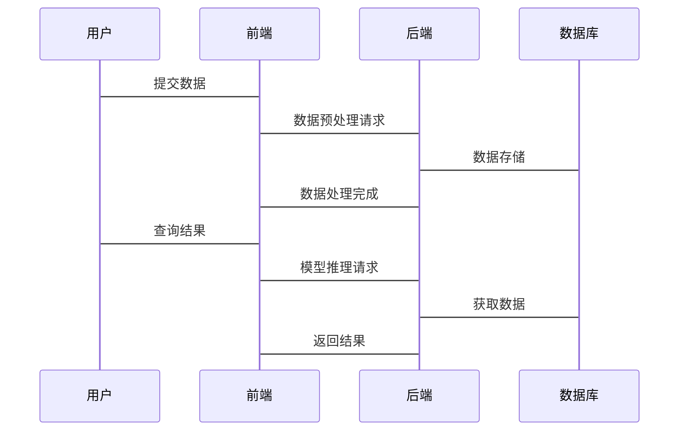

                 


# AI Agent 的隐私保护：确保 LLM 应用的数据安全

> 关键词：AI Agent, 大语言模型, 隐私保护, 数据安全, 联邦学习, 同态加密, 差分隐私

> 摘要：随着AI Agent和大语言模型（LLM）的广泛应用，隐私保护问题日益凸显。本文系统地探讨了AI Agent在LLM应用中的隐私保护策略，分析了数据分类与访问控制、隐私保护技术（如同态加密、联邦学习、差分隐私）的原理与实现，结合实际案例，详细讲解了系统架构设计、算法实现和项目实战。本文旨在为AI Agent的隐私保护提供全面的技术指导，确保LLM应用的数据安全。

---

## 第一部分: AI Agent 的隐私保护概述

### 第1章: AI Agent 与大语言模型概述

#### 1.1 AI Agent 的定义与特点
AI Agent（人工智能代理）是一种智能实体，能够感知环境、自主决策并执行任务。AI Agent的特点包括自主性、反应性、主动性、社交能力和社会性。与传统AI相比，AI Agent更加注重与环境的动态交互和自主决策能力。

#### 1.2 大语言模型（LLM）的概述
大语言模型（LLM）是一种基于深度学习的自然语言处理模型，具有强大的语言理解和生成能力。LLM的核心功能包括自然语言理解、文本生成、问答系统和机器翻译等。LLM的应用场景广泛，包括智能客服、内容生成和数据分析等。

#### 1.3 AI Agent 的隐私保护的重要性
AI Agent在处理用户数据时，必须确保数据的安全性和隐私性。LLM的应用中，用户数据可能被用于训练和推理，因此保护这些数据的隐私至关重要。本文将探讨如何在AI Agent中实现有效的隐私保护，确保LLM应用的数据安全。

---

### 第2章: 隐私保护的核心概念与原则

#### 2.1 隐私保护的基本原则
隐私保护的基本原则包括数据最小化原则、数据匿名化原则和数据加密原则。数据最小化原则要求仅收集实现目标所需的最小数据；数据匿名化原则要求对数据进行处理，使其无法直接关联到个人；数据加密原则通过加密技术保护数据的安全性。

#### 2.2 数据分类与访问控制
数据分类是将数据按敏感程度进行分类，分为公开数据、内部数据和机密数据。访问控制通过权限管理确保只有授权人员才能访问敏感数据。数据分类与访问控制的结合可以有效降低数据泄露风险。

#### 2.3 隐私保护的法律与伦理框架
隐私保护的法律法规包括《通用数据保护条例》（GDPR）和《加州消费者隐私法案》（CCPA），这些法规对数据收集、处理和保护提出了严格要求。隐私保护还涉及伦理道德，要求企业在追求商业利益的同时，尊重用户的隐私权。

---

### 第3章: LLM 应用中的隐私保护技术

#### 3.1 同态加密技术
同态加密是一种在加密数据上进行计算的技术，能够保护数据隐私。在LLM中，同态加密可用于在不泄露原始数据的情况下进行模型训练和推理。

#### 3.2 联邦学习技术
联邦学习是一种分布式机器学习技术，允许多个参与者在不共享原始数据的情况下共同训练模型。在LLM中，联邦学习可以用于在保护数据隐私的前提下进行模型更新。

#### 3.3 差分隐私技术
差分隐私通过在数据中添加噪声，使得个体数据无法被唯一识别，从而保护用户隐私。在LLM中，差分隐私可用于数据预处理和模型推理阶段，防止敏感信息泄露。

---

### 第4章: AI Agent 的隐私保护算法原理

#### 4.1 同态加密算法
同态加密算法的数学模型基于环和群的代数结构，通过加密和解密操作实现数据隐私保护。以下是一个简单的同态加密算法示例：

$$
\text{加密}: E(x) = x + k \mod p
$$

$$
\text{解密}: D(E(x)) = E(x) - k \mod p
$$

其中，\(k\) 是加密密钥，\(p\) 是模数。

#### 4.2 联邦学习算法
联邦学习算法的数学模型包括本地模型更新和全局模型聚合。以下是一个简单的联邦学习流程：

1. **本地模型训练**：每个参与者在本地数据上训练模型，生成梯度更新。
2. **模型聚合**：通过通信协议将各个参与者的梯度更新聚合，生成全局模型。
3. **模型分发**：将全局模型分发给各个参与者，进行下一轮训练。

#### 4.3 差分隐私算法
差分隐私通过在数据中添加拉普拉斯噪声，使得个体数据无法被唯一识别。以下是一个简单的差分隐私数据发布过程：

$$
\text{噪声添加}: y = x + \text{Laplace}(b)
$$

其中，\(b\) 是噪声参数，控制隐私保护的程度。

---

### 第5章: 系统分析与架构设计

#### 5.1 问题场景介绍
在AI Agent中，用户数据可能被用于训练和推理。为了保护用户隐私，需要设计一个数据安全的系统架构。

#### 5.2 系统功能设计
系统的功能模块包括数据预处理、模型训练、隐私保护模块和用户接口。以下是系统的领域模型：



#### 5.3 系统架构设计
系统的架构包括前端、后端和数据库。以下是系统的架构图：



#### 5.4 系统接口设计
系统接口包括数据输入接口、模型训练接口和隐私保护接口。以下是接口设计的序列图：



---

### 第6章: 项目实战

#### 6.1 环境安装
安装必要的Python库，如TensorFlow、PyTorch和加密库。

#### 6.2 核心实现
以下是一个简单的同态加密实现示例：

```python
def encrypt(x, key):
    return x + key

def decrypt(y, key):
    return y - key
```

#### 6.3 案例分析
通过实际案例分析，展示如何在AI Agent中实现隐私保护。

---

### 第7章: 总结与展望

#### 7.1 总结
本文系统地探讨了AI Agent的隐私保护问题，分析了多种隐私保护技术，并结合实际案例进行了详细讲解。

#### 7.2 未来展望
未来的研究方向包括隐私保护与AI Agent的融合、新型隐私保护技术的开发以及隐私保护的法律与伦理问题。

---

作者：AI天才研究院/AI Genius Institute & 禅与计算机程序设计艺术 /Zen And The Art of Computer Programming

